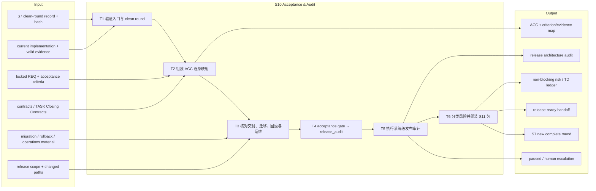
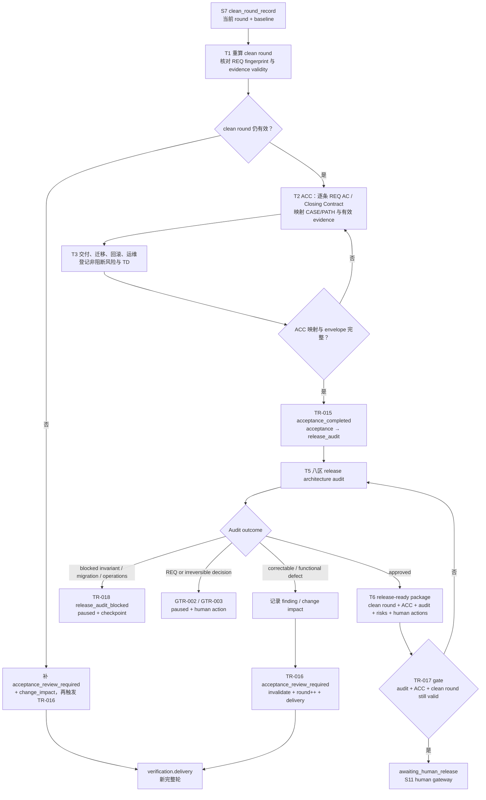

# L3-S10 — 验收与发布审计（Acceptance & Audit）

> 层：第三层 ｜ 上游：L2 §S10 ｜ 前置：S7 当前 review round 已形成有效 clean round ｜ 下游：S11 `awaiting_human_release`，或回 S7 / paused
>
> 阅读顺序：§1～§3 先回答“验收和审计各自要证明什么、为什么不能把 clean round 直接当 release”；§4 再按验收材料、审计八区、风险分流和 S11 handoff 展开；§5～§8 审计职责、当前实现边界、出口和易错点。S6～S11 尚未完成机制优化，本文把目标工作流、模板引导和现有代码能力分开记录。

## 1. 第一层：S10 的立意与目标

### 1.1 为什么需要 S10

S7 的 clean round 只说明：当前 review round 的 Delivery、QA、E2E 和阻断 BUG 条件已经收敛。它还没有回答两个更高层的问题：

- **验收**：REQ 的每条 acceptance criterion、每条 TASK Closing Contract 是否都能落到本轮有效证据，交付和运维是否具备接管条件；
- **发布审计**：本次变更是否破坏了系统级不变量，例如状态机出口、事务边界、并发幂等、数据迁移、调用点、可观测性和发布回滚路径。

因此 S10 是一个“从验证事实到发布判断材料”的汇编阶段。验收对照用户/需求承诺，审计对照系统性质；二者都不是再次实现功能，也不是提前替人发布。

### 1.2 阶段目标与完成定义

| 项目 | 定义 |
|:--|:--|
| 输入 | S7 当前 round 的 clean-round record 与 hash；locked REQ；当前 contracts/TASKs/module truth；所有有效 review/build/BUG/repair evidence；部署、迁移、回滚、运维资料 |
| 要搞清楚 | 每条 REQ AC 和 Closing Contract 的证据落点；基线与 evidence 是否仍有效；变更是否破坏系统级不变量；非阻断风险和技术债由谁跟踪；人到闸后要做什么 |
| 核心工作 | 复验 clean round → 组装 ACC → 逐条做 REQ/contract/CASE 映射 → 核对交付运维与回滚 → 执行 8 个审计区 → 分类 audit finding → 组装 S11 handoff |
| 输出 | ACC 文档与 acceptance evidence；release architecture audit；风险/TD ledger；S11 release-ready package；必要的 change impact 或 pause/finding 路由 |
| 目标完成 | ACC 的每条承诺均有当前有效证据；审计无阻断（或明确 approved with non-blocking risks）；clean round 在到闸时仍有效；发布包、剩余风险和人类动作清晰 |
| 下一阶段 | TR-017 → S11 `awaiting_human_release`；验收差异 → TR-016 回 S7 新轮；审计阻断 → TR-018 paused；REQ/不可逆动作 → 相应人工闸 |

### 1.3 Overview：输入、主步骤与输出

### 1.4 S10 的边界与当前保证

- S10 包含两个连续的 top-level state：`acceptance` 与 `release_audit`；没有独立 phase machine，TR-015 是验收→审计，TR-017 是审计→S11；
- S10 不拥有发布权，也不执行 merge、publish、deploy 或 formal release；它只生成工程证据并把控制交给 S11；
- `clean_round_still_valid` 是真实语义 guard：会调用 `verification.EvaluateCleanRound` 重算当前状态，而不是只相信缓存的 `review.clean_round`；
- ACC 和 release audit 的**文档正文没有领域 schema 消费者**。当前 gate 解析的是通用 evidence envelope 的 kind、producer、conclusion、代际、round、指纹和 subject refs，不会读取 ACC 的逐条表格或审计模板的 8 个检查区；
- `record_acc`、`record_release_audit` action 主要确认 transition evidence context 非空，不把正文内容转换进 Runtime；
- acceptance/release audit 的 requested routes 共用 selector。若同一时刻既有 `acceptance_completed` 又有 `acceptance_review_required`，或既有 audit approved 又有 audit blocked，Controller 应 fail closed，而不是猜优先级；
- S10 当前的“完整性”仍依赖 ACC/审计模板、主会话复核和 evidence envelope 三者的人工对账，不能把自动 gate 的通过描述成正文已逐项机检。

## 2. 第二层：S10 的任务分解

| 任务 | 要解决的问题 | 主要动作 | 阶段产出 |
|:--|:--|:--|:--|
| T1 验证入口与 clean round | 进入 S10 的是不是当前代际、当前轮、仍有效的完整验证事实 | 复算 clean round；核对 REQ fingerprint、review round、validity、P0 BUG 与 targeted refs；发现漂移就回 S7 | clean-round anchor ledger、entry decision |
| T2 组装 ACC | “做了什么”能否逐条回到 REQ、CASE/PATH、contract 和 evidence | 逐条复制 REQ AC/source refs；映射期望、oracle、证据、结果；覆盖正/负分支与 module regression | ACC 文档、criterion→evidence map |
| T3 交付与运维准备 | 能不能接管、部署、迁移和回滚 | 写 deployment order、migration/data handling、runtime health、rollback、operations handoff、剩余风险/TD | release readiness ledger、risk/TD entries |
| T4 acceptance gate | ACC 是否足够进入系统级审计 | 登记 acceptance envelope；subject/fingerprint/round/baseline 对齐；触发 TR-015 | acceptance evidence、`release_audit` cursor |
| T5 发布架构审计 | 本次改动是否破坏跨模块系统性质 | 按 state machine、transaction/UoW、concurrency/idempotency、data/migration、call sites/topology、observability、verification、docs/release scope 八区审计 | audit report、ARA findings、APPROVED/APPROVED_WITH_NON_BLOCKING_RISKS/BLOCKED |
| T6 风险分流与 S11 handoff | 审计结果如何转成唯一、可读、不可误解的人类决策包 | correctable → S7；blocking → pause；REQ/不可逆 → human；通过则汇总 clean-round/ACC/audit hash、残余风险、建议和 automation-stops | release-ready package 或 correction/pause route |

T2 的逐条映射、T5 的系统级审计和 T6 的风险裁决必须分开。ACC PASS 不能替 audit PASS，audit APPROVED 也不能替 human release approval。

## 3. 从 clean round 到 S11 handoff 的完整工作流

注意：当前 TR-016 的失效 action 仍取触发迁移的 `AffectedPaths`，而不是从 ACC discrepancy 或 rich change-impact 文档自动推导完整受影响集合。进入回归轮前，主会话必须人工核对实际 changed paths 与 invalidation 结果。

## 4. 第三层：每项任务如何被引导和承载

### 4.1 T1 — clean-round 入口复验

S10 的第一问不是“ACC 模板填完了吗”，而是“支撑 ACC 的验证事实还是真的吗”。应依次核对：

- Runtime `review.round` 与 clean-round record 的 round、baseline generation、ID/hash；
- `clean_round` evidence 文件仍可读、指纹匹配、status=valid；
- REQ 和当前文档 fingerprint 没有漂移；
- Delivery、QA、E2E team/responsibility 的 current-round PASS/N/A 仍齐；
- P0 BUG 没有停在 investigating/pending_approval/accepted/assigned/fixing/retesting；closed P0 有 targeted evidence；
- 本轮相关 evidence 没有被 invalidated。

`verification.EvaluateCleanRound` 确实执行这些类别的复算，但它的分母仍有明确边界：

| 检查 | 当前实现 |
|:--|:--|
| same round | 只把 delivery/qa/e2e/clean-round/angle/team-manifest/targeted 等 verification kinds 纳入；planning/building evidence 不影响该项 |
| required dimensions | 从注册 team manifest 收集 responsibility IDs，要求当前 round 有 valid evidence；不直接解析正文 conclusion |
| invalid evidence | 当前 round 出现 `status=invalid` 即失败；不会替 rich impact ledger 做反向推理 |
| blocking BUG | 只把 severity=`P0` 作为 blocking；P1～P3 不进入该 clean-round guard |
| closed BUG evidence | 只检查 current-round valid `targeted_reverification` 的 scope_refs 或 path 是否包含 BUG ID |

因此 T1 的 ledger 必须补充机器没有表达的事实，尤其是 P1～P3 风险、每条 AC 的来源和真实 evidence 内容。

### 4.2 T2 — ACC 的逐条验收映射

`docs/reports/acceptance/ACC-template.md` 的核心结构是：

1. REQ、module current truth、contracts、tasks 的指纹化基线；
2. clean round 三组 manifest/round/result/validity 与 open blocking BUG 状态；
3. 每条 REQ source_ref、Rule/CASE/Story/PATH 的 expected、evidence、result；
4. module scenario 的 allow/reject branch、coverage profile 和 regression；
5. delivered scope、deployment order、migration/data handling、runtime verification、rollback、operations handoff；
6. 非阻断风险、owner、Tracking artifact 与最终 `passed/blocked`。

实际填写时，ACC 不应只复制“Delivery PASS”。每一条 AC 都要回答：

- 它的权威来源是什么；
- 它对应哪个 CASE/PATH/contract assertion；
- 哪个 evidence 直接观察了 expected behavior；
- 若 N/A，依据是哪个允许的 N/A 理由，而不是空白；
- 是否有负向分支、权限/异常/边界 oracle；
- 证据是不是 current round、current baseline、valid 且 subject/fingerprint 对齐。

当前 gate 的真实强度较低于这套方法：`GATE-ACCEPTANCE-COMPLETE` 只需要一条 `acceptance_record`（responsibility=`Acceptance` 或 `Orchestrator`，conclusion=`pass`）加一条当前 round `clean_round_record`（`Clean Round Evaluator` 或 `Orchestrator`，conclusion=`pass`）。quality-gate evaluator 会验证通用 envelope 的 runtime/baseline/producer/subject/fingerprint/conclusion，但不会遍历 ACC 的 criterion 表，也不会检查“每条 AC 至少有一条 evidence”。

`record_acc` action 也只把当前 transition 的 evidence context 作为已记录事实，不把 ACC 的映射写进 Runtime。因此 T2 的逐条完整性目前主要由模板、主会话复核和文件指纹共同承载。

### 4.3 T3 — 交付、迁移、回滚与运维准备

验收材料必须把“功能通过”翻译成“可以被接管”：

| 维度 | 至少要说明 |
|:--|:--|
| 交付范围 | 哪些 module/interface/config/data 被改，哪些被明确排除 |
| 部署顺序 | 前后端、配置、依赖、feature flag、兼容窗口的顺序 |
| 数据迁移 | 迁移脚本、前置条件、执行后校验、历史数据处理、重复执行策略 |
| 运行验证 | health、关键用户路径、指标/日志、告警观察窗口 |
| 回滚 | 代码回滚、数据补救/反向迁移、不可逆步骤的人工处理 |
| 运维接管 | runbook、on-call、manual control、owner、已知风险 |
| 技术债 | 类型、影响、成本、负责人、Tracking artifact；向后兼容选择要说明移除条件 |

`L2` 的“技术债登记”当前并没有独立 runtime/entity 结构；ACC 第 5 节的 non-blocking risk 表和 TD 链接是现有承载。不要在没有真实消费者的情况下再造一份 debt registry。

### 4.4 T4 — acceptance gate 与 TR-015

要进入 `release_audit`，目标上需要：ACC 完整、clean round 仍有效、REQ baseline 未漂移。实际链路是：

- `GATE-ACCEPTANCE-COMPLETE`：`acceptance_record/pass` + current-round `clean_round_record/pass`；
- TR-015 guards：`acc_complete` + `clean_round_still_valid`；前者是 evidence-backed attestation，后者调用 `EvaluateCleanRound`；
- TR-015 action：`record_acc`；没有额外的 ACC 领域解析；
- 成功后 top-level state 进入 `release_audit`。

如果 ACC 发现需要补验收或重新验证，目标是形成 `acceptance_review_required` + `change_impact_record`，由 TR-016：

1. `invalidate_affected_evidence`；
2. `review.round++`、清空 `clean_round`；
3. 回到 `verification.delivery`。

当前 TR-016 没有语义 guard，且 action 的影响输入仍来自触发该 transition 的工具调用 paths。它可以记录“重做完整轮”，但不能证明 rich ACC discrepancy 中列出的每个旧 evidence 都已被准确失效。

### 4.5 T5 — release architecture audit

审计不是又一次 code review，而是沿 R-P05 的八个系统不变量区域逐项问“这次变更后系统还站得住吗”：

| 审计区 | 核心问题 | 常见证据 |
|:--|:--|:--|
| state machine | 新状态有进入/退出条件吗？retry/dependency 会不会卡死？ | loop-definition、transition tests、控制面输出 |
| transaction/UoW/session | 写入是否跨错 session？长 I/O 是否持有写事务？失败是否 rollback？ | service code、DB traces、failure recorder |
| concurrency/idempotency | 多 worker claim/lease 是否安全？重复事件/重启/重复创建是否幂等？ | DB constraint、integration/concurrency tests |
| data model/identity/migration | identity/default/enum 是否一致？历史数据是否满足新约束？migration 可验证/回滚吗？ | schema、migration、数据样本、dry-run/apply checks |
| call sites/runtime topology | 新参数、DI、共享/隔离状态是否在所有入口同步？ | grep call sites、后台 loop、admin API、真实路径测试 |
| observability/errors | 是否有稳定短错误码、上下文日志、指标和控制面可诊断状态？ | logs、metrics、diagnostic SQL、runbook |
| verification evidence | 是否验证真实 DB/migration/concurrency/runtime path，而非只测 mock？ | S7、Builder、integration/e2e evidence |
| docs/release scope | BUG/TD/REV/QA/ACC 与代码一致吗？范围外变更、部署顺序、回滚是否写清？ | diff、reports、ACC、runbook、release notes |

`docs/release_audits/TEMPLATE.md` 是 16 节的人类填写模板，R-P05 规定的是上述 8 个审计区和 8 类典型阻断原因。当前没有 parser 强制 16 节都填满，也没有 parser 强制阻断表逐项对应 R-P05；审计者仍需在报告中显式写 PASS/FAIL/NA、证据和处理要求。

阻断类型包括：状态无出口、迁移未进正式发布路径、raw SQL 未对真实 schema 验证、唯一键变更未查历史冲突、并发创建只靠 SELECT、关键 DB 行为只测 mock、范围外代码混入、failure recorder 使用无效 session。任何一项应 BLOCK，不以“本轮测试绿”抵消。

审计结论只能是 `APPROVED`、`APPROVED_WITH_NON_BLOCKING_RISKS` 或 `BLOCKED`。`approved_with_risk` 仍然只表示工程审计允许把风险交给 S11，不表示人已经批准发布。

### 4.6 T6 — 风险分流与 S11 package

| 发现类型 | 目标路由 | 说明 |
|:--|:--|:--|
| ACC 映射不足、功能/合同问题 | TR-016 → S7 新完整轮；若形成 blocking finding，进入 S8 | 不在 S10 直接改产品代码 |
| 可纠正的审计问题 | 记录 change impact，TR-016 → S7 | 需要重新验证受影响行为 |
| 架构/迁移/运维阻断 | TR-018 → paused + checkpoint | 等待人工处理/恢复；不包装成 approved_with_risk |
| locked REQ 必须变化 | GTR-002 或对应 REQ gateway → paused | S10 不修改 REQ |
| 不可逆生产/安全/合规动作 | GTR-003 → paused | 先交人工，不把动作塞进 audit PASS |
| 无阻断，仅非阻断风险 | `APPROVED_WITH_NON_BLOCKING_RISKS` → S11 | 风险要有 owner、tracking 和建议处置 |
| 全部审计通过 | `APPROVED` → S11 | 仍只生成 handoff，不执行 release |

S11 package 至少包含：clean-round ID/hash、ACC ID/hash、release audit ID/hash、runtime ID/baseline/review round、已完成范围、唯一未决事实、影响/残余风险、建议处置、恢复点和明确的 `automation stops` 声明。它是给人做决策的压缩视图，不是把全部过程 evidence 再复制一遍。

## 5. 职责分布与覆盖审计

### 5.1 职能落点

| 职能 | 主责 | 承载位置 | 当前消费者 |
|:--|:--|:--|:--|
| clean-round 事实 | S7 Clean Round Evaluator / Orchestrator | `clean_round` evidence + Runtime review state | T1、TR-015/TR-017 guards |
| 逐条需求验收 | Acceptance owner / Orchestrator | ACC 第 3 节、scenario coverage、evidence map | 人工审阅；当前 gate 不解析正文 |
| 交付与运维接管 | Builder/Delivery/Operations owner | ACC 第 4 节、runbook、migration/rollback | S11 人类决策 |
| 系统级审计 | Architect / Release Auditor | release audit 8 区、ARA findings、Final Decision | TR-017/018 的通用 envelope |
| 风险/TD 裁决 | Orchestrator + owner | ACC 风险表、TD、audit non-blocking table | 人与后续周期 |
| transition/gate | Controller + transition engine | generic envelope、journal、cursor | 自动推进一条 allowlisted transition |
| release authorization | Human | S11 human decision evidence | TR-025～TR-030 |

### 5.2 应有的分工与重叠控制

- S7 负责产生观察事实，S10 负责汇编和系统级判断；S10 不重写 S7 的 PASS，也不把 audit 变成普通 reviewer 的第四个角度；
- Acceptance owner 逐条回答“承诺是否满足”，Release Auditor 回答“系统性质是否仍成立”；两个角色的 evidence 和结论不能互相代填；
- Builder 可以提供 migration/check/runbook 事实，但不能独自把 release audit 标成 APPROVED；
- non-blocking risk 必须保留 owner 和 tracking artifact，不能因为不阻断就从 package 中删掉；
- S10 把人类需要的材料压缩成 package，S11 只做价值/风险/时机决策，不重新开展工程审计；
- 审计发现 defect 后沿 S8/S9/S7 链回去，不能在 S10 直接把修复写进当前 release package。

### 5.3 当前实现与未闭合缺口

1. **ACC 正文不被机器解析**：gate 不枚举每条 AC、Closing Contract、CASE/PATH 或 N/A 理由；
2. **release audit 正文不被机器解析**：8 个审计区、16 节模板、ARA finding 和 sign-off questions 都是文件/人工事实；
3. **`record_acc`/`record_release_audit` 只确认 evidence context**：不会把正文摘要写进 Runtime；
4. **acceptance gate 是单证据门**：一条 acceptance PASS + 一条 current clean-round PASS 可以满足 gate，不代表批量 criterion 已覆盖；
5. **release-audit gate 不是 current-round 要求**：`release_audit_record` 和 `acceptance_record` 的 registry requirement 不标 current round，实际 freshness 主要靠 `acc_complete`/`clean_round_still_valid` guard；
6. **`release_audit_approved` 是 evidence-backed attestation**：不独立解析 audit 的三枚举或 blocking table；
7. **clean-round 分母有意偏窄**：只语义阻断 P0 BUG，P1～P3 不影响 clean-round guard；
8. **TR-016 影响失效输入错位**：使用当前工具 `AffectedPaths`，不消费 rich acceptance change-impact 内容；空/错 paths 可静默无失效；
9. **acceptance/release audit 没有独立业务 entity**：Runtime 只保留 evidence refs 与 top-level state，无法查询“哪条 AC 已验收”的结构化实体；
10. **requested route 可能冲突**：同一 cursor 同时满足 complete/review-required 或 approved/blocked 时 selector fail closed，没有自动优先级；
11. **审计阻断→paused 的 pause checkpoint 不携带领域级 ARA 条目**：仍需依赖 audit evidence/报告给人解释；
12. **技术债没有独立载体**：当前靠 ACC/audit 风险表 + TD reference，L2 若写成独立 debt registry 会超过实现；
13. **当前 policy 对 release commands 的硬边界不完整**：`protected_commands.json` 和 classifier 有发布命令表，但主 `policy.Engine.Evaluate` 实际硬处理的是 locked-artifact write 与 squash merge；其它命令的拦截不能仅凭表存在来宣称已生效。

### 5.4 关键取舍

| 问题 | 设计选择 | 原因与当前代价 |
|:--|:--|:--|
| clean round 与 acceptance | 保留两道门，入口复算 clean round，ACC 逐条补需求语义 | 防止总体绿代替逐条验收；正文完整性仍未机检 |
| acceptance 与 audit | 两份产物、两个责任面 | 需求承诺与系统不变量不同分母；材料更长但结论更清楚 |
| approved_with_risk | 允许把非阻断风险交给 S11 | 风险可见且不伪装为 zero-risk；人决定是否接受时机 |
| audit block | paused，不自动猜修复顺序 | 架构/迁移/运维阻断可能需要跨团队或人决策 |
| S10 到 S11 | 只交 handoff，不执行 release | 永久分离工程判断与发布授权；当前命令硬拦仍需补齐 |

## 6. L1 准则如何嵌入 S10

| L1 准则 | S10 中的实际落点 |
|:--|:--|
| D1 权威外置 | ACC、audit、Runtime evidence、fingerprints、journal 与 risk/TD links 落盘；正文与 Runtime 尚未完全同构 |
| D2 自然路径观测 | PreToolUse 评估 TR-015/016/017/018；clean-round guard 在 transition 时重新计算 |
| D3 门是顾问 | missing acceptance/audit/clean-round evidence 会给出下一步；不会指出哪条 AC 或哪个审计区缺失 |
| D4 引导性产物 | ACC criterion map、migration/rollback 表、audit 八区和 sign-off questions 把抽象“可发布”变成可逐项回答的材料 |
| D5 三级强制 | Skill/template 引导；evidence envelope/schema/fingerprint 约束文件；gate/guard 控制 state route；正文语义强制仍主要靠人 |
| D6 三方收敛 | Acceptance owner、Release Auditor、Orchestrator/人类在不同层收敛；不得由 Builder 自己完成所有结论 |
| D7 收敛可观测 | clean round、ACC/audit refs、risk/TD、pause checkpoint、S11 package 形成可审计轨迹；正文内容未进入 state machine |
| 公理一 原型 | 对应 release acceptance、architecture review、operational readiness、change control 与 human release gate |
| 公理二 分工 | 验收、审计、风险 owner、Controller、人类授权分开；当前 agent identity 仍不是本地认证 |
| 公理三 消费 | clean round 供 acceptance/audit，ACC 供审计/人，audit 供 S11；当前 gate 只消费 envelope 摘要，不消费完整正文 |
| 公理四 成本 | 只对 clean round 之后的 release scope 做系统审计，避免每个单元测试都重复做架构审计 |
| 公理五 传达 | `acceptance pass`、`audit approved`、`approved_with_risk`、`awaiting_human_release`、`release_authorized` 用不同词和不同责任，不能合并成“已发布” |

## 7. 产出、出口门槛与失败路由

### 7.1 正式产出

- current clean-round revalidation ledger 与 REQ/baseline/round fingerprint 对账；
- ACC 文档：基线、clean round、逐条 REQ/CASE/PATH/contract 映射、scenario acceptance、交付运维、风险和结论；
- acceptance evidence envelope 与 TR-015 handoff；
- release architecture audit：changed paths、八区检查、证据、ARA findings、非阻断风险、三枚举结论；
- audit evidence envelope 与 TR-017/TR-018 route evidence；
- release-ready package：clean-round/ACC/audit IDs and hashes、impact、风险、建议、恢复点和 `automation stops`；
- 若需回归/暂停，记录 change impact、finding、pause checkpoint 和下一步 owner。

### 7.2 目标出口判定与当前机器地板

| 维度 | 目标判定 | 当前机器实际检查 |
|:--|:--|:--|
| Clean round | 当前基线/当前轮仍 valid，四项 clean-round checks 全 PASS | `EvaluateCleanRound` 复算；分母只含 verification relevant evidence、P0 BUG |
| ACC | 每条 AC/Closing Contract/CASE/PATH 都有 valid evidence 或有依据的 N/A | 一条 acceptance envelope + current clean-round envelope；不解析正文 |
| Operations | 部署、迁移、运行验证、回滚、接管均有 owner 和 evidence | ACC 正文人工维护；无领域 gate |
| Audit | 八区均有结论，阻断项为零或被正确路由，非阻断风险有 owner | 一条 release-audit envelope 的 conclusion=approved/approved_with_risk；不解析 8 区 |
| S10 handoff | 所有 refs/hashes/风险/建议/恢复点清晰且 automation stops | TR-017 只需要 audit envelope + acceptance envelope，package 正文不被 gate 读取 |
| Release authority | S10 只把决策交 S11，不产生授权 | `awaiting_human_release` 无自动候选；真正人闸由 TR-025～030 |

### 7.3 失败路由

| 情况 | 去向 |
|:--|:--|
| clean round missing/stale/invalidated 或 REQ fingerprint drift | 留/回 S7，形成新完整轮；不组装旧事实的 ACC |
| 某条 AC/Closing Contract 无证据 | 留 acceptance，补映射或回 S7；不以一条 overall PASS 覆盖空洞 |
| ACC 发现功能缺陷 | 记录 finding → S8；accepted 后走 S9，修复后必须新完整轮 |
| acceptance 需要重新验证且 impact 已登记 | TR-016 → S7 `verification.delivery`；先核对失效范围 |
| migration/transaction/concurrency/state/observability 阻断 | TR-018 → paused，保留 audit report 和 checkpoint |
| locked REQ 必须改变 | GTR-002 / REQ amendment → paused，人修订后新 generation |
| 不可逆生产/安全/合规动作 | GTR-003 → paused，等待人批准 |
| audit approved with non-blocking risks | 进入 S11，package 必须突出风险和 owner |
| audit fully approved | TR-017 → S11；不执行 merge/publish/deploy/release |
| acceptance/release-audit route conflict | Controller fail closed；先清理互斥 requested evidence，不猜优先级 |

## 8. 易错点与渐进披露

### 8.1 易错点

1. 把 S7 clean round 当作 ACC，跳过逐条 REQ/Closing Contract 映射；
2. 只复制 Delivery/QA/E2E 的总体 PASS，不核对每条 AC 的 expected、oracle 和 evidence；
3. 用空白或 free-text 代替 N/A 理由；
4. 把 ACC PASS 当作 release audit PASS；两者的分母和责任不同；
5. 把 audit `APPROVED_WITH_NON_BLOCKING_RISKS` 写成无风险通过；风险必须进 owner/TD/package；
6. 认为 `record_acc` 会解析 ACC 正文；当前只记录 evidence context；
7. 认为 release-audit envelope 会解析 8 个审计区或 ARA 表；当前不会；
8. acceptance review 触发 TR-016 后，忘记核对当前工具 `AffectedPaths` 是否覆盖实际 discrepancy；
9. 同时留下 `acceptance_completed` 与 `acceptance_review_required`，让 selector conflict；
10. 把 paused 当作 audit 失败后自动可继续；需要人恢复、REQ amendment 或 abort；
11. 把 S10 的 `awaiting_human_release` 当作发布成功；它只是人工决策入口；
12. 因 `protected_commands.json` 存在，就假定所有 deploy/publish/formal-release 命令已被主 Hook 硬拦；当前 policy Evaluate 的实际接线更窄；
13. 在 S10 直接修代码或修改 locked REQ；正确路由是 S8/S9、planning 或 human amendment；
14. 只在 ACC/audit 写风险，不写 owner、tracking artifact、恢复点和人需要做的选择。

### 8.2 阅读预算

- **只想理解 S10 主线**：读 §1.1～§1.3、§2、§3、§7.3；
- **正在写 ACC**：重点读 §4.1～§4.4，配合 `ACC-template.md`、REQ、contracts、TASK Closing Contracts 和 S7 clean-round evidence；
- **正在做发布审计**：重点读 §4.5～§4.6，配合 R-P05、`docs/release_audits/TEMPLATE.md` 和 changed paths；
- **正在组装 S11 包**：读 §4.6、§7.2，确保人只看到汇总事实、风险、建议和恢复点；
- **正在维护 harness**：必须读 §5.3，并对照 `verification.EvaluateCleanRound`、quality-gate registry/evaluator、TR-015～018 actions/guards、Controller selector 与 `AffectedPaths`；
- **S11 人类消费者**：只需读 package、ACC 结论、审计结论、风险和建议；不要把 S10 evidence envelope 本身当成发布授权。
