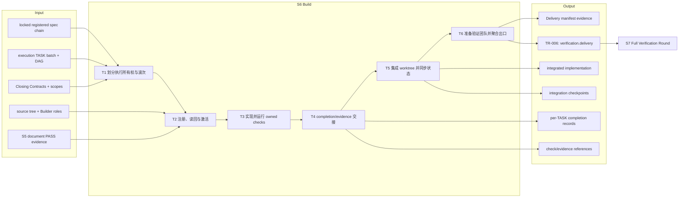
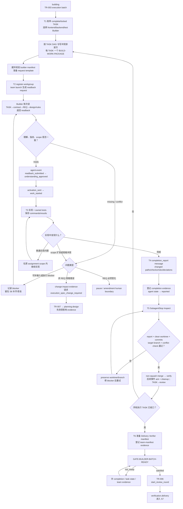

# L3-S6 — 构建（Build）

> 层：第三层 ｜ 上游：L2 §S6 ｜ 前置：S5 TR-003 已建立 execution batch ｜ 下游：S7 全量验证轮
>
> 阅读顺序：§1～§3 先回答“如何把锁定工作包变成可复验实现”；§4 再映射 Builder 角色、team/activation、worktree integration、completion evidence 和 TR-006/007；§5～§8 审计职责、当前真实强制力、出口和易错点。S6～S11 尚未完成机制优化，本文会把目标设计与现有代码能力分栏表达，不把计划中的能力写成既成事实。

## 1. 第一层：S6 的立意与目标

### 1.1 为什么需要 S6

S5 结束时，系统已经知道要实现什么、允许改什么、完成时应证明什么，但它仍只有文档事实。S6 的职责是把每个锁定 TASK 转换为三类可交给独立验证者的事实：

1. **实现事实**：实际代码、测试、配置或迁移已经落在集成分支；
2. **执行事实**：Builder 在明确 assignment 下完成工作，真实记录 changed paths、checks、风险和偏差；
3. **可复验事实**：每条 Closing Contract 都有 S7 能重新运行或检查的证据入口。

因此 S6 不是“把代码写出来就算完”，也不负责证明产品最终正确。它要完成的是**受控实现与诚实交接**：Builder 负责产出，S7 负责独立复验；二者不能合并为 Builder 自证。

### 1.2 阶段目标与完成定义

| 项目 | 定义 |
|:--|:--|
| 输入 | 当前 generation 已登记并从 S6 起锁定的 REQ/design/contracts/TASK；TASK DAG、scope、Closing Contract；代码库；Builder 角色卡与适用 Best Practices；S5 document PASS evidence |
| 要搞清楚 | 每个 TASK 谁拥有写入权；依赖按什么波次执行；哪些技能/命令适用；实现与测试实际改变了什么；S7 如何复验 |
| 核心工作 | 分配执行所有权 → readback/activation → 实现与 owned checks → worktree 集成 → completion/evidence 收口 → 准备 S7 delivery workgroup 并过 build gate |
| 输出 | 已集成的实现；每 TASK completion message/evidence；测试与命令原始输出引用；worktree integration checkpoint；S7 Delivery manifest 准备材料 |
| 目标完成 | 每个 execution TASK 均到 reported/review；报告与证据可读且当前；实现已安全集成；Delivery Verifier team 已可进入 S7；TR-006 启动新 review round |
| 下一阶段 | S7 从 `verification.delivery` 开始，独立检查需求兑现、规格符合、模块完整、集成与回归，再进入 QA/E2E |

### 1.3 Overview：输入、主步骤与输出

“locked registered spec chain”只覆盖 runtime `documents[]` 中完成登记的当前代文档。S2 模块场景包仍可能是 Builder 的必要输入，但按 S5 已记录的现状，它没有同等的 runtime 指纹锁与漂移保护。

### 1.4 S6 的边界与当前保证

- **负责**：执行组队、上下文确认、实现、owned unit/integration tests、真实 completion、worktree 合并与构建期规格冲突路由；
- **不负责**：自己给交付结论、修改 locked 规格、替代 S7 的 Delivery/QA/E2E、直接修复 S7 finding、发布或部署；
- **当前硬阻断只有两类**：PreToolUse minimal safety policy 会阻断可识别的 locked-artifact 写入与 squash merge；它不再硬阻断未激活写或一般 write-scope 越界；
- **activation/scope 的当前强度**：agent-event 能记录状态和 activation envelope，但 `policy.Engine` 不消费 `AllowedWritePaths` 做 deny；越界主要通过 guidance、报告和集成纪律发现；
- **出口 gate 的当前强度**：能要求 completion 类 evidence、按一部分 runtime TASK ID 补齐报告，并要求一条 team-manifest 类 evidence；不会检查报告中的 checks 都 PASS、scope deviations 为空或 changed paths 属于授权范围；
- **基线修改**：Builder 发现非 REQ 规格错误应走 TR-007 回 planning；REQ 变化不得借 TR-007 静默推进，应走 amendment/human boundary。

## 2. 第二层：S6 的任务分解

| 任务 | 要解决的问题 | 主要动作 | 阶段产出 |
|:--|:--|:--|:--|
| T1 划分执行所有权与波次 | 每个 TASK 谁写；哪些可并行；如何避免多人写同一表面 | 从 TASK scope/Primary contract/风险选 role；每 TASK 建 `BUILD-WORK-PACKAGE` assignment；按 DAG 和冲突面排波次 | Builder manifest、assignment、执行顺序 |
| T2 注册、读回与激活 | Builder 是否读到正确版本并理解范围；授权事实如何留痕 | register workgroup；team launch；readback；主会话批准；activation_sent/work_started；加载适用 Skills | runtime team/agent/task 记录、readback/activation messages |
| T3 实现并运行 owned checks | 如何在不改规格、不扩 scope 的前提下兑现条款 | 按 Closing Contract 实现；编写 owned tests；执行精确 test/lint/build 命令；保存原始结果；问题分类 | 代码/测试/迁移、check evidence、finding/blocker |
| T4 completion/evidence 交接 | Builder 实际做了什么；集成器和 gate 能否消费当前记录 | 提交 schema-valid completion message；登记 agent lifecycle；另登记 gate 可消费 evidence | per-TASK completion message/evidence |
| T5 集成 worktree 并同步状态 | 多个 Builder 的提交如何进入同一基线；冲突如何保留；TASK 如何进入 review | SubagentStop Inspect→non-squash integrate→verify→后续 ack/cleanup；保存 checkpoint；同步 TASK 状态 | 集成实现、checkpoint、reported/review task |
| T6 准备验证团队并聚合出口 | S7 启动是否不需要重新组队；构建批次是否齐全 | 规划 Delivery Verifier responsibilities；登记 team-manifest 类 evidence；GATE-BUILDER-BATCH-READY；TR-006 | review round+1、`verification.delivery` cursor |

T1～T5 对每个 TASK 重复，并受任务依赖限制；T6 只在整批收口时执行。当前 runtime 并没有完整接通 S4 TASK DAG 到 S6 调度器，因此“按 DAG 波次执行”仍需 Orchestrator 主动维护，详见 §5.3。

## 3. 从锁定 TASK 到验证轮输入的完整工作流

图中“按意图同步 TASK→review”是协议需要的状态变化，但当前公开 CLI 没有暴露 `task-event`，且普通 register/agent-event 流程没有自动完成这一步；它是现状缺口，不应从图中误读为已经无缝自动化。

## 4. 第三层：每项任务如何被引导和承载

### 4.1 T1 — 执行所有权与波次

每个锁定 TASK 应对应一个可审计的 `BUILD-WORK-PACKAGE` assignment。角色按实际写入所有权选择：

| 写入类型 | Builder | 允许拥有 | 不允许借机拥有 |
|:--|:--|:--|:--|
| 前端产品代码 | `frontend-builder` | UI、route/store、owned unit/component tests | 后端实现、独立 E2E 结论、locked 规格 |
| 后端产品代码 | `backend-builder` | domain/API/persistence、显式迁移、owned unit/integration tests | 前端实现、独立 review、未声明迁移 |
| 纯测试/测试基础设施 | `test-builder` | test、fixture、helper/config；CASE/PATH 绑定 | 产品代码、CASE oracle、E2E reviewer evidence |

TASK §4 是 prospective scope，team manifest 把它投影到 assignment；角色卡给出静态最大边界。正常设计要求一个 TASK 一个写 owner，并用 DAG 等待上游完成后再激活下游。

当前 `team.ValidateBytes` 对 `builder` workgroup 没有 mandatory responsibility 列表，不检查每个 TASK 恰有一个 `BUILD-WORK-PACKAGE`、role 与路径相符，也不检查 assignment write-path overlap。`team-planning` 中这些规则目前属于方法纪律，不是 validator 已实现的事实。

此外，S4 TASK §8 的依赖没有在 `register-workgroup` 时写入 runtime task entity；manifest `depends_on` 又只允许本 workgroup 内 assignment。因而 runtime 的 TeammateIdle 调度看不到完整 TASK DAG，跨任务顺序仍由 Orchestrator 保持。

### 4.2 T2 — 注册、读回与两阶段激活

实际载体分为四步：

1. `runtime register-workgroup` 校验 team manifest，在正确的 building/bug_resolution 状态登记 team、agents，并在缺少 TASK entity 时创建 state=`reviewed` 的 task；
2. `team launch --manifest ... --request-template ...` 基于手工准备的 request template 生成每 assignment 的 fingerprinted readback request；
3. Builder 依次阅读 TASK→contract→REQ→design/prototype/rules，提交 schema-valid `readback_response`；
4. 主会话用 `runtime agent-event` 记录 readback、approval、activation、work_started。

readback fields 会逼 Builder复述 objective、责任、条款、planned surfaces、forbidden actions、依赖、证据计划、Closing Contract、风险和已读文档。这个结构是理解检查的主要引导载体。

六方交集（role maximum ∩ manifest ∩ TASK ∩ activation ∩ lifecycle ∩ hook policy）仍是**授权模型**，但当前不是六方都由 enforce path 硬算。`policy.Engine` 已缩减为 locked artifact 与 squash merge 两个 deny；`AgentContext.AllowedWritePaths` 只是下游数据载体。普通未激活/越界工具调用可被 Quality Gate 标为 `not_ready` 并继续放行，主会话必须靠流程纪律不批准、不收口。

渐进披露也尚未真正收敛：`team launch` 会把 role default Skills 全量合并进 assignment。frontend/backend 角色各自带一大组默认 Best Practices，再追加 task skills；这与“只加载当前风险需要的最小集合”存在明显张力。

### 4.3 T3 — 实现、owned checks 与问题分类

Builder 的工作顺序应直接由 TASK Closing Contract 驱动：

1. 确认每条 contract assertion 对应的实现表面；
2. 为行为变化建立能够失败的测试或复现；test-builder 必须证明测试对目标缺陷会失败；
3. 在 assignment scope 内实现，不改 locked specs，不扩大产品含义；
4. 运行精确的 unit/integration/lint/build 命令，保存 command、exit/result 与原始 evidence ref；
5. 对照 Closing Contract，记录通过、阻塞和未验证项，而不是用“基本完成”概括。

发现问题时先分类：

| 发现 | 处理 |
|:--|:--|
| scope 内普通实现错误 | Builder 自己修到 owned checks 通过 |
| 外部环境/权限暂缺 | 写 blocker，保留 worktree；能独立完成的其余工作继续，必要时走全局 pause |
| TASK/contract/design 无法共同成立，REQ 不变 | 运行 impact analysis，登记请求 `execution_spec_change_required` 的 change-impact evidence，TR-007 回 planning.design |
| 必须改变 REQ 目标或 AC | 不用 TR-007 偷渡；停下来走 human amendment |
| 看到邻近但不在 assignment 的缺陷 | 记录 finding，不顺手修；S7 发现后的正式缺陷走 S8→S9 |

当前 `GATE-EXECUTION-SPEC-CHANGE-REQUIRED` 消费的是通用 evidence envelope（responsibility=`Builder`/`BUILD-WORK-PACKAGE`、conclusion=`spec_change_required`、requested event 对应 TR-007），而正式 `changeImpact` schema 是另一种记录形状。二者之间没有统一模板/自动包装，属于现状集成缺口。

### 4.4 T4 — completion message 与 gate evidence

完整收口在概念上需要三类事实：

| 事实 | 载体 | 当前消费者 |
|:--|:--|:--|
| Agent 做了什么 | agent-message `completion_report`：status、summary、changed/reviewed paths、checks、evidence/finding refs、risks、scope deviations、requested event | `runtime agent-event completion_reported`、SubagentStop |
| Gate 能否计数 | `agent_completion` / `completion_report` evidence envelope：evidence_id、kind、runtime/generation、producer/responsibility、conclusion、task_id、subject refs | GATE-BUILDER-BATCH-READY |
| TASK 执行状态 | runtime task `in_progress → review`（builder_reported） | 后续 T5、`all_builder_tasks_in_review`、batch completeness |

这三类目前没有一个命令原子完成。agent-message schema 与 quality-gate evidence envelope 不是同一 JSON 形状：前者 `additionalProperties=false`，后者由 evaluator 读取另一组字段。因此实践上需要消息记录和 gate envelope 两份相互引用的产物，但仓库没有专门的 Builder completion evidence 模板。

更关键的是，`runtime evidence add` 只登记文件指纹和元数据，不做内容 schema 校验；quality gate 只读取 envelope 的最小字段。它不会读取 completion message 中的 `checks`、`changed_paths`、`scope_deviations`、`activation_id` 或 evidence_refs，也不检查 producer 就是 TASK owner。

TASK lifecycle 的 `AdvanceTask` 内部实现支持 `builder_activated` 和 `builder_reported`，但 CLI 当前没有 `runtime task-event` 入口，register/agent-event 也不自动同步 task state。因此文档要求的 `review` 状态与正常操作路径尚未闭合。

### 4.5 T5 — worktree 集成、实际差异与 TASK 收口

SubagentStop 的 Controller 路径会：

1. 从 assignment、sidecar 或旧 checkpoint 解析 `worktree_path`、source branch、target branch；
2. `Inspect` 检查 completion 文件可读、worktree clean、source 有 commits、target 存在、merge-tree 无冲突；
3. 条件满足时执行 non-squash integrate 并写 durable checkpoint；
4. 第一次通常到 verified，后续 SubagentStop/TeammateIdle 再做 completion acknowledgement 与 cleanup；
5. dirty/conflict/缺元数据时保留 worktree 和 branch，给恢复 guidance，不销毁现场。

这里不能继续沿用旧叙事中的两个承诺：

- Controller 调用 `Inspect` 时没有传 required checks，因此 integration path 不会重新运行 TASK checks；
- `Inspect` 没有比较 git changed files 与 assignment `WritePaths`，也没有执行 `changed_paths subset_of activated_write_paths`；它的 locked-artifact diff hints 在当前 Controller 调用中也为空。

所以 worktree integration 目前能证明“可合并、非 squash、现场可恢复”，不能证明“一切改动都在 activation scope 内”。实际 changed-path/scope 审计仍停留在报告纪律和 S7 复核层。

另一个接口错位是：team-manifest schema 的 assignment 不允许 `worktree_path/branch/target_branch` 扩展字段，但 Hook loader 会尝试读取这些字段。当前可行来源主要是 `.claude/assignments/<id>.json` sidecar 或已有 integration checkpoint；`team launch` 本身不生成它们。

集成完成后还应把 runtime TASK 从 `in_progress` 同步到 `review`，让 TR-006 能知道“Builder 已报告、等待独立验证”。但如 T4 所述，这个 task lifecycle 事件尚无公共 CLI，当前只能把它列为协议目标和实现缺口，不能假装 SubagentStop 已自动完成。

### 4.6 T6 — S7 团队前置与 TR-006

TR-006 的意图是同时确认：

1. 每个 Builder TASK 已 reported；
2. 每个 TASK 有当前 completion report；
3. S7 Delivery Verifier 团队已经覆盖 `VER-REQ-GAP`、`VER-SPEC-GAP`、`VER-MODULE-COMPLETE` 及触发的 integration/regression 职责。

满足后 `start_review_round` 把 review.round +1，`set_verification_phase_delivery` 进入 S7。

当前实现只部分兑现这个意图：

- build gate 至少要求一条 completion evidence，并对 runtime 中 state=`in_progress|review|done` 的 TASK 按 `task_id` 补齐；state=`reviewed` 的 TASK 不进入补齐集合；
- completion evidence 可用空 `subject_refs`，不要求精确绑定 TASK 文档；
- gate 只要求一条 Orchestrator/complete 的 team-manifest 类 envelope，不解析实际 manifest responsibility coverage；
- TR-006 的三个 transition guards 都是 evidence-attestation stub，只确认已有当前 evidence context，不重复语义检查；
- `runtime register-workgroup` 明确拒绝在 building 登记 `delivery_verifier`（要求已经位于 `verification.delivery`），与“TR-006 前 runtime.entities.teams 已登记 Delivery 团队”的 guard 文案互相冲突。当前只能先准备 manifest/evidence，TR-006 后再登记真正 workgroup。

因此“机器已保证所有 TASK checks PASS 且完整 Delivery Team 就位”目前不成立。本文保留它作为 S6 的目标完成定义，同时把现有 gate 当作较低的结构地板。

## 5. 职责分布与覆盖审计

### 5.1 职能落点

| 职能 | 主责 | 承载位置 | 消费者 |
|:--|:--|:--|:--|
| TASK→Builder 写所有权 | Orchestrator/team planner | builder manifest + assignment | Builder、Hook loader |
| 文档理解与版本确认 | Builder + Orchestrator | readback request/response + approval | activation lifecycle |
| 实现和 owned tests | frontend/backend/test Builder | source/test/worktree | S7 Delivery/QA |
| 动态授权记录 | runtime assignment lifecycle | activation message + agent entity | guidance、audit |
| locked spec 保护 | minimal safety policy | runtime documents + PreToolUse | 所有写操作 |
| worktree 合并与恢复 | Controller/Integrator | SubagentStop + checkpoint | integration branch、后续复验 |
| completion 叙述 | Builder | agent-message completion report | Orchestrator/SubagentStop |
| batch completion 计数 | quality gate | registered evidence envelope + task IDs | TR-006 |
| 规格冲突影响 | Builder/impact analysis | change-impact record/envelope | TR-007、planner |
| 独立验证团队准备 | Orchestrator | Delivery manifest + evidence envelope | TR-006/S7 |

### 5.2 应有的分工与重叠控制

- Builder 写产品与 owned tests，Delivery/QA/E2E 只验证，不在 S6 预写自己的 PASS；
- frontend/backend/test Builder 按写所有权分离，跨端行为由 SYNC 合同连接，不由某一个 Builder 私自统一解释；
- assignment scope 是 TASK scope 的执行投影，不应成为第二份规格；
- completion report 陈述“做了什么”，Closing Contract 陈述“应证明什么”，S7 evidence 陈述“独立观察到什么”；三者有映射但不互相替代；
- worktree inspect 负责合并安全，quality gate 负责阶段出口，二者不能互相冒充代码质量审查；
- 构建期规格冲突回 planning，验证期实现 finding 走 S8；路由按问题发现时点和性质分开。

### 5.3 如实现状与未闭合缺口

1. **activation/scope 没有 deny**：minimal policy 只阻断 locked artifacts 和 squash merge，一般未激活写、越界写不会被 `policy.Engine` 硬拒绝；
2. **builder manifest 校验不足**：无 mandatory `BUILD-WORK-PACKAGE`、无一 TASK 一 owner、无 role/path 一致性、无 write overlap 校验；
3. **S4 DAG 未进入 runtime**：register-workgroup 创建 task entity 时不带 `depends_on`，跨 workgroup manifest 又不能引用，自动调度无法可靠遵守 TASK DAG；
4. **task lifecycle 无公共入口**：内部有 `AdvanceTask`，CLI 不暴露；agent lifecycle 与 task lifecycle 不自动联动；
5. **报告有双格式裂缝**：schema-valid agent completion message 与 quality-gate evidence envelope 不是同一形状，也没有 Builder 专用 evidence 模板/原子登记；
6. **gate 不审内容**：不检查 checks PASS、Closing Contract 四类映射、changed paths、scope deviations、activation ID、producer=owner；
7. **reviewed TASK 可漏计**：batch completeness 只扫描 in_progress/review/done，register-workgroup 初始创建 reviewed；
8. **worktree 集成不做 scope 差集**：Controller 没有传 required checks/locked hints，Inspect 也不使用 assignment WritePaths 做 changed-path subset；
9. **worktree 元数据来源断裂**：schema 不允许 manifest 扩展坐标，launch 不生成 sidecar，缺少 sidecar/checkpoint 时 SubagentStop 只能阻塞；
10. **S7 manifest 前置矛盾**：TR-006 文案要求已登记 Delivery team，但 register-workgroup 只允许进入 verification.delivery 后登记；gate 目前只看 envelope；
11. **Skill 预载过宽**：launch 自动注入整套 role defaults，最小按需加载尚未实现；
12. **补充真相未锁**：模块场景包若未登记，Builder 的输入仍可能在 S6 漂移而 gate 不知情；
13. **TR-007 的 REQ unchanged 不是实算 guard**：`req_baseline_unchanged` 当前是 evidence-attestation stub；通用 change-impact envelope 与正式 `changeImpact` schema 也未统一。

### 5.4 关键取舍

| 问题 | 当前设计意图 | 现状代价 |
|:--|:--|:--|
| 执行粒度 | 每个锁定 TASK 一个单职责写 owner | validator/gate 未完整强制，需要 Orchestrator 守住 |
| 激活方式 | readback 后显式批准，保留审计链 | 工具写入并未被 activation scope 硬 deny |
| 质量策略 | Builder owned checks + S7 独立复验 | S6 gate 不读 checks，早期假绿只能靠纪律/S7 揭示 |
| 并行模型 | 按 DAG 与写冲突分波次 | DAG 未投影进 runtime，自动 scheduler 依据不足 |
| 集成方式 | worktree + non-squash + preserve-on-conflict | 元数据/检查/scope 审计链未完全接通 |
| 报告形式 | 结构化 completion + 当前 evidence | 两种 schema/登记路径分裂，重复且易失配 |
| 规格冲突 | 影响分析后回 planning，不在代码里改文档 | TR-007 证据形状与 unchanged guard 仍弱 |

## 6. L1 准则如何嵌入 S6

| L1 准则 | S6 中的实际落点 |
|:--|:--|
| D1 权威外置 | assignment、readback、activation、completion、evidence、integration checkpoint 和 runtime state 均落盘 |
| D2 自然路径观测 | PreToolUse 评 gate；SubagentStop 触发 integration；TeammateIdle 驱动恢复/收队 |
| D3 门是顾问 | missing completion/task/team evidence 与 integration blocker 指向具体补项；scope 诊断仍不完整 |
| D4 引导性产物 | readback fields 与 completion fields 迫使 Builder 陈述理解、实际变化、checks、风险和偏差 |
| D5 三级强制 | 方法/角色引导实现；schema/runtime 约束消息和状态；hard policy 仅保留锁文档与禁 squash——强制层目前偏弱 |
| D6 三方收敛 | Builder 产出、machine 登记/集成、S7 独立复验；REQ 变化交人 |
| D7 收敛可观测 | task/agent states、missing evidence、worktree checkpoint 与 gate 状态显示剩余工作，但 task 同步缺口会造成失真 |
| 公理一 原型 | 对应真实工程的 work package、branch/worktree、CI-like checks、merge 和 handoff |
| 公理二 分工 | Builder 不自审最终交付；Integrator 不判断需求；Gate 不应伪装代码质量 reviewer |
| 公理三 消费 | completion 供 lifecycle/gate/S7 消费；当前双格式与未消费字段被明确列为整改点 |
| 公理四 成本 | 可并行 TASK 使用 worktree，风险 skill 按需；但默认 Skill 全量预载仍产生上下文成本 |
| 公理五 传达 | completion 按 changed paths/checks/findings/risks 传达；blocker 与 spec change 分路 |

## 7. 产出、出口门槛与失败路由

### 7.1 正式产出

- 每个 execution TASK 的 Builder assignment、readback/approval/activation/work-start 记录；
- 已提交并集成的实现、owned tests、迁移/fixture（仅在 scope 明确时）；
- 每个 TASK 的 completion message，以及 gate 可消费的 completion evidence envelope；
- commands/checks 的原始输出引用、changed paths、remaining risks、scope deviations；
- worktree integration checkpoint、merge/verify 状态和必要的 preserve blocker；
- S7 Delivery Verifier manifest 及 team-manifest 类 evidence；
- TR-006 后的新 review round 与 `verification.delivery` cursor，或 TR-007 的规划返工记录。

### 7.2 目标出口判定与当前机器地板

| 维度 | 目标判定 | 当前机器实际检查 |
|:--|:--|:--|
| TASK 覆盖 | 每个锁定 execution TASK 恰有一个 completed Builder report | 只补齐 runtime 中 in_progress/review/done task_id；reviewed 可漏 |
| 实现状态 | worktree 变更均已非 squash 集成到目标分支 | Integrator 可检查 clean/commit/target/conflict 并合并；需要外部坐标 |
| 范围 | changed paths ⊆ activated write paths；deviations=[] | 不检查 |
| Checks | Closing Contract 命令/fixture 均映射且 owned tests PASS | 不读取 completion checks；Integrator 默认不重跑 |
| 报告真实性 | producer=owner，activation/version 当前，风险/偏差完整 | 只校验 evidence envelope 最小身份/代际/结论/task_id |
| 验证团队 | 完整 Delivery responsibilities 与风险触发项已规划 | gate 只认一条 Orchestrator/complete team evidence，不解析 manifest |
| 协议出口 | batch ready 后新开 review round | TR-006 执行 `start_review_round` + delivery phase |

### 7.3 失败路由

| 情况 | 去向 |
|:--|:--|
| readback 缺输入/指纹不明 | 留 S6，补输入并重新 readback；不要先写 |
| 普通实现/测试失败且规格明确 | 留原 assignment 修复，保留失败 evidence |
| 外部权限/环境阻塞 | blocker + preserve worktree；穷尽其余可做项后按全局 pause 机制处理 |
| 需要扩大写 scope 但不改规格 | 主会话重新规划 assignment/activation；旧批准不可自动继承 |
| contract/design/TASK 冲突，REQ 不变 | change-impact → TR-007 → planning.design → 重走 S2～S5 |
| 需要改变 REQ | human amendment；不得以 execution spec change 绕过人闸 |
| worktree dirty/merge conflict/missing metadata | Integrator preserve，修复现场后重试 SubagentStop |
| completion/evidence/task state 缺失 | 留 S6 补真实记录，不伪造 envelope 绕 gate |
| S7 manifest 尚不完整 | 留 S6 准备并校验文件；真正 workgroup 在 TR-006 后登记 |

## 8. 易错点与渐进披露

### 8.1 易错点

- S5 的 document PASS 只授权实现，不代表代码正确；
- TASK 文档 Status=complete 与 runtime task reported/review 不是同一状态；
- agent state=reported 也不会自动让 task state=review；
- activation envelope 当前不是 write-scope 硬锁，不能因“工具没被拒绝”就认为合法；
- locked artifact hook 只保护已登记且身份完整的文档，不保护未登记场景包；
- `team launch` 需要 request template，且不会替你创建 worktree coordinate sidecar；
- team validator 当前不会发现 Builder write overlap 或 role/path 错配；
- completion message 写盘、agent-event 记录、evidence add、task state 同步是不同动作；
- PASS checks 写在报告里不等于 gate 已复跑；S7 必须独立执行；
- worktree merge success 不等于 changed paths 在 scope 内；
- Delivery workgroup 不能在 building 用当前 register-workgroup 正式登记；先准备 manifest，S7 再登记；
- Builder 发现邻近缺陷不应顺手扩大修复，尤其不能修改 locked docs；
- TR-007 只处理 REQ 不变的规格返工，REQ 变化必须回到人。

### 8.2 阅读预算

| 角色/时机 | 最小阅读集 | 按需加载 | 当前不应被迫预载 |
|:--|:--|:--|:--|
| Orchestrator 组队 | execution TASK 清单、scope、DAG、角色边界、team-planning | worktree/风险专项 | 每个技术 Skill 全文 |
| Builder readback | 自己的 TASK、Primary contract、REQ 切片、相关 design/module truth、rules | assignment 指名的 Best Practices | 全 REQ、其他 TASK、所有 role defaults |
| Builder 实现 | Closing Contract、目标代码与 owned tests | 碰到 domain/UI/migration/integration 风险时加载对应 Skill | transition/gate 实现 |
| completion 收口 | agent-message schema、evidence envelope要求、实际 diff/checks | impact-analysis（仅规格冲突） | S7 全套审查方法 |
| Integrator | completion path、worktree/branch/target、merge blockers | required checks（若未来接通） | 需求语义全文 |
| S6 出口 | task/evidence coverage、Delivery manifest、TR-006 missing | gate/explain 诊断 | 重做 Builder 实现 |

当前 role default Skills 的自动全量合并与上表不一致；上表描述的是应达到的渐进披露目标，§5.3 已把实现差距列入现状，而非宣称已经完成。
