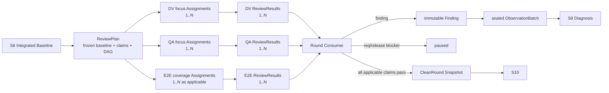
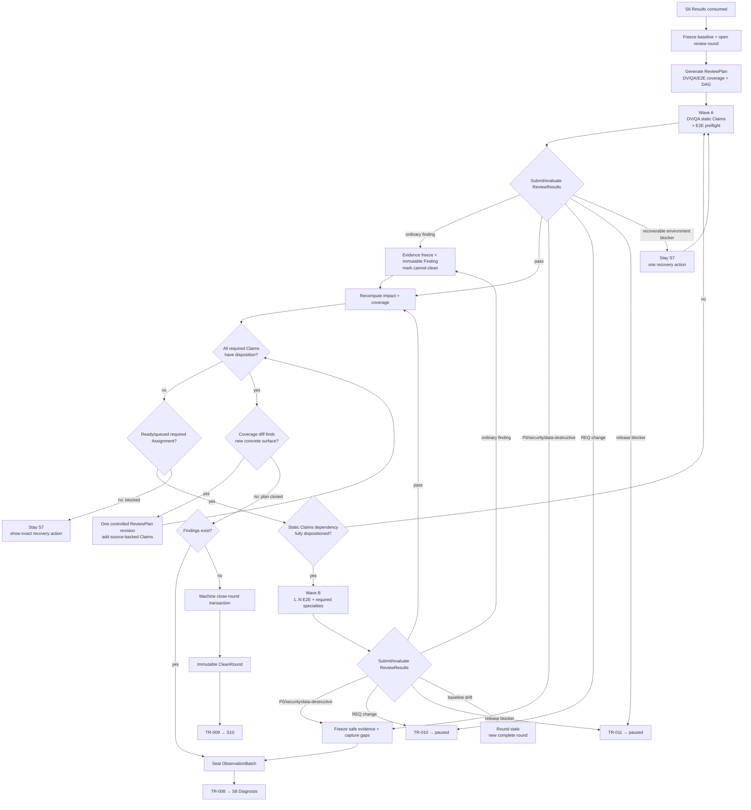

# L3-S7 — 完整验证轮（Verification Round）

> 层：第三层 ｜ 上游：L2 §S7、S6 已集成的实现与 Builder Result ｜ 下游：S8 缺陷调查、S10 验收或 paused
>
> Macro-stage：S7 Discovery → S8 Diagnosis → S9 Remediation。S7 记录可复现表象以及真正“撞墙”的操作现场，S8 在无需默认重新复现症状的前提下推导根因与 RepairContract，S9 执行完整根因修复；三者共同审查和修复开发结果，但任何一层不得越过自己的判断权限。
>
> 横切机制：[L4 Agent 调度与治理](./L4-agent-dispatch-governance.md)。L4 负责 Assignment、PLAN_REPORT、连续执行、Hook、idle/stop、恢复和拓扑选择；本文只定义 S7 特有的验证规划、Claims、波次、ReviewResult、Finding、ObservationBatch 与 clean-round 收口。
>
> 设计状态：本文件以目标机制为主；§13 单列当前实现差距和迁移顺序。目标中的 `ReviewPlan`、Canonical `ReviewResult`、结果提交事务和新 Hook 在 L5 完成前，不得被描述为现有代码能力。

## 0. 阅读方式与一句话结论

S7 不应继续被实现成“Delivery、QA、E2E 三段人工串行，再由 Agent 手工拼聚合 PASS”的流程。目标形态是：

> **冻结一个基线，生成一份 ReviewPlan，将适用验证 Claims 编成 Assignment DAG；DV、QA、E2E 都按真实验证面派出 1..N 个互补 Reviewer，不设 Agent 数量或 token 预算上限。静态 Claims 先完成，行为 Claims 再按真实依赖执行；普通 Finding 只关闭 clean 路径，不关闭安全的发现路径。每个 Assignment 只提交一份 Canonical ReviewResult；所有 required Claims 都有明确 disposition 后，无矛盾则机器生成 CleanRound，有矛盾则把不可变 Findings 封装成 ObservationBatch 交给 S8。**

建议阅读顺序：

1. §1～§2：理解 S7 的价值核心和需要删除的复杂度；
2. §3～§5：理解 ReviewPlan、Claims、Assignment、ReviewResult 与两波流程；
3. §6～§10：理解三类审查、Sub-agent 派发、工具必经路径与 clean round；
4. §13～§15：维护者按迁移顺序实施并验收。

## 1. S7 的立意、边界与不变量

### 1.1 为什么需要 S7

S6 交付的是 Builder 对实现和检查结果的声明，不是独立结论。S7 必须让与 Builder 分离的 Reviewer 在同一冻结基线上回答三个不能互相替代的问题：

| Lens | 要回答的问题 | 典型事实 |
|:--|:--|:--|
| Delivery Verification（DV，schema 中仍为 `delivery`） | 做的是不是当前锁定规格要求的东西，交付边界和跨模块接缝是否完整 | REQ/设计/契约/TASK 是否兑现，模块、接缝、数据流和回归是否遗漏 |
| QA | 实现本身是否逻辑自洽、边界清晰、符合项目惯用模式并易于维护 | 架构/设计模式适配、SOLID/依赖方向、抽象与复用、可读性、复杂度、错误/状态/并发逻辑、测试、安全、性能、可靠性和迁移质量 |
| E2E | 用户或外部参与者是否能从声明入口得到预期行为 | 真实交互、console/network、持久化、副作用、拒绝与恢复路径 |

S7 的价值不是三份报告，而是一份可复算事实：**所有适用 Claims 在同一基线上有独立结论，结论仍有效，没有未路由的阻断 finding，也没有用局部重验冒充完整轮。** 对黑盒 Agent 生产的代码，DV/QA 还是 E2E 前最重要的白盒治理抓手：能从代码、契约和测试中看出的设计债、边界混乱和逻辑风险，应尽量在这里一次发现，而不是等用户旅程撞墙后再回头治理。

### 1.2 阶段目标与完成定义

| 项目 | 目标定义 |
|:--|:--|
| 输入 | S6 已集成实现；Canonical Builder Result；当前 generation 的 REQ/design/contracts/TASK；change impact；风险标签；CASE/PATH；可运行环境 |
| 核心工作 | 冻结 baseline → 生成 ReviewPlan/required Claims → 编排不设数量上限的 DV/QA/E2E Assignments → 先静态、后行为地完成有真实依赖的 Claims → 发现时冻结 encounter 现场并继续安全发现 → 受控求差确认无新增 Claim → clean 或 ObservationBatch 路由 |
| 最小工程权威 | 一份 ReviewPlan、若干 Assignment、每个 Assignment 一份 ReviewResult；通过时一份 CleanRound，失败时一组 immutable Findings + 一份 ObservationBatch |
| 目标完成 | 所有 required Claims 均有被消费的 pass；所有 not_applicable disposition 均在计划中有来源和理由；baseline 未漂移；无阻断 finding/BUG；CleanRound 原子生成并进入 S10 |
| 失败出口 | 实现/质量/行为 finding → S8；REQ 变化或 release blocker → paused；基线漂移或轮不完整 → 新完整轮 |

### 1.3 S7 负责与不负责

S7 负责：

- 定义本轮要证明的 Claims、适用性和证据 oracle；
- 独立执行 Delivery、QA 和适用 E2E；
- 将 DV/QA 各自按真实审查侧重点拆成 1..N 个 focus Assignments，完成静态质量发现面，而不是固定各派一个通用 Reviewer；
- 将 E2E 按 persona、入口、flow、状态/副作用、负向/恢复路径和环境边界拆成 1..N 个 Assignments；首次覆盖为空时执行 E2E cold start，而不是把设计、写 spec、执行和取证压给一个通用 Reviewer；
- 对 Reviewer Result 做结构、身份、scope、fingerprint 和覆盖消费；
- 将可复现表象、简短操作动线和逐步骤现场证据保存为 immutable Finding，使 S8 无需默认重新复现症状即可开始因果调查；
- 在 required Claims 都有 disposition、且受控求差不再产生新 Claim 后，以 ObservationBatch 原子传给 S8；
- 从当前事实计算 CleanRound。

S7 不负责：

- 修改被审产品实现或 locked 规格；
- 替 Builder 补普通单元/集成测试；
- 在发现 finding 后直接修复或关闭 BUG；
- 让 Reviewer 自己推进 Runtime、伪造 requested event 或手写聚合 PASS；
- 做验收和发布决定。

### 1.4 不可退让的不变量

1. **冻结产品基线，分离验证产物**：一轮所有 Result 必须绑定相同 generation、产品代码/配置/S6 测试和 authoritative subject fingerprints；这些变化使本轮 stale。S7 cold-start 新建的 E2E spec/fixture/evidence 使用独立 verification-artifact revision，允许增长，但每份 Result 必须绑定自己实际使用的 artifact digest。
2. **角色独立**：Reviewer 不能验证自己在 S6/S9 写入的产品结果；原 finding 的 targeted re-verification 由原责任方承担，但它不能生成 clean round。
3. **职责无沉默**：每个适用 Claim 必须有明确结论；`not_applicable` 是有来源、有理由的决定，不是缺报告的别名。
4. **结论不聚合造假**：Lens/round 状态只由被消费的 ReviewResult 计算，不能由 Orchestrator 另写一条总 PASS 覆盖局部缺失。
5. **先保全现场，再扩展观察**：Finding 不是一句症状和一份复现脚本。S7 必须先保存最后正常点、撞墙动作、首个异常点、终态、状态差异和可关联 raw evidence；否则不得把普通 Finding 标为 investigation-ready。
6. **发现即判定 cannot-clean，不等于停止发现**：首个阻断 Finding 确认后停止所有修复行为，但普通且可安全观察的 Finding 仍须完成当前 frozen baseline 的 required Claims。只有 Result/Finding 明确暴露新的、可定位的 affected surface 时才允许一次受控 ReviewPlan revision；不以“继续找更多可能性”开放递归范围。只有 P0/安全/数据破坏类立即 stop-the-line，并保存已经产生的只读现场证据与 capture gaps。
7. **S8 不默认重现症状**：S7→S8 的 Definition of Ready 是“可直接形成初始因果模型和竞争假设”，不是“把复现劳动转交给 Investigator”。S8 后续 observation 只为区分假设，而不是重新证明 Finding 存在。
8. **白盒问题优先，但不能替代行为发现**：预先规划的 required DV/QA static Claims 必须先得到完整 disposition，再按真实依赖启动行为 E2E。普通 static Finding 会关闭 clean path，但不会取消仍可安全执行的 E2E Claims；S7 仍要把真实旅程、负向路径和副作用观察做完，避免 S8/S9 只收到代码问题而漏掉同一根因的运行表象。
9. **模式适配不是模式配额**：QA 必须判断实现是否使用了项目惯用技巧或合适设计模式，也必须识别模式缺失和模式滥用；不能用“出现 Factory/Strategy/SOLID 名词数量”代替上下文判断。
10. **覆盖优先于 token 节省**：S7 不设置 Reviewer 数量上限、固定 WIP 或 token budget gate。只要存在独立且必要的验证面，就创建足够的 Assignment；平台并发不足只影响排队，不得删除、合并过载 scope 或降低 required coverage。优化目标是去掉重复阅读、空报告和无消费机制，不是省掉专业判断。
11. **机器做确定性汇总**：Agent 负责专业判断和标注 failure boundary；Harness 负责采集时间线、证据绑定、集合、指纹、身份、状态、覆盖和路由，不把业务判断伪装成规则分数。

## 2. 复杂度—收益审计与机制取舍

### 2.1 保留、改变和删除

| 当前机制 | 收益 | 成本/风险 | 目标决策 |
|:--|:--|:--|:--|
| Delivery、QA、E2E 三种 Lens | 防止 Builder 自证和单视角漏检 | 需要独立角色与证据 | **保留** |
| 同轮、冻结指纹、有效性 | 防止混用历史 PASS | 需要可靠控制面 | **保留并强化** |
| 首个 finding 立即杀死整轮并去 S8 | 减少错误基线上的继续验证 | 可能只带走第一个表象，让 S8 重做发现 | **改为 cannot-clean + coverage-complete discovery + ObservationBatch** |
| 自由文本 `preconditions/inputs/steps` | 写法简单 | 常变成“如何重做”的脚本，缺少当次实际动作、首次偏差和状态差异 | **改为 Finding 内嵌 discriminated `encounter`；人只写短摘要和边界，Harness 自动采集 timeline** |
| 每个 finding 另建 Failure Episode 报告/状态机 | 可以承载完整现场 | 新增长期权威、ID、同步、恢复和 gate 成本 | **不新增顶层控制面；复杂 raw trace 作为 typed evidence，Finding 只保存索引与摘要** |
| S8 默认再次复现 bug | 可重新观察最新现场 | 重复 S7 成本、污染现场、遇到间歇问题时可能永远无法开始调查 | **删除默认要求；仅在判别竞争假设时请求受控 follow-up observation** |
| targeted reverify 后再开 full round | 防止局部修复破坏其他面 | 会增加一次完整轮 | **保留** |
| Delivery → QA → E2E 全串行 | 可避免早期已失败时继续昂贵 E2E | 增加排队和 lead time；同轮一致性实际由冻结基线保证 | **改为 ReviewPlan DAG + 两波调度** |
| 每个 responsibility 一个 Assignment/Agent | 表面上责任清晰 | 微任务、回执、报告和回收数量膨胀 | **改为一个 Assignment 覆盖同上下文多个 Claims** |
| DV 固定一个 Reviewer、QA 固定一个 Reviewer | 调度简单 | 单个上下文容易只看主路径；架构、逻辑、测试和维护性互相挤压，黑盒代码缺陷逃到 E2E/后续维护 | **每个 Lens 按 focus clusters 生成 1..N Assignments；N 由风险/边界/上下文决定** |
| E2E 固定一个 Reviewer | 表面上入口单一、容易管理 | 首次覆盖为空时，一个 Agent 同时理解所有旅程、设计 oracle、写 spec、准备数据、执行与取证，极易上下文过载并漏掉负向/恢复/副作用 | **E2E 也按 coverage matrix 生成 1..N Assignments；cold start 默认拆分，不把全需求压给单 Agent** |
| 固定 WIP=2、Agent 上限或 token budget gate | 成本可预测 | 为节省当前轮 token 主动制造漏检，缺陷会在 S8/S9/后续迭代成倍返工 | **删除质量层资源上限；只保留真实依赖、resource lock、平台并发容量和安全门，排队不裁 coverage** |
| 每个 checklist 点派一个 Reviewer | 看似覆盖充分 | 重复读仓库、结论重叠、Agent 数量和汇总成本爆炸 | **Claims 细，Assignment 按共享 read set/方法聚类；禁止 generic full-review 重复派发** |
| 强制使用或计数设计模式 | 可提醒结构化设计 | 容易模式崇拜和过度工程，简单逻辑被抽象成迷宫 | **QA 做 pattern-fit judgment：缺模式、错模式和过度模式都可形成 Finding，但必须给 context/risk evidence** |
| angle declaration、继承、至少三个、逐条 disposition | 强迫 Reviewer 提前思考具体检查点 | 与 responsibility/risk/check 重叠；维护第二套分类；当前链路不闭合 | **删除独立生命周期，意图并入 Claim** |
| readback → approval → activation | 降低误解风险 | 正常任务多一次同步等待；Agent 易在第一轮结束 | **按 L4 改为 plan_checkpoint 后连续执行** |
| 逐职责 evidence + Markdown + phase aggregate envelope | 兼顾人读和路由 | 同一事实多写、词汇漂移、aggregate 假绿 | **只提交 Canonical ReviewResult，视图自动生成** |
| Agent 调用 clean-round Skill 再写 wrapper | 解释方法 | 纯函数被包装为人工步骤 | **Evaluator 机器执行并自动持久化** |
| PTR clean 后 TR 再重复 clean guards/record | 多一道保险 | 双状态、双动作、恢复困难 | **一次 close-round 事务** |
| Agent 手写 requested_event/pause evidence/Params | 暴露路由意图 | 让 Worker 理解 Controller 内部协议 | **Result verdict 驱动工具自动路由** |
| 任意下一次 PreToolUse 才推进 | 借自然事件触发 | 因果关系隐蔽，可能等待无关操作 | **在 semantic submit 后立即求值** |

### 2.2 要删除的是重复控制面，不是专业判断

机制减法不能误删以下能力：

- Delivery、QA、E2E 仍由不同专业 Lens 给出结论；
- DV、QA、E2E 每个 Lens 都允许 1..N 个专业 Reviewer，且没有人为最大值；删掉的是“一责任一 Agent”的机械映射和重复泛审，不是多视角验证；
- token 是本阶段购买缺陷发现率和可维护性的必要投入；不得以成本、默认并发数或“一个 Agent 应该能做完”为理由合并认知过载的 Assignment；
- QA 必须审查设计模式/项目惯用法的适配、逻辑自洽、边界/依赖方向、可读性和维护风险，而不退化成 lint + tests；
- 安全、性能、可靠性、迁移等高风险专项仍按 impact 触发；
- E2E 仍需真实浏览器和原始证据，不因统一 Result 而退化成一条文字 PASS；
- 运行型 Finding 仍需一份真实 encounter；但操作时间线、network/console/trace 应由工具自动采集，不让 Reviewer 手写第二份测试日志；
- `not_applicable` 仍需明确来源和理由；
- CleanRound 仍是严格合取，只是不再需要 Agent 手工组装。

## 3. 目标权威模型：ReviewPlan → Assignment → ReviewResult → CleanRound / ObservationBatch

### 3.1 单一事实链



权威分工：

| 事实 | 唯一工程权威 | 非权威投影 |
|:--|:--|:--|
| 本轮要审什么、为什么适用 | ReviewPlan Claims | Prompt、Team task、Markdown 看板 |
| 谁负责、scope、checks、dispatch mode | Assignment | Agent/teammate 活会话状态 |
| Reviewer 实际怎么审、看到什么 | ReviewResult + raw evidence refs | 聊天 final、聚合摘要 |
| 失败时看到的表象、操作现场和 failure boundary | immutable Finding（含 encounter）+ sealed ObservationBatch | BUG 草稿、聊天摘要、复现脚本、root-cause 猜测 |
| 本轮是否完整、有效、blocker-free | CleanRound evaluator/snapshot | 人工总 PASS |

所有控制面记录遵循 L4 的共享存储不变量：即使 E2E spec 或报告写在隔离 worktree，ReviewPlan、Assignment、plan checkpoint、ReviewResult 和 round checkpoint 仍必须写入项目级共享控制面，并使用 revision/CAS。

### 3.2 ReviewPlan

每个 review round 只有一份权威 ReviewPlan：

| 字段 | 含义 |
|:--|:--|
| `review_plan_id` / `review_round` / `revision` | 计划身份、轮次和并发控制 |
| `baseline_generation` | 当前冻结 generation |
| `frozen_subjects[]` | S6 产品代码、配置、已有产品测试、REQ、设计、契约、TASK、CASE/PATH 的精确版本与指纹 |
| `change_impact` | S6 变化面、依赖接缝、风险标签、历史 BUG 与回归面 |
| `claims[]` | 本轮必须回答的具体可审计命题；每条 Claim 记录 `lens/source/target/assertion/oracle/applicability` |
| `assignments[]` | Claims 的责任分组和 DAG 投影 |
| `claim_coverage_view` | 由 Claims 的 disposition 计算出的静态、行为、必需发现等查询视图；不作为第二套长期权威 |
| `e2e_coverage_state` | `cold_start / regression_available / not_applicable`；由当前 CASE/PATH 到有效可执行 E2E spec/evidence 的映射计算，不由 Agent 主观填写 |
| `verification_artifact_workspace` | 仅在 E2E `cold_start` 需要新建 spec/fixture/dataset 时启用的独立写面；已有验证资产时不创建额外控制面 |
| `dispatch_capacity_policy` | 固定为 L4 `coverage_complete`；required Assignment 逻辑数量不设上限，物理槽位不足只进入 queued；不因此开放无限 Claim 扩张 |
| `dispatch_policy` | 优先级、真实依赖、共享环境/账号/spec 写面的 resource locks 和平台容量；不得含 Reviewer/token 硬上限 |
| `status` | `planned / running / cannot_clean / discovery_draining / observation_sealed / closing / clean / paused / stale` |

ReviewPlan 在 S7 入口生成初始完整 required Claims。平台是否当下允许 launch 某个 Agent 是调度事实，不应删除或合并 required Assignment。只有 Result/Finding 明确暴露一个初始 plan 未覆盖、且可以通过 `source_ref + affected_surface` 定位的新表面时，才允许一次受控 revision；revision 后重新计算受影响 Claims，完成后即关闭本轮计划。所谓“无新增 Claim”是一次计算结果，不是 Agent 可以自行递归扩大范围的长期状态。

### 3.3 Claim：取代重复的 angle/责任/检查叙事

Claim 是“本轮必须由 Reviewer 判断的一条具体命题”，不是泛化分类词：

| 字段 | 要求 |
|:--|:--|
| `claim_id` | round 内稳定身份 |
| `lens` | `delivery / qa / e2e` |
| `target` | 精确模块、路径、contract clause、CASE/PATH、运行时不变量或失败模式 |
| `assertion` | 要证明的陈述 |
| `oracle` | 什么可观察事实算 pass/fail |
| `method` | 代码审查、命令、真实浏览器步骤、trace 检查等 |
| `required_evidence` | 最低证据类型，不复制证据正文 |
| `applicability` | `required / not_applicable`；N/A 必须有 `source_refs + rationale` |
| `source_refs` | REQ、risk、impact、BUG history、Closing Contract 或 CASE/PATH 来源 |
| `focus_key` | round-local 专业侧重点，用于 1..N Assignment 分组；无全局 registry、继承、最小数量或独立生命周期 |
| `priority/cost` | 用于决定顺序、环境准备和资源调度，不得用于删除 required Claim 或限制 Reviewer 数量 |
| `depends_on[]` / `resource_locks[]` | 仅记录真实前置条件和共享资源冲突 |

不再要求“每个 Lens 至少三个 angle”。Claims 数量由真实影响面决定：小变更可以少而具体，高风险跨组件变更必须增加接缝与专项 Claims。

`focus_key` 不是复活 angle registry。它只回答“哪类专业上下文最适合一起读”，并必须被 Assignment grouping 和 coverage view 消费。典型值可来自本轮事实动态生成：DV 的 requirement traceability、architecture/contract conformance、integration completeness；QA 的 design/boundary、logic/state/error、maintainability/idiom、test/oracle，以及风险触发的 security/performance/reliability/migration。没有适用 Claim 就不创建空 focus。

历史学习不再通过 append-mostly angle registry 强制逐条确认；它从以下事实自然进入新 ReviewPlan：

- 当前 open/closed BUG 和 targeted re-verification；
- change-impact invalidation；
- 历史 escaped defect 和 flaky test；
- 现有 CASE/PATH、Closing Contract 与风险标签；
- 上一轮未消费或 stale 的 Claim。

### 3.4 Assignment：调度粒度不等于 Claim 粒度

S7 Assignment 复用 L4 Assignment，只增加 `claim_ids[]`、`focus_keys[]` 和 `non_overlap_boundary` 投影。Lens 与 Agent 不是一对一：一个 Lens 可以生成 1..N 个 Assignments；一个 Assignment 仍只有一个执行 owner。一个 Assignment 可以覆盖多个 Claims，当且仅当：

- 属于同一角色 Lens；
- authoritative read set、工具上下文和证据目的地高度重合；
- 合并后仍可逐 Claim 给出独立结论；
- 不破坏 Builder/Reviewer、Original Finder/Repair Builder 等 separation edge；
- 工作量仍能在一个可恢复上下文内完成；
- 不制造并行写冲突或共享环境冲突。

`non_overlap_boundary` 写明该 Assignment 主责回答什么，以及相邻 Reviewer 不应重复做什么。跨焦点重叠只有在能提供不同 oracle 时允许，例如 architecture Reviewer 看 dependency direction，maintainability Reviewer 看同一服务的认知复杂度；两者不能都提交一份没有独立问题定义的“全量代码 review”。

必须拆开 Assignment 的情况：

- 不同专业角色或不同结论权限；
- 安全/release/权限等需要额外独立性；
- 不兼容的工具、Skills、环境或 write scope；
- E2E Agent 会争用同一账号、数据集、端口或 spec 文件；
- 合并后计划无法清晰表达每个 Claim 的 oracle 和检查。

Assignment 数量不是预设配额，也没有最大值。Planner 先生成 Claims、focus/flow graph，再按可恢复上下文聚类；凡是专业判断、read set/方法、persona/旅程、风险边界或环境/数据隔离使单 Agent 可能过载，就继续拆分并派足 Reviewer。合并只为共享紧密上下文，不为省 token；重复 read set + 相同 oracle 的泛审应合并，但不同 oracle 的独立视角必须保留。

### 3.5 Canonical ReviewResult

每个 Assignment 只提交一份结构化 ReviewResult：

```json
{
  "result_id": "review-result-...",
  "assignment_id": "assignment-...",
  "assignment_revision": 3,
  "review_plan_id": "review-plan-...",
  "review_round": 2,
  "baseline_generation": 4,
  "subject_digest": "sha256:...",
  "verification_artifact_digest": "sha256:...",
  "claim_results": [
    {
      "claim_id": "claim-...",
      "conclusion": "pass",
      "method": "...",
      "observed": "...",
      "evidence_refs": ["..."]
    }
  ],
  "checks": [{"command": "...", "result": "pass", "evidence_refs": ["..."]}],
  "findings": [],
  "deviations": [],
  "verdict": "pass"
}
```

约束：

- `claim_results[]` 必须与 Assignment 的 Claim 集合精确相等，不得漏项或越权添加；
- Claim 结论为 `pass / fail`；可恢复阻塞使用 Assignment 的 BLOCKER checkpoint，不伪装成专业结论；`not_applicable` 是 ReviewPlan disposition，不是 Reviewer 在 Result 中临时选择的结论；
- E2E Result 必须同时绑定 frozen product `subject_digest` 与本次实际使用的 `verification_artifact_digest`；spec/fixture 在 Result consumed 后变化，只 invalid 依赖它的 Result 并要求重跑，不使产品 baseline stale；
- `verdict` 由 Claim 结果和 finding 类型校验，不允许与局部结果矛盾；
- 每个 fail Claim 必须引用一份待提交 Finding；运行型 Finding 还必须带 `encounter`，不能只把 `observed` 或测试报错复制进来；

Claim 的 round-level disposition 由 Planner/consumer 计算为 `planned / running / pass / finding / not_applicable / blocked / stale`。`blocked` 不是 Reviewer 自报的专业结论；只有工具能根据已确认 Finding、失败前置条件和证据，把它投影为 `blocked_by_confirmed_finding`。该投影必须带 `blocking_finding_ids[] + failed_precondition + evidence_refs + after_repair_required=true`，不另建一套长期 Claim 状态。
- Markdown、图表和 E2E 原始产物可以继续作为人读/raw evidence，但不再充当另一份状态权威；
- Agent final text 只是通知，不能替代 ReviewResult。

### 3.6 Finding：只陈述表象，不抢答根因

Finding 是 S7 从某条失败 Claim 中提取的不可变观察事实。它必须足以让一个没有原会话上下文的 S8 Investigator**不重新复现症状，也能建立初始因果边界、竞争假设和判别计划**：

| 字段 | 含义 |
|:--|:--|
| `finding_id` | 稳定身份；S8/S9 全链只引用，不改写 |
| `review_plan_id / review_round / baseline_generation / subject_digest` | 证明观察发生在哪个冻结世界 |
| `assignment_id / claim_id / lens / original_finder` | 谁从哪个验证命题观察到 |
| `expected` + `authority_refs[]` | 预期行为及 REQ/contract/CASE/PATH/Closing Contract 来源 |
| `observed` | 实际可观察表象，不混入原因判断 |
| `observation_mode` | `user_flow / api_flow / command_flow / state_transition / code_inspection`；决定 encounter 的最低字段，不强迫代码审查伪造用户动线 |
| `encounter` | 本次真实发生的“操作现场”，见下文；不是未来复现脚本 |
| `reproducibility` | 对已经实际执行样本的 `always / intermittent / once_with_deterministic_trace` 记录；不要求为填数量额外重跑 |
| `evidence_refs[]` | trace、request/response、console、screenshot、video、data snapshot、command output 等 typed refs；关键证据还须绑定 encounter step/checkpoint |
| `correlation_refs[]` | trace ID、request ID、entity ID、账号、时间窗等跨表象关联键 |
| `visible_impact` | 对用户、数据、系统和风险的已观察影响 |
| `negative_facts[]` | 邻近但仍正常的行为，用于 S8 排除假设 |
| `open_questions[]` | S7 尚未回答的问题 |
| `hypotheses[]` | 可选线索，必须标为 unverified，不得成为路由权威 |

`encounter` 是 Finding 内的 discriminated union，不是新的顶层 authority、独立报告或生命周期。下面是统一字段全集；`journey_summary / scenario_ref / runtime_context / timeline / last-good / wall-action / first-bad / evidence-or-capture-gap` 为共同核心，其余字段由 `observation_mode` 决定 required/optional，避免为不适用场景制造空字段：

| 字段 | 含义 |
|:--|:--|
| `journey_summary` | 1～3 句短动线：`入口/目标 → 关键动作 → 撞墙动作 → 首个异常/终态` |
| `scenario_ref / entrypoint` | CASE/PATH、页面、API、命令、测试或代码入口 |
| `runtime_context` | build/commit、环境、浏览器/CLI/runtime 版本、locale/timezone、flags/config/dependency refs；不复制 baseline 已有正文 |
| `actor_context` | persona、role、tenant、账号类型和权限；敏感值只存脱敏 ref/hash |
| `initial_state_ref` | 操作前 UI/数据/系统状态和 test seed |
| `timeline[]` | 当次实际步骤；每步含 sequence/time、action、target、sanitized input ref、observed checkpoint、evidence refs |
| `last_good_checkpoint` | 最后一个明确正常的状态或检查点 |
| `wall_action` | 触发或暴露首个偏差、使预期动线无法正常继续的操作、请求、命令、状态转换或代码证据点；不暗示它就是根因 |
| `first_bad_checkpoint` | 最早可确认的偏差，不等同于最终错误提示 |
| `blocked_continuation` | 原本下一步以及为什么无法继续；若仍可继续，记录受损后的实际分支 |
| `terminal_state` | 页面、请求、数据、进程或调用链最后停在哪里 |
| `state_delta_refs` | before/after UI、payload、response、持久化、cache、event 或调用路径差异 |
| `side_effects` | 已持久化、部分写入、重复操作、脏数据、错误提示、禁止副作用和恢复行为 |
| `attempt_variants[]` | 实际重试和每次唯一变化的条件；不要求为了填字段额外重复危险操作 |
| `capture_gaps[]` | 因安全、权限、环境或工具限制未捕获的现场，以及对调查的影响 |
| `cleanup_state` | 测试数据/会话是否保留、清理或不可再访问 |

示例：`从客户详情进入编辑页 → 修改税号 → 点击保存；页面提示成功，但刷新后税号为空，后续审核无法继续。` 这句话帮助 S8 在数秒内理解动线；真正调查仍读取对应 timeline、request/response、状态差异和 correlation refs。

最重要的调查边界是：

```text
last_good_checkpoint → wall_action → first_bad_checkpoint
```

不同 observation mode 只要求与其真实形态相符的最小现场：

| mode | 必需现场 |
|:--|:--|
| `user_flow` | entrypoint、用户动线、关键 UI checkpoint、wall action、terminal state、network/console/state refs |
| `api_flow` | 调用方状态、sanitized request、response、correlation/time window、下游状态差异 |
| `command_flow` | cwd/tool version、sanitized command/inputs、stdout/stderr/exit、产生或未产生的 artifacts |
| `state_transition` | before state、event/action、expected/actual transition、after state 和副作用 |
| `code_inspection` | inspection entry、symbol/call/data-flow trail、最后成立的不变量、首个违反点和源码证据；不要求伪造“点击步骤” |

复杂度控制遵循“短摘要 + 自动 trace”：Reviewer 只负责 `journey_summary`、failure boundary 和专业判断；浏览器、测试 runner、CLI wrapper 与 trace collector 自动生成 timeline、时间戳、请求/响应、console、状态快照和 hashes。大量 raw data 只作为 typed evidence 保存，Finding 不复制正文。无法自动采集时才允许人工最小记录。

Finding 禁止将以下内容写成已确认事实：`root_cause`、`repair_scope`、`suggested_fix`、canonical BUG mapping。S7 可以观察“填写后不显示”和“填写后无法保存”，但不能仅凭直觉将二者合并为“后端 DTO 错误”。

原 Finding 永不覆盖更新。S8 需要补充判别信息时，通过 original finder 产生 `FindingSupplement`，追加新的 observation/evidence/correlation refs，并保持 `supplements_finding_id` 和独立 hash；Supplement 不用于补做 S7 本应交付的基础现场。

### 3.7 ObservationBatch：S7→S8 的无损交接

首个 confirmed Finding 打开本轮 ObservationBatch；所有 required Claims 都有 disposition，且一次受控 coverage 求差不再产生新 Claim 后 seal：

| 字段 | 含义 |
|:--|:--|
| `observation_batch_id` | S7→S8 handoff 身份 |
| `review_plan_id / frozen_baseline_digest` | 所有 Finding 的共同观察基线 |
| `finding_ids[]` | 本批不可变 Finding exact set |
| `drained_assignment_ids[]` | 首个 Finding 后为完成剩余 required Claims 而派发、收尾并被消费的观察任务 |
| `drain_policy` | `complete_required_claims / immediate_stop`；普通安全 Finding 固定前者，只有 P0/安全/数据破坏类使用后者 |
| `claim_coverage_summary` | required Claims 的 exact set、按 lens/来源的 disposition、最终 ReviewPlan revision 和受控 coverage 求差结果；静态、E2E、Discovery 只是该视图的筛选，不再各自产生 summary 权威 |
| `cancelled_or_non_gating_assignment_ids[]` | 仅记录高危停线、权威 pause 或 baseline stale 导致的取消；普通 cannot-clean 不取消 required discovery Assignment |
| `unobserved_claim_ids[]` | 正常 ordinary batch 必须为空；仅 immediate-stop/safety gap 可保留 exact IDs 与原因，不能用来节省 token 或提前进入 S8 |
| `original_finder_routes[]` | 可继续联系/resume 的 Agent、Assignment、responsibility；会话失联时仍可从 Finding 恢复 |
| `investigation_readiness` | 每个 Finding 的 encounter/evidence 完整性和显式 capture gaps；不是“可再次复现”评分 |
| `severity_summary / stop_reason` | 为什么立即停线，或为什么按普通策略继续完整发现 |
| `sealed_at / sealed_by / revision` | 不可变交接和 CAS 信息 |

ObservationBatch 只打包事实，不做语义去重，也不预分配 canonical BUG。两个 Finding 表象相近仍分别保留；是否同根由 S8 的 InvestigationCase 证明。

这里的 coverage 求差是一次受控计划收口，不是开放式资源边界：初始 Claims 完成后，仅允许由 Result/Finding 的 `source_ref + affected_surface` 触发一次 revision；revision 后的 exact set 完成即收敛。它不按 Agent 数、token、墙钟时间或“已经发现足够多问题”截断，也不允许 Agent 无来源地继续增加 Claim。

`investigation_readiness` 只有两个可交接状态：`ready`，或仅用于 P0/安全/数据破坏类的 `ready_with_safety_gaps`。它不是主观分数。普通 Finding 缺 wall action、first-bad、关键 state/evidence 时不得 seal；高危 Finding 可以停止危险复现，但必须逐项列出 capture gap、停止理由和 S8 可安全使用的既有证据。

对所有普通 Finding，`claim_coverage_summary` 是 seal 条件：初始及一次受控 revision 后的 required Claims 必须全部得到 `pass / finding / not_applicable / blocked` exact disposition。工具只在已有 Finding 客观导致 build/start/entry/precondition 不成立、继续操作无信息增益或不安全时，把 `blocked` 投影为 `blocked_by_confirmed_finding`；它不是 PASS，也不能满足修复后新轮的 Claim。普通环境/凭证/工具缺失复用 Assignment BLOCKER 留在 S7，不能伪装成产品因果 blocker；尚未计划或因省 token 未执行的验证面不能 seal。P0/安全/数据破坏的 immediate-stop 例外必须显式保留未完成 Claims，供后续安全新轮恢复。

Evidence freeze 是 `verification result submit` 前后的原子子步骤和短生命周期 capture buffer，不新增 `capturing` phase、人工审批或独立恢复账。若进程中断，恢复依据仍是 Assignment + capture artifacts + Result draft。

### 3.8 CleanRound

CleanRound 是由 ReviewPlan、被消费的 ReviewResult、fingerprint 和 BUG/finding 状态计算出的不可变快照。它不是 Reviewer 自己填写的报告，也不是单独派给某个 Agent 的判断任务。

## 4. S7 的规划与有思路的派发

### 4.1 入口条件

进入 S7 前必须满足：

1. S6 所有纳入本轮的 Builder Result 已被集成并消费；
2. 没有 in-flight 产品写 Assignment；
3. 当前代码、配置和 authoritative documents 可生成统一 frozen digest；
4. change impact、风险标签和 CASE/PATH 索引可读取；
5. 需要真实环境的 Claims 有环境准备责任或明确 blocker；
6. review round ID 和 ReviewPlan revision 已创建。

入口不要求三个 Workgroup 已经 launch；它要求整轮覆盖面已经可计划。

### 4.2 Claim 生成顺序

Main/Planner 按以下顺序生成 Claims：

1. **Closing Contract**：每条 S6 声明必须有独立验证 oracle；
2. **REQ/contract/CASE/PATH**：生成符合性和用户可观察行为 Claims；
3. **change impact**：为跨模块、API、数据库、配置和依赖接缝增加 Claims；
4. **DV focus decomposition**：按 requirement traceability、architecture/contract conformance、module/integration completeness 拆出白盒交付 Claims；
5. **QA static quality decomposition**：按 design/boundary、pattern/idiom fit、logic/state/error、maintainability/readability、testability/oracle、debt/operability 生成基线 Claims；这是所有实现都要回答的质量面，不依赖先出现 E2E 症状；
6. **E2E coverage inventory**：将 persona、声明入口、CASE/PATH、正向/负向/边界/恢复、状态持久化、禁止副作用和跨层可观察点映射到现有可执行 spec/evidence；计算 `cold_start / regression_available / not_applicable`；
7. **E2E coverage decomposition**：对缺失或被 change impact 失效的映射生成 required E2E Claims，不把“已有一条 happy path”当作完整覆盖；
8. **风险标签**：按需增加 security、performance、reliability/concurrency、migration 等专项；
9. **历史缺陷**：将相关 BUG、escaped defect、flaky area 转成回归 Claim；
10. **负向 oracle**：检查拒绝、无副作用、持久化、恢复和错误传播；
11. **覆盖求差**：所有 authoritative obligations、适用 static quality focus 与 E2E surfaces 必须映射到 required Claim 或有证据的 N/A；Result/Finding 只有暴露新 affected surface 时才允许一次 revision，revision 后闭合最终 Claim set。

Planner 只生成机器和 Reviewer 真正消费的字段，不复制规格正文；Claim 通过 `source_refs` 指回权威内容。

只要本轮包含产品代码、测试、配置、schema 或迁移实现变化，DV 和 QA 都至少有一个 required Assignment；`N=0` 仅允许纯文档/元数据变化，且必须通过 impact/source 证明没有可执行或可维护性影响。这里的最小值保证 Lens 不被跳过，最大值仍由 focus graph 而不是固定 roster 决定。

### 4.3 E2E 的适用性

“完整验证轮”表示所有**适用观察面**都完整，不等于每次变化机械创建浏览器 Agent。

| 影响面 | E2E 决策 |
|:--|:--|
| 用户可见 UI、入口、交互、路由或浏览器状态变化 | 必须执行相关模块完整 CASE/PATH |
| 后端/API 变化会影响现有用户旅程 | 必须执行受影响旅程及负向路径 |
| auth、权限、持久化、异步状态影响浏览器结果 | 必须执行对应真实路径和副作用 oracle |
| 纯内部重构但 change impact 指向关键回归面 | 按风险执行回归 E2E |
| 纯文档、纯构建工具或无浏览器 oracle 的内部变化 | 可 N/A，但必须记录 impact/source/rationale；不能仅凭 `ui_impact=none` 静默跳过 |

是否需要 E2E 由 `required_surfaces` 和可观察行为决定，单一标签只能作为输入，不能直接成为结论。

E2E 数量同样没有预设上限。Planner 先计算本需求的 coverage state：

| coverage state | 判定 | 计划要求 |
|:--|:--|:--|
| `cold_start` | 本需求首次从 S6 进入 S7，或当前 generation 的 required CASE/PATH 没有可复用且指纹有效的 executable spec/evidence 映射 | 从零建立 coverage matrix，并按可恢复 flow context 拆成 1..N E2E Assignments；不得默认交给一个通用 Agent |
| `regression_available` | 已有 spec/evidence 与当前 CASE/PATH、入口、selector/contract 和 environment fingerprint 对齐 | 复用有效资产，对 changed/invalidated/gap surfaces 补 Claims；仍按实际规模派 1..N，不固定一个回归 Agent |
| `not_applicable` | 没有用户/外部参与者可观察行为，且 impact/source/rationale 完整 | 不创建空 E2E Agent；N/A 进入 ReviewPlan 并参与 close gate |

`cold_start` 不是一个新阶段或人工审批门，只是 Planner/Assignment generator 的必消费输入。它至少展开以下 coverage dimensions：persona/权限、声明入口、核心 flow clusters、跨页/跨服务接缝、正向与负向路径、边界数据、持久化与刷新、禁止副作用、错误可见性与恢复、必要浏览器/设备/环境。每个 dimension 必须映射到 Claim/Assignment/oracle；不适用项要有证据，而不是由单个 E2E Agent 在执行中临时决定不测。

### 4.4 Assignment 分组算法

Planner 不按 responsibility catalog 机械一项一 Agent，而按以下键分组：

```text
role lens
+ round-local focus cluster
+ module / bounded context
+ authoritative read set
+ tool and Skill context
+ evidence destination
+ resource lock / write conflict
+ independence requirement
```

典型分组不是“一个 Lens 一个 Agent”，而是：

- DV 可按 requirement traceability、architecture/contract conformance、cross-module completeness 分成多个 Assignments；小变更上下文高度重合时也可合并为一个；
- QA 可按 design/boundary、pattern/idiom fit、logic/state/error、maintainability/readability、testability/oracle、debt/operability 分成多个 Assignments；同一模块很小时可以合并，相互挤压或需不同 Skills 时必须拆开；
- security、performance、reliability/concurrency、migration 只有在风险触发、方法明显不同或需要独立判断时单独派发；
- E2E 按 persona/权限、入口与 flow cluster、状态/持久化/副作用、负向/边界/恢复、浏览器/环境和 spec 写面拆成 1..N Assignments；同一可恢复 flow context 可合并 user-flow 与 console/network Claims，共享账号/数据/端口/spec 文件时用 resource lock 或隔离 worktree，而不是减少覆盖；
- `cold_start` 下禁止把 coverage design、全部 spec authoring、所有 flow execution、evidence capture 和结果提交塞进一个全需求 Assignment；Planner 必须按上下文容量拆到每个 Worker 可以完整读懂、执行和交卷。

Planner 应输出统一 coverage matrix：每个 required DV/QA focus 与 E2E persona/flow/surface → Claim IDs → Assignment ID → oracle。矩阵是 ReviewPlan 的计算视图，不再新增“review roster”文档。若某个重要 focus/surface 没有 Claim，plan/validate 指出缺口；若多个 Assignment 的 Claim/read set/oracle 高度重复，planner 要求合并或写出独立判断理由。这里的 overlap validator 只删除重复劳动，不能以“读了相同文件”为由合并不同 persona、状态或 oracle。

### 4.5 调度优先级与并发

S7 使用“先建立前置事实、再把所有必要验证做完”的流动策略：

1. 能快速确认 authority、contract 和代码结构的 Delivery/QA 检查优先，为 E2E 提供可靠 oracle 与 impact 边界；
2. 安全、权限、迁移等可能需要 stop-the-line 的高风险 Claim 提前；
3. E2E coverage inventory、环境/账号/数据/入口/spec write-surface preflight 与 DV/QA 并行，避免静态 Claims 完成后才发现 E2E cold start 或环境空白；
4. 所有 required DV/QA static Claims 必须先完整 disposition，再按真实依赖解锁行为 E2E，但普通 Finding 不取消后续安全 E2E；
5. static Claims 完成后释放仍适用的 E2E 和专项 Assignment；`cannot_clean` 只决定最终去 S8，不降低 required coverage；
6. 不设置固定 WIP、Agent 数量上限或 token budget gate。所有依赖独立且 resource lock 不冲突的 ready Assignments 都可派发；平台并发槽不足时进入确定性队列，不能删 Claim、缩 oracle 或把多个过载 scope 强塞给一个 Agent；
7. Assignment 拆分以“一个 Worker 能在一个可恢复上下文内完整理解并高质量交卷”为准。token 成本不能否决必要拆分；只有 read set、方法和 oracle 高度重合的真实重复工作才合并；
8. 普通 Finding 后继续完成剩余 required Claims；只有 Result/Finding 携带 `source_ref + affected_surface` 时才触发一次受控 Claim revision，revision 后完成 exact disposition 即收口；
9. P0/安全/数据破坏类仍立即停线；资源冲突只改变顺序，普通环境 blocker 保持 S7 并给恢复动作。仅当 confirmed product Finding 客观使某 Claim 不可执行时，工具才将 `blocked` 投影为 `blocked_by_confirmed_finding`，并保留修复后必验义务，不能把它伪装成 PASS。

因此，S7 有逻辑上的无限 Reviewer 容量，只有物理平台并发和真实资源互斥。调度器管理队列与锁，不管理“最多允许花多少质量 token”。

该原则通过 ReviewPlan `dispatch_capacity_policy=coverage_complete` 下沉到 L4。它不是 Prompt 建议：Assignment/Task 派发 Hook 必须保留 exact required set，并将暂时无物理槽位的工作标为 queued；任何试图把本轮切回 `bounded_flow` 的 revision 都属于质量策略降级，必须由人显式改变 L3 policy，而不是由 Main 为省成本临时决定。

## 5. 两波验证与端到端闭环

### 5.1 为什么不是三段全串行

Delivery 与 QA 都是在同一 frozen baseline 上进行的独立读审，QA 不需要等待 Delivery PASS 才能判断代码和测试质量。同轮一致性由 baseline digest 保证，不由排队顺序保证。

严格串行只在存在真实依赖时有价值，例如：

- E2E 环境构建依赖前置集成成功；
- 某个行为/昂贵检查需要静态 Claims 或环境前置事实先完整 disposition；普通 Finding 改变出口，但不取消该检查；
- 多个 E2E Assignment 争用相同数据或账号；
- 专项检查需要前一 Claim 产出的定位结果。

这些依赖应写入 Assignment DAG，而不是固化成所有项目都必须经过的阶段墙。

### 5.2 Wave A：高信息、低成本与环境预检

默认包含：

- 全部 required DV focus Assignments：requirements/authority traceability、contract/architecture conformance、module/integration completeness；
- 全部 required QA static focus Assignments：design/boundary、pattern/idiom fit、logic/state/error、maintainability/readability、testability/oracle、debt/operability；
- 早期阻断价值高的安全、权限、架构或迁移 Claims；
- E2E 环境、账号、入口、selector、数据和浏览器可达性 preflight。

E2E preflight 可以与 1..N DV/QA Assignments 并行，但只是解锁真实执行的 enabling Assignment，不产生产品行为 PASS，也不能替代 E2E Claims 或满足 CleanRound。行为 E2E 在静态 Claims 全部得到 disposition 后按依赖解锁；普通 Finding 会使本轮 `cannot_clean`，但不会阻止后续安全 E2E 发现。只有 critical stop、权威 pause、baseline stale 或真实不可执行 blocker 才不继续。

Wave A 结果：

- 有 confirmed ordinary finding：先把当前 session 的 inspection/operation trail、last-good/wall/first-bad、before/after 状态和 raw evidence 冻结到 Finding encounter，再原子登记 Result + Finding，ReviewPlan 标 `cannot_clean` 并打开 ObservationBatch；继续完成剩余静态 Claims，随后仍释放可安全执行的 E2E 和专项 Assignments；
- 新 Finding 或 pass Result 暴露具体 affected surface：revision ReviewPlan、生成对应 Claims/Assignments 后继续；不做无来源的全仓漫游，但也不以“计划已经写完”为理由忽略新证据；
- P0/安全/数据破坏类：保存已产生现场后立即 seal，不因追求“更多问题”延误止损；
- 需要改 REQ：原子创建 pause checkpoint，进入 paused；
- release blocker：原子创建 release checkpoint，进入 paused；
- 环境/凭证/工具 blocker：保留 S7，给出可恢复下一步；不能以 API 直调绕过真实 E2E；若是已确认产品 Finding 使 build/start/entry 不成立，则对受影响 Claims 计算 `blocked_by_confirmed_finding`，带证据进入最终 batch；
- 静态 Claims complete：不论当前是 clean candidate 还是 ordinary `cannot_clean`，只要安全且可执行，就解锁行为 E2E Ready Set。

### 5.3 Wave B：真实行为与昂贵专项

默认包含：

- 按 coverage matrix 拆成 1..N Assignments 的所有适用 E2E CASE/PATH；
- console/network、持久化、禁止副作用、拒绝和恢复 oracle；
- 必要的性能、可靠性、并发或迁移演练；
- ReviewPlan 根据 Wave A 事实显式新增、且经过 revision 的 Claim。

行为波次不是允许任意扩 scope。新增 Claim 必须来自 Result/Finding 的 `source_ref + affected_surface`，且每轮最多进行一次受控 ReviewPlan revision，再重新计算受影响 Assignment。所有 required Claims 有 disposition后，本轮计划即收口；首次 E2E `cold_start` 下，spec/fixture/evidence 写面按 Assignment 隔离或加锁，平台排队可以延长时间，但不得减少 E2E Agents 或合并过载 flow。

### 5.4 主流程



## 6. 三类 Lens 如何工作

### 6.1 Delivery：是否做对东西

Delivery Verification（DV）从当前模块完整真相而不是触发变更的一小段 REQ 开始。它可以按不同 focus 派出 1..N 个 Reviewers，至少检查适用的：

- REQ/AC 与可观察结果；
- design、FE/BE/SYNC contract 与实际实现；
- TASK Closing Contract 与实际 diff/checks；
- 当前模块 CASE/PATH 和负向行为；
- 跨组件接缝和回归面；
- Builder Result 声明与实际实现是否一致。

典型 DV focus：

| focus | 主要问题 |
|:--|:--|
| requirement/acceptance traceability | 每条权威要求是否在实现、配置、迁移和测试中有真实落点 |
| architecture/contract conformance | 组件职责、FE/BE/SYNC contract、数据/控制方向是否符合设计 |
| module/integration completeness | 是否遗漏消费者、生成物、注册、依赖接缝、负向路径或回归面 |

Builder Result 只是入口和声明，不能转抄为 Delivery PASS。DV 不修改产品代码或被审测试。DV 可以观察到架构不符合，但它的判断核心是“是否忠实交付设计”；QA 的核心则是“即使功能对了，这个实现本身是否值得维护”。相邻 Claims 必须在 coverage matrix 中写清 oracle，避免两组 Reviewer 提交同一份泛化意见。

### 6.2 QA：是否以可交付方式实现

QA 是 S7 的白盒质量治理主力，不是“跑 lint、看 coverage、确认测试存在”。它要在 E2E 之前判断 Builder 交出的代码是否逻辑自洽、边界清晰、符合项目惯用模式，另一个 Agent 能否低风险地读懂和修改。QA baseline 至少覆盖：

| focus | 必须回答的问题 | 典型 evidence |
|:--|:--|:--|
| design/boundary | 责任是否单一，模块/层/接口边界和依赖方向是否清晰，source-of-truth 是否唯一 | package/module graph、interfaces、imports、ownership、data/control flow |
| pattern/idiom fit | 存在稳定变化点、状态机、策略切换、适配、资源生命周期等问题时，是否使用项目惯用模式；是否用条件堆叠/复制粘贴代替结构；是否反向过度设计 | repository conventions、language/framework idioms、extension points、branch/duplication structure |
| logic/state/error | 正常/异常/边界路径是否自洽，状态转换、error ownership、rollback、并发和资源释放是否完整 | call/state graph、error paths、transactions、locks/goroutines/tasks、cleanup |
| maintainability/readability | 命名和领域语言是否一致，抽象层级是否稳定，函数/类型是否职责集中，认知/圈复杂度、隐藏副作用和硬编码是否制造改错风险 | code trail、complexity/duplication signals、API shape、comments/implicit contracts |
| testability/oracle | 设计是否可隔离测试，测试是否验证行为而非实现细节，负向/边界/集成接缝是否有有效 oracle | unit/integration tests、fixtures、mocks/fakes、failure assertions、flaky signals |
| debt/operability | 临时兼容、TODO、feature flag、日志/观测、迁移路径是否有 owner 和退出条件 | tracking refs、config、telemetry、migration/rollback plan |

设计模式判断遵循 **fit over count**：

1. 先识别真实设计压力：变化轴、状态复杂度、跨边界适配、生命周期、复用和测试隔离；
2. 再判断项目现有惯用法、语言/框架 idiom 或某个模式是否能显著降低耦合和改错风险；
3. 缺失合适结构、选错抽象、绕开现有模式，以及为未来假设滥用 Factory/Strategy/多层 interface，都属于 QA 判断范围；
4. 不要求每个实现出现命名设计模式，也不以 SOLID/checklist 命中数判 PASS；简单问题用直接清晰实现通常优于模式仪式；
5. pattern-related Finding 必须给出 `context → observed structure → violated quality invariant → maintenance/change risk → code evidence`，不能只写“这里应该用某模式”。

QA 发现的边界混乱、双重 source-of-truth、条件分支扩散、错误处理不闭合、不可测试耦合等，都是 `code_inspection` Finding，可在没有 E2E 表象时直接进入 ObservationBatch/S8。这样 S8 能把结构性 Finding 与后续运行时表象建立因果关系，而不是让维护者等到用户撞墙才看到技术债。

一个 QA Agent 很难同时深入所有 focus。Planner 按 change impact 和上下文将它们组合为 1..N Assignments；同一小模块可由一个 Reviewer 覆盖多个紧密 focus，跨层/高风险/认知负载高时拆开。专项 Claims 仅在 impact/risk 触发时增加：security、performance、reliability/concurrency、migration。每个专项 Agent 必须有明确 target/oracle，不能只执行泛化 checklist。

### 6.3 E2E：真实入口和完整行为

E2E 不是一个 Reviewer，也不是一条 happy path。它是一组按 coverage matrix 派发的 1..N Assignments，数量不设上限。每个 Assignment 负责一个边界清晰、可在单个上下文中完成的 persona/flow cluster，并可以在授权的独立写面内连续完成 spec/fixture 准备、真实执行、证据冻结和逐 Claim 交卷；不再额外制造“设计 Agent → 写脚本 Agent → 执行 Agent”的固定流水线。

首次需求从 S6 进入 S7 且 `e2e_coverage_state=cold_start` 时，Planner 必须先把空白摊开，不能让一个 Agent 边探索边独自决定覆盖范围：

| work pack 维度 | 典型拆分依据 |
|:--|:--|
| persona / permission | 匿名、普通用户、管理员、不同租户/权限边界 |
| entry / flow cluster | 声明入口、核心任务链、跨页/跨服务接缝 |
| state / side effects | 保存、刷新、缓存、异步任务、消息、审计、禁止副作用 |
| negative / boundary / recovery | 校验失败、权限拒绝、极值/空值、超时、重试、回滚和恢复 |
| environment / compatibility | 必要浏览器、设备、locale/timezone、feature flag、迁移前后状态 |
| spec/evidence write surface | 可独立写入的 spec、fixture、dataset、trace/截图目录；冲突面使用 worktree/resource lock |

coverage matrix 先把这些维度映射为 exact Claims，再生成足够多的 E2E Assignments。一个 Worker 可以合并同一 flow context 的紧密 Claims，但如果 PLAN_REPORT 显示它需要同时掌握多个 persona、多个入口、大量独立数据状态或多个写面，Assignment generator 必须继续拆分，而不是期待 Agent 靠更长上下文硬扛。`regression_available` 也只代表可以复用资产，不代表只需要一个 Agent；失效面、变更面和历史缺陷仍按实际规模拆分。

E2E 对每个适用 CASE/PATH 至少证明：

- 从声明入口进入，并按声明控件顺序交互；
- 除非 PATH 明确声明，不用 deep link 代替入口流程；
- 不用直接 API/数据库调用代替用户步骤；
- 每个 material step 有可见断言和 raw evidence；
- console/network、HTTP 状态和契约接缝可观察；
- 持久化结果与禁止副作用成立；
- 负向路径分别说明 `visible`、`terminal_state`、`persisted_effects`、`forbidden_side_effects`、`rejection`、`expected_state`、`recovery`；
- flow/CASE 与真实 UI 冲突时形成规格 finding，不在 Playwright spec 中发明产品行为。

Harness 应从真实执行自动形成 encounter timeline：记录 material action、sanitized input、可见 checkpoint、URL/selector、时间戳、network/console、trace/request/entity correlation 和必要 state snapshots。发生 fail 时自动冻结失败前后的 evidence window；Reviewer 只标记 `journey_summary`、`last_good_checkpoint`、`wall_action` 和 `first_bad_checkpoint`。

Harness 可以机械校验 flow fingerprint、CASE/PATH coverage、step-to-evidence binding、trace/截图存在性、console/network 摘要、failure boundary 和字段完整性；“用户行为是否正确”仍由 E2E Reviewer 判断。自动采集不得记录 password/token/secret 或无必要 PII，敏感输入使用脱敏 ref/hash 和独立 redaction manifest。

## 7. Sub-agent / Agent Team 派发方式

### 7.1 拓扑选择

| 工作类型 | 默认拓扑 | 原因 |
|:--|:--|:--|
| DV focus Assignments（1..N） | 多个 Agent Team teammates + `plan_checkpoint` | 按 traceability/conformance/completeness 分工，共享 frozen baseline 和 coverage matrix |
| QA focus Assignments（1..N） | 多个 Agent Team teammates + `plan_checkpoint` | 按 design/logic/maintainability/tests/专项分工，与 DV 并行 |
| E2E flow Assignments（1..N） | 多个 teammate 或自定义 Sub-agent + `plan_checkpoint` | 按 persona/flow/state/negative/recovery/environment 分工；数量由 coverage matrix 决定，不设上限 |
| E2E cold-start spec/fixture/evidence 独立写面 | 多个调用级 worktree isolation 自定义 Sub-agent 优先 | 让不同 flow packs 并行走实；冲突写面加锁，控制面仍共享，不把全部 authoring 压给一人 |
| 高风险破坏性测试、生产式数据操作 | `plan_approval_required` | 在真正风险边界使用原生 Plan approval |

不要因为当前平台有 Agent Team 就按 checklist 机械一项一 Agent，也不要因为调度方便就固定只派一个 DV、一个 QA、一个 E2E。Agent 数量由 focus/flow graph、上下文边界、Skills、独立 oracle、认知负载和隔离需求决定，没有质量政策上限。coverage matrix 用来发现漏派、过载和真正重复派发；平台容量只决定哪些先 running、哪些 queued。

### 7.2 默认计划回执

所有执行型 S7 Assignment 默认使用 L4 `plan_checkpoint`：

1. Worker 读取 Assignment、Claims 和指向的 authoritative documents；
2. 通过 SendMessage 发送 PLAN_REPORT，至少包含 objective、claim coverage、planned paths、review methods、checks、dependencies、risks/blockers；
3. PLAN_REPORT 不是 final response；发送后立即继续；
4. Main 对齐时保持沉默；scope、oracle、检查或依赖偏移时才发送 CORRECTION；
5. Worker 最终提交 ReviewResult，然后发送 COMPLETION；
6. Main/round consumer 成功消费 Result 后才把 Assignment 标 consumed。

S7 不再维护 readback approval 和 activation 的第二轮开工许可。高风险任务通过 L4 的 `plan_approval_required` 升级，而不是让所有正常审查都等待批准。

### 7.3 Main Agent 的 S7 调度循环

```text
S7_DISPATCH_LOOP()
1. Read ReviewPlan, frozen baseline, Assignments and consumed Results.
2. Revalidate baseline digest; if drifted, mark round stale and stop dispatch.
3. Recompute applicable Claims, DV/QA/E2E coverage views, DAG, resource locks and Ready Set. The static/E2E/discovery views are projections of one Claim set, not separate state machines.
4. Detect E2E cold_start/regression_available/N/A; generate enough bounded E2E flow Assignments before execution.
5. Dispatch every independent ready Assignment allowed by real dependencies/resource locks/platform slots; queue overflow without deleting or merging coverage.
6. Keep behavior E2E dependency-locked until static Claims have exact disposition; run E2E preflight/spec isolation setup in parallel.
7. Consume PLAN_REPORT:
   - mechanical scope/check/dependency validation;
   - semantic claim/oracle judgment;
   - reject overloaded generic DV/QA/E2E plans and split the Assignment;
   - silence if aligned, CORRECTION/revision if drifted.
8. Consume ReviewResult transactionally.
9. On finding verdict, freeze current encounter timeline/evidence window; require last-good/wall/first-bad or explicit safe capture gaps.
10. Mark cannot-clean and open/update ObservationBatch; prohibit repair, but continue all ordinary safe required discovery Assignments.
11. For critical findings, preserve already-produced safe evidence and seal immediately.
12. After every Result, recompute coverage; only a concrete `source_ref + affected_surface` may trigger the one permitted ReviewPlan revision.
13. Once static Claims have exact disposition, unlock all safe ready E2E/required specialty Assignments even when cannot_clean.
14. On pause verdict, create the authoritative checkpoint and stop all new dispatch.
15. Seal ordinary ObservationBatch only when the final required Claim set has exact disposition and `unobserved_claim_ids` is empty.
16. When every applicable claim is consumed without findings, compute and persist CleanRound.
17. Mark Team tasks completed only after Result/round consumption.
```

### 7.4 idle、stop 和失联

复用 L4 决策矩阵：

- 没有 PLAN_REPORT 就 idle/stop：Hook 要求先发计划并继续；
- 只有计划没有 ReviewResult：阻止把计划当交卷；
- Result 已提交等待消费：允许 idle，不自动领取下一个 Claim；
- Main 纠偏后：同一 Agent 继续当前 Assignment；
- 会话已正常结束但可恢复：resume 原 Agent；
- Agent 被取消/killed 且不可恢复：从共享 Assignment、plan checkpoint 和 evidence refs 重派 replacement，不创建第二份运行态真相。

## 8. 指引必须埋在 Agent 的必经之路

`agent-protocol.md` 只保留 S7 入口、三类 Lens、四种出口和对本文件/L4 的链接。持续执行规则分布如下：

| 必经位置 | S7 特有内容 | 控制方式 |
|:--|:--|:--|
| `verification plan` | 从 impact/Closing Contract/CASE/PATH 生成 Claims、DV/QA focus graph、E2E coverage state/matrix、DAG、建议分组 | 缺 coverage、cold start 未拆分或固定“一 Lens 一 Agent”造成 scope 过载时返回具体缺口 |
| ReviewPlan schema | target、assertion、oracle、method、focus key、Claim coverage view、可选 verification artifacts、`dispatch_capacity_policy=coverage_complete`、evidence、N/A 来源 | 计划生成/变更时结构校验；禁止 Reviewer/token 上限字段裁剪 required coverage，也禁止无 source 的递归扩张 |
| Coverage matrix | required DV/QA focus 与 E2E persona/flow/surface → Claims → Assignment → oracle；检测漏派、单 Agent 过载和重复泛审 | 自动投影，不新增 roster 文档 |
| Assignment generator | frozen product digest、verification-artifact revision、claim/focus/flow IDs、non-overlap boundary、scope、checks、Skills、resource locks、dispatch mode、context-load estimate | 派发前必须生成；过载就拆分，Prompt 只是投影 |
| Agent Definition | Lens、最大工具和产品代码禁止写入边界 | 长期稳定角色能力 |
| Spawn prompt | 最小读序、专业 focus/flow pack、non-overlap boundary、Claims、pattern-fit 或 E2E oracle、cold-start 写面、PLAN_REPORT 后继续、Result 提交命令 | Worker 第一轮必然收到 |
| PostToolUse(SendMessage) | 记录 PLAN_REPORT/BLOCKER/COMPLETION | 消息必经路径 |
| 首次写入型 PreToolUse | 缺 plan、revision 过期、approval 缺失时拒绝；通过后不重复提醒 | 开工必经路径 |
| Reviewer 的 Write/Edit/Bash PreToolUse | 产品代码/locked 规格越界 hard deny；只允许 verification workspace 内的 evidence、E2E spec/fixture 和授权命令 | 每次 mutation 必经路径；自动更新 artifact revision，不改 product digest |
| 浏览器/测试/CLI/trace wrapper | 自动记录 material action、checkpoint、sanitized input、时间戳、network/console/state refs | 执行动作自然产生 capture buffer，不要求 Agent 另写日志 |
| fail observer/PostToolUse | 冻结失败前后 evidence window，提示标注 last-good/wall/first-bad | 撞墙当下保全易失现场；不启动修复 |
| ReviewResult/Finding scaffold | 逐 Claim conclusion、observed、encounter summary、failure boundary、evidence binding、capture gaps | 只要求人补机器无法判断的语义 |
| `verification result submit` | schema、身份、scope、fingerprint、coverage、encounter/investigation readiness、verdict 校验 | Result/Finding 进入控制面的唯一入口 |
| TeammateIdle/SubagentStop | 计划不能当交卷，缺 Result 不能结束 | Worker 停止前必经路径 |
| Round consumer | 自动聚合、finding/pause 路由、Claim coverage 求差与 CleanRound 计算 | 普通 Finding 继续发现；不接受人工 aggregate PASS |
| SessionStart/PreCompact | 当前 round、running/queued/blocked Assignments、未消费 Result、Claim coverage 缺口和唯一下一步 | 跨会话恢复；平台容量不足不丢 queued coverage |

错误反馈必须只给当前缺失事实和一个下一动作，例如：

```text
REVIEW RESULT REJECTED: claim QA-UNIT-TEST has no observed result or evidence_refs.
Next: update review-result-17.json for QA-UNIT-TEST, then rerun
loop-harness verification result submit --assignment assignment-qa-fund --result ...
```

不能把整份 S7 或 `agent-protocol.md` 注入每次 Hook。

## 9. ReviewResult 提交与出口事务

### 9.1 `verification result submit` 的原子职责

一次提交必须在同一 revision/CAS 事务中：

1. 解析 Assignment 和当前 revision；
2. 校验 producer/role/independence；
3. 校验 product subject digest 与 frozen baseline；E2E Assignment 同时校验 verification-artifact revision/digest；
4. 校验 Claim 集合、逐项结论、required checks 和 evidence refs；
5. 校验 write/review scope deviations；
6. 对 fail Claim 从 capture buffer 固化 encounter timeline/evidence window，校验 `journey_summary` 和 failure boundary；
7. 按 `observation_mode` 校验 required state/evidence，计算 `investigation_readiness`；
8. 持久化 Canonical ReviewResult；
9. 更新 Assignment `result_submitted`；
10. 若有 finding，创建 immutable Finding 并绑定原 Assignment/Claim，将其加入当前 ObservationBatch；
11. 根据 verdict 更新 ReviewPlan：`cannot_clean`、pause 或继续验证；`cannot_clean` 只关闭 clean path，不取消普通 required discovery；
12. critical finding 不继续危险动作，保存已产生证据和明确 `capture_gaps` 后立即 seal；普通 finding 若 encounter 未 ready，保持原 Reviewer/session 做一次现场补全，不把任务推给 S8；
13. 普通 finding ready 后固定 `drain_policy=complete_required_claims`：继续释放并消费 required DV/QA/E2E Claims；新 evidence 指向具体 affected surface 时进行一次 ReviewPlan revision；
14. 静态 Claims 未 100% disposition 时不启动行为 E2E；最终 required Claim set 未达到 exact disposition 时保持 S7/Assignment BLOCKER，不 seal、不以 `unobserved` 绕过；`blocked_by_confirmed_finding` 必须通过 finding/evidence/after-repair validator；
15. seal 时原子持久化 ObservationBatch、Finding exact set、`claim_coverage_summary`、final ReviewPlan revision 和 readiness 摘要并路由 S8；
16. 返回唯一下一动作；
17. consumer 成功后更新 Assignment `consumed`，再解锁 drain policy 允许继续的 DAG 下游。

提交命令不要求 Agent 另写 phase envelope、requested event、pause wrapper 或 transition Params。

“现场补全”只允许标注 capture buffer、补取当前仍在的只读状态或关联既有日志，不默认从入口重新执行整条旅程。若普通 Finding 的关键现场已经不可恢复，复用现有 Assignment BLOCKER/checkpoint 留在 S7，修复采集条件或由授权人决定是否可安全重建；不新增 capture 状态，也不能伪装成 ready 后把复现债务转给 S8。

### 9.2 Verdict 与路由

| Result verdict | 前置事实 | 工具行为 | 去向 |
|:--|:--|:--|:--|
| `pass` | 所有 assigned Claims pass，无 finding/deviation；N/A 只存在于已批准 ReviewPlan | 持久化并交 round consumer | 继续 Ready Set 或 close round |
| `finding` | 至少一个 confirmed fail；Finding 有真实 encounter、failure boundary、step-bound evidence，或高危情况下有明确 capture gaps | 原子创建 immutable Finding、标 cannot-clean、禁止修复；普通安全 finding 继续完成剩余 required Claims，高危立即 seal | seal 后 TR-008 → S8 |
| `req_change_required` | 当前 authoritative REQ 无法支持正确实现/判断 | 创建 pause checkpoint，不由 Reviewer 改 REQ | TR-010 → paused |
| `release_blocked` | security/compliance/环境等需人工决定 | 创建 release checkpoint | TR-011 → paused |

Finding 是观察事实，不在 S7 自动变成 accepted BUG。S8 负责消费已保存的 encounter、聚类、假设验证、因果推导和 RepairContract；S7 必须保证 ObservationBatch、全部 Finding IDs、readiness 和 raw evidence refs 真正随 TR-008 handoff 到达 S8，不能只改变 lifecycle cursor，也不能默认让 S8重新复现症状。

环境、凭证、工具或输入缺失且可恢复时，Worker 发送 BLOCKER，Assignment 进入 blocked 并保留恢复动作，不提交“blocked ReviewResult”。baseline/revision 变化时，submit 拒绝旧 Result 并将 round/Assignment 标 stale；`stale` 是控制面状态，不是 Reviewer verdict。

### 9.3 N/A 的控制

N/A 只允许两条路径：

1. Planner 在 ReviewPlan 中依据 impact/source 明确标 `not_applicable`；
2. Reviewer 发现适用性判断错误，提交 PLAN_REPORT/BLOCKER 请求 ReviewPlan revision，由 Main/Planner 更新后再提交 Result。

Reviewer 不能在最终 Result 中单方面把 required Claim 改成 N/A。机器也不能把缺 Result 当 N/A。

ReviewPlan 标为 `not_applicable` 的 Claim 不再派发，也不要求生成一份“空审查”Result；它由 close-round 直接校验 disposition 的 source 和 rationale。

## 10. CleanRound 的正确语义

### 10.1 严格条件

机器生成 CleanRound 前必须同时满足：

1. ReviewPlan 属于当前 review round 和 baseline generation；
2. DV/QA/E2E coverage matrix 完整，单一 required Claim set 全部 dispositioned，且没有 unresolved generic-overlap/overload；
3. 所有 `required` Claims 都有当前 Assignment 的被消费 Result；
4. 每个 required Claim `conclusion=pass`；所有 N/A 均来自当前计划且理由/来源完整；
5. Result kind、producer role、Assignment、Claim、round 和 generation 精确对应；
6. consumed Result 引用的 product subject fingerprints 仍与 frozen baseline 相同，verification artifact digest 仍与该 Result 实际执行版本相同；
7. 没有被消费的 PASS 已 invalid/superseded；无关 invalid evidence 不应污染本轮；
8. 当前轮不存在 confirmed blocking Finding；一旦确认，S7 必须原子标 `cannot_clean`、继续完成剩余 required Claims，并在最终 Claim set 完成后路由 S8，不能继续尝试 clean；
9. 没有业务定义为 blocking 的 open BUG，不以“只有 P0”代替语义 blocker；
10. 若本轮承接 S9，targeted re-verification 只作为 BUG 闭合前置，不替代任何 full-round Claim；
11. Reviewer/Builder independence、scope compliance 和 Result deviations 均满足；
12. 适用 E2E 的 coverage state、flow fingerprint、CASE/PATH coverage、spec/fixture digest 与 raw evidence 结构验证通过；
13. 没有 in-flight 产品写或尚未消费的 review Assignment。

### 10.2 一次收口

当最后一份 required ReviewResult 被消费时，round consumer 运行一次 close-round 事务：

```text
recompute focus/claim/assignment exact set
→ validate DV/QA/E2E coverage views and final Claim set
→ validate consumed results
→ validate product baseline freshness + verification artifact digests
→ validate findings/bugs/independence
→ write immutable CleanRound snapshot
→ set ReviewPlan clean
→ commit S7 → S10 handoff
```

不再把 `clean_round_evaluation` 当成需要派 Agent 的业务阶段，不要求执行者先写一条通用 `clean_round/pass` envelope 再由纯函数重新检查，也不在相邻 transition 重复 `record_clean_round`。

CleanRound 必须保存用于重算的最小引用和 digest，而不是复制所有 raw evidence：ReviewPlan ref、Result IDs/hashes、frozen product baseline digest、verification artifact digests、Claim disposition 摘要、Finding/BUG 摘要、evaluated_at/by 和 evaluator version。

### 10.3 stale 与新完整轮

以下任一事实使当前轮 stale：

- 产品代码、S6 产品测试、配置、依赖或 authoritative documents 变化；
- ReviewPlan required Claim 集合发生实质变化；
- 被消费 Result 的 subject/evidence 失效；
- S8/S9 修复产生新实现；
- 运行环境版本变化到足以改变 oracle。

S7 在授权 verification workspace 中新增/修订 cold-start E2E spec、fixture 或 evidence 不使产品 round stale；它只增加 artifact revision。某份 Result consumed 后，其绑定的 spec/fixture digest 若变化，该 Result 和依赖 Claim 变为 invalid，必须用新 artifact revision 重跑。若所谓 E2E spec 修改越界改变了产品测试、CASE/PATH 或 locked 规格，则按产品/权威变化使整轮 stale。

新轮创建新 ReviewPlan 和新 Result IDs；历史记录保留但不进入当前集合。旧轮 evidence 不因仍在 index 中而否决新轮，也不能因 ID 相同而满足新轮。

## 11. 生命周期与状态投影

### 11.1 目标状态

S7 控制面以 ReviewPlan 状态表达整轮收敛：

```text
planned -> running -> closing -> clean
              |           |
              |           +-> stale -> planned(new round)
              +-> cannot_clean -> discovery_draining -> observation_sealed -> S8
              |                    (critical finding skips drain)
              +-> paused -> human/REQ/release decision
```

`discovery_draining` 按 `drain_policy` 投影：普通安全 Finding 完成剩余 required Claims；critical finding 跳过 drain。这样复用一个状态表达两种确定性策略，不新增 `static_reviewing_after_failure`、`e2e_after_failure` 等阶段。`cannot_clean` 后即使其余 Result 全 pass，也只能丰富 ObservationBatch，不能回到 clean path；但不能因此取消尚未执行的 required E2E。

Delivery/QA/E2E 的 `pending/running/passed/finding/blocked/stale` 是从 Claims/Assignments/Results 计算的 Lens 视图，不再作为三段互相等待的独立权威状态机。

### 11.2 与现有 Transition 名称的目标映射

| 事件 | 目标行为 |
|:--|:--|
| S6 `TR-006` 进入 S7 | 冻结 baseline、打开 review round、创建 ReviewPlan |
| blocking finding | Result submit 原子登记 Finding 并标 cannot-clean；ObservationBatch seal 后携 exact Finding set 由 `TR-008` 进入 S8 |
| req change | Result submit 创建 checkpoint，`TR-010` 进入 paused |
| release blocker | Result submit 创建 checkpoint，`TR-011` 进入 paused |
| all applicable Claims consumed | close-round 原子生成 CleanRound，`TR-009` 进入 S10 |
| stale/incomplete | 创建新 ReviewPlan/review round，从 Ready Set 重新完整验证 |

现有 `PTR-VERIFY-01/02/03/04/05` 在迁移期间可以保留为兼容投影，但不能继续要求 Agent 手工制作 phase aggregate 才能推进。迁移完成后应由 Assignment DAG 和 result consumer 取代。

## 12. 职责分布与 L1 准则

### 12.1 职责落点

| 职能 | 主责 | 权威载体 |
|:--|:--|:--|
| baseline freeze/change impact | Main/Orchestrator + Harness | ReviewPlan frozen subjects |
| Claims 与适用性 | Planner/Main | ReviewPlan |
| Focus/flow coverage、Assignment grouping、队列/资源锁、拓扑 | Planner/Scheduler/Main | ReviewPlan coverage matrix + Claim coverage view + L4 Assignment |
| DV 专业判断 | 1..N Delivery Reviewers | 各 focus 的 ReviewResult claim results |
| QA 专业判断 | 1..N QA Reviewers | design/logic/maintainability/test/专项 ReviewResult |
| E2E 专业判断、cold-start spec/fixture 与 raw evidence | 1..N E2E Reviewers | 各 persona/flow/surface 的 ReviewResult + spec/trace/JSONL/PNG/video refs |
| encounter 自动采集与脱敏 | Harness/wrappers | transient capture buffer + typed evidence |
| journey/failure boundary 标注 | 原 Reviewer | Finding nested encounter |
| mechanical focus/claim coverage、freshness、identity | Harness | plan validator + result submit + round evaluator |
| finding 观察事实 | 原 Reviewer + Harness | Finding entity linked from ReviewResult；自动事实与人工语义分工 |
| BUG 调查与接受 | S8 | canonical BUG lifecycle |
| clean round | deterministic evaluator | immutable CleanRound snapshot |
| REQ/release 决策 | Human Gateway | pause/release checkpoint |

### 12.2 L1 映射

| L1 准则 | S7 落点 |
|:--|:--|
| D1 权威外置 | ReviewPlan、Assignment、ReviewResult、Finding、CleanRound 都落共享控制面；聊天和 Markdown 只是投影/证据 |
| D2 自然路径观测 | plan 在 SendMessage、操作在 execution wrapper、撞墙在 fail observer、结果在 submit、停止在 idle/stop、收口在 result consumer 上观察 |
| D3 门是顾问 | 缺失时返回具体 Claim/字段/下一命令；真实越权与 stale 才 hard fail |
| D4 引导性产物 | DV/QA focus + E2E flow coverage matrix、specific Claims 和 non-overlap boundary 迫使 1..N Reviewers 形成互补判断；Finding 的短 journey/failure boundary 形成可交接事实 |
| D5 三级强制 | Prompt/Skill 引导 → Schema/Assignment 结构 → PreToolUse/submit/round evaluator 机械控制 |
| D6 三方收敛 | Builder 闷头产出，1..N DV/QA Reviewers 从不同白盒视角挑战，1..N E2E Reviewers 穷举适用真实行为，机器汇总；REQ/release blocker 交人 |
| D7 收敛可观测 | ReviewPlan board 展示 Ready/Running/Blocked/Consumed Claims 和唯一下一步 |
| 公理二 分工 | Main 计划调度，Reviewer 判断，Harness 计算，人握需求/发布；Reviewer 不修产品 |
| 公理三 消费 | 每个字段必须被 Assignment、Result validator、Finding flow 或 CleanRound 消费；不再维护 wrapper |
| 公理四 成本 | 必要 Reviewer/token 是防止缺陷逃逸和反复返工的质量投资，不设上限；只消除重复泛审和无消费控制面。static-first 保证 oracle 清晰，不用于取消 E2E；encounter 内嵌 Finding 且自动采集 |
| 公理五 传达 | pass/finding/req change/release blocked/recoverable blocked/stale 有不同出口 |

## 13. 当前实现差距与迁移清单

### 13.1 当前事实

目标机制尚未落地。当前仓库仍有以下差距：

| 当前位置 | 如实现状 | 与目标的差距 |
|:--|:--|:--|
| `docs/loop-definition.json` verification phase machine | Delivery → QA → E2E → clean evaluation → clean passed 串行 | 应迁为 ReviewPlan DAG/Lens 投影与一次 close-round |
| `internal/schema/assets/team-manifest.schema.json` / `internal/team/validator.go` | Assignment 只有单一 `responsibility_id` | 应支持 `claim_ids[]/focus_keys[]/non_overlap_boundary`，Lens/责任粒度不再等于 Agent 粒度 |
| angle declaration/registry + guards | 有独立 schema、历史 disposition、min count、dispatch 时间检查；标准登记链仍不闭合 | 删除独立生命周期，迁移有效意图到 Claim |
| `skills/two-phase-activation` 与三个 Agent Definition | 仍要求 readback → approval → activation | 引用 L4 plan_checkpoint/approval_required |
| Delivery/QA/E2E 模板 | Markdown 枚举和字段不一致，缺统一 adapter | 生成 Canonical ReviewResult scaffold；Markdown 自动投影视图 |
| DV/QA/E2E 派发 | 现有叙事容易每个 Lens 各启动一个通用 Agent，且 E2E 首次覆盖空白没有 cold-start 分解 | 从 impact 生成 focus/flow coverage matrix 与单一 Claim set，按不设上限的 1..N Assignments 派发 |
| QA 内容 | 偏代码质量、复用和测试枚举，缺 pattern-fit、逻辑自洽、边界/依赖方向、维护风险的结构化 oracle | 建 design/boundary、pattern/idiom、logic/state/error、maintainability、test/debt baseline Claims |
| E2E coverage | 以“一个 E2E Agent 跑一轮”表达，缺 persona/flow/state/negative/recovery matrix、cold-start 状态和 spec 写面拆分 | 增加 `e2e_coverage_state`、1..N flow Assignments、overload validator 与隔离写面；coverage 只作为 Claim 计算视图 |
| 并发/成本策略 | 初始 WIP=2、finding 后停止新昂贵/E2E 派发 | 删除 Reviewer/token 硬上限；真实锁冲突排队，ordinary finding 继续剩余 required Claims；不因资源不足扩张或裁剪计划 |
| Finding/Observation handoff | 当前只有通用 finding envelope/BUG draft，没有 immutable Finding、Supplement、ObservationBatch schema | 建立无损 S7→S8 exact-set handoff，禁止在 S7 预写 root cause/fix |
| Finding 现场 | 现有字段偏自由文本 reproduction，未区分实际发生时间线、failure boundary 和未来复现步骤 | Finding 内嵌 discriminated encounter；执行 wrapper 自动采集，Reviewer 只补短摘要/边界 |
| E2E/命令证据 | trace、截图、console/network 可能存在，但没有 step/checkpoint binding 和统一 freeze 时机 | 撞墙时冻结 evidence window，按 timeline step 引用 typed evidence；敏感值脱敏 |
| Quality Gate phase requirements | 各 phase 只要求一条 aggregate PASS envelope | 改读精确 Assignment/Claim Results；aggregate 只计算不手写 |
| `internal/verification/clean_round.go` | 责任集合和 evidence 过滤不精确；valid ID 可替代 PASS；旧轮/无关 evidence 会污染 | 按当前 ReviewPlan exact set、Result kind/producer/conclusion/fingerprint 求值 |
| TR-008 auto path | quality-gate evidence 不携带 finding Params，可能切状态却不创建实体；首个 finding 也无法表达 required-Claim drain | result submit 原子持久化 Finding，batch seal 后携 exact IDs handoff |
| TR-010/011 pause | 预判 pause evidence 与生成 checkpoint 双载体 | verdict 提交内创建一个权威 checkpoint |
| `settings.json` | 没有 PostToolUse(SendMessage)；reviewer write scope 不 hard deny | 增加计划回执捕获、首写屏障和 reviewer scope enforcement |
| PreToolUse Quality Gate | `not_ready/unknown` 默认 allow，只有少量安全规则 deny | 保留顾问式 gate，但 plan/stale/role scope 等确定性越权必须真实阻断 |
| `agent-protocol.md` S7 | 仍描述三段 team + two-phase activation +人工 clean-round Skill | 缩成入口、Lens、出口和本文/L4 索引 |

### 13.2 P0：先修正确性与原子闭环

1. 定义 ReviewPlan/Claim/ReviewResult/Finding/FindingSupplement/ObservationBatch/CleanRound schema；ReviewPlan 只持有单一 required Claim set，静态/E2E/discovery 是计算视图；verification-artifact workspace 仅为 E2E cold start 可选能力，Finding 内含按 observation mode 判别的 encounter，不新增顶层 Failure Episode 状态机；
2. 实现 `verification result init/submit`；
3. Result submit 从 capture buffer 固化 encounter、校验 investigation readiness，并原子登记 Finding、pause checkpoint 和路由事实；实现 cannot-clean、剩余 Claim drain 与 batch seal；
4. plan validator 校验 required DV/QA focus 与 E2E persona/flow/surface → Claim → Assignment → oracle coverage，将静态 Claim 设为行为 E2E 顺序前置，并拒绝 Agent/token 上限裁剪 required coverage或无 source 的范围扩张；
5. clean evaluator 按当前 ReviewPlan exact set 核验 conclusion/producer/round/fingerprint；
6. Reviewer 产品写路径 hard deny；
7. 使用共享控制面和 CAS，覆盖 worktree 并发。

### 13.3 P1：删除重复机制

1. S7 停用 two-phase activation，接入 L4 plan_checkpoint；
2. 停止要求人工 phase aggregate envelope；
3. 将 angle 的有效数据迁入 Claims，停用 angle dispatch guard；
4. 合并 clean-round evaluation/pass 重复动作；
5. 合并 pause 双载体；
6. QA/E2E/Delivery 模板改为 ReviewResult scaffold 或自动人读视图。

### 13.4 P2：优化流动与派发

1. 实现 Claim 生成与 coverage 求差；
2. 支持 Assignment `claim_ids[]/focus_keys[]/non_overlap_boundary` 与 grouping rationale；
3. 生成 DV/QA focus graph 与 E2E persona/flow/surface coverage matrix，按可恢复上下文聚合为不设上限的 1..N Assignments；
4. 实现 E2E `cold_start/regression_available/not_applicable` inventory 和 spec/fixture/evidence 写面隔离；只有 cold start 才分离 frozen product digest 与 verification-artifact revision/digest；
5. DV/QA 并行，E2E preflight 提前，behavior E2E 等待静态 Claims disposition；ordinary finding 后仍继续；
6. 支持 priority、真实 dependencies、resource locks、platform-capacity queue，删除固定 WIP/Agent/token gate；
7. 结果消费后立即重新计算 Ready Set；只有存在 `source_ref + affected_surface` 时才执行一次 ReviewPlan revision，不实现无边界 fixed-point 递归；
8. 实现浏览器/测试/CLI/trace wrapper 的 timeline 和 failure-window 自动采集；
9. ordinary finding 后先 evidence freeze，再完成剩余 required Claims；只有 critical finding immediate-stop。

### 13.5 P3：协议瘦身与观测

1. `agent-protocol.md` 只保留入口索引；
2. Agent Definitions 只保留稳定角色边界；
3. PostToolUse(SendMessage)、TaskUpdate、idle/stop、SessionStart/PreCompact 接入 L4；
4. 提供 ReviewPlan board/status 和唯一下一动作；
5. 删除不再消费的旧 schema、模板、CLI 和兼容状态。

每个迁移阶段必须明确“旧/新权威切换点”，禁止长期双写后让 Gate 自行猜测。

## 14. 系统测试与运营指标

### 14.1 必须有的系统测试

| 场景 | 期望 |
|:--|:--|
| ReviewPlan 漏掉 Closing Contract obligation | plan/validate 拒绝并指出缺失 source |
| 一个 QA Assignment 覆盖四个同模块 Claims | 允许；Result 必须逐 Claim 给结论 |
| 跨模块高风险实现把 design/logic/maintainability/tests 塞给一个 generic QA Agent | plan/validate 要求按 focus/context 拆分或证明单上下文可完成 |
| 小模块的多个 QA focus 共享 read set/方法 | 允许合并为一个 Assignment，不为凑 N 增加 Agent |
| 三个 QA Agents 都执行“全量代码 review” | overlap validator 拒绝，要求 focus/non-overlap/oracle 区分或合并 |
| ReviewPlan 固定只派一名 DV 和一名 QA，但 coverage matrix 有未覆盖 focus | plan/validate 拒绝，指出 exact focus/Claim 缺口 |
| 有产品实现变化却 DV 或 QA 为 N=0 | plan/validate 拒绝；纯文档例外需 impact/source 证明 |
| E2E `cold_start`，多个 persona/入口/状态/负向路径却只生成一个全需求 Assignment | overload validator 拒绝；先形成 coverage matrix，再拆成足够多的 bounded flow Assignments |
| E2E `regression_available` | 只复用 fingerprint 有效的 spec/evidence；changed/invalidated/gap surfaces 继续生成 1..N Assignments |
| 配置 `max_reviewers=3`、`wip=2` 或 token budget 导致 required Claim 未派发 | plan/dispatch validator 拒绝裁剪；平台容量只能把 Assignment 标 queued，不能删除 coverage |
| Main 临时把 S7 capacity policy 改成 `bounded_flow` 以节省成本 | revision/schema gate 拒绝；S7 policy 固定为 `coverage_complete`，策略降级必须修改权威设计并经人工决策 |
| 20 个互相独立且无资源冲突的 ready Assignments，平台只有 6 个并发槽 | 6 个 running、其余 queued 并持续补位；所有 20 个仍在 required Claim set |
| 多个 E2E flows 共用账号/端口/spec 文件 | 使用 resource lock、隔离数据或 worktree 排队/并行；不得合并成一个过载 Agent 或跳过 flow |
| cold-start E2E Agent 在授权 verification workspace 新建 spec/fixture | 只增加 verification-artifact revision，不使 frozen product baseline stale；Result 绑定实际 digest |
| 已 consumed E2E Result 对应 spec 后续被修改 | 仅该 Result/依赖 Claims invalid 并重跑；若改到产品测试、CASE/PATH 或 locked 规格则整轮 stale |
| 简单直接实现没有命名设计模式 | 不因 pattern 数为 0 失败；QA 根据变化压力、惯用法和维护风险判断 |
| 多类型分支持续扩张却未采用已有 Strategy/handler registry 惯用法 | QA 形成 code-inspection Finding，给出结构、质量不变量和变更风险 evidence |
| 简单 CRUD 被多层 Factory/interface 包装 | QA 可形成 over-engineering Finding，不把“用了模式”自动当优点 |
| QA 只提交 lint/coverage/test-pass | Result 不满足 design/boundary、logic、maintainability 等 required Claims |
| 合并不同 role Lens | Assignment validator 拒绝 |
| Reviewer 与原 Builder 相同 | independence gate 拒绝派发/消费 |
| PLAN_REPORT 前首次 evidence/spec mutation | PreToolUse 阻止并指导发送计划后继续 |
| PLAN_REPORT 对齐 | Worker 连续执行，Main 不发送批准消息 |
| Reviewer 尝试写产品代码 | PreToolUse hard deny，给授权 evidence 路径 |
| Result 漏 Claim、错 revision、错 digest | submit 原子失败，无部分状态 |
| Result 有 finding | Result 与 immutable Finding 同事务写入；ObservationBatch seal 后，TR-008 handoff 携带 Finding exact set |
| 首个普通 static finding 出现 | 先冻结 inspection encounter 并标 cannot-clean；完成剩余静态 Claims 后仍执行可安全的 E2E Claims，最终统一 seal |
| Claim 有 blocked/unassigned required disposition | 留在 S7 BLOCKER，不 seal、不记 unobserved 绕过 |
| confirmed build/start/entry Finding 客观阻断后续 E2E | 受影响 Claims 可计算 `blocked_by_confirmed_finding`，但必须绑定 Finding/precondition/evidence 且 `after_repair_required=true`；不得当 PASS |
| 仅因 token、时间、Agent 不足把 E2E Claim 标 `blocked_by_confirmed_finding` | validator 拒绝；没有产品 Finding 与不可执行证据就保持 queued/blocked in S7 |
| 普通运行型 finding 出现 | 先冻结 encounter 并标 cannot-clean；其他预规划 flow 继续，只有新证据指向具体 affected surface 时进行一次 Claim revision |
| P0/security/data-destructive finding | 不继续危险操作；保留已产生证据、记录 safety capture gaps，立即 seal ObservationBatch 并 stop-the-line |
| 两个表象疑似同根 | S7 保留两个 Finding，不合并、不写 root cause；S8 接收 exact set |
| user-flow Finding 只有“保存失败” | submit 拒绝，要求 journey summary、last-good/wall/first-bad、terminal state 和 step-bound evidence |
| code-inspection Finding | 接受 inspection/call/data-flow trail，不要求伪造 UI steps |
| timeline step 无 evidence ref | 普通 Finding 不得 investigation-ready；指出需冻结的 checkpoint |
| 普通 Finding 关键现场已丢失 | 复用 Assignment BLOCKER 留在 S7，不新增 phase、不 seal、不把复现债务交给 S8 |
| 自动 capture 含 token/password/非必要 PII | redaction gate 拒绝持久化敏感正文，只保留脱敏 ref/hash |
| 间歇 Finding 只发生一次但有 deterministic trace | 允许 `once_with_deterministic_trace`，不要求为了次数重复危险操作 |
| Finding 缺 expected/encounter/evidence/baseline | result submit 拒绝，指出缺失字段 |
| S8 请求重新复现已确认症状 | 默认拒绝；只有明确 discriminator 的受控 follow-up observation 才追加 FindingSupplement |
| S8 请求判别观察 | 追加 FindingSupplement，不覆盖原 Finding/encounter |
| 两个 Reviewer 报同一症状 | 保留两个 source Findings；S8 通过 Case/duplicate disposition 判断关系，不在 S7 自动去重或丢证据 |
| req/release verdict | 单个权威 checkpoint 创建并进入 paused |
| behavior E2E 在静态 Claims 未完成前启动 | DAG/gate 阻止；E2E preflight 仍可并行 |
| DV/QA ordinary finding 后静态 Claims 已完整 disposition | 解锁 1..N E2E Assignments；cannot_clean 不得被误作“停止发现” |
| 首个 E2E flow 报 finding | 该 flow 冻结现场；其余安全 required E2E flows 继续，不因节省 token 提前 seal |
| Result 暴露原 impact 未包含的具体消费者/旅程 | 进行一次带 source 的 ReviewPlan revision，增加 Claims/Assignments；最终 Claim set 完成后才能 seal |
| ordinary ObservationBatch 仍有 `unobserved_claim_ids[]` | seal validator 拒绝；仅 critical immediate-stop 可携 safety gaps |
| Delivery/QA 并行 | 两者绑定同一 frozen digest，互不等待假 phase |
| E2E 不适用 | 必须有 impact/source/rationale，缺任一项不得 close |
| valid evidence 但 conclusion 非 pass | CleanRound 不通过 |
| 旧轮/无关 invalid evidence 存在 | 不污染当前 exact set |
| 当前 consumed PASS 被 invalid | 当前轮 stale，不生成 CleanRound |
| closed blocking BUG 无 targeted reverify | CleanRound 不通过 |
| targeted reverify 通过但 full Claims 未跑 | CleanRound 不通过 |
| 最后一份 Result 被消费 | 原子生成一份 CleanRound 并进入 S10，不重复记录 |
| worktree Worker 提交计划/Result | Main 与 Worker 读取同一共享控制面，无第二份运行态 |
| Session 恢复 | status 显示 in-flight、未消费 Result、Ready Set 和唯一下一步 |

### 14.2 运营指标

| 指标 | 目的 |
|:--|:--|
| S7 lead time / touch time / wait time | 判断串行等待和工具摩擦 |
| overloaded Assignment rate | 单 Assignment 跨过多独立 focus/flow/context/write surfaces 的比例，目标趋近 0；不以少 Agent 为优 |
| DV/QA/E2E coverage completeness | required focus/persona/flow/surface → Claim → Assignment → oracle 完整率，目标 100% |
| E2E cold-start matrix completeness | 首次覆盖空白时 persona/entry/positive/negative/state/side-effect/recovery/environment 的映射完整率，目标 100% |
| E2E cold-start generic-agent rate | cold start 被压给一个全需求 Agent 的比例，目标 0 |
| required Assignment queue retention | 平台并发不足时 required Assignments 仍保留为 running/queued 的比例，目标 100% |
| duplicate review overlap rate | 多 Assignment 高度重复 read set + oracle 的比例，目标趋近 0 |
| Claim lead time by mode | 按 `static / e2e / discovery` 过滤视图衡量依赖、平台容量、resource lock 和环境准备瓶颈；不反向设置 Agent/token 上限 |
| code-visible defect escape to E2E | E2E Finding 后确认本可由 DV/QA 静态发现的比例，核心目标趋近 0 |
| unobserved required Claims on ordinary batch | 目标 0；任何非 critical 缺口都说明 S7 提前交卷 |
| static findings per repair batch | 观察是否一次暴露相关技术债，不作为 Reviewer 数量 KPI |
| pattern-fit Finding quality | 含 context/observed structure/invariant/risk/evidence 的比例，目标 100%；不统计“使用模式数量” |
| PLAN_REPORT drift rate | 判断 Planner/Prompt 是否清晰 |
| mechanical plan rejection rate | 判断 scope/check/dependency 生成质量 |
| manual aggregate/wrapper count | 目标为 0 |
| Wave A finding rate | 判断 cheap-blocker 策略是否有效 |
| ordinary finding 后剩余 Claim completion | 普通 Finding 后最终 required Claim set 的完成率，目标 100% |
| E2E environment blocked time | 推动环境 preflight 和可恢复性 |
| Result submit first-pass success rate | 衡量 schema/脚手架是否顺滑 |
| ObservationBatch handoff completeness | Finding exact set/hash/baseline 必须 100%，不能只有 cursor 或单条 generic envelope |
| ObservationBatch information completeness | expected/observed/encounter/failure-boundary/evidence/baseline/finder 完整率必须 100%，高危 safety gaps 显式计数 |
| automatic encounter capture coverage | 运行型 Finding 中 timeline/时间戳/correlation/state evidence 自动生成比例，目标持续上升 |
| step-to-evidence binding completeness | material steps 和 last-good/wall/first-bad 的 evidence 绑定率，目标 100% |
| S8 symptom re-reproduction rate | S8 为确认同一症状而重跑的比例，应趋近 0；判别假设的 follow-up 不计入 |
| manual Failure Episode report count | 目标为 0，防止新增第二份人工报告和状态权威 |
| first finding → final Claim set → batch seal time | 观察完整发现成本与瓶颈；不得以压缩该时间为由跳过 required Claims |
| findings per diagnosed root cause | 观察聚类价值，不作为 finding 数量 KPI |
| false clean / false stale | 核心正确性指标，目标为 0 |
| baseline drift restart rate | 判断 S6/S7 边界和并发写控制 |
| idle/stop without Result rate | 判断连续执行协议是否生效 |

指标用于发现机制摩擦、过载和缺陷逃逸，不把 Reviewer 数、token 总量或“尽快 seal”设成优化目标。token 可以观测以做容量规划，但不能成为 S7 coverage gate；应优化的是重复劳动和等待，不是必要验证。

## 15. Definition of Done

S7 目标机制只有在以下条件全部成立时才算落地：

- ReviewPlan 是本轮 coverage、Claims、适用性和调度 DAG 的唯一权威；
- ReviewPlan 计算 required DV/QA focus、E2E persona/flow/surface coverage matrix，以及单一 required Claim set；Static、E2E、Discovery 只作为 coverage view；
- DV、QA、E2E 每个 Lens 都可按 focus/flow/context 生成 1..N Assignments，且无 Reviewer 数量、固定 WIP 或 token budget 上限；Assignment 支持同 Lens 多 Claims，并保留 necessary separation/non-overlap；
- ReviewPlan 固定声明 L4 `dispatch_capacity_policy=coverage_complete`；required work 可 queued，但不能因 capacity policy 被裁剪；
- E2E `cold_start/regression_available/not_applicable` 可确定性计算；cold start 必须分解 coverage 和 spec/fixture/evidence 写面，不能默认为一个 Agent；
- 只有 E2E cold start 启用 verification-artifact revision/digest，并与 frozen product baseline 分离；已有验证资产不创建额外控制面，cold-start authoring 不自废整轮，已消费 Result 的 artifact 变化可精确失效和重跑；
- QA baseline 覆盖 design/boundary、pattern/idiom fit、logic/state/error、maintainability/readability、testability/oracle 和 debt/operability；
- pattern-fit 同时识别模式缺失、错配和过度工程，不使用模式数量/关键词作为 gate；
- 默认 PLAN_REPORT 后连续执行，不再依赖两轮开工许可；
- PostToolUse 能捕获计划，首次 mutation 能机械检查计划；
- Reviewer 产品写域有真实 hard deny；
- 每个 Assignment 只提交一份 Canonical ReviewResult；
- phase/lens/round PASS 全部由 Result 计算，无人工 aggregate；
- finding、pause 和 Result 在同一事务闭合，不丢 canonical entity；
- 首个 finding 后能够区分 critical stop-the-line 与 ordinary complete-required-claims，并生成 immutable ObservationBatch；
- behavior E2E 在静态 Claims 完成前不能启动；普通 static finding 后仍完成剩余 E2E Claims，普通运行型 finding 后也继续其他安全 required flows；
- 每次 Result 后只允许一次基于具体 `source_ref + affected_surface` 的 Claim revision；最终 required Claim set 完成 exact disposition 后 ordinary seal；
- ordinary ObservationBatch 的 `unobserved_claim_ids[]` 必须为空；平台容量不足只能排队，不能裁 coverage；
- `blocked_by_confirmed_finding` 只是工具从 `blocked` Claim disposition 投影出的结果，必须绑定证据并在修复后新轮恢复执行；
- 普通 Finding 在 complete-required-claims drain 继续前完成 evidence freeze，并记录短 journey、last-good/wall/first-bad、终态、状态差异和 step-bound evidence；
- observation mode 能覆盖 user/API/command/state/code-inspection，而不要求不适用的伪动线；
- 高危 Finding 不为补字段重复危险动作，但 capture gaps 和停止理由完整；
- S7 Finding 不包含权威 root cause/repair suggestion，所有原始表象与现场无损交给 S8；
- S8 可在不重新复现症状的情况下开始竞争假设和因果调查；
- encounter 是 Finding 内嵌事实，raw trace 走 typed evidence，不新增独立人工报告/状态机；
- CleanRound 按 exact current set 计算并只生成一次；
- Delivery、QA 和 E2E preflight 可并行；行为 E2E 服从 static dependency 后按完整 coverage 调度，不按 token 成本裁剪；
- baseline drift 可确定性使当前轮 stale 并创建新轮；
- `agent-protocol.md` 不再承载长篇 S7 操作说明；
- §14.1 系统测试通过，false clean/实体丢失/越权写为 0。

## 16. 易错点与渐进披露

### 16.1 易错点

1. 把“删除 angle 生命周期”误解成不需要具体审查焦点；具体 target/oracle 必须进入 Claim；
2. 把 Delivery、QA、E2E 三个 Lens 固定映射成三个 Agent；每个 Lens 都应按真实 focus/flow/context 形成 1..N Assignments；
3. 反过来给每个 checklist 点派 Agent；应先生成细 Claims，再按紧密 read set、方法、Skills 和可恢复上下文聚类；
4. 让多个 Reviewer 都做“全量代码/E2E review”；必须写 focus/flow、non-overlap boundary 和独立 oracle；
5. 用 `WIP=2`、`max_reviewers` 或 token budget 裁掉 required Claims；平台容量只能排队，不能降低验证完整度；
6. E2E cold start 仍只派一个 Agent，让其独自决定覆盖、写全部 spec、准备数据、跑旅程和取证；必须先展开 matrix 再拆 Assignment；
7. 为降低 token 总量合并认知过载的 Assignment，或把“Agent 少”当 KPI；应只消除真实重复劳动；
8. 把“用了设计模式”当质量证明，或把“没有命名模式”当缺陷；QA 判断的是 pattern fit 和维护风险；
9. QA 只看 lint、coverage 和测试是否绿，忽略逻辑自洽、依赖方向、状态/error ownership、可读性和技术债；
10. 等 E2E 暴露行为问题后才检查代码结构；code-visible defects 应在静态 Claims 阶段尽量一次找完；
11. 第一个普通 static finding 后停止后续 E2E，或第一个运行型 finding 后只收在途任务；ordinary finding 只关闭 clean path，剩余 required Claims 仍要完成；
12. 把初始 ReviewPlan 当成可以无限扩张的 scope；只有带 source_ref 的具体 affected surface 才允许一次 Claim revision；
13. Delivery/QA/E2E 并行观察时使用不同代码版本；所有 Result 必须绑定同一 frozen digest；
14. 为追求并行让 E2E Agents 争用同一账号、数据、端口或 spec；应声明 resource lock、隔离数据/worktree 或确定性排队；
15. PLAN_REPORT 后等待 Main 回复；默认对齐即静默继续；
16. 把 ReviewResult final text 当成已消费；只有 submit + consumer 成功才闭合；
17. 继续手写 aggregate PASS 或 requested event；这些都是机器投影；
18. `ui_impact=none` 就自动跳过 E2E；必须结合 required surfaces 和用户可观察行为；
19. 把 `regression_available` 理解成旧 E2E 都有效；必须校验 CASE/PATH、入口、selector/contract 和 environment fingerprints；
20. E2E 环境失败后以 URL/API/DB 直调绕过；应形成 recoverable blocker 或 finding；
21. finding 后让 Reviewer 顺手修代码或在 S7 宣布根因；表象必须先经 ObservationBatch 进入 S8；
22. 把复现步骤当成本次实际 timeline；必须记录每一步真正观察到什么并绑定 evidence；
23. 只写最终报错，不标最后正常点、撞墙动作和首个异常点；S8 会失去因果边界；
24. 为“完整现场”新增一份手写 Failure Episode 报告；应内嵌 Finding 并引用自动 raw trace；
25. 为补齐次数或截图重复 P0/破坏性操作；高危场景应停线并显式记录 capture gaps；
26. 让 Harness 自动猜 root cause；自动化只采 timeline/refs，failure boundary 仍由 Reviewer 确认；
27. targeted reverify PASS 后直接进 S10；仍需新完整 ReviewPlan 和 full Claims；
28. 旧轮 evidence 仍在索引就让新轮失败，或用旧 ID 满足新轮；CleanRound 只读 exact current set；
29. 只更新本文件却不改 Hook/Schema/CLI，就宣称机制已强制；§13 明确列出实现差距。

### 16.2 阅读预算

- **理解 S7 主线**：读 §0、§1、§2、§5；
- **规划 ReviewPlan**：读 §3、§4；
- **派发 Reviewer**：读 §4.4～§4.5、§7，并对照 L4；
- **DV Reviewer**：读 Assignment focus/non-overlap、§6.1 和对应 authority/contracts；
- **QA Reviewer**：读 Assignment focus/non-overlap、§6.2 和项目语言/框架惯用法；不要加载全部无关专项；
- **E2E Reviewer**：读自己的 persona/flow pack、Claims/oracles、§6.3 和授权 spec/fixture/evidence 写面；无需加载其他独立 flow 的完整上下文；
- **编写或提交 Result/Finding**：读 §3.5～§3.7、§6.3、§8、§9；
- **维护 clean round**：读 §10～§11；
- **实现机制**：读 §13～§15，并对照 schema、team、qualitygate、verification、hook 和 controller 代码；
- **S8 消费者**：消费 Finding encounter、failure boundary、typed evidence/correlation 和 capture gaps，不应默认重新复现症状；
- **S10 消费者**：只消费 CleanRound 的 ID、hash、baseline、Result 摘要和剩余风险，不必重读所有 Reviewer 方法。

## 变更记录

| 日期 | 版本 | 变更 | 原因 |
|:--|:--|:--|:--|
| 2026-08-20 | v0.7.0 | 将三类 Frontier 收敛为单一 required Claim set 与计算视图；将 coverage fixed point 改为最多一次、来源明确的 ReviewPlan revision；将 `blocked_by_confirmed_finding` 降为工具派生投影；verification-artifact workspace 限定为 E2E cold start 可选能力；ordinary finding 后继续剩余 required Claims | 终审发现多套 frontier、开放式 fixed point 和独立 blocked 状态会形成重复控制面；保留完整发现能力，但把范围扩张和状态数量限制在可验证闭环内 |
| 2026-08-20 | v0.5.0 | 将 DV/QA 明确为可按 focus 派出 1..N Reviewers 的 Static Quality Frontier；新增 focus coverage matrix、non-overlap boundary、QA design/boundary、pattern/idiom fit、logic/state/error、maintainability/test/debt 基线；ordinary static finding 后完成 preplanned frontier 再去 S8，behavior E2E 必须等待 frontier | 把黑盒 Builder 代码的设计债、边界混乱和维护风险尽量在白盒阶段一次发现，避免等 E2E 撞墙或后续 Agent 改错；同时以 focus 聚类、WIP 和 overlap validator 防止多 Agent 变成重复 checklist 与模式崇拜 |
| 2026-08-20 | v0.4.0 | 在 Finding 内新增 discriminated encounter、短 journey、last-good/wall/first-bad、状态差异、side effects、capture gaps 和 investigation readiness；增加撞墙时 evidence freeze、step-to-evidence binding、自动采集/脱敏和高危安全例外；明确 S8 不默认重新复现症状 | 保全最易丢失的操作现场，让 S8 可直接开展因果调查；采用内嵌事实 + typed raw evidence，避免新增独立报告和状态机造成复杂度失控 |
| 2026-08-20 | v0.3.0 | 将 S7 定位为 Macro-stage 的 Discovery 步骤；新增 immutable Finding、FindingSupplement、bounded discovery window、ObservationBatch 和 S8 无损 handoff；明确 S7 只记录表象、不判断根因或修复思路 | 与 S8 Diagnosis、S9 Remediation 联合设计，确保多表象可被完整接收并推导共同根因 |
| 2026-08-20 | v0.2.0 | 将 S7 重构为冻结基线、ReviewPlan Claims、Assignment DAG、两波调度、PLAN_REPORT 连续执行、Canonical ReviewResult、必经路径 Hook、原子 finding/pause 路由和机器 CleanRound；增加实现迁移、系统测试与指标 | 从软件工程和项目管理角度删除高复杂度低收益机制，并将指导下沉到工具自然路径 |
