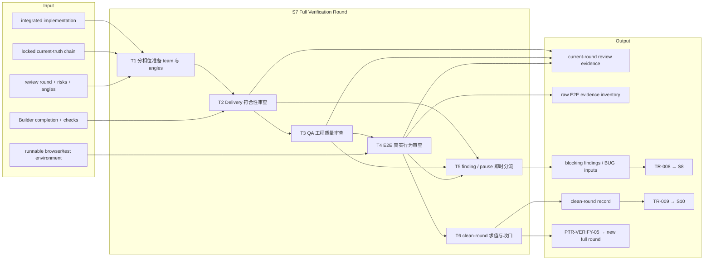
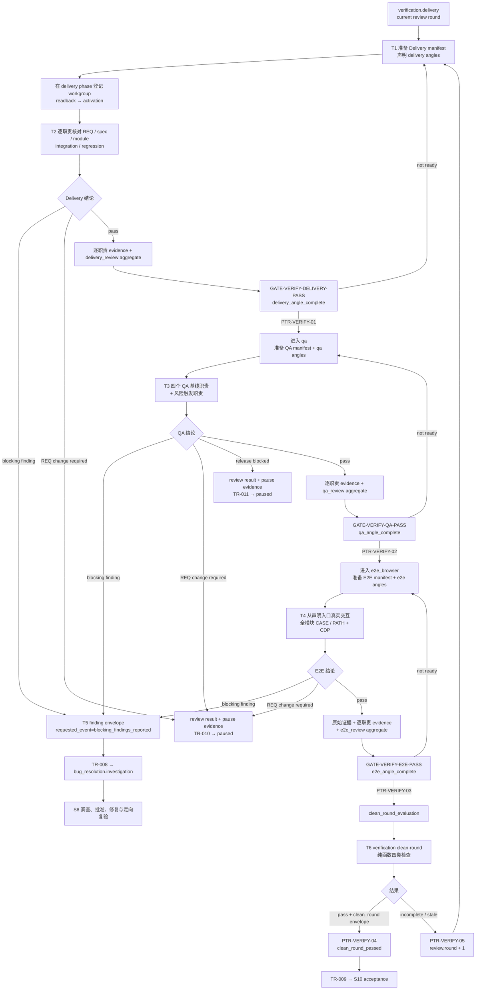

# L3-S7 — 完整验证轮（Verification Round）

> 层：第三层 ｜ 上游：L2 §S7 ｜ 前置：S6 TR-006 已启动当前 review round 并进入 `verification.delivery` ｜ 下游：S8 缺陷闭环或 S10 验收
>
> 阅读顺序：§1～§3 先回答“这一轮究竟要证明什么、三类验证为什么串行、何时立即分流”；§4 再映射 team/angle、Delivery、QA、E2E、finding 与 clean-round 机制；§5～§8 审计职责、当前真实强制力、出口和易错点。S6～S11 尚未完成机制优化，本文会把目标设计与现有代码能力分栏表达，不把 REQ-040 或角色文本中的规划能力写成既成事实。

## 1. 第一层：S7 的立意与目标

### 1.1 为什么需要 S7

S6 交付的是 Builder 声明、实现和测试结果，不是独立结论。S7 要从三个互不替代的角度重新观察同一份当前实现：

1. **Delivery Verifier：做的是不是锁定规格要求的东西**——需求、规格、模块、集成和回归有没有缺口；
2. **QA：东西是否以可维护、可测试、可靠且符合风险要求的方式实现**——代码与测试质量是否足以进入真实行为验证；
3. **E2E Browser：用户是否能沿声明入口和步骤在真实浏览器中得到预期结果**——包括网络、console、持久化、副作用和恢复路径。

S7 的核心不是把三份报告拼在一起，而是建立**同一 review round 下、职责无沉默、证据仍有效、阻断缺陷已闭合的一轮独立事实**。任何阶段发现阻断问题都应立即离开验证轮进入 S8；验证者不得一边审一边修，也不得用局部重验替代新的完整轮。

### 1.2 阶段目标与完成定义

| 项目 | 定义 |
|:--|:--|
| 输入 | S6 已集成实现与 per-TASK completion；当前 generation 的锁定 REQ/design/contracts/TASK；当前 review round；风险标签、历史 angles 与 S7 manifests；可运行环境和测试入口 |
| 要搞清楚 | 实现是否完整兑现当前真相；工程质量是否达到交付地板；真实用户路径与负向 oracle 是否成立；是否存在阻断 finding、REQ 变化或 release blocker；本轮证据是否足以称为 clean round |
| 核心工作 | 分相位准备 team/angle → Delivery 审查 → QA 审查 → 真实浏览器 E2E → finding/暂停分流 → clean-round 求值与整轮收口 |
| 输出 | 三类 workgroup/angle 记录；逐职责 review evidence；三类相位聚合 evidence；E2E 原始证据；finding/BUG 或 clean-round record |
| 目标完成 | Delivery、QA、E2E 在同一轮覆盖所有适用职责；所有必要结论可复算；无失效 PASS；无未闭阻断 BUG；PTR-VERIFY-04 与 TR-009 均成立 |
| 下一阶段 | 有阻断 finding 时 TR-008 → S8；需要改 REQ 或人工处理 release blocker 时 TR-010/011 → paused；clean round 成立时 TR-009 → S10 |

### 1.3 Overview：输入、主步骤与输出

图中的“分相位准备”不是修辞：当前 `runtime register-workgroup` 只允许在 `verification.delivery`、`.qa`、`.e2e_browser` 各自登记对应 kind，不能在 S7 入口一次性把三个 runtime workgroup 全部登记完。

### 1.4 S7 的边界与当前保证

- **负责**：独立符合性审查、工程质量审查、真实浏览器行为审查、阻断问题分流、完整轮判定；
- **不负责**：修改产品实现、替 Builder 补测试、静默改 locked 规格、在 review 中直接关闭 BUG、执行验收或发布；
- **当前顺序是真实机器状态**：verification phase machine 串行执行 delivery → qa → e2e_browser → clean_round_evaluation → clean_round_passed，每次 PreToolUse 最多推进一步；
- **相位 gate 的当前强度较低**：每个相位只要求一条当前轮聚合 envelope（Delivery/QA/E2E 各一条 `pass`），不会逐项核验 manifest 中每个 responsibility 的结论；
- **angle guard 已有语义实现但操作链未闭合**：它会检查维度、数量、具体 target、历史 angle disposition 和声明早于派发；然而标准 evidence 登记不写 index-level `dimension`，manifest 又没有 `dimension/min_angles` 字段，当前自然操作路径难以满足 guard；
- **clean-round 有纯函数实现但不等同于理想定义**：它能检查轮次、team/责任、失效 evidence 和 P0 BUG，但当前责任覆盖、跨轮处理、PASS 语义和文件新鲜度仍存在明显缺口，详见 §4.6 与 §5.3。

## 2. 第二层：S7 的任务分解

| 任务 | 要解决的问题 | 主要动作 | 阶段产出 |
|:--|:--|:--|:--|
| T1 分相位准备 team 与 angles | 本相位由谁审、审哪些角度、历史角度如何处置 | 校验本相位 manifest；声明当前维度 angles；处置 inherited angles；在对应 phase 登记/launch/activation | team manifest、angle declaration、readback/activation |
| T2 Delivery 符合性审查 | 实现有没有偏离需求、规格、模块、集成或回归真相 | 按责任读取完整链和 Builder evidence；运行/检查对应证明；逐职责结论；形成 delivery 聚合结论 | Delivery responsibility evidence、`delivery_review` envelope |
| T3 QA 工程质量审查 | 代码、复用、测试及风险维度是否达到交付地板 | 四个基线职责全查；按风险触发 architecture/security/performance/reliability/migration；独立复现 | QA responsibility evidence、`qa_review` envelope |
| T4 E2E 真实行为审查 | 声明的 CASE/PATH 是否能从真实入口完整走通 | 启动真实环境；按序交互；观察 UI/API/CDP/持久化；跑全模块回归与负向 oracle | Playwright specs、JSONL/PNG/video、`e2e_review` envelope |
| T5 finding 与暂停分流 | 发现属于实现缺陷、REQ 变化还是人工 release blocker | 形成可复现 finding；登记 requested event；构造 BUG 输入或 pause evidence；立即离开当前轮 | TR-008/010/011 所需 evidence 与 handoff |
| T6 clean-round 求值与收口 | 三相位通过后能否称为同轮、完整、当前且 blocker-free | 运行 clean-round evaluator；登记聚合 record；通过则进入 S10，不完整则新开完整轮 | `clean_round` record、PTR-VERIFY-04/05、TR-009 |

T2～T4 是严格串行的阶段，不是三个并行 reviewer 池。每个阶段内部可以按 manifest 的 independent responsibilities 并行，但下一阶段只能消费前一阶段已经收口的当前轮事实。

## 3. 从 Builder 交接到 clean round 的完整工作流

流程中有两种“证据层”：逐职责 evidence 用于说明每个 assignment 实际审了什么，聚合 envelope 用于驱动 phase quality gate。当前仓库没有把两层自动聚合或相互校验，因此图中的箭头表达目标工作流，不代表已有单命令原子完成。

## 4. 第三层：每项任务如何被引导和承载

### 4.1 T1 — review team、angles 与分相位激活

team validator 为三个 workgroup 定义了最低责任地板：

| Workgroup | 无条件责任 | 风险触发责任示例 |
|:--|:--|:--|
| `delivery_verifier` | `VER-REQ-GAP`、`VER-SPEC-GAP`、`VER-MODULE-COMPLETE` | cross-component → `VER-INTEGRATION`；regression → `VER-REGRESSION` |
| `qa` | `QA-MODULE-CODE`、`QA-REUSE-ABSTRACTION`、`QA-UNIT-TEST`、`QA-INTEGRATION-TEST` | architecture/security/performance/reliability/migration 对应专项责任 |
| `e2e_browser` | `E2E-USER-FLOW`、`E2E-CONSOLE-NETWORK` | frontend/ui/regression 会强化 user-flow 责任 |

manifest validator 能检查 mandatory/risk dispositions、部分责任所需 Skills、assignment 引用、分离边和内部依赖；它不检查不同 assignment 的 write overlap，也不证明每个责任已经产生当前轮 PASS。workgroup 只能在对应 phase 登记，所以实际节奏是：进入 delivery 后登记 Delivery，PTR-VERIFY-01 后登记 QA，PTR-VERIFY-02 后登记 E2E。

每个 phase transition 还挂有本维度 `angle_complete` guard。设计意图是先于派发提交至少三个具体审查角度，逐条处置 inherited angles，并阻止 delivery/qa/e2e 角度跨维度复用；`ui_impact=none` 时 E2E 有数量放宽，但不等于跳过 E2E workgroup 或 E2E pass。

当前操作链存在三个硬裂缝：

1. `findEvidence` 要求 runtime evidence index 自身带 `dimension`，但 `runtime evidence add` 的请求/索引没有该字段；guard 在打开 angle declaration 文件之前就会找不到记录；
2. team-manifest schema 有 `dispatched_at` 和 `inherited_angles`，但没有 guard 读取的 `dimension`、`min_angles`；仓库也没有描述中所称的 `team dispatch` CLI 去自动写 `dispatched_at`；
3. `angle-declaration.schema.json` 存在，但没有对应 Skill、模板或专用登记命令。

因此 angle 语义本身比普通 evidence stub 强，但通过正式 CLI 自然构造一条可过 PTR-VERIFY-01/02/03 的链路目前并未闭合。测试 fixture 可直接写入 index-level `dimension`，不能被误读为用户操作路径已经可用。

### 4.2 T2 — Delivery：先判断“做对东西”，再谈质量

Delivery Verifier 应以当前模块完整真相为检查面，而不是只复查触发本次变化的 REQ 行：

- `VER-REQ-GAP`：需求与可观察结果是否全被兑现；
- `VER-SPEC-GAP`：实现是否符合 design、FE/BE/SYNC contract 与 TASK Closing Contract；
- `VER-MODULE-COMPLETE`：当前模块 CASE/PATH、边界和负向行为是否没有因局部变更被破坏；
- `VER-INTEGRATION` / `VER-REGRESSION`：风险触发时检查跨组件接缝与完整回归。

角色卡要求两阶段激活、每个 assignment 一项独立结论、只写 review evidence/BUG drafts，不改被审产品代码。Builder completion 只是定位入口；Delivery 必须读取实际 diff、实现和可执行检查，不能把 Builder 的 PASS 转抄为自己的 PASS。

当前 phase gate 只读取一条当前轮 `delivery_review` envelope，要求 `producer_responsibility="Delivery Verifier"`、`conclusion="pass"`。它不打开 manifest 检查上述每个责任是否都有 PASS，也不校验 producer 与具体 assignment 的对应关系。若逐职责记录与聚合 envelope 之间没有人工聚合纪律，单条总 PASS 可以绕过职责完整性。

### 4.3 T3 — QA：四项基线加风险专项

QA 的基础检查面不是“测试绿了没有”，而是四个不能互相替代的问题：模块代码质量、复用/抽象边界、单元测试质量、集成测试质量。风险标签再决定是否增加架构、安全、性能、可靠性或迁移专项。

每项结论应包含：适用性、方法、实际命令或检查、观察结果、可复现证据、finding/BUG draft。工具输出用于支撑判断，不替代判断；缺失负向覆盖不能因为正向测试通过而沉默。

当前 `docs/reports/qa/QA-template.md` 是 Markdown 叙述模板，使用 `PASS/FIX_REQUIRED/RELEASE_BLOCKED`；quality gate 消费的是通用 JSON envelope 与小写 `pass/req_change_required/release_blocked`。两者没有标准 adapter。phase gate 同样只要求一条 `qa_review` 聚合 PASS，不核验四项基线和风险触发职责是否逐项完成。

### 4.4 T4 — E2E：真实入口、逐步交互与七维负向 oracle

E2E 要证明的不是“接口可调用”，而是用户从声明入口开始，按 `flows.md`/CASE/PATH 的控件顺序完成行为，浏览器可见结果、HTTP 状态、console/network、持久化与禁止副作用均符合预期。

角色与 `e2e-browser-testing` 方法要求：

- 对当前模块执行完整 CASE/PATH regression，而不是只跑变更点；
- 从声明入口进入，除非 flow 明确声明 deep link，否则不以 URL 直跳替代交互；
- 每步保存可见断言与 JSONL/PNG/video 等原始证据，并记录 CDP console/network findings；
- 每个负向 CASE 分别说明 `visible`、`terminal_state`、`persisted_effects`、`forbidden_side_effects`、`rejection`、`expected_state`、`recovery`；
- flow/CASE 缺失或原型与真实 UI 不一致时停止并上报规格 finding，不在 Playwright spec 中发明产品行为；
- 只允许写 `web/e2e/<module>/`、E2E evidence 和 BUG drafts，不能改产品实现。

仓库另有 `loop-harness e2e-coverage --inventory ... [--gate]`：它对一份独立 inventory 计算 CT/AC ID presence、fidelity score、L3+ hook surface 和 `SPINE-S2-S11` organic spine。这个工具用于 REQ-039 自身的 harness 覆盖盘点，不读取本轮 Playwright trace/HAR，也不能证明某个产品模块完成真实浏览器交互。

当前 E2E phase gate 仍只认一条 `e2e_review` 聚合 PASS；没有机器规则核验 trace 中是否真点击了声明控件、是否绕过 UI 直调 API/数据库、PATH 是否逐步取证或负向七维是否齐全。真实交互目前主要由角色协议、方法和证据抽查承载。

### 4.5 T5 — finding、BUG 输入与暂停分流

验证结果至少要区分三类出口：

| 结果 | 应形成的事实 | 路由 |
|:--|:--|:--|
| 实现/质量/行为阻断 finding | 当前轮、原 reviewer、可复现步骤、期望/实际、证据路径、`conclusion=blocking`、`requested_event=blocking_findings_reported` | TR-008 → S8 investigation |
| 必须修改 REQ | review result 的 `req_change_required` + 暂停所需记录 | TR-010 → paused，等待 amendment/human decision |
| security/compliance 等 release blocker | QA/Orchestrator 的 `release_blocked` + 暂停所需记录 | TR-011 → paused，等待人工处置 |

TR-008 的 `record_finding_batch` 动作能够从 `Params.findings` 创建 canonical draft BUG，并按 `reporter_agent_id + 排序后的 finding_body 行 + finding_path` 指纹去重。但 Controller 的自动 PreToolUse 迁移只绑定 quality-gate evidence，不把 finding 文件内容投影到 transition Params；所以自动 TR-008 可以进入 S8，却让该动作以 `no findings in batch` 跳过，未必创建任何 BUG entity。当前自动化链只能改用显式、带 `--params` 的 transition；代码虽另有内部 `assignment.RegisterBug`，但 CLI 没有公开 `runtime register-bug` 入口。不同 reporter 报同一症状也不会被该指纹合并。

TR-010/011 的 `pause_record` 又有双层语义：quality-gate registry 先要求一条持久化的 Orchestrator/recorded pause 类 envelope，Controller 真正提交 transition 时却使用 catalog 生成绑定 `generated:pause_checkpoint`，随后 `capture_pause_checkpoint` 才写 runtime pause。两层没有统一模板，执行者必须知道“预判 evidence”和“迁移时生成 checkpoint”不是同一个对象。

### 4.6 T6 — clean-round 的目标语义与当前实现

理想 clean round 应回答四个问题：是不是同一轮、所有适用职责是不是都明确 PASS、被消费的 PASS 是否仍有效、所有阻断 BUG 是否闭合并完成定向复验。当前 `verification.EvaluateCleanRound` 是只读纯函数，并被 transition guards 与 `verification clean-round` CLI 复用，但它的具体判断比名称弱或更宽：

| 检查名 | 当前实际判断 | 与目标语义的差异 |
|:--|:--|:--|
| `review_round_started` | `review.round >= 1` | 只确认轮存在 |
| `same_review_round` | 所有 delivery/qa/e2e/clean_round/angle/team_manifest/targeted evidence，只要 `review_round` 非零就必须等于当前轮 | 不过滤 valid/invalid；`start_new_review_round` 只加轮次、不清旧 evidence，因此旧轮记录会污染新轮，单纯 invalidation 也不能消除 |
| `all_required_dimensions_passed` | 至少出现 delivery/qa/e2e 三种 team；收集**所有已登记 team** 的 responsibility IDs；每个 ID 有任意一条当前轮 `status=valid` evidence 即覆盖 | 不按 team kind/status/round 过滤，可能把 S5/S6 职责也并入；不检查 evidence kind、`conclusion=pass`、N/A 或 assignment 对应关系 |
| `no_invalidated_pass_evidence` | 当前轮不存在任何 `status=invalid` evidence | 比名称更宽：不只检查被消费的 PASS，任意当前轮 invalid 都会否决 |
| `no_open_blocking_bugs` | 只把 P0 且位于 investigating/pending_approval/accepted/assigned/fixing/retesting 的 BUG 当 open blocker；closed P0 需当前轮 targeted evidence | P1/P2 即使语义上阻断也不计；targeted evidence 只按 kind/status/round 与 BUG scope/path 命中，不读取 PASS 结论或原 finder 身份 |

该函数只读取 runtime index，不重新核对 evidence 文件指纹、frozen artifacts 或原始证据内容。`verification clean-round` 也只返回结果，不创建 `clean_round` record；执行者仍需另写并登记一条通用 quality-gate envelope。

此外，正式 `review-evidence.schema.json` 定义的是含 frozen artifacts、manifest refs、responsibility results 的丰富 review record，而 quality gate 读取的是另一种通用 envelope（producer、round、conclusion、subject refs 等）。二者不能直接互换，当前需要“丰富记录 + 通用 wrapper”两份产物，却没有 adapter。PTR-VERIFY-04 先靠通用 `clean_round/pass` envelope 过 quality gate，再由 transition guard 跑纯函数；TR-009 还会重复 clean-round guards 与 `record_clean_round` 动作。

## 5. 职责分布与覆盖审计

### 5.1 职能落点

| 职能 | 主责 | 承载位置 | 当前消费者 |
|:--|:--|:--|:--|
| review round 与 phase 顺序 | Runtime/Controller | loop state + verification phase machine | PreToolUse selector |
| 责任全集与风险适用性 | Orchestrator/team planner | team manifest dispositions | team validator、reviewer |
| 本轮审查角度 | 各维度 reviewer + Orchestrator | angle declaration + inherited angles | angle_complete guard |
| 需求/规格/模块符合性 | Delivery Verifier | per-responsibility report/evidence | 人工聚合、Delivery gate |
| 工程质量与专项风险 | QA | QA report/evidence | 人工聚合、QA gate |
| 真实浏览器行为 | E2E Tester | Playwright specs、JSONL/PNG/video、E2E report | 人工聚合、E2E gate |
| 相位推进 | quality gate + Controller | 三类聚合 envelope | PTR-VERIFY-01/02/03 |
| finding 分类与缺陷输入 | 原始 reviewer + Orchestrator | finding/bug envelope、BUG draft、Params | TR-008、S8 |
| clean-round 计算 | verification evaluator | runtime index + BUG/team state | CLI、PTR-VERIFY-04、TR-009 |
| REQ/release 人闸 | reviewer + Orchestrator + human | review result、pause evidence/checkpoint | TR-010/011、S11 |

### 5.2 应有的分工与重叠控制

- Delivery 判断“是否符合当前真相”，QA 判断“实现质量是否可交付”，E2E 判断“真实用户行为是否成立”；同一症状可能被不同维度观察，但不能用一份结论替三类职责；
- Builder completion 是被验证输入，不是独立 evidence；reviewer 不应是原实现 owner，也不应在发现后直接改产品代码；
- phase 内 per-responsibility evidence 证明局部判断，aggregate envelope 只负责阶段路由；聚合层不应创造局部层不存在的 PASS；
- E2E spec 是测试实现，产品 flow/CASE 是权威输入；测试不能通过发明新行为来修复原型缺口；
- targeted re-verification 证明某个 BUG 修复有效，新的 full round 证明整批当前实现仍然一致；前者绝不替代后者；
- clean-round evaluator 只做确定性汇总，不负责生成 reviewer 判断，也不应按分数折中阻断项。

### 5.3 如实现状与未闭合缺口

1. **angle evidence 登记路径不可自然闭合**：index 要 `dimension`，公开 evidence add 不写；manifest 无 `dimension/min_angles`，也没有 dispatch CLI 自动盖时戳；
2. **workgroup 不能一次准备完**：三类 runtime team 必须到各自 phase 才能登记，旧叙事中的“入口先组建三组”不成立；
3. **职责 evidence 与 phase envelope 分裂**：每个 assignment 的结果不会自动汇总为 Delivery/QA/E2E gate envelope，也不会被 gate 逐项反查；
4. **缺少 phase evidence 正式模板**：QA/E2E 是 Markdown，Delivery 没有本阶段专用 JSON 模板；结果词汇与通用 envelope 不一致；
5. **evidence add 不做内容 schema 校验**：只登记路径、指纹和索引元数据；真正 gate 只解最小 envelope 字段；
6. **clean-round 责任判断可假阳性**：任何当前轮 valid evidence 只要 responsibility ID 相同就算覆盖，不要求 PASS、正确 kind 或正确 producer；
7. **clean-round 可被无关 team/旧轮污染**：责任集合来自所有历史 team；same-round 又扫描旧轮相关 evidence，开启新轮并不会自动清理；
8. **invalid 检查过宽、BUG 检查过窄**：任意当前轮 invalid 都否决；只有 P0 被视为阻断；closed P0 的 targeted evidence 不核验结论；
9. **TR-008 自动路径不携带 findings Params**：能切到 S8，但 `record_finding_batch` 可能不创建 BUG entities；
10. **真实浏览器约束仍是判断层承诺**：phase gate 不核 trace/HAR、交互顺序、禁直调、CASE/PATH 计数或负向七维；
11. **E2E coverage CLI 不是本轮质量门**：它评分的是 REQ-039 inventory，不消费产品 E2E evidence；
12. **丰富 review schema 与通用 gate envelope 不兼容**：没有 wrapper/adapter 或单一事实源；
13. **clean-round 不重验文件新鲜度**：不读 frozen artifact 指纹、原始 evidence 或 subject 精确全集；
14. **暂停存在预判/生成双载体**：semantic gate 要持久化 pause evidence，transition 又绑定生成式 checkpoint，没有统一作者流程；
15. **review 写范围仍非 hard deny**：角色虽声明只写 evidence/BUG drafts，但 S6 已确认 general activation/write-scope 不受 minimal policy 硬阻断；
16. **Skill 默认预载仍偏宽**：三个角色 frontmatter 预载大量跨领域 Skills，尚未做到按责任最小注入。

### 5.4 关键取舍

| 问题 | 设计选择 | 原因与当前代价 |
|:--|:--|:--|
| 三类验证顺序 | Delivery → QA → E2E 串行 | 避免后相位在前相位已证明错误的基线上继续取证；代价是前一聚合 gate/angle 链断裂会阻塞后续 |
| finding 处理 | 发现即分流，不等三相位跑完 | 减少无效验证；但自动 TR-008 尚不能把 finding 内容带入 BUG batch |
| 完整性粒度 | 目标按 responsibility/CASE；当前 machine 主要按聚合 envelope 与 ID presence | gate 简单，但职责沉默和 aggregate 假绿仍可能发生 |
| E2E 可信度 | 真实浏览器 + 原始证据 + 独立 reviewer | 当前缺少 trace/HAR 机械验证，仍依赖协议和抽查 |
| clean round | 无加权、全条件合取 | 原则正确；当前实现的集合过滤与语义检查不精确，会同时产生假阳性和假阴性 |
| 修复后验证 | targeted reverify 后再开 full round | 防局部修复破坏其他维度；当前跨轮旧 evidence 污染会妨碍自然重开 |

## 6. L1 准则如何嵌入 S7

| L1 准则 | S7 中的实际落点 |
|:--|:--|
| D1 权威外置 | manifest、angle、逐职责报告、聚合 envelope、原始 E2E evidence、BUG 与 runtime round 均落盘；双 schema 仍削弱单一事实源 |
| D2 自然路径观测 | PreToolUse 逐步推进 phase；真实浏览器从声明入口走 PATH；clean-round 从 runtime state 复算 |
| D3 门是顾问 | gate 的 missing evidence 与 angle/clean-round 原因可指出缺项；当前 aggregate gate 对具体沉默职责提示不足 |
| D4 引导性产物 | responsibility disposition、angle target、负向七维、finding 字段迫使 reviewer 明确陈述判断 |
| D5 三级强制 | 角色/Skills 引导方法；schema/runtime 约束结构；phase/clean guards 负责机器门——真实交互与 scope 的 hard enforcement 仍弱 |
| D6 三方收敛 | Builder 产出、独立 reviewer 判断、machine 汇总；REQ/release blocker 交人 |
| D7 收敛可观测 | phase、round、team、evidence、BUG state 与 clean checks 显示剩余工作；跨轮污染会使观测失真 |
| 公理一 原型 | 对应现实的交付审查、QA、浏览器验收前测试、缺陷回流和整轮回归 |
| 公理二 分工 | Builder 不自证；Delivery/QA/E2E 互不替代；clean evaluator 不做专业判断；reviewer 不修代码 |
| 公理三 消费 | 每份 evidence 必须服务 responsibility、phase gate、BUG flow 或 clean round；当前双载体和未消费原始字段是显式缺口 |
| 公理四 成本 | phase 内可按独立职责并行，跨 phase 串行；风险专项按 tag 触发，不应无差别全跑 |
| 公理五 传达 | PASS、blocking finding、REQ change、release blocker、incomplete round 各有不同路由，不用模糊“有问题”代替 |

## 7. 产出、出口门槛与失败路由

### 7.1 正式产出

- 当前轮 Delivery/QA/E2E 三类 team manifest、readback/activation 记录与可用 angle declarations；
- 每个 assigned responsibility 的独立 review result、命令、观察和原始 evidence 引用；
- 三条 phase gate 可消费的 `delivery_review`、`qa_review`、`e2e_review` 聚合 envelopes；
- E2E Playwright specs、JSONL/PNG/video、CDP console/network 与 API 状态分布；
- 阻断时的 finding envelope、BUG draft、canonical BUG 输入或 pause evidence；
- clean-round evaluator 输出，以及 gate 可消费的 `clean_round` envelope；
- 通过时的 `review.clean_round=current round` 与 S10 handoff；不完整时的新 full-round 入口。

### 7.2 目标出口判定与当前机器地板

| 维度 | 目标判定 | 当前机器实际检查 |
|:--|:--|:--|
| Delivery | 所有 mandatory/risk responsibilities 独立 PASS | 一条当前轮 Delivery Verifier/`pass` envelope + angle guard |
| QA | 四基线与适用专项逐项 PASS/N/A 有依据 | 一条当前轮 QA/`pass` envelope + angle guard |
| E2E | 全模块 CASE/PATH 从真实入口执行；原始 evidence 与负向 oracle 齐全 | 一条当前轮 E2E Browser/`pass` envelope + angle guard；不核 trace/CASE |
| Angle | 本维度至少 N 个具体角度；历史角度全处置；声明早于派发 | guard 有语义检查，但标准登记/manifest/dispatch 接口未闭合 |
| 同轮完整性 | 三 team、全责任 PASS、仅消费当前且未失效 evidence | 三 team kind + 所有 team responsibility ID 有任意 valid current evidence；旧轮 evidence 会否决 |
| BUG | 所有语义阻断缺陷闭合且原 finder 定向复验 PASS | 只检查 P0 状态与 targeted evidence presence/path，不核 conclusion/producer |
| 文件新鲜度 | subject/frozen artifacts 与 evidence 指纹仍匹配 | clean evaluator 不重验；phase gate 会读聚合 envelope 指纹及最小字段 |
| 协议出口 | 一条可复算 clean round 后进入验收 | PTR-VERIFY-04 与 TR-009 各自再跑部分 guards，并依赖 `clean_round/pass` envelope |

### 7.3 失败路由

| 情况 | 去向 |
|:--|:--|
| 本相位 manifest/angle/aggregate evidence 缺失 | 留在当前 phase，补真实记录；不要伪造 PASS 绕 gate |
| Delivery、QA 或 E2E 发现实现阻断 | finding → TR-008 → S8；确保 BUG Params/登记另行闭合 |
| reviewer 判断必须改 REQ | TR-010 → paused → human amendment；不得在 review 中改 locked REQ |
| security/compliance/环境等 release blocker 需人工决定 | TR-011 → paused，保留 checkpoint 与未完成证据 |
| E2E 环境不可达、auth 缺失或 selector/flow 不足 | 留在 E2E 形成 blocker/规格 finding；不以 deep URL/API 直调绕过 |
| clean evaluator incomplete/stale | PTR-VERIFY-05 → delivery，新开完整轮；当前实现需先处理旧轮 evidence 污染问题 |
| S8 targeted reverification 全部通过 | TR-012 从 `ready_for_full_review` 新开 review round，仍从 Delivery 完整重跑 |
| clean round 通过 | PTR-VERIFY-04 → `clean_round_passed`，再由 TR-009 → S10 |

## 8. 易错点与渐进披露

### 8.1 易错点

1. 在 S7 入口一次登记 Delivery/QA/E2E 三个 workgroup；runtime 实际要求按 phase 登记；
2. 把一条 phase aggregate PASS 当成所有 manifest responsibilities 已被机器核验；当前 gate 没有该能力；
3. 把 Builder tests 或 completion report 当作 reviewer 的独立 evidence；它们只能是输入；
4. 把 `e2e-coverage` inventory 分数当成本轮产品 E2E 结果；两者的数据源和目的不同；
5. 用 URL 直跳、直接 API/数据库调用替代声明的用户交互，再把结果标成 E2E PASS；
6. 只登记 blocking finding envelope，就假设 TR-008 已自动创建 BUG；自动 Controller 没有传 `Params.findings`；
7. 用 targeted re-verification 替代 Delivery+QA+E2E 新完整轮；TR-012 明确要求重新从 delivery 开始；
8. `ui_impact=none` 就跳过 E2E；当前只放宽 angle 数量，clean round 仍要求 E2E team 与 pass；
9. 新开 round 后只把旧 evidence 标 invalid；same-round 检查仍会看到它，当前实现可能继续失败；
10. 将丰富 `review-evidence` JSON 直接登记后期待 phase gate 解析；通用 envelope 形状不同；
11. 因 clean evaluator 只识别 P0，就把其他实际 release blocker 降级沉默；机器边界不是业务严重度定义；
12. reviewer 发现缺陷后顺手改产品代码；这破坏独立性，也绕开 S8 的调查、批准和定向复验链。

### 8.2 阅读预算

- **只想理解 S7 主线**：读 §1.1～§1.3、§2、§3、§7.3；
- **正在组织某个验证相位**：再读对应 §4.1～§4.4 与角色卡/manifest；
- **正在处理 finding 或 clean round**：重点读 §4.5～§4.6；
- **维护 harness 或补机制**：必须读 §5.3、§7.2，并对照 `qualitygate`、`angle_complete_guard`、`verification/clean_round`、Controller transition evidence 代码；
- **进入 S8/S10 的下游角色**：只需消费当前 round、有效 evidence、BUG/clean-round handoff 和明确的剩余风险，不要重读全部方法叙事。
