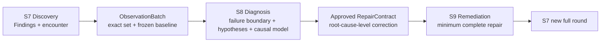
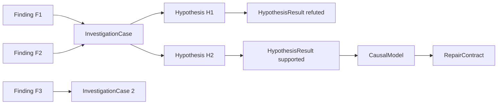
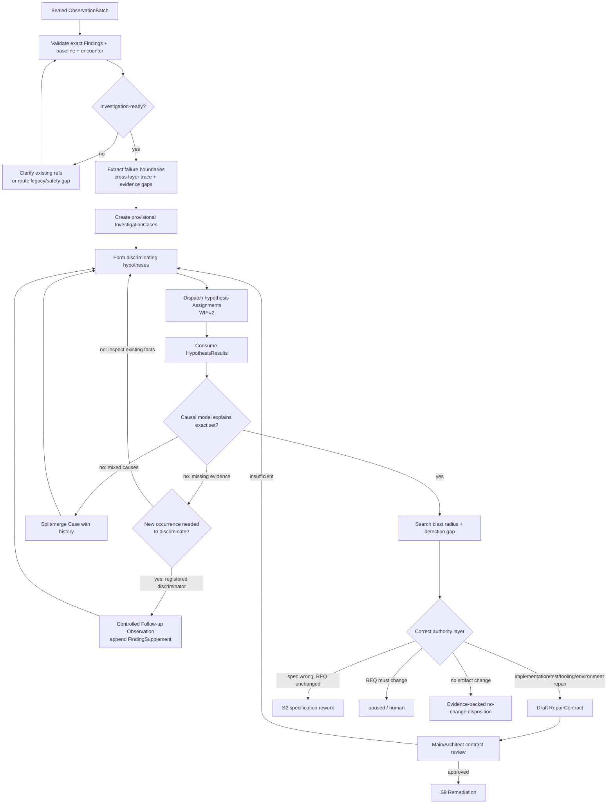

# L3-S8 — 表象调查与根因推导（Finding Investigation & Diagnosis）

> 层：第三层 ｜ Macro-stage：S7 Discovery → **S8 Diagnosis** → S9 Remediation ｜ 上游：S7 sealed ObservationBatch 或其他受控 finding source ｜ 下游：S9 Repair、S2 specification rework、paused 或 S7 新完整轮
>
> 横切机制：[L4 Agent 调度与治理](./L4-agent-dispatch-governance.md)。L4 负责 Assignment、PLAN_REPORT、连续执行、Hook、idle/stop 和恢复；本文只定义 S8 特有的 Observation ingest、InvestigationCase、Hypothesis、CausalModel、RepairContract 与路由。
>
> 设计状态：本文以目标机制为主；§13 单列当前实现差距。目标中的 ObservationBatch/encounter ingest、InvestigationCase、HypothesisResult、RepairContract 和 case-level 事务在 L5 实现前，不得被描述为既有代码能力。

## 0. 一句话结论与阶段关系

S7 证明“某些可观察事实与权威预期冲突”，并保存当时实际发生的操作现场；S8 从已冻结的 `last-good → wall-action → first-bad` 边界出发，证明“什么机制导致这些冲突、同一机制还影响哪里、恢复哪个架构不变量才能完整解决”；S9 才负责实施。

> **S8 的交付物不是 BUG 列表，也不是几个修改建议，更不是重新跑一遍 S7；它无损消费 Findings 的 encounter 与 raw evidence，通过可证伪假设建立因果模型，将同根表象归入 InvestigationCase，并输出 Main/Architect 批准的 RepairContract。中间调查记录必须收敛在 Case 内，不再扩张为一组互相同步的顶层控制面。**



阅读顺序：

1. §1～§3：理解职责边界和权威对象；
2. §4～§8：理解 intake、聚类、假设调查、因果证明和 RepairContract；
3. §9～§11：理解路由、S9 handoff 和工具必经路径；
4. §13～§15：维护者按迁移顺序实现并验收。

## 1. S8 的立意、目标与不变量

### 1.1 为什么 Finding 不能直接派修

Finding 只说明“观察与预期冲突”。例如：

- 表单填报后内容不能正常显示；
- 同一表单无法正常保存；
- 页面刷新后字段丢失；
- 后端日志出现反序列化告警。

这些表象可能是四个缺陷，也可能都来自一条 FE/BE 数据契约漂移。若每个表象独立派一个 Builder，最容易得到四个局部补丁：UI 默认值、保存重试、刷新缓存、后端字段别名。系统看似变绿，真正的双重 schema 仍存在，下一次变化会产生更多分叉。

S8 用独立调查层切断这种 Fixes that Fail 回路：

1. 保留每个原始表象，不在 intake 时语义去重；
2. 建立可证伪的候选假设，而不是从最近 diff 猜原因；
3. 用证据证明 trigger → violated invariant → faulty mechanism → propagation → symptoms；
4. 搜索同一机制的 blast radius 和未出现但可能出现的同类风险；
5. 将修复目标写成需要恢复的系统不变量，而不是需要消失的一个页面报错；
6. 冻结 RepairContract 后才允许 S9 修改系统。

### 1.2 阶段目标与完成定义

| 项目 | 目标定义 |
|:--|:--|
| 输入 | S7 ObservationBatch/FindingSupplement；运行型与 QA/DV `code_inspection` Findings 的 encounter/failure boundary；frozen baseline；权威 REQ/design/contracts/TASK/CASE/PATH；实现、测试和 raw evidence；历史 BUG/impact；original finder routes |
| 要搞清楚 | 从已确认现场看，偏差最早出现在哪个边界；哪些表象可由同一因果链解释；primary root cause 与 contributing factors；blast radius；属于实现、测试、规格、REQ、环境/依赖哪一层；如何完整恢复系统不变量 |
| 核心工作 | intake → investigation-readiness 校验 → 提取 failure boundary/trace window → 可逆候选聚类 → 假设驱动调查 → 因果模型 → blast radius/detection gap → RepairContract → case-level disposition/route |
| 最小工程权威 | immutable Findings；一组 InvestigationCases；每个 Case 的 HypothesisResults/CausalModel；accepted case 的一份 RepairContract |
| 目标完成 | ObservationBatch 中每个 Finding 都有明确解释/拆分/false-positive/duplicate/spec/REQ disposition；所有去 S9 的 Case 有证据支持的因果模型和批准 RepairContract |
| 下一阶段 | repairable case → S9；spec 错误 → S2；REQ 变化 → paused；无需任何 artifact 变化且证据充分 → S7 新完整轮；报告不足留 S8 |

### 1.3 S8 负责与不负责

S8 负责：

- 无损接收 S7 的每个表象和原始证据；
- 将设计边界、模式/惯用法错配、逻辑闭环和维护风险等 `code_inspection` Finding 作为一等调查输入，而不是等待 E2E 症状后再受理；
- 消费 S7 已保存的 encounter、状态差异和跨层 evidence；
- 仅在现有证据不能区分竞争假设时，请求 original finder 做受控补充观察；
- 聚类、拆分、建立并验证假设；
- 识别 primary root cause、contributing factors、传播路径和 blast radius；
- 识别为何现有测试/审查没有提前拦截；
- 确定正确修复层级和恢复的不变量；
- 形成并批准 RepairContract。

S8 不负责：

- 修改产品代码、测试、规格或环境；
- 将调查中的假设写成已确认根因；
- 因为多个 Finding 位于同一文件就合并；
- 给 Builder 一个“先试着改改”的开放任务；
- 以最少代码行、最快变绿或单一表象消失作为修复目标；
- 执行 targeted re-verification 或生成 clean round；
- 把重新复现已确认症状作为默认调查步骤，或用“没有再复现”推翻 S7 的 immutable observation。

### 1.4 不可退让的不变量

1. **表象不丢失**：S7 Findings immutable；聚类、合并和 duplicate 只增加关系，不删除 source facts。
2. **聚类可逆**：candidate group 可以 split/merge，并保留理由和 revision；canonicalization 发生在因果模型成立之后。
3. **根因必须因果化**：根因能解释触发条件、传播路径和所有归入 Case 的表象；只相关、不因果的事实不能收口。
4. **重要替代假设必须处理**：supported/refuted/inconclusive 均有证据；不能因一个看似合理的解释停止调查。
5. **调查不改系统**：S8 任何产品写入都会污染 before-fix baseline 和因果判断，必须 hard deny。
6. **现场已经由 S7 建立**：S8 不重复执行用户旅程来证明 Finding 存在；调查从 evidence-backed failure boundary 开始。新 observation 必须绑定某个 discriminator，而不是笼统“再试一次”。
7. **修复目标是恢复不变量**：RepairContract 必须覆盖 root cause、所有 source Findings、detection gap 和 blast radius，禁止局部症状补丁。
8. **层级授权正确**：implementation/test/tooling 可进入 S9；spec 错回 S2；REQ 变化交人；S8 不跨层授权。
9. **静态审查结论不是现成根因**：QA/DV 提交的模式缺失、边界混乱或维护性风险是需要解释的 observed contradiction；S8 必须证明被破坏的不变量、形成机制、扩散/变更风险和正确修复层级，不能把“应该用 Strategy/Factory/某惯用法”直接复制成 CausalModel 或 RepairContract。

## 2. S7→S8 的无损 Intake

### 2.1 ObservationBatch 是入口权威

S8 入口消费一份 sealed ObservationBatch，而不是聊天摘要或单条 generic finding envelope。Intake 必须验证：

- batch revision、frozen baseline digest 和当前 handoff 一致；
- `finding_ids[]` exact set 可解析且每个 Finding hash 匹配；
- Finding 的 expected/authority、observed、observation mode、encounter、failure boundary、evidence 和 original finder 完整；
- 按 observation mode，`last_good_checkpoint → wall_action → first_bad_checkpoint` 或 inspection/call/data-flow failure boundary 可解析，每个 material checkpoint 有 step-bound evidence 或显式 safety capture gap；
- encounter runtime context、occurrence time window、actor/data refs 与 frozen baseline 可关联且敏感值已脱敏；
- initial/terminal state、state deltas、side effects、correlation/time window 和 cleanup state 足以定位当次 occurrence；
- 同一 batch 的 Findings 均来自同一 frozen baseline；
- raw evidence refs 可读取且未被改写；
- `claim_coverage_summary` 与 final ReviewPlan revision 一致；ordinary batch 的 required Claim set 已完整 disposition；静态、E2E、Discovery 只是该 summary 的筛选视图，不再各自形成 handoff 权威；
- 每个由工具投影为 `blocked_by_confirmed_finding` 的 Claim 都能解析 `blocking_finding_ids[]`、failed precondition、evidence 和 `after_repair_required=true`；它进入 evidence-gap/blast-radius 视图，不能被当成已验证行为；
- ordinary batch 的 `unobserved_claim_ids[]` 为空；只有 P0/安全/数据破坏 immediate-stop 可以携带 exact safety gaps、cancelled assignments 和未观察 Claims，不能接受因 Reviewer/token 上限提前交卷；
- `investigation_readiness` 为 `ready`，或高危场景为带完整停止理由的 `ready_with_safety_gaps`；
- original finder 可寻址，或 Finding 已足以让 replacement 继续因果调查；不能因 Agent 失联就要求重新证明症状；
- S7 没有预写 authoritative root cause、repair scope 或 canonical BUG。

Intake 失败时不丢弃 batch，也不新建 BUG。工具返回缺失 Finding ID、字段和唯一补充动作。

### 2.2 FindingSupplement 与澄清

S8 可向 original finder 发送两类请求：

| 请求 | 用途 | 输出 |
|:--|:--|:--|
| `CLARIFICATION_REQUEST` | 解释已有 encounter step、capture gap、环境、期望来源或 evidence 含义；不重新执行旅程 | FindingSupplement 文本/refs |
| `FOLLOWUP_OBSERVATION` | 在同一 frozen baseline/可重建 snapshot 上，为某个已登记 Hypothesis discriminator 执行一次受控、只读/非变更型观察 | FindingSupplement + fresh evidence + `hypothesis_id/discriminator_id` |

Supplement 追加到原 Finding，不覆盖 `observed` 或原 encounter。若原 Agent 已失联，Scheduler 从 Finding + Assignment checkpoint 派 replacement；S8 不能把“联系不上 original finder”当作丢失表象的理由。

Follow-up observation 只补判别事实，不允许 original finder 在 S8 里修改产品或宣布根因。没有 `hypothesis_id + discriminator + expected distinguishing outcomes` 的“再复现一次”请求应被工具拒绝。

### 2.3 Encounter 消费与复杂度控制

S8 不创建独立 Failure Episode entity，也不把 encounter 复制进 InvestigationCase。Finding 是现场索引的唯一权威；raw timeline、trace、截图、请求/响应和状态快照继续作为 content-addressed typed evidence。S8 只计算三个工作视图：

1. **Failure boundary view**：各 Finding 的 last-good、wall-action、first-bad、terminal state；
2. **Cross-layer trace view**：UI/command → request/event → service/domain → persistence/cache 的已观察节点与断点；
3. **Evidence gap view**：哪些因果边已有证据，哪些缺口需要 read-only inspection 或 discriminator。

这种设计的收益是让 Investigator 直接从最小异常边界开始读代码/契约/trace，而不是从入口重新点击；成本只增加 Finding 的嵌套字段和 capture adapter，不增加新的 ID、生命周期、Markdown 报告、Agent 角色或审批门。

`journey_summary` 只帮助快速理解，不能替代 timeline/evidence；timeline 只陈述当次事实，不能自动推导根因。S8 可以将多条 encounter 的共同边界作为 grouping/hypothesis 线索，但不能把“撞在同一步”当作同根证明。

QA/DV `code_inspection` Finding 不要求伪造用户旅程。它的 encounter 应给出 inspection entry、symbol/call/data-flow trail、最后仍成立的质量/架构不变量、首个违反点与代码证据。S8 围绕这个 failure boundary 调查“为何形成、影响哪些变化路径、与其他运行型 Findings 是否同根”；Reviewer 提议的设计模式最多是候选修复线索，不是权威根因，也不能跳过竞争假设和 pattern-fit 论证。

### 2.4 Intact Finding Ledger

Intake 后生成机器投影的 ledger。Ledger 只用于查阅，不成为第四套生命周期：

| Finding | Baseline | Failure Boundary | Readiness | Candidate Case | Original Finder | Supplements | Disposition |
|:--|:--|:--|:--|:--|:--|:--|:--|
| F-001 | g4/digest | form-valid → save → payload-missing-field | ready | CASE-A? | assignment-e2e-1 | FS-001 | investigating |
| F-002 | g4/digest | response-200 → refresh → rendered-empty | ready | CASE-A? | assignment-delivery-1 | none | investigating |

Ledger 是 ObservationBatch、InvestigationCase 和 disposition 的计算视图，不要求 Orchestrator 再手写一份独立状态文件。

## 3. S8 的权威对象模型

### 3.1 最小对象链



只维护三个长期权威：Finding、InvestigationCase、RepairContract。Hypothesis/HypothesisResult、CausalModel、blast radius 和 detection gap 都是 Case 内可审计工作记录或计算字段；ledger、看板和 canonical BUG entity 都从它们投影或在批准时生成。不得为每个 Hypothesis、Failure Episode、frontier 或摘要再建立独立生命周期。

### 3.2 InvestigationCase

| 字段 | 含义 |
|:--|:--|
| `case_id / revision / status` | 调查身份、CAS 和生命周期 |
| `observation_batch_id / baseline_digest` | 来源与 before-fix 世界 |
| `source_finding_ids[]` | 当前 Case 尝试解释的表象 exact set |
| `failure_boundary_refs[]` | 从 source Findings 计算的 last-good/wall/first-bad 视图，不复制 encounter |
| `cross_layer_trace / evidence_gaps` | 已观察传播节点、断点和待判别缺口 |
| `normalized_contradiction` | 多表象共同违反的可观察事实，不写修复方案 |
| `grouping_rationale` | 为什么可能同根；允许 provisional |
| `hypotheses[]` | 互斥或竞争的机制解释 |
| `hypothesis_results[]` | supported/refuted/inconclusive 及证据 |
| `causal_model` | trigger、invariant、mechanism、propagation、symptom mapping |
| `primary_root_cause / contributing_factors[]` | 主根因与必要条件 |
| `blast_radius` | 同机制影响的组件、数据、用户、路径和历史 evidence |
| `detection_gap` | 为什么 S5/S6/测试/监控/S7 之前没有拦住 |
| `classification` | implementation/test/tooling/spec/REQ/environment/dependency/duplicate/false_positive |
| `split_merge_history[]` | 所有可逆聚类变化及理由 |
| `unexplained_finding_ids[]` | 未解释完时禁止收口 |
| `disposition` | investigate_more / repair / spec_rework / req_change / no_change / duplicate |

### 3.3 Hypothesis 与 HypothesisResult

Hypothesis 必须写成可证伪陈述：

```text
如果 FE/BE payload schema 在 field_name/type/nullability 上发生漂移，
那么同一请求 trace 中应出现客户端字段、服务端 DTO 与持久化模型的不一致，
且该不一致能够同时解释 display 与 save Findings。
```

HypothesisResult：

| 字段 | 含义 |
|:--|:--|
| `hypothesis_id / assignment_id / revision` | 责任和版本 |
| `method` | 如何判别，不复制整份 Case |
| `evidence_refs[]` | 命令、trace、schema diff、数据 snapshot、控制实验 |
| `source_boundary_refs[]` | 使用了哪些 Finding encounter steps/checkpoints，防止调查脱离原现场 |
| `observed` | 实际事实 |
| `counterfactual_or_discriminator` | 什么结果能区分该假设和竞争假设 |
| `result` | `supported / refuted / inconclusive` |
| `explains_finding_ids[]` | 能解释哪些表象 |
| `does_not_explain[]` | 残余事实 |
| `new_hypotheses[]` | 新线索；加入 Case revision 后才可派发 |

Agent final text 不是 HypothesisResult；产品代码 diff 更不是调查证据。

### 3.4 CausalModel

根因收口必须形成可读也可校验的因果链：

```text
trigger
→ violated authority / invariant
→ faulty mechanism
→ propagation path
→ observable symptoms (Finding IDs)
→ blast radius
→ detection gap
```

根因不是“某文件第 42 行写错”，而是能解释为何会错、为何扩散、为何未被拦住的机制。代码位置只是 mechanism evidence。

### 3.5 RepairContract

RepairContract 是 accepted InvestigationCase 给 S9 的唯一授权输入，详见 §8。它冻结架构修复意图、范围、禁止补丁和验证合同；S9 可以设计代码实现步骤，但不能重新定义该意图。

## 4. 从表象到根因的完整工作流



正常新路径不应频繁进入 `Investigation-ready=no`：普通 Finding 在 S7 seal 前就必须 ready。`ready_with_safety_gaps` 仍走 yes，并把缺口带入 evidence-gap view，不能要求重做危险操作；no 分支主要兼容旧 batch、不合法字段或不可恢复的 evidence ref。能通过解释已有证据解决时只发 CLARIFICATION；只有进入假设调查后发现明确 discriminator 缺口，才允许 FOLLOWUP_OBSERVATION。

## 5. 可逆聚类：一因多果，不丢原始表象

### 5.1 Candidate grouping 只是假设

Intake 可以根据以下线索建立 provisional Case：

- 相同 baseline、时间窗、账号、entity、request/trace ID；
- encounter 显示相同 last-good/wall/first-bad 边界或相邻 cross-layer 断点；
- 相同 violated contract/invariant；
- 相同 write/read/serialization/state propagation path；
- 相同触发输入或前置状态；
- 一个控制实验能同时改变多个表象；
- 历史 BUG 显示同一机制曾产生类似症状。

以下不是充分合并条件：

- 在同一个页面；
- 报错字符串相似；
- 修改同一个文件；
- 同一个 Reviewer 发现；
- 都发生在前端或后端；
- 自动 fingerprint 相同；
- 都在同一个 UI step“撞墙”；相同 failure boundary 只是候选线索，不是共同根因证明。

### 5.2 合并和拆分条件

多个 Findings 只有在以下条件同时满足时才进入同一个 accepted Case：

1. 同一被破坏的不变量或权威契约；
2. 同一证据支持的 faulty mechanism；
3. 因果链能解释每个 source Finding；
4. blast radius 和 repair boundary 兼容；
5. Closing assertions 可以组成一个一致 RepairContract。

若一个 Finding 需要两个独立根因共同解释，允许它关联 primary Case 和 contributing Case；不能为追求一对一账目强行选择一个。

### 5.3 Canonical ID 何时生成

Finding ID 在 S7 生成；InvestigationCase ID 在 S8 intake/grouping 生成；canonical BUG/Problem ID 只在 CausalModel 通过审查、Case disposition=`repair` 时生成。调查前预分配 BUG-NNN 会把“有表象”误传成“已确认根因”，目标机制应删除这种语义。

## 6. 假设驱动调查与 Sub-agent 派发

### 6.1 按假设派发，不按 Finding 或文件派发

Main/Investigation Lead 先建立最小竞争假设集，再创建 Assignment。以“无法显示 + 无法保存”为例：

| Hypothesis | 判别检查 |
|:--|:--|
| H1 前端 form state→payload 映射错误 | 对比 form state、network payload 与 generated client type |
| H2 FE/BE contract 字段名/类型/nullability 漂移 | 对比 authoritative schema、request trace、DTO decode 和 response encode |
| H3 DTO→domain/persistence 映射丢字段 | 跟踪 handler→service→repository→DB before/after |
| H4 保存成功但 response/cache 回填覆盖 | 对比 DB、response、client cache 和 render state |

上述检查首先消费 S7 encounter 已保存的 form state、payload、response、refresh、render checkpoint 和 correlation refs；只有某个必要节点完全没有证据且能区分 H1～H4 时，才追加受控 observation。不同 Agent 调查能够区分这些机制的证据，而不是四个 Agent 分别重现/修复四个症状。

对于纯 `code_inspection` Case，假设应围绕结构形成机制和可证伪风险展开，例如“重复分支是否来自缺失的稳定扩展边界”“双重 source-of-truth 是否会使两个写路径产生不同结果”“现有项目惯用 registry 是否已定义该变化轴”。不能按设计模式名称派发 Agent，也不能把 QA Reviewer 的重构偏好当作唯一假设。

### 6.2 Assignment 分组

一个 Hypothesis Assignment 可以覆盖多个紧密相关的假设，当它们共享：

- 同一数据/调用传播路径；
- 相同 read-only 工具和 Skills；
- 相同 evidence destination；
- 不会因合并失去竞争假设的独立判别。

必须拆分：不同信任边界、需要独立安全判断、不兼容环境/工具、会争用破坏性诊断资源，或同一 Agent 会同时提出并批准 RepairContract。

### 6.3 拓扑与连续执行

| 工作 | 默认拓扑/模式 |
|:--|:--|
| 独立代码/契约/数据路径调查 | Agent Team teammate + `plan_checkpoint` |
| 多个互斥假设并行取证 | 多 teammate，初始 WIP=2 |
| 需要隔离运行实验但不改产品 | 自定义 Sub-agent + 隔离环境/worktree；控制面共享 |
| 高风险生产式数据/破坏性实验 | `plan_approval_required` 或 human gateway |
| CausalModel/RepairContract 集成 | Main/Investigation Lead；不得由单个假设 Worker 自动批准 |

PLAN_REPORT 至少包含 hypothesis coverage、source failure-boundary refs、read/command scope、discriminator、expected evidence、risks，以及是否需要新 observation。发送后连续调查；Main 对齐时保持沉默，偏移、无 discriminator 却准备重跑用户旅程，或开始设计补丁时发送 CORRECTION。

### 6.4 调查停止条件

Case 只有满足以下条件才停止调查：

- source Finding exact set 全被解释，或显式 split/false-positive disposition；
- 每个 source encounter 的 wall/first-bad 和 terminal symptom 都能映射到 causal model；
- primary root cause 有支持证据，不只是未被证伪；
- 关键竞争假设已 refuted 或将 residual uncertainty 明确列为 blocker；
- causal model 的每条边有 evidence ref；
- blast radius 和 detection gap 已搜索；
- 修复层级明确；
- RepairContract 可以逐 Finding 定义修后断言。

“找到一行看起来可疑的代码”“改一下可能就好”不满足停止条件。

## 7. 根因、blast radius 与 detection gap

### 7.1 根因证明标准

一个 root cause 至少满足：

1. **必要解释**：能说明为何在给定 trigger/condition 下出现症状；
2. **传播解释**：能从机制走到所有归入 Case 的 Findings；
3. **判别证据**：存在区分它与主要竞争假设的 observation/control evidence；
4. **反事实**：若恢复该不变量，症状应消失；必要时通过 mock、schema validation 或 controlled probe 证明，不能在 S8 改产品验证；
5. **权威对齐**：指出哪个实现/测试/spec/环境事实偏离哪个 authority；
6. **范围解释**：说明同类机制还能影响哪里，以及为什么某些邻近路径未受影响；
7. **检测解释**：说明现有测试、类型、契约、监控或流程为何未拦住。

这些证明可以来自 S7 已冻结的 occurrence、静态契约/代码读取、日志/数据 trace、schema comparison、mock 或只读 controlled probe；不要求在 S8 再次执行原用户旅程。重新复现只可用于缺失 occurrence 的 legacy 输入，且必须确认可安全重建、获得对应风险批准并绑定明确 discriminator；`ready_with_safety_gaps` 本身绝不是重做危险操作的理由。

### 7.2 根因与 contributing factor

不要把触发条件、传播媒介、受害组件都称为 root cause：

| 类型 | 示例 |
|:--|:--|
| Primary root cause | FE 与 BE 分别维护 DTO，缺少单一权威 schema，字段语义发生漂移 |
| Trigger | 新字段加入 FE form，但 BE DTO 未同步 |
| Contributing factor | decode 对 unknown/missing 字段静默降级，没有 contract validation |
| Propagation | 请求丢字段 → 持久化空值 → response/cache 渲染为空 |
| Symptoms | 无法保存、保存后不显示、刷新丢失 |
| Detection gap | 没有 FE/BE contract test，E2E 只断言请求 2xx |

RepairContract 必须处理 primary root cause；是否同时处理 contributing factor 由其对复发风险的必要性决定，并写出理由。

### 7.3 Blast radius 搜索

Blast radius 不是“改了几个文件”，而是同一机制可能污染的：

- 其他 endpoint/DTO/serializer；
- 历史数据与 migration；
- client cache、消息、异步任务；
- 权限、审计、日志和监控；
- 其他 CASE/PATH 和 personas；
- 已登记 PASS evidence；
- 生成器、shared type、contract tooling；
- rollback/compatibility 边界。

S8 只提出影响模型和修复预期；S9 根据实际 diff 生成最终 change impact 并失效证据。

## 8. RepairContract：从根因到架构修复思路

### 8.1 RepairContract 的内容

| 字段 | 要求 |
|:--|:--|
| `repair_contract_id / case_id / canonical_problem_id / revision` | 唯一身份和批准版本 |
| `source_finding_ids[]` | 原始表象 exact set，一个都不能丢 |
| `root_cause_statement` | primary mechanism，不写模糊“逻辑问题” |
| `violated_authority/invariant` | 需要恢复的契约、所有权或状态不变量 |
| `causal_model_ref` | 证据支持的完整因果链 |
| `architecture_intent` | 正确 source-of-truth、边界所有权和交互方向 |
| `repair_units[]` | 可执行但不绑定具体代码行的修复单元和 DAG |
| `prospective_scope / forbidden_scope` | 允许调查所得的边界与禁止局部补丁 |
| `compatibility/migration/rollout/rollback` | 数据和运行安全要求 |
| `symptom_assertions[]` | 每个 Finding 的 before/after 断言 |
| `root_invariant_assertions[]` | 直接证明根因机制被消除的 contract/integration assertions |
| `detection_gap_assertions[]` | 新 oracle 必须能在回退补丁时变红 |
| `regression_surfaces[]` | S9 targeted 与下一 S7 full round 的范围 |
| `impact_expectations` | 哪些旧 evidence 预计 invalid/superseded/reverify |
| `required_skills/tools` | S9 计划输入 |
| `stop/escalation_conditions` | 发现根因错误、scope 扩大、spec/REQ 冲突时返回哪里 |
| `approved_by/at/hash` | Main/Architect 的授权事实 |

### 8.2 Minimum Complete Root-Cause Repair

S8 不追求 smallest diff，而是定义 **Minimum Complete Root-Cause Repair**：能够完整恢复被破坏不变量、覆盖全部 source Findings、补上检测缺口，并处理必要兼容/迁移的最小一致变更集。

对于数据契约漂移，合理的 repair units 可能包括：

1. 确立一个 authoritative schema/owner；
2. 让 FE client、BE DTO、domain mapping 和 response 从该权威同步或受 contract test 约束；
3. 处理已有数据/兼容窗口；
4. 增加 schema/contract/integration assertions；
5. 用真实 E2E 同时覆盖显示、保存、刷新和负向行为；
6. 删除或迁移重复定义，避免继续双写。

### 8.3 禁止的 symptom patches

RepairContract 必须显式列出不能接受的捷径，例如：

- UI 用默认值掩盖字段丢失；
- 保存失败却显示成功；
- 每个页面各自添加字段 alias；
- 后端临时兼容一个 endpoint，但保留双重 schema；
- 只修改测试预期让错误行为变绿；
- 捕获异常后静默吞掉；
- 只修第一个 Finding，不验证同根其他表象。

### 8.4 S9 Definition of Ready

Case 只有同时满足以下条件才能进入 S9：

- source Findings exact set 完整；
- captured occurrence/before-fix evidence 可用；
- CausalModel 通过 Main/Architect 审查；
- root cause、blast radius、detection gap 明确；
- RepairContract 无 unexplained Finding；
- repair units、依赖、prospective/forbidden scope 和 assertions 完整；
- classification 属于当前 authority 下可修；
- contract revision/hash 已批准；
- original finder/independent targeted verifier 路径可恢复。

## 9. Disposition 与路由

### 9.1 Case-level 分类

| 分类 | 说明 | 路由 |
|:--|:--|:--|
| `implementation` | 当前规格正确，实现机制违背它 | RepairContract → S9 |
| `test/tooling` | 产品 authority 正确，但测试、fixture、harness、oracle 或生成机制需改 | RepairContract → S9 的 verification repair；不能简单 final reject |
| `environment/dependency` | 项目内配置/依赖/环境机制需持久修复 | RepairContract → S9；纯外部人工条件则 paused/operational route |
| `spec` | design/prototype/contract/TASK 错，REQ 不变 | S2 specification rework；当前 baseline 失效 |
| `REQ` | 正确行为必须改变 locked requirement | paused → human amendment |
| `duplicate` | 已由同一已证实 CausalModel/RepairContract 覆盖 | link canonical Case；跟随其 route |
| `false_positive/no_change` | observation 或环境噪声已有确定性解释，且无需任何 artifact 变化 | 记录证据；整批无其他工作时回 S7 新完整轮 |

测试缺陷不能因为“不改产品”就一律 no-repair。只要验证 artifact 需要变化，就必须进入 S9，随后重新执行 S7；否则同一假 finding 或漏检仍会再次发生。

### 9.2 Mixed batch 的确定性优先级

ObservationBatch 可以拆成多个 Cases，不要求一条 batch envelope 强迫所有 Case 走同一路由。Macro-stage 聚合规则：

1. 任一 Case 需要 REQ change：pause 整个受影响 baseline，其他 repair 不得在过期 authority 上继续；
2. 否则任一 Case 需要 specification rework：先回 S2，重新生成/验证规格，再重建 repair/discovery 计划；
3. 否则所有 `repair` Cases 可按 RepairContract DAG 进入 S9；
4. duplicate 跟随 canonical Case；
5. 只有全部 Cases 均为 evidence-backed no-change，才回 S7 新完整轮。

优先级由 Case classifications 和 authority 层级计算，不由多个 requested events 竞争，也不由 Controller 猜测。

### 9.3 报告不足不是最终否决

`investigate_more` 表示根因、证据或 RepairContract 不够，Case 留在 S8；它与 `false_positive/no_change` 完全不同。前者仍未决，后者需要确定性证据证明无需改变任何 artifact。

## 10. S8→S9 的原子 Handoff

Main/Architect 批准 RepairContract 时，一个事务必须：

1. 校验 Case revision、source Finding exact set 和 baseline；
2. 校验 CausalModel、root cause、blast radius、detection gap；
3. 校验无 unexplained Findings；
4. 校验 contract assertions 覆盖每个 source Finding 和根因不变量；
5. 校验 classification/authority route；
6. 生成 canonical Problem/BUG ID；
7. 持久化 approved RepairContract hash；
8. 将 original Finding relationships 写入 canonical mapping；
9. 生成 S9 repair work-package inputs/Assignment candidates；
10. 更新 Case `contract_approved` 并返回唯一下一动作；
11. 只有所有受当前 route 约束的 Cases 都 ready，才推进 Macro-stage。

不再要求 Investigator 手写 rich BUG、runtime entity、generic root-cause envelope 和 batch wrapper 四份独立事实。人读 BUG 报告、Runtime entity 和 gate 由 InvestigationCase/RepairContract 投影。

## 11. 指引和控制必须埋在必经路径

| 必经位置 | S8 特有内容 | 控制方式 |
|:--|:--|:--|
| `investigation ingest` | exact Findings、baseline、encounter/failure-boundary、step evidence、readiness/finder 完整性 | 缺项指向 Finding/Supplement，不创建 BUG |
| Encounter viewer | 从 Finding refs 计算 failure-boundary、cross-layer trace、evidence-gap 三个只读视图 | 自动投影，不复制 raw evidence/新增状态 |
| InvestigationCase schema | source set、failure-boundary refs、group rationale、hypotheses、causal model、unexplained set | create/revise/split/merge 时验证 |
| Hypothesis Assignment generator | hypothesis、source boundary refs、discriminator、read/command scope、expected evidence | 派发前生成，按 L4 plan_checkpoint |
| Agent Definition | Investigator 只读产品、可运行受控诊断、禁止修复 | 长期角色边界 |
| PostToolUse(SendMessage) | PLAN_REPORT/BLOCKER/CLARIFICATION | 调查消息必经路径 |
| Follow-up observation request | 必须有 hypothesis/discriminator、可区分结果、最小只读 scope 和安全条件 | 拒绝无目的“再复现一次” |
| PreToolUse Write/Edit/Bash/diagnostic runner | 产品/规格写入 hard deny；诊断命令按风险控制；新 observation 必须绑定 discriminator | 每次 mutation/command/实验必经路径 |
| `hypothesis result submit` | supported/refuted/inconclusive、evidence、residual facts | 调查结果唯一入口 |
| `case split/merge` | 可逆 grouping history 与 exact source set | 不删除 Finding |
| `causal-model evaluate` | 因果边、Finding coverage、竞争假设、blast/detection gap | 不判断业务优劣，只查完整性 |
| `repair-contract approve` | authority、root cause、repair units、forbidden patches、assertions | Main/Architect 唯一批准入口 |
| TeammateIdle/SubagentStop | 计划不能当结论；缺 HypothesisResult 不能结束 | 停止前必经路径 |
| SessionStart/PreCompact | open Cases、in-flight hypotheses、unexplained Findings、唯一下一步 | 跨会话恢复 |

Hook 反馈只给一个缺失事实和下一动作，不把整份调查方法反复注入 Agent。

## 12. 生命周期与状态投影

### 12.1 Case lifecycle

```text
ingested
→ grouping
→ investigating
→ causal_model_ready
→ contract_review
→ contract_approved → S9
                 ├→ spec_rework → S2
                 ├→ req_change → paused
                 ├→ no_change → S7 new round
                 └→ investigate_more → investigating
```

Hypothesis 的 running/idle/stopped 是执行事实；`supported/refuted/inconclusive` 是 Case 内判断。它们不应被写成另一套 BUG lifecycle。

### 12.2 Macro-stage board

S8 状态页至少展示：

- ObservationBatch exact Finding 数；
- final required Claim set completeness、final ReviewPlan revision 与 claim coverage summary；
- ingested/needs-supplement Findings；
- `ready / ready_with_safety_gaps`、failure boundaries 和 evidence gaps；
- clarification 与 discriminator-bound follow-up 数；
- provisional Cases 与 split/merge history；
- in-flight Hypothesis Assignments/WIP；
- unexplained Findings；
- supported/refuted/inconclusive hypotheses；
- CausalModel/RepairContract readiness；
- case-level routes 和 Macro-stage 唯一下一步。

## 13. 当前实现差距与迁移清单

### 13.1 当前事实

| 当前位置 | 如实现状 | 与目标差距 |
|:--|:--|:--|
| S7→S8 TR-008 | 可能只切 cursor，finding Params/BUG entity 丢失 | 应传 sealed ObservationBatch exact set，不在 S7 创建 canonical BUG |
| Runtime BUG creation | 调查前分配 BUG-looking ID，存在两套不同 fingerprint | canonical Problem 只在 RepairContract approve 时创建；Finding 不语义去重 |
| S8 入口 | 通用 finding envelope + 手工 inventory | 缺 ObservationBatch ingest、FindingSupplement 和 completeness gate |
| S7 discovery completeness | 旧 handoff 可能在首个 Finding 后留下未执行 DV/QA/E2E Claims | ingest 校验单一 `claim_coverage_summary`；ordinary batch 必须完成最终 Claim set 且 `unobserved=0` |
| Finding 现场消费 | 复现步骤、trace、截图可能分散，未形成 failure boundary/readiness | 直接消费 S7 nested encounter；投影 boundary/trace/gap，不另建 Failure Episode entity |
| 调查默认动作 | Investigator 容易重新跑症状来理解现场 | 已确认症状不默认复现；新 observation 必须服务于 hypothesis discriminator |
| BUG entity/phase | 两套状态链不同步 | 以 InvestigationCase 为 S8 authority，Runtime BUG 仅作批准后的投影 |
| Investigator role/team | gate 接受 Investigator 文本，但无正式 Agent/workgroup | 增加只读 Investigator Definition/Assignment topology |
| Root cause | non-empty string/envelope 即可过部分 gate | 需要 HypothesisResults、CausalModel、Finding coverage 和证据 |
| Dedup | reporter/body/path 或 source/evidence fingerprint | 只防重复输入；语义 grouping 通过可逆 Case 和因果模型 |
| Rich BUG/Markdown/generic envelope | 四套事实无 adapter | InvestigationCase/RepairContract 单一权威，其他自动投影 |
| Closing Contract | 自由文本或非空 ref | 改为 RepairContract 的 symptom/root/detection assertions |
| Batch selector | mixed routes 互相冲突 | case-level disposition + authority precedence 确定性聚合 |
| Product write scope | 调查只读主要靠文本 | S8 Investigator product/spec writes hard deny |
| S9 input | accepted BUG 仍需 Builder 重读和猜修复思路 | S9 只消费 approved RepairContract，不重新定义 root cause |

### 13.2 P0：先闭合信息链和权限

1. 定义 Finding nested encounter、FindingSupplement、ObservationBatch investigation-readiness + Claim coverage ingest contract；
2. 定义 InvestigationCase/HypothesisResult/CausalModel/RepairContract schema；
3. TR-008 原子 handoff exact Finding set、failure-boundary refs、readiness 和 capture gaps；
4. 增加 Investigator role、Assignment 和产品写 hard deny；
5. Case/Result/Contract 使用共享控制面与 CAS；
6. 从 Finding/evidence refs 计算 failure-boundary/cross-layer/evidence-gap 视图，不复制成新实体；
7. canonical Problem ID 延后到 contract approval。

### 13.3 P1：建立假设调查与因果收口

1. 实现 `investigation ingest/case create/revise/split/merge`；
2. 实现 hypothesis Assignment/Result；
3. 实现 Finding coverage、unexplained set 和 causal model completeness；
4. 支持 original finder clarification/supplement；
5. follow-up observation 必须绑定 hypothesis/discriminator，删除默认 symptom re-reproduction；
6. blast radius/detection gap 成为 contract 前置；
7. 删除按 finding 一条一 Investigator 的默认叙事。

### 13.4 P2：RepairContract 和 S9 handoff

1. 实现 contract scaffold/approve 事务；
2. 自动投影 canonical BUG、人读报告、repair work-package inputs；
3. case-level disposition 和 authority precedence；
4. 删除 generic batch wrapper 和 root-cause attestation stub；
5. S9 改为消费 contract revision/hash。

### 13.5 P3：观测、去旧与防振荡

1. Macro-stage board/status；
2. retry/inconclusive budget 和 human escalation；
3. 删除旧 dedup/双状态/双枚举/未消费模板；
4. 追踪 symptom-patch rejection、root-cause escape 和 reopened cases；
5. `agent-protocol.md` 只保留入口/出口索引。

每个阶段必须声明旧/新权威切换点，禁止长期双写 InvestigationCase 与旧 BUG batch 后让 Gate 猜测。

## 14. 系统测试与运营指标

### 14.1 必须有的系统测试

| 场景 | 期望 |
|:--|:--|
| ObservationBatch 缺一个 Finding/坏 hash/混 baseline | ingest 原子失败并指出 exact ID |
| ordinary ObservationBatch 的 E2E Claim coverage 未完成或仍有 unobserved required Claim | ingest 拒绝并指回 S7；不能让 S8 接手遗漏的 discovery |
| E2E Claim 因 confirmed build/start/entry Finding 无法执行 | 接受工具从 `blocked` 投影出的、证据完整的 `blocked_by_confirmed_finding`，将未观察行为纳入 blast radius 和 RepairContract after-repair assertions |
| `blocked_by_confirmed_finding` 只写“时间/token 不足” | ingest 拒绝；资源不足不是产品因果 blocker，且不能创建该投影 |
| critical immediate-stop batch 有 safety gaps/unobserved Claims | 在停止理由、exact IDs 和既有安全证据完整时接受，并把缺口投影到 evidence-gap view |
| 普通 Finding 缺 wall/first-bad/step evidence | ingest 拒绝并指回 S7 encounter gap，不创建 Case/BUG |
| 高危 Finding 为 `ready_with_safety_gaps` | 接受已保存现场和停止理由；不要求重做危险操作，缺口进入 evidence-gap view |
| code-inspection Finding | 消费 inspection/call/data-flow trail 和 violated quality/architecture invariant，不要求 user journey |
| QA Finding 只写“应该使用 Strategy/Factory” | ingest/causal review 拒绝把模式名当根因；要求 observed structure、violated invariant、maintenance/change risk 和 code evidence |
| QA structural Finding 没有对应 E2E symptom | 仍可建立 InvestigationCase；按结构形成机制、blast radius 和 detection gap 调查，不等待用户撞墙 |
| original finder 失联 | 从 Finding/Assignment/encounter 继续调查，事实不丢，不默认重现症状 |
| Investigator 请求“再试一次”但无 discriminator | follow-up request 拒绝 |
| discriminator 需要区分 H1/H2 | 允许最小只读 observation，并将新事实追加为 Supplement |
| 两个表象疑似同根 | provisional Case 保留两个 Findings，未证实时可 split |
| 只因同文件/同报错尝试合并 | case validator 要求因果/contract grouping rationale |
| 一个 Finding 两个 contributing causes | 允许多 Case 关系，不强制一对一 |
| Hypothesis Worker 发送计划后等待 | 提示连续执行；无业务批准门 |
| Investigator 尝试写产品代码 | PreToolUse hard deny |
| HypothesisResult 只写“看起来是”无证据 | submit 拒绝 |
| supported hypothesis 不能解释一个 source Finding | Case 保留 unexplained，不能进入 contract review |
| 竞争假设未处理 | causal model incomplete |
| 根因只是代码位置 | contract review 拒绝，要求 invariant/mechanism/propagation |
| test defect 需要改 test | route S9 verification repair，不错误 no-repair |
| spec 与 implementation cases 混合 | authority precedence 先 S2，不产生冲突 requested events |
| RepairContract 只修一个症状 | assertion coverage 拒绝 |
| RepairContract 缺 detection gap/forbidden patch | approve 拒绝 |
| contract approved | canonical Problem、mapping、S9 inputs 同事务创建 |
| session 恢复 | open Cases/hypotheses/unexplained/next action 可重建 |

### 14.2 运营指标

| 指标 | 目的 |
|:--|:--|
| Observation intake completeness | S7→S8 信息传递质量，目标 100% |
| S7 Claim completeness at ingest | ordinary batch 的最终 Claim exact disposition 完整率，目标 100%；static/E2E/discovery 只做分组视图 |
| investigation-ready on first ingest | 无需补基础现场即可建 Case 的比例，目标趋近 100% |
| time from ingest to first hypothesis | encounter 是否真正降低理解现场成本 |
| symptom re-reproduction rate in S8 | 为重新确认既有 Finding 而重跑的比例，目标趋近 0 |
| discriminator-bound follow-up ratio | 新 observation 中绑定 hypothesis/discriminator 的比例，目标 100% |
| evidence-gap source | 区分 S7 capture gap、legacy artifact、权限/安全限制与 S8 新判别需求 |
| code-inspection Finding diagnosis completeness | QA/DV 静态 Findings 具有 invariant/mechanism/blast/detection 解释的比例，目标 100% |
| findings per confirmed root cause | 识别一因多果；不作为 finding 数量 KPI |
| clarification round count | 评估 S7 Finding scaffold 是否充分 |
| hypothesis discrimination rate | 评估调查任务是否高信息量 |
| time to first causal model / contract approval | 诊断 lead time |
| unexplained finding aging | 防止 batch 用总结掩盖遗漏 |
| case split/merge after approval | 过高说明过早 canonicalization |
| root-cause escape/reopen rate | S9 后仍出现同机制问题，目标趋近 0 |
| symptom-patch plan rejection count | 观察局部修补倾向，不追求绝对为 0 |
| contract revision during S9 | 衡量 S8 是否给出可执行且正确的架构意图 |
| no-change false disposition | 回 S7 后再次出现同 Finding，目标为 0 |

## 15. Definition of Done

S8 目标机制只有在以下条件全部成立时才算落地：

- ObservationBatch/Finding exact set 可无损 ingest；
- ordinary ObservationBatch 只有在最终 required Claim set 达到 exact disposition 且 `unobserved_claim_ids=[]` 时才能进入调查；`blocked_by_confirmed_finding` 必须是有证据的工具投影并进入修后断言，critical safety exception 必须逐项携带 gap；
- encounter 的 last-good/wall/first-bad、状态差异、step evidence 和 capture gaps 可被确定性消费；
- QA/DV `code_inspection` Finding 即使没有 E2E symptom，也能以 inspection/data-flow boundary 进入假设和因果调查；
- 设计模式名称或 Reviewer 重构偏好不能直接满足 root-cause/RepairContract gate；
- original finder 在线或失联时都能继续调查，而不是重新证明症状；
- Findings immutable，Supplement 追加不覆盖；
- S8 不新增 Failure Episode 顶层实体/人工报告，只投影 boundary/trace/gap 视图；
- 无 discriminator 的 symptom re-reproduction 被工具拒绝；
- InvestigationCase grouping 可逆且不丢 source facts；
- 调查按假设和判别证据派发，不按表象机械派修；
- Investigator 产品/spec 写入被真实 hard deny；
- CausalModel 解释全部 source Findings、blast radius 和 detection gap；
- Case 可表达一因多果、多个 contributing causes 和 split/merge history；
- RepairContract 定义架构不变量、最小完整根因修复、禁止局部补丁和三层 assertions；
- Main/Architect approve 是 canonical Problem 和 S9 handoff 的唯一入口；
- mixed routes 按 authority precedence 确定性处理；
- S9 不再需要从 Findings 重新猜根因或修复思路；
- §14.1 系统测试通过，Finding 丢失、未解释收口、调查写产品和 symptom-only contract 为 0。

## 16. 易错点与渐进披露

### 16.1 易错点

1. 进入 S8 就给每个 Finding 分配 BUG-NNN；canonical Problem 应在根因与 contract 批准后生成；
2. 用自动 fingerprint 做语义去重；fingerprint 只能防重复输入；
3. 把同页面、同文件、同报错当成同根；必须有因果与 repair contract 兼容证据；
4. 合并后删除原 Findings；source facts 永不丢失；
5. 原 finder 补充时改写 observed；应追加 FindingSupplement；
6. 把 journey summary 当完整现场；它只用于速读，timeline/state/evidence 才是调查依据；
7. 进入 S8 后先重新跑一遍用户流程；应从已冻结 failure boundary 和 cross-layer trace 开始；
8. 没有竞争假设/discriminator 就请求 follow-up observation；这是把 S7 工作重复到 S8；
9. 因同一 wall action 合并 Findings；相同撞墙点只是线索，不是同根证明；
10. 为 encounter 新建独立 Case-like 状态机或人工报告；只需 Finding 内嵌事实与计算视图；
11. 按每个 Finding 派一个 Investigator；应围绕可证伪假设和传播路径派发；
12. 把“尚未证伪”写成 supported；supported 需要判别证据；
13. 根因只写某行代码；必须解释 authority、mechanism、propagation、blast 和 detection gap；
14. 调查者顺手提交补丁验证猜想；用 read-only trace/mock/control probe，产品修改只在 S9；
15. 将 test defect 直接 final reject；测试 artifact 需要变化时仍应进入 S9；
16. RepairContract 指定具体代码行，却没有架构不变量；S9 可以选择实现细节，但不能缺修复意图；
17. 以最小 diff 代替最小完整修复；必须覆盖根因、所有表象和检测缺口；
18. 一条 accepted batch envelope 代替逐 Case readiness；Macro-stage 必须 exact-set 聚合；
19. 同时发 accepted/spec/REQ/no-repair requested events；应按 authority precedence 计算唯一 route；
20. 只更新文档却没有 schema/Hook/CLI，就声称因果调查已被机器强制。

### 16.2 阅读预算

- **理解 S7/S8/S9 大闭环**：读 §0、§1、§4、§8、§10；
- **正在 intake/补充 Finding**：读 §2、§3.2；先消费 encounter/boundary/gap，不默认复现；
- **正在规划调查**：读 §5、§6、§7；
- **正在审查根因**：读 §3.4、§7；
- **正在批准 RepairContract**：读 §8～§10；
- **实现 Harness**：读 §11～§15，并对照 assignment、schema、hook、controller、transition 与现有 BUG lifecycle；
- **S9 Builder**：只消费 approved RepairContract、CausalModel ref、before-fix evidence、repair units、scope/assertions 和 stop conditions，不重解释 S7 Findings。

## 变更记录

| 日期 | 版本 | 变更 | 原因 |
|:--|:--|:--|:--|
| 2026-08-20 | v0.6.0 | Intake 改为校验单一 `claim_coverage_summary` 与最终 Claim exact disposition；static/E2E/discovery 降为查询视图；`blocked_by_confirmed_finding` 改为工具从 blocked Claim 投影；仅 critical immediate-stop 接受显式 safety gaps | 消除 S7→S8 handoff 的重复 summary 和独立 blocker 状态，保留完整发现与产品客观不可执行面的表达能力 |
| 2026-08-20 | v0.4.0 | 将 QA/DV `code_inspection` Finding 明确为一等入口；按 observation mode 消费 inspection/data-flow boundary；禁止把设计模式名称或 Reviewer 重构偏好直接当根因，并补充结构性 Case 的假设、测试、指标和 DoD | 接住 S7 Static Quality Frontier 一次发现的设计债、边界和维护风险，同时防止静态审查意见未经因果证明就演变为模式化重构 |
| 2026-08-20 | v0.3.0 | S8 intake 改为消费 S7 Finding encounter、failure boundary、cross-layer trace 和 capture gaps；新增 investigation readiness、计算型 boundary/trace/gap 视图与 discriminator-bound follow-up；明确 S8 不默认重新复现症状，也不新增 Failure Episode 顶层实体 | 让 S8 直接开展因果调查，避免重复 S7 的复现成本；只增加嵌套字段、投影视图和一个 follow-up validator，使收益高于机制复杂度 |
| 2026-08-20 | v0.2.0 | 将 S8 重构为 Macro-stage 的 Diagnosis 步骤；新增 ObservationBatch intake、FindingSupplement、InvestigationCase、HypothesisResult、CausalModel、可逆聚类、因果证明、RepairContract、case-level route 与 S9 原子 handoff | 确保 S7 多个表象无损进入 S8，推导共同根因和架构级修复思路，禁止局部症状修补 |
