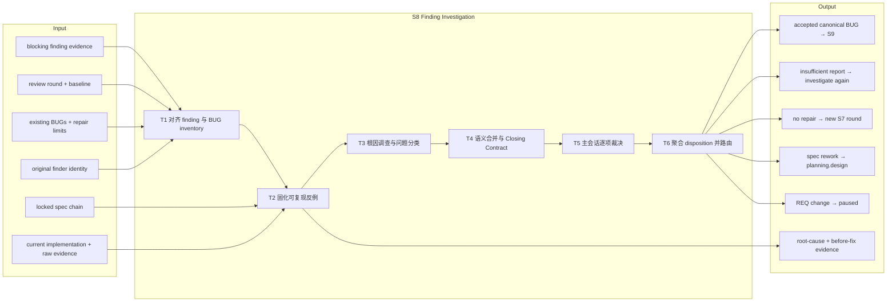
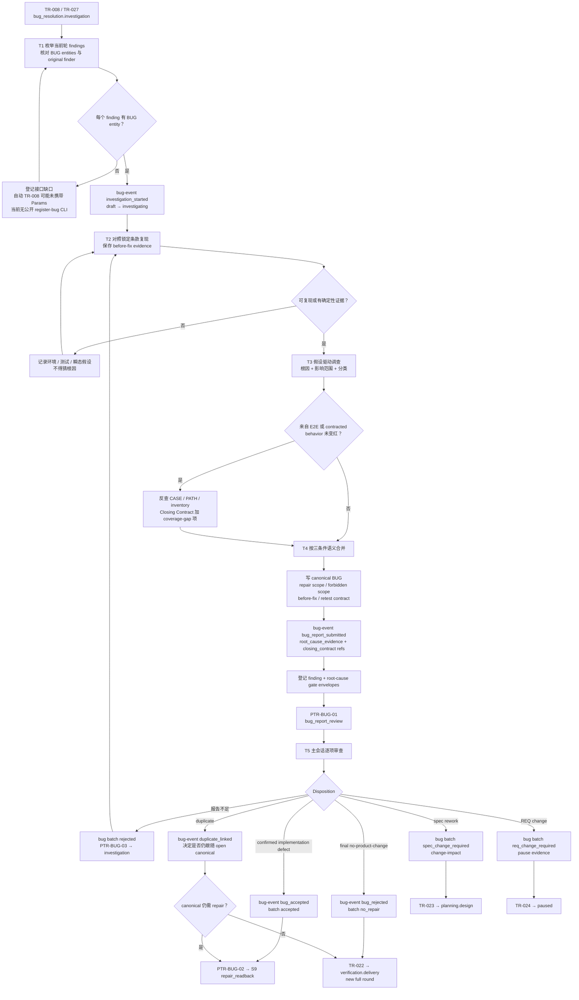

# L3-S8 — 发现调查（Finding Investigation）

> 层：第三层 ｜ 上游：L2 §S8 ｜ 前置：S7 TR-008 或 S11 TR-027 已进入 `bug_resolution.investigation` ｜ 下游：S9 修复、S7 新完整轮、S2 规格重做或 paused 人闸
>
> 阅读顺序：§1～§3 先回答“为什么 finding 不能直接派修、如何从反例收敛到可裁决 BUG”；§4 再映射 BUG entity、调查方法、canonical report、Closing Contract、batch gate 与六类路由；§5～§8 审计职责、当前真实强制力、出口和易错点。S6～S11 尚未完成机制优化，本文会如实区分目标设计、文本方法与现有代码能力。

## 1. 第一层：S8 的立意与目标

### 1.1 为什么需要 S8

finding 只说明“某个观察与预期冲突”，并没有回答为什么冲突、真正需要改什么、同一机制还影响哪里、修复后怎样证明问题消失。若跳过这层直接让 Builder 看 diff 修症状，系统会反复进入“修一个表现、留下同一根因、再制造新回归”的 Fixes that Fail 回路。

S8 的职责是把 observation 转成 decision-ready defect model：

1. 先固定一个可重复或确定性的反例，避免在不可复现噪声上归因；
2. 用证据排除假设，确定问题类别、根因和影响范围；
3. 只在“同一用户可见矛盾、同一根因、兼容 Closing Contract”同时成立时合并 findings；
4. 在修复前写清允许范围、禁止范围、before-fix evidence 和重验断言；
5. 由主会话逐项裁决 accepted、报告退回、最终无修复否决、duplicate、spec rework 或 REQ change。

因此 S8 不修代码。它的完成定义是**每个 finding 都有显式、证据支撑且可路由的 disposition；每个 accepted BUG 已足够让 S9 Builder 在不重新猜需求的情况下执行**。

### 1.2 阶段目标与完成定义

| 项目 | 定义 |
|:--|:--|
| 输入 | S7/S11 finding evidence；当前 review round 与 baseline generation；锁定规格链、当前实现和原始测试/浏览器证据；现有 BUG entities；repair limits；original finder 身份 |
| 要搞清楚 | finding 是否真实且可复现；属于实现、测试、规格、REQ、环境/依赖还是 duplicate；根因机制与 blast radius；哪些 findings 可合并；修复边界和重验证明是什么 |
| 核心工作 | 对齐 finding/BUG inventory → 固化 before-fix 反例 → 假设驱动根因调查 → 归类和语义去重 → 写 canonical BUG/Closing Contract → 主会话裁决并路由 |
| 输出 | finding disposition ledger；root-cause evidence；canonical BUG report；BUG entity 状态；batch gate envelope；spec/REQ change impact 或 no-repair 说明 |
| 目标完成 | 每个阻断 finding 恰有一个最终归宿；accepted BUG 均有证据根因、影响范围、repair/forbidden scope、before-fix evidence、retest contract 和 original finder |
| 下一阶段 | accepted → PTR-BUG-02 → S9；整批无 repair → TR-022 → S7 新轮；spec rework → TR-023 → planning.design；REQ change → TR-024 → paused |

### 1.3 Overview：输入、主步骤与输出

### 1.4 S8 的边界与当前保证

- **S8 的机器边界**：`bug_resolution.investigation` 与 `.bug_report_review`；从 `.repair_readback` 起属于 S9；
- **实际入口**：Loop Definition 只有 S7 TR-008 和 S11 人工驳回缺陷 TR-027 直接进入 S8；协议/L2 提到的“S10 finding 进 S8”目前没有对应 top-level transition；
- **不负责**：写产品代码、分配未被接受的修复、修改 locked 规格、执行 targeted re-verification、关闭 clean round；
- **双状态链**：top-level phase 与每个 `entities.bugs[].state` 由不同命令/transition 修改，当前没有自动同步；
- **调查方法主要是文本约束**：`bug-resolution` 方法、BUG 模板与 R-P06 能引导深查，但 phase gate 不解析这些内容；
- **当前机器地板**：BUG event 能要求若干非空参数并维持实体状态枚举；quality gate 能要求指纹匹配的通用 envelopes；它们尚不能证明根因正确、全 batch 已处置或 Closing Contract 真正 Builder-ready。

## 2. 第二层：S8 的任务分解

| 任务 | 要解决的问题 | 主要动作 | 阶段产出 |
|:--|:--|:--|:--|
| T1 对齐 finding 与 BUG inventory | 进入 S8 的 findings 是否都可追踪；BUG entity 是否存在；original finder 是谁 | 枚举当前轮 finding evidence；核对 source path、reporter、severity、现有 live BUG 和 repair counters；补齐登记缺口 | finding ledger、BUG/entity mapping、investigation queue |
| T2 固化可复现反例 | 观察是真缺陷、测试问题还是环境噪声 | 从锁定预期出发复现；保存 before-fix output/trace/screenshot/data；记录最小触发输入与环境；E2E finding 反查为何原测试未拦住 | reproduction record、before-fix evidence、coverage-gap hypothesis |
| T3 根因调查与分类 | 什么机制导致反例；影响哪里；应该走哪一层修正 | 假设表逐条证伪/证实；沿 write/read/retry/fallback/data path 追踪；分类 implementation/test/spec/REQ/environment/dependency/duplicate | evidence-supported root cause、impact/blast radius、proposed disposition |
| T4 语义合并与 Closing Contract | 哪些 finding 属于一个 canonical BUG；修复授权边界是什么 | 用三条件合并；分配 canonical ID；写 affected clauses、repair/forbidden scope、before-fix evidence、retest assertions、Skills | canonical BUG report、duplicate map、Closing Contract |
| T5 主会话逐项裁决 | 报告是否足以派修；每个 finding 的最终归宿是什么 | 复核证据链、根因、边界和 contract；更新 BUG entity；形成 accepted/rejected/duplicate/spec/REQ disposition | per-BUG decision、entity events、review feedback |
| T6 聚合 disposition 并路由 | 整批下一步是修复、无修复回归、规格重做还是人闸 | 生成唯一 batch envelope；避免互斥 requested events 同时有效；让 PreToolUse 选择一个出口 | PTR-BUG-02/03 或 TR-022/023/024 handoff |

T2～T4 应按 canonical root-cause group 组织，而不是机械地“一条 finding 一个调查者”。T5 是主会话的裁决责任；T6 只聚合已经存在的逐项事实，不能用一条 batch 结论补造遗漏的 disposition。

## 3. 从 finding 到可路由 canonical BUG 的完整工作流

图中的 GAP 是真实断点，不是建议性分支：TR-008 的自动 Controller 不会把 finding 内容放入 `Params.findings`，TR-027 也没有创建 BUG entity 的 action；而内部 `assignment.RegisterBug` 没有公开 CLI。进入 S8 后若 entity 缺失，当前正式用户操作面没有闭合的补登记命令。

## 4. 第三层：每项任务如何被引导和承载

### 4.1 T1 — finding inventory、BUG 登记与双状态链

进入 S8 后先建立一张不可沉默的 finding ledger，至少记录 finding evidence ID/path、当前 round/generation、producer agent/responsibility、severity、被违反条款、BUG entity ID、original finder 和当前 disposition。原因是现有 Runtime 不会替 batch 做这张映射。

仓库里实际存在两套 BUG 创建逻辑：

| 路径 | 输入与检查 | 持久化结果 | 现状问题 |
|:--|:--|:--|:--|
| TR-008 `record_finding_batch` | `Params.findings` 中 reporter/body/path；severity 缺省为 P0 | 自动分配 BUG-NNN，state=draft，path 中编码 fingerprint，记录 original finder | 自动 Controller 不传 Params；指纹是 reporter + sorted body lines + path；对所有历史状态都去重 |
| 内部 `assignment.RegisterBug` | 显式 ID/severity；finding source 与 evidence files 必须存在；reporter 必填 | 同样只写精简 runtime entity | 没有 CLI；指纹是 source + sorted evidence refs，且只对 live BUG 去重；request 的 RootCause/Reproduction/ClosingContractHints 实际不落盘 |

两套指纹既不同，也都只是“同一输入是否重复登记”的机械去重，不实现 S8 的语义合并三条件。TR-008 还在调查前就分配 canonical-looking ID，因此该 ID 只是 runtime identity，不代表根因已经 canonicalized。

单个 BUG entity 必须另走 `runtime bug-event`：draft → investigating → pending_approval → accepted/rejected/duplicate。phase machine 则由 PTR/TR 修改 `bug_resolution.investigation/bug_report_review`。PTR-BUG-01/02/03 的 actions 只记录 evidence context，不推进任何 BUG entity；bug-event 也不检查 top-level 当前是否真的位于 S8/S9。两条链可以彼此矛盾，例如 phase 已进 S9 而某些 BUG 仍是 draft。

### 4.2 T2 — 复现、before-fix evidence 与“为什么测试没拦住”

调查应从 locked expected behavior 开始，而不是从最近 diff 开始。最小记录应包含：

- 触发输入、身份/权限、环境和前置数据；
- 逐步 reproduction 与实际 terminal state；
- 精确 expected/actual，以及用户、数据和系统影响；
- 命令输出、HTTP/console/network、trace/screenshot/JSONL 或历史样本；
- 如果是数据修复类问题，目标行、dry-run、apply/rollback 约束和 before/after assertions；
- 原测试为何没有失败：CASE/PATH 缺失、fidelity 太低、oracle 太弱、执行路径绕过，还是证据本身不可信。

`bug-resolution` 方法要求在存在 inventory 时运行 `e2e-coverage` 并把 coverage gap 写进 Closing Contract。但如 S7 所述，该 CLI 评分的是 REQ-039 风格的独立 scenario inventory，不自动读取产品 CASE/PATH 或本轮浏览器 evidence；项目若没有建立两者映射，命令只能提供辅助线索，不能替代实际反查。

当前没有 machine gate 读取 reproduction steps、before-fix evidence 或 coverage-gap 项。BUG event 的 `root_cause_evidence` 可以只是任意非空字符串，甚至不要求引用文件存在；因此可复现性仍靠调查者方法与主会话审查。

### 4.3 T3 — 假设驱动根因、问题分类与重试信号

根因不是“哪一行错了”，而是能解释触发条件、传播路径和同类风险的机制。调查至少要沿这些层面排除假设：状态机、数据模型、write/read path、retry/fallback、接口契约、权限/信任边界、测试 oracle、环境/依赖。

目标分类至少区分：

| 类别 | 含义 | 正确下一步 |
|:--|:--|:--|
| implementation defect | 当前规格明确，实现违背它 | accepted BUG → S9 |
| test defect / coverage gap | 产品行为可能正确，但验证实现或 oracle 错；是否要改产品需另判 | 无产品变更时 final rejection；测试修正需明确范围，不能伪装产品 BUG |
| spec conflict | design/prototype/contract/TASK 本身不一致或错误，REQ 不变 | TR-023 → planning.design |
| REQ change | 正确行为需要改变 locked REQ | TR-024 → paused |
| environment/dependency | 外部条件或瞬态造成，且无需产品/spec 修正 | 有证据的 no-product-change disposition |
| duplicate | 已由同一 canonical root cause/contract 覆盖 | link canonical；是否进 S9 取决于 canonical 是否仍需 repair |

L2 要求根因是可检索的“类别”并表达影响范围；当前 `review-evidence.schema` 只有自由文本 `root_cause` 和字符串数组 `impact`，没有 mechanism vocabulary 或结构化 blast radius。BUG Markdown 模板的 hypothesis table 是良好逼问，但 phase gate 不解析它。

`investigation_started` 和 failed retest 回 investigation 会增加 `attempt_count`。然而现有 retry-limit 路径有三处断裂：BUG lifecycle 使用自己的非 typed 检查，超过阈值只返回错误；typed `CheckRepairLimit` 与 GTR-004 adapter 没有被生产调用链自动接上；`same_contract_failure_count` 从未自增。因此“达到上限自动 pause、同一 contract 连续失败触发重查”目前不是完整机器保证。

### 4.4 T4 — canonicalization 与 Closing Contract

语义合并只在以下三项同时成立时进行：

1. 同一用户可见或系统可观察矛盾；
2. 同一证据支撑的根因；
3. repair boundary 与 retest assertions 兼容。

“碰了同一个文件”“报错字符串相同”或“同一个 reviewer 发现”都不是充分条件。机械 fingerprint 只能阻止相同输入重复登记，不能代替这个判断。

一个 Builder-ready canonical BUG 至少要承载：

- source finding IDs/reports 与 violated clauses；
- actual/expected behavior、reproduction evidence、root cause、impact；
- repair scope 与 forbidden scope；
- before-fix evidence；
- 可执行的 Closing Contract：旧矛盾消失、目标字段/状态正确、回归用例先红后绿、数据修复不变量；
- original assignment/responsibility/finder；
- required Skills、attempt counters 和主会话审查信息。

当前载体分成三种互不自动同步的形状：

| 载体 | 能表达什么 | 当前消费者/限制 |
|:--|:--|:--|
| `BUG-template.md` | 人类可读的指纹链、假设表、四段 Closing Contract、历史 | Runtime/gate 不解析；状态词 `reported/verifying` 与 entity 的 `pending_approval/retesting` 不一致 |
| `review-evidence.schema.json#canonicalBug` | 丰富结构化 canonical record | 与 quality-gate 通用 envelope 不兼容；没有 adapter |
| runtime BUG entity | ID/state/path/severity/counters/finder，加 event 写入的若干 string refs | 不保存完整 clauses/impact/scopes/assertions；root-cause/contract 只存字符串引用 |

PTR-BUG-01 的 gate 只要求当前轮一条 blocking finding envelope 和一条 Investigator/Orchestrator `complete` root-cause envelope；它不要求每个 finding/BUG 都具备根因。transition 又禁止一个 evidence ref 同时绑定 finding/root-cause 两个 slot，因此即使两者都使用 kind=`bug`，仍需两条独立 envelope。仓库没有专门的 Investigator agent 卡或 team kind，实际通常只能由 Orchestrator 承担或临时组织，但这种单职责调查没有 runtime workgroup 支撑。

### 4.5 T5 — 主会话裁决与每条路由的真实强度

| 裁决 | 目标动作 | 当前真实机制与缺口 |
|:--|:--|:--|
| 报告不足 | 拒绝“报告”并回 investigation，保留 finding 未决 | `bug_batch/rejected` 可触发 PTR-BUG-03；但 BUG entity 没有 pending_approval → investigating 事件，容易仍卡在 pending_approval 或被误用 `bug_rejected` 终结 |
| accepted | entity 进入 accepted；完整 accepted batch 进 S9 | `bug_accepted` 只检查 ID 非空；PTR-BUG-02 只看一条 Orchestrator/accepted envelope，`canonical_bug_mapping_complete` 和 `bug_closing_contracts_complete` 是 evidence-attestation stubs，不枚举全部 findings/entities |
| final no-product-change | entity rejected，理由与证据完整；整批无 repair 才回 S7 | `bug_rejected` 只要求非空 reason；TR-022 只看 `bug_batch/no_repair`，`no_accepted_bugs` 与 `bug_report_review_complete` 也是 stubs，不实际扫描 accepted BUG 或全部 findings |
| duplicate | 指向存在且语义匹配的 canonical；open canonical 跟 S9，closed/no repair 才可 TR-022 | `duplicate_linked` 只要求非空 `duplicate_of`；schema 只检查 BUG-NNN 格式，不验证目标存在、非 self、仍 live 或三条件成立 |
| spec rework | 记录 batch + change impact，REQ 不变，失效受影响 evidence | TR-023 可从任意 bug_resolution phase 触发；`req_baseline_unchanged` 是 stub；action 按当前工具的 affected paths 算影响，不读取 rich changeImpact 内容，空 paths 可导致零失效 |
| REQ change | 记录 batch，暂停并等待人修订 | TR-024 同样不要求先到 bug_report_review；quality gate 先要持久化 pause 类 envelope，transition 再用生成式 checkpoint，载体分裂 |

spec/REQ disposition 也没有对应 BUG entity state/event；rich canonical schema 有 `spec_rework_required/req_change_required` status，但 runtime entity 只能停在 pending_approval、转 rejected 或保持其他状态。phase 路由与 entity 历史因此无法天然对齐。

所有 bug_resolution 顶层自动出口与当前 phase transition 共用 `SEL-BUG-OUTCOME`。若 state 中同时存在两个有效 requested events，或 accepted phase gate 与 spec/no-repair 等顶层 gate 同时满足，Controller 会报告 `LOOP_TRIGGER_CONFLICT`，不会按优先级选一个。混合 disposition batch 必须先明确如何分批/聚合；当前没有自动 batch partition 或 precedence。

### 4.6 T6 — batch 出口不是 per-BUG 状态的替代品

S8 的出口应先完成逐 finding ledger，再形成一个 batch-level routing fact：

- 至少一个 accepted canonical BUG 且没有更高层 spec/REQ 路由时，形成 `bug_batch/accepted`，PTR-BUG-02 进入 S9；
- 所有 findings 都是 final no-product-change 或指向不再需要 repair 的 canonical，形成 `bug_batch/no_repair`，TR-022 新开 S7 round；
- 任一 finding 证明 specification 必须更正，形成单一 spec-change requested event 与 change impact，TR-023 回 planning；
- 任一 finding 证明 locked REQ 必须改变，形成单一 req-change event 与 pause evidence，TR-024 交人；
- 报告本身不足时形成 review feedback，PTR-BUG-03 回 investigation，而不是给 finding 一个最终 rejected disposition。

当前这些 batch envelopes 都是通用 quality-gate JSON，不是 rich canonical BUG record。PTR/TR actions 除 change invalidation/pause/start-round 外，大多只确认 evidence map 非空，不会同步 individual BUG state。因此“phase 已离开 S8”不能作为“所有 BUG 已正确裁决”的替代证据。

## 5. 职责分布与覆盖审计

### 5.1 职能落点

| 职能 | 主责 | 承载位置 | 当前消费者 |
|:--|:--|:--|:--|
| finding 事实与原始证据 | S7 reviewer / S11 human | finding envelope + report/trace | S8 investigator、GATE-BUG-DRAFTS-READY |
| finding ledger 与 batch 完整性 | Orchestrator | 当前无正式模板；应由 S8 工作记录承载 | 主会话裁决、batch route |
| 可复现反例 | Investigator/Orchestrator | BUG report、raw evidence | 根因调查、S9 before/after |
| 根因与影响判断 | 单职责 Investigator 或主会话 | hypothesis table、root-cause evidence | canonical BUG、PTR-BUG-01 |
| canonicalization | Orchestrator/Architect | BUG report + duplicate map | BUG entities、S9 |
| Closing Contract | Investigator 提案，主会话批准 | BUG Markdown/rich canonical record | S9 Builder、original-finder retest |
| BUG entity 生命周期 | Orchestrator | `runtime bug-event` | runtime state、repair limits |
| phase/batch 路由 | quality gate + Controller | generic bug/root-cause/change/pause envelopes | PTR-BUG-01/02/03、TR-022/023/024 |
| REQ 最终变更决策 | Human | pause + human decision/amendment | S11/控制面 |

### 5.2 应有的分工与重叠控制

- 原 reviewer 提供观察和 original-finder continuity；Investigator 建立因果模型；主会话批准 canonical BUG；S9 Builder 只执行已批准边界；
- 调查者可以读实现和运行诊断，但不能借调查直接修改产品；否则 before-fix evidence 和独立因果判断都会被污染；
- canonical ID 分配与语义合并属于主会话，不由并行 reviewers 各自抢号；
- root-cause evidence 解释“为什么”，Closing Contract 定义“修后必须真什么”，change impact 决定“哪些旧 PASS 失效”；三者互相引用但不互相替代；
- “报告退回”与“finding 最终无修复否决”必须是两个不同事实；前者仍未决，后者需要证据证明产品与规格已经一致；
- duplicate 只复用 canonical repair chain，不复用未证实的根因判断；open duplicate 不能走 no-repair 快捷出口。

### 5.3 如实现状与未闭合缺口

1. **自动 S7→S8 可能没有 BUG entity**：Controller 不传 `Params.findings`；TR-027 也不创建 entity；
2. **内部 RegisterBug 无 CLI**：正式用户操作面无法在已进入 S8 后补齐 entity；
3. **两套去重指纹不一致**：TR-008 与 RegisterBug 的输入、终态处理不同；都不实现语义三条件；
4. **phase 与 BUG entity 不同步**：PTR/TR 不推进 individual BUG，bug-event 也不约束当前 S8/S9 phase；
5. **没有 Investigator agent/workgroup 类型**：gate 虽接受 `Investigator`，但 agents/team-manifest 没有对应注册路径；
6. **根因/contract 只做非空参数检查**：bug-event 不验证引用存在、指纹、内容或 assertion 完整性；
7. **PTR-BUG-01 不检查 batch 完整**：一条 finding + 一条 root-cause envelope 即可把整批推进 review；
8. **PTR-BUG-02 的两个关键 guards 是 stubs**：不检查 finding→canonical mapping、所有 accepted BUG 的 Closing Contract 或 entity state；
9. **rich canonical BUG 与 gate envelope 分裂**：Markdown、review-evidence JSON、runtime entity、generic gate JSON 四套事实无 adapter；
10. **状态词不一致**：BUG template 的 reported/verifying 与 runtime pending_approval/retesting 不对齐；
11. **报告退回没有 entity 回路**：PTR-BUG-03 回 phase investigation，但 pending_approval BUG 无对应回 investigating event；
12. **duplicate guard 过弱**：不验证 canonical 存在、live、自引用或根因/contract 兼容；
13. **spec/REQ disposition 无 entity 状态**：路由后 BUG 历史可能悬在 pending_approval；
14. **TR-022 的安全 guards 是 stubs**：一条 no_repair envelope 可绕过实际 accepted BUG 与未处置 findings；
15. **TR-023 影响失效不消费 changeImpact 内容**：依赖触发工具 affected paths；`req_baseline_unchanged` 也非实算；
16. **混合 batch 无 partition/优先级**：多个有效 route 会触发 selector conflict；
17. **retry-limit 自动桥未接通**：BUG lifecycle 返回普通错误，typed adapter 需外部显式调用且还要已有 bug_batch evidence；
18. **`same_contract_failure_count` 是死字段**：未在 failed retest 路径自增；
19. **original finder 只存 agent IDs**：runtime entity 不保存 original responsibility；后续“原职责重验”的身份链较弱；
20. **S10→S8 缺 top-level route**：协议与 L2 的失败路由没有 Loop Definition 对应 transition。

### 5.4 关键取舍

| 问题 | 设计选择 | 原因与当前代价 |
|:--|:--|:--|
| finding 是否直接修 | 必须先调查并接受 canonical BUG | 防治标和越界；当前 gate 对根因深度的机器检查很弱 |
| 调查组织 | 按根因候选/责任单元，而非按文件或 finding 数量 | 能合并一因多果；当前没有 Investigator team type |
| 去重 | machine fingerprint 防重复登记 + human 三条件做语义合并 | 边界正确；两套 machine fingerprint 漂移造成不一致 |
| Closing Contract | 修复前冻结边界和可执行断言 | S9 有明确授权；当前三种载体不自动同步 |
| no-repair 出口 | 整批无 accepted repair 才回新 S7 round | 防吞 finding；当前 TR-022 guards 未实算 |
| spec/REQ 分路 | specification 回 planning；REQ 交 human | 保持授权边界；entity 没有对应 disposition state |
| batch selector | 多个有效出口 fail closed | 不猜优先级；混合 batch 目前缺少正式拆分方法 |

## 6. L1 准则如何嵌入 S8

| L1 准则 | S8 中的实际落点 |
|:--|:--|
| D1 权威外置 | finding、BUG entity、root cause、Closing Contract、batch envelope 和 journal 落盘；多载体不同步削弱权威唯一性 |
| D2 自然路径观测 | PreToolUse 评 PTR/TR；bug-event 记录实体变化；复现沿真实系统路径而非只看 diff |
| D3 门是顾问 | missing finding/root-cause/batch evidence 可指向补项；当前不能指出具体哪个 finding/contract 沉默 |
| D4 引导性产物 | hypothesis table、actual/expected、repair/forbidden scope、before-fix、retest assertions 迫使深查 |
| D5 三级强制 | Skill/规则引导调查；schema/entity 限制形状；gate/selector 控制路由——根因语义和 batch completeness 强制仍弱 |
| D6 三方收敛 | reviewer 提供观察、Investigator 建因果、Orchestrator 裁决；REQ 变化交 human |
| D7 收敛可观测 | attempt counters、BUG states、phase 与 disposition 可显示回路；死计数器和双状态链会制造假收敛 |
| 公理一 原型 | 对应现实中的 defect triage、root-cause analysis、canonical issue、repair contract 与 retry budget |
| 公理二 分工 | finding owner、Investigator、approver、Builder、retester 分开；当前 Investigator 缺正式角色载体 |
| 公理三 消费 | 根因供 scope/同类检索，Closing Contract 供 S9，disposition 供 route；未被 gate 消费的丰富字段被列为缺口 |
| 公理四 成本 | 同根因 findings 合并调查；风险触发深度按问题类型加载；避免每条 finding 重复读全仓 |
| 公理五 传达 | 报告不足、final rejection、duplicate、spec、REQ、accepted 使用不同词和去向，不以一个“rejected”覆盖全部 |

## 7. 产出、出口门槛与失败路由

### 7.1 正式产出

- 当前 round 的 finding disposition ledger 与 finding→canonical BUG mapping；
- 每个有效反例的 reproduction、before-fix raw evidence 和环境说明；
- 假设表、evidence-supported root cause、问题类别与 impact/blast radius；
- 每个 accepted BUG 的 canonical report、repair/forbidden scope、Closing Contract、original finder 与 required Skills；
- 每个 final rejection 的 no-product-change rationale，或 duplicate 的 canonical link；
- runtime BUG entity events 与 counters；
- phase/batch gate 可消费的 finding、root-cause、bug_batch、change-impact、pause envelopes；
- PTR-BUG-02/03 或 TR-022/023/024 handoff。

### 7.2 目标出口判定与当前机器地板

| 维度 | 目标判定 | 当前机器实际检查 |
|:--|:--|:--|
| Finding 覆盖 | 每个 blocking finding 恰有一个 disposition | 无全量 ledger/schema；phase gates 最少只需一条相关 envelope |
| Reproduction | 可重复或有确定性原始 evidence；before-fix 已冻结 | 不读取步骤/原始内容；主要靠报告审查 |
| Root cause | 证据支持、类别明确、可解释 blast radius | 一条 Investigator/Orchestrator `complete` envelope；bug-event 只要非空 ref |
| Canonicalization | 三条件成立才合并；每个 duplicate 指向有效 canonical | 两套机械 fingerprint；duplicate 只校验非空/pattern |
| Closing Contract | repair/forbidden scope + before-fix + executable retest 全齐 | bug-event 只保存一个非空 string；PTR-BUG-02 guard 不解析 |
| Accepted batch | 所有 accepted entities 与 rich reports 一致，其他 findings 已处置 | 一条 Orchestrator/accepted envelope；不枚举 entities |
| No-repair batch | 无 accepted/open repair，所有 findings final | 一条 Orchestrator/no_repair envelope；两个 transition guards 是 stubs |
| Spec/REQ route | 正确层级、impact 完整、互斥出口唯一 | requested-event envelope；spec invalidation 依赖 affected paths；多出口冲突 |
| Retry safety | 达 limit 自动 pause；same-contract failure 可观测 | counters/typed helper 部分存在，但生产桥和 same-contract 自增未闭合 |

### 7.3 失败路由

| 情况 | 去向 |
|:--|:--|
| BUG entity 缺失 | 留 S8，报告 integration gap；当前需补公开登记能力或经受控内部路径修复，不能直改 loop-state |
| finding 不可复现且无确定性证据 | 留 investigation，补环境/数据/trace；不得猜根因后派修 |
| root cause/impact/Closing Contract 不足 | PTR-BUG-03 退报告；同时注意 entity 没有自动回 investigating |
| 确认实现缺陷 | accepted entity + accepted batch → PTR-BUG-02 → S9 |
| false positive/test-only/transient 且无产品/spec 变更 | final rejection；整批无 repair 后 TR-022 → S7 新完整轮 |
| duplicate 指向 open canonical | 跟随 canonical 进入/继续 S9；不得走 TR-022 |
| design/prototype/contract/TASK 错误，REQ 不变 | TR-023 → planning.design，重新走 S2～S5 |
| locked REQ 必须变化 | TR-024 → paused → human amendment |
| repair attempt 达上限 | 目标为 GTR-004 pause；当前自动桥未接通，必须显式保留现场并升级 |
| 同时出现多个 requested routes | `LOOP_TRIGGER_CONFLICT`；先拆清 batch/撤销冲突 evidence，不猜优先级 |

## 8. 易错点与渐进披露

### 8.1 易错点

1. 看到 finding 就给 Builder 派修；finding 还没有授权边界和完成判据；
2. 假设 TR-008 一定创建 draft BUG；自动 Controller 路径没有 `Params.findings`；
3. 进入 S8 后调用不存在的 `runtime register-bug`；代码只有未暴露的内部函数；
4. 把 BUG-NNN 已分配当成语义 canonicalization 已完成；ID 可在调查前生成；
5. 按“同文件”合并 findings；必须同时满足可见矛盾、根因和 Closing Contract 三条件；
6. 从 diff 猜根因，未先保存 before-fix 反例；修后将失去可验证的因果基线；
7. 把 `bug_reports_rejected` 当作 finding final rejection；PTR-BUG-03 的语义是报告不足回查；
8. 用 `bug_rejected` 退回调查；它会把 entity 置为 terminal rejected，且没有回 investigating 事件；
9. duplicate 只填一个 BUG-NNN 就相信 machine 已核实 canonical；当前没有存在/live/语义检查；
10. 同时登记 accepted、spec-change、req-change/no-repair 等互斥 batch facts；selector 会 fail closed；
11. 认为 PTR-BUG-02 会把所有 entities 置 accepted；它只推进 phase；
12. 认为 TR-022 会实际扫描无 accepted BUG；当前 guards 只做 evidence attestation；
13. 把 rich canonical BUG JSON 直接当 quality-gate envelope；两种 schema 不兼容；
14. 认为 repair limits 与 same-contract counter 已自动防振荡；生产桥和计数仍未闭合；
15. 调查时顺手改实现；这会污染 before-fix evidence，并绕开 S9 activation/invalidation/retest。

### 8.2 阅读预算

- **只想理解 S8 主线**：读 §1.1～§1.3、§2、§3、§7.3；
- **正在调查某个 finding**：重点读 §4.2～§4.4，再加载 `bug-resolution` 方法和对应风险 Skill；
- **正在做主会话裁决**：读 §4.5～§4.6、§7.2，不必重做调查方法；
- **正在维护 harness**：必须读 §4.1、§5.3，并对照 RegisterBug、BUG lifecycle、quality-gate registry、selector 与 actions；
- **S9 Builder/Verifier**：只消费 accepted canonical BUG、当前指纹链、repair/forbidden scope、Closing Contract、original finder 和剩余风险，不重解释 finding。
