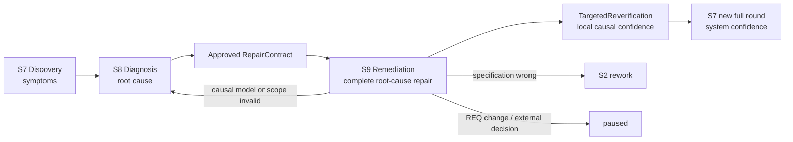
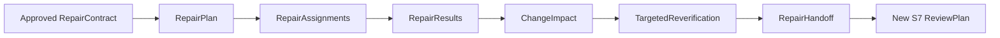
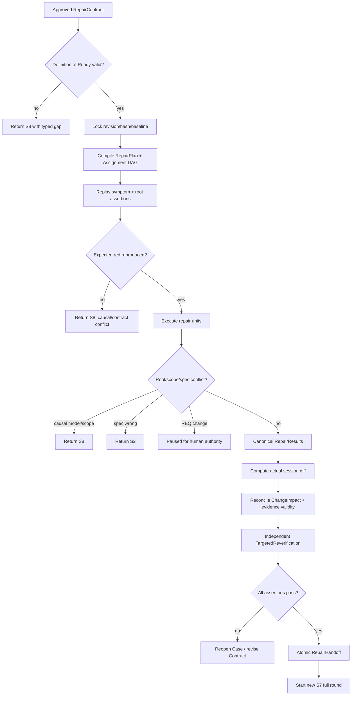

# L3-S9 — 根因修复与可信度重建（Root-Cause Remediation）

> 层：第三层 ｜ Macro-stage：S7 Discovery → S8 Diagnosis → **S9 Remediation** ｜ 上游：S8 approved RepairContract ｜ 下游：S7 新完整验证轮、S8 重新调查、S2 specification rework 或 paused
>
> 横切机制：[L4 Agent 调度与治理](./L4-agent-dispatch-governance.md)。L4 负责 Assignment、PLAN_REPORT、连续执行、Hook、idle/stop、恢复和拓扑选择；本文只定义 S9 特有的 RepairContract 消费、根因修复、ChangeImpact、定向复验与 S7 回环。
>
> 设计状态：本文以目标机制为主；§13 单列当前实现差距。目标中的 RepairPlan、RepairResult、基于真实 diff 的 ChangeImpact、TargetedReverification 和原子 S9→S7 handoff，在 L5 实现前不得被描述为既有代码能力。

## 0. 一句话结论与阶段关系

> **S9 不接收“发现了什么问题”的自由文本，也不重新猜根因；它只消费 S8 已批准且带 revision/hash 的 RepairContract，把其中的架构修复意图转成可执行 Assignment，完成 Minimum Complete Root-Cause Repair，按真实 diff 重算影响、独立复验全部断言，然后回到 S7 开启一轮全新的完整审查。**



S7、S8、S9 合在一起才完成一次缺陷闭环：

1. S7 证明“系统出现了哪些可复现表象”；
2. S8 证明“哪些表象由什么机制共同引起、正确修复意图是什么”；
3. S9 证明“该机制已被完整消除、检测缺口已补上、受影响可信度已重建”；
4. 新 S7 再证明“修复后的整体开发结果仍然成立”。

## 1. S9 的立意、目标与不变量

### 1.1 为什么“把代码改绿”不等于修复完成

一个症状通常可以被很多局部补丁暂时遮住。例如“填报内容无法显示”和“填写后无法保存”可能同时来自 FE/BE schema 漂移。只给页面补默认值会让显示变绿，只在一个 endpoint 加 alias 可能让保存变绿，但双重 schema、历史数据兼容和契约漂移仍然存在，后续页面还会以其他方式再次失败。

因此 S9 的成功标准不是 smallest diff，而是 S8 定义的 **Minimum Complete Root-Cause Repair**：

- 恢复被破坏的 authority/invariant；
- 覆盖 RepairContract 中全部 source Findings；
- 完成必要的数据、兼容、迁移、发布和回滚工作；
- 补上原来没能阻止问题的 detection gap；
- 根据真实改动重新判断哪些旧 PASS 已失效；
- 通过独立定向复验，但不把定向 PASS 冒充系统 CleanRound。

### 1.2 阶段目标与完成定义

| 项目 | 定义 |
|:--|:--|
| 输入 | approved RepairContract revision/hash；CausalModel ref；source Findings exact set；before-fix evidence；repair-unit DAG；scope/assertions；current authority/baseline；original finder/verifier route |
| 要搞清楚 | 如何在不改变 root-cause intent 的前提下实施完整修复；哪些 repair units 可并行；真实 diff 影响哪些 artifact/evidence；谁独立复验哪些断言；何时必须退回上游 |
| 核心工作 | 验证 Contract DoR → 生成 RepairPlan/Assignments → 先红后绿 → 执行完整根因修复 → ChangeImpact reconciliation → TargetedReverification → 新 S7 round |
| 最小工程权威 | 一份 approved RepairContract；一份 RepairPlan；每个 Assignment 一份 RepairResult；一份真实 diff 驱动的 ChangeImpact；每个 Contract 一份 TargetedReverification；一份 RepairHandoff |
| 目标完成 | 所有 repair units 已消费；全部 symptom/root/detection assertions 通过；实际 diff 与 scope/impact 对齐；历史 evidence 已正确 invalid/supersede/retain；没有未决 Case；已创建新 S7 full-review round |
| 不代表 | 定向复验 PASS 不代表 CleanRound；局部测试绿不代表根因被消除；一条修复报告不代表整批 RepairContracts 完成 |

### 1.3 S9 负责与不负责

S9 负责：

- 校验并锁定 S8 批准的 RepairContract revision/hash；
- 将 `repair_units[]` 编译成有依赖、有 scope、有验证目标的 RepairPlan/Assignments；
- 在实现前重放 source Findings 和 root-invariant assertion，保存可审计的 red evidence；
- 实施 Minimum Complete Root-Cause Repair；
- 增加 detection-gap tests/oracles；
- 依据实际 committed diff 形成 ChangeImpact，并使旧证据正确失效或被替代；
- 由未参与修复实现的责任人完成定向复验；
- 生成 RepairHandoff，并只回到新的 S7 完整轮。

S9 不负责：

- 从 Findings 重新推导另一套 root cause；
- 在 RepairContract 未批准时先写代码“试试看”；
- 擅自把 prospective scope 扩到新的 authority/requirement；
- 发现 Contract 错误后边修边修改因果模型；
- 用 UI fallback、异常吞噬、测试放宽等 symptom patch 代替根因修复；
- 用 targeted PASS 跳过 S7 Delivery/QA/E2E；
- 修改 locked REQ 或在规格错误时继续修过期实现。

### 1.4 不可退让的不变量

1. **RepairContract 是唯一修复授权**：每次 Assignment 和写操作都必须可追溯到 approved contract revision/hash 与 repair unit。
2. **根因不在 S9 重定义**：实现发现 CausalModel 错、scope 不足或 assertions 自相矛盾时，停止并返回 S8；不能静默改 Contract。
3. **完整修复优先于最小 diff**：允许的最小单位是恢复不变量的最小一致变更集，不是文件数或行数最少。
4. **先红后绿**：若 source symptom/root assertion 在修复前无法失败，Contract 的可证伪性不足，必须回 S8；不能继续盲修。
5. **实际 diff 是影响权威**：ChangeImpact 必须从整个 repair changeset 计算，不从某次工具调用、Builder 自报或 prospective paths 猜测。
6. **Builder 不自我关闭**：Builder 提交 RepairResult；独立 verifier 提交 TargetedReverification；Main 只按结构化事实裁决。
7. **定向 PASS 不是 CleanRound**：S9 成功只能创建 S7 新轮入口，不能直接进入 S10 或发布。
8. **旧证据不替新实现背书**：受实际改动影响的历史 PASS 必须 invalidated/superseded，下一轮只消费 current baseline 的 fresh evidence。

## 2. S8→S9 的输入合同

### 2.1 RepairContract Definition of Ready

S9 入口只接受一份通过 S8 §8.4 和 §10 原子批准的 RepairContract。入口工具必须校验：

| 输入 | 必须满足 |
|:--|:--|
| identity | `repair_contract_id / case_id / canonical_problem_id / revision / approved hash` 唯一且未撤销 |
| source facts | `source_finding_ids[]` 与 Case exact set 一致；Finding/before-fix evidence 均可读取且 hash 正确 |
| diagnosis | root-cause statement、violated authority/invariant、CausalModel ref 已批准 |
| architecture intent | 正确 source-of-truth、ownership、交互方向和要删除的重复机制明确 |
| execution model | `repair_units[]`、依赖 DAG、prospective/forbidden scope、required skills/tools 完整 |
| safety | compatibility/migration/rollout/rollback 和 stop/escalation conditions 完整 |
| verification | symptom、root-invariant、detection-gap assertions 以及 regression surfaces 完整 |
| impact | impact expectations 和需要重算的历史 evidence 范围明确 |
| independence | original finder/independent verifier route 可恢复，且 verifier 未被安排为同一 repair unit 的 Builder |

任一项缺失都返回 typed `CONTRACT_NOT_READY`，并指出字段、Case 和修复建议。入口不能“先建任务再慢慢补”，否则 Builder 会在不完整授权下开始写入。

### 2.2 Contract 锁定与 stale 检查

进入 S9 时生成 `repair_session_id`，锁定：

- approved Contract revision/hash；
- authority fingerprints；
- source baseline/Findings；
- implementation baseline commit/worktree；
- repair-unit DAG；
- prospective/forbidden scope；
- assertion set 与 impact expectations。

每次 PLAN_REPORT、首次写入、RepairResult submit、impact reconcile 和 targeted submit 都复验该锁。如果 Contract revision、REQ/design authority 或 implementation baseline 发生未声明变化，当前 session 标记 `stale`，停止继续消费。不得让一个旧计划在新 authority 上悄悄执行。

### 2.3 S9 如何使用 Findings

S9 读取 Findings 的目的只有三个：

1. 在修复前重放原始表象；
2. 在修复后逐项验证表象已消失；
3. 保持从 source Finding 到 RepairResult/TargetedReverification 的审计链。

S9 不根据 Findings 单独修改 repair intent，也不把两个 Finding 临时合并或拆分。若某个 Finding 不能由当前 CausalModel 解释，或修复后仍需新的根因假设，必须返回 S8 更新 InvestigationCase/RepairContract revision。

## 3. S9 的权威对象模型

### 3.1 最小对象链



长期权威只保留 RepairContract、RepairPlan/RepairResults、ChangeImpact、TargetedReverification 和 RepairHandoff。TASK、看板、BUG entity、generic gate evidence 都从这些对象投影，不再要求 Agent 手写多份内容相近但无法同步的事实。

### 3.2 RepairPlan

RepairPlan 是 S9 Main/Repair Lead 从 RepairContract 编译出的执行计划：

| 字段 | 含义 |
|:--|:--|
| `repair_plan_id / session_id / contract_refs[]` | 计划身份和精确输入 |
| `baseline / authority_fingerprints` | 执行基线 |
| `repair_units[]` | Contract repair units 的原样引用，不重新发明 |
| `assignments[]` | 按 ownership/tool context 分组后的执行单元 |
| `dependency_dag` | 生成、迁移、实现、测试、复验之间的顺序 |
| `write_ownership` | 每个 artifact 只有一个 active writer |
| `shared_integration_points` | 需要串行合并的 schema/API/migration 等共享点 |
| `verification_map` | 每个 unit 对应哪些 symptom/root/detection assertions |
| `impact_seed` | prospective surfaces，仅用于预检；最终由真实 diff 覆盖 |
| `approval_policy` | 默认连续执行或 high-risk approval checkpoint |
| `status/revision/hash` | 机器生命周期 |

### 3.3 RepairAssignment

每个 Assignment 至少包含：

- contract/session/plan revision 与 hash；
- repair unit IDs 和依赖；
- root invariant、architecture intent 与禁止的 symptom patches；
- read scope、prospective write scope、forbidden scope；
- before-fix assertions 和 expected red evidence；
- completion assertions 与 required checks；
- migration/compatibility/rollback 责任；
- required Skills/tools；
- expected RepairResult schema；
- stop/escalation conditions；
- `plan_checkpoint=required` 和默认 `execute_after_plan=true`。

Assignment 不复制整份 protocol，也不要求 Agent 在聊天里复述所有文档。工具生成器把最相关约束注入 prompt；read helper 返回按顺序裁剪后的 Contract、authority 和代码入口。

### 3.4 RepairResult

Builder 对每个 Assignment 只提交一份 Canonical RepairResult：

```text
RepairResult
├── assignment_id / contract_revision / session_id
├── plan_report_ref
├── before_fix_results[]
│   ├── assertion_id
│   ├── observed_red
│   └── evidence_refs[]
├── repair_unit_results[]
│   ├── unit_id
│   ├── implementation_summary
│   ├── changed_artifacts[]
│   └── restored_invariant_refs[]
├── checks[]
├── migration_rollout_rollback_results
├── detection_gap_artifacts[]
├── scope_deviations[]
├── residual_risks[]
├── evidence_refs[]
└── verdict: completed | blocked | contract_conflict | stale
```

`completed` 只说明 Builder 已按 Assignment 实施并完成自检，不关闭 canonical Problem，也不等价于 targeted PASS。

### 3.5 ChangeImpact

ChangeImpact 必须基于 session 的实际 changeset 计算：

- `actual_changed_artifacts[]` 与 content hashes；
- source Contract/RepairResult refs；
- 变更类型和受影响 authority/contracts/modules/data/interfaces；
- `invalidated_evidence_ids[]`；
- `superseded_evidence_ids[]` 及 replacement refs；
- `retained_evidence_ids[]` 及保留理由；
- `required_reverification[]`；
- migration/compatibility/deployment implications；
- prospective-vs-actual scope deviations；
- reconciliation status/hash。

只有 ChangeImpact 与真实 diff exact set 对齐，证据状态事务也成功后，才能开始 targeted re-verification。

### 3.6 TargetedReverification 与 RepairHandoff

TargetedReverification 逐项证明当前 RepairContract 的局部因果断言：

- 每个 source Finding 的 symptom assertion；
- 直接证明 root cause 被消除的 invariant assertions；
- 证明新增 oracle 能抓回退的 detection-gap assertions；
- compatibility/migration/rollback assertions；
- ChangeImpact 要求的局部 re-verification；
- scope compliance 和独立性。

RepairHandoff 则证明整个 S9 批次已经具备回 S7 的条件：所有 Contract/repair unit/Problem 的 disposition、ChangeImpact、targeted results、invalidated evidence、新 baseline 和下一轮 regression surfaces 都已闭合。

## 4. 修复规划与有思路的派发

### 4.1 先编译 RepairContract，不从文件列表派任务

Main/Repair Lead 按以下顺序生成 RepairPlan：

1. 读取 architecture intent 和 violated invariant；
2. 保留 Contract 中 repair-unit DAG，不按仓库目录机械切块；
3. 标出 authoritative source、生成物、消费者、迁移和 oracle；
4. 为每个 unit 绑定至少一个 root/detection assertion；
5. 根据 write ownership、工具上下文、合并风险和知识连续性分组；
6. 安排 integration/impact/targeted gates；
7. 计算 critical path，再决定并行度。

“前端一个 Agent、后端一个 Agent、测试一个 Agent”只有在 repair units 和 ownership 恰好对应时才成立。若根因是 schema ownership 漂移，更合理的分派可能是：

| Assignment | 责任 | 依赖 |
|:--|:--|:--|
| A1 Authority | 建立 authoritative schema/owner，删除重复定义或定义生成链 | 无 |
| A2 Server | DTO/domain/persistence/response 对齐权威 schema | A1 |
| A3 Client | FE client/form/display 对齐权威 schema，不保留页面级 alias | A1 |
| A4 Migration | 兼容旧数据、迁移、rollout/rollback | A1，必要时 A2 |
| A5 Detection | contract/integration/E2E oracle，覆盖全部 source Findings | A1～A4 |

这样修复是在恢复机制，而不是把每个症状分别派给最近的文件作者。

### 4.2 Assignment 合并与拆分

可以合并：

- 同一 write owner、同一工具上下文、同一 repair invariant；
- 必须在一个原子变更内保持编译/数据兼容；
- 拆开会制造临时双重 authority 或不可运行中间态；
- 同一 Builder 可以在单个上下文中完成且仍可独立复验。

必须拆分：

- 不同信任边界或破坏性权限；
- 数据迁移与普通代码改动需要不同审批/回滚能力；
- 多 Agent 会写同一 artifact 或共享生成源；
- Builder 会同时成为自己的 targeted verifier；
- 单个上下文无法安全理解所有 repair units；
- unit 之间只有验证依赖，不需要共享写权限。

默认 WIP 不是固定人数。起始可取 `min(2, ready_non_conflicting_assignments)`，随后按 critical path、write conflicts、测试资源和反馈速度动态调整。并行度是结果，不是目标。

### 4.3 PLAN_REPORT 后连续执行

沿用 L4 的统一机制：

1. Sub-agent 读取 Assignment 和必需上下文；
2. 第一条结构化回报必须是 `PLAN_REPORT`；
3. 计划必须把每一步映射到 `repair_unit_id`、被恢复 invariant、预计 artifacts、checks 和 stop conditions；
4. 默认回报后直接执行，不进入 idle 等第二轮“批准”；
5. Main 只有在计划缺失、偏离 Contract、扩大 scope、采用 forbidden patch 或 high-risk gate 命中时才打断；
6. 普通计划纠偏通过消息完成，不 kill/recreate Agent。

High-risk 例外包括不可逆数据迁移、权限/安全边界变化、生产发布操作、Contract 显式 `approval_required` 的步骤。此时 Agent 在批准点暂停的是高风险动作，不是整个任务。

### 4.4 派发时必须注入的思考顺序

Assignment 生成器应直接把以下顺序写进 Agent 的必经 prompt：

```text
理解 invariant → 重放 red → 恢复 authority/ownership →
处理所有 consumers 与数据兼容 → 补 detection gap →
运行 scoped checks → 提交 Canonical RepairResult
```

工具还应自动附上：

- “禁止只修第一个 source Finding”；
- “禁止以 fallback/alias/swallow/放宽测试掩盖问题”；
- “scope 不足或 root cause 不成立时返回 S8，不自行扩权”；
- “completed 不是 closed；不得自报 CleanRound”；
- “实际 changed artifacts 由提交工具从 diff 复算”。

## 5. 从批准 Contract 到完整修复的工作流



### 5.1 Step 1：重放全部 before-fix assertions

正式写入前，按 Contract 运行三类最小 red checks：

1. `symptom_assertions[]`：逐 Finding 重现 visible failure；
2. `root_invariant_assertions[]`：直接暴露 authority/ownership/状态机等根机制错误；
3. 已存在的 detection-gap candidate：证明现有 oracle 的确没有正确阻止问题，或记录其缺失。

结果必须绑定 current session baseline。若出现以下情况，立即停止：

- 表象无法重现且环境/数据没有可解释变化；
- root assertion 已经 green；
- 两个 source Findings 不能被同一已批准因果链解释；
- reproduction 需要修改产品代码才能“造红”；
- Contract 的 expected behavior 与 authority 不一致。

这些都说明 diagnosis 或 Contract 需要修订，不是让 Builder继续猜。

### 5.2 Step 2：执行 Minimum Complete Root-Cause Repair

每个 repair unit 必须回答四个问题：

1. 恢复了哪个 invariant/authority？
2. 哪些 source Findings 因此被同时解决？
3. 哪些 consumers/data/compatibility 必须一起调整才不留下第二套事实？
4. 哪个 assertion 能直接证明不是 symptom patch？

例如 schema drift 的完整修复可以包含 authoritative schema、FE/BE/domain/persistence 一致性、历史数据迁移、contract tests 和真实 E2E。它可能修改多个模块，却比“两个页面 alias + 一个 endpoint fallback”的小 diff 更小，因为它只保留一个机制和一个 source-of-truth。

### 5.3 Step 3：补上 detection gap

每个根因至少对应一条能阻止同类回归的 oracle。优先顺序是：

1. 最靠近 authority 的 schema/contract/static check；
2. 跨边界 integration test；
3. 真实入口 E2E；
4. 运行期观测/告警，仅用于无法在更早层确定的问题。

不能只增加一个复现当前字面输入的回归测试。Detection assertion 应证明：若把根因修复撤回或再次引入双重 authority，测试会变红。这样它保护的是机制，而不是某个表面样例。

### 5.4 Step 4：处理兼容、迁移、发布和回滚

Contract 声明这些要求时，RepairResult 必须提供可执行事实：

- 数据迁移是否幂等、可重放、可回滚；
- 旧客户端/旧数据的兼容窗口和删除条件；
- 双写/双读若不可避免，谁是 authority、持续多久、如何观测和移除；
- rollout 顺序和失败停止条件；
- rollback 是否会恢复被修复的根因；
- feature flag/config 是否成为新的永久分叉。

“先临时兼容以后再收拾”只有在 Contract 中是显式、限时、有 owner 和 removal assertion 的 repair unit 时才允许。

### 5.5 Step 5：提交 RepairResult

`repair result submit` 必须原子执行：

1. 校验 session/plan/assignment/contract revision/hash；
2. 复算当前 worktree/changeset changed artifacts；
3. 校验每个 repair unit 都有实现结果和 invariant mapping；
4. 校验全部 expected-red assertion 有 before-fix evidence；
5. 校验 required checks、migration/rollback results 和 detection artifacts；
6. 校验 actual paths 未越出 prospective scope、未进入 forbidden scope；
7. 对任何 scope deviation 生成 typed conflict，而不是接受自由文本说明；
8. 持久化 Canonical RepairResult 和 evidence hashes；
9. 更新 Assignment 状态；
10. 只有当前 dependency frontier 完成后才释放下游 Assignment。

提交工具不接受一个 markdown “完成报告”同时扮演 RepairResult、impact 和 targeted PASS。

## 6. ChangeImpact：用真实 diff 重建证据可信度

### 6.1 为什么影响分析必须在修复结果之后

RepairContract 的 `impact_expectations` 只是计划种子。真实实现可能少改、追加必要生成物，或发现兼容变更。只有所有目标 RepairResults 提交后，Runtime 才能对整个 `repair_session_id` 计算 authoritative changeset。

影响分析的输入必须是：

- session 起点 baseline；
- 各隔离 worktree 最终合并后的 content-addressed diff；
- rename/generated/migration/config/dependency changes；
- authority/contract/module/evidence 的依赖图；
- RepairContract impact expectations。

不能使用“触发阶段迁移的最后一次 Edit/Write 的 path”作为整个修复的 changed paths。

### 6.2 四类证据处置

| 分类 | 判断 | 动作 |
|:--|:--|:--|
| `invalidated` | 证据依赖的行为、artifact、authority 或环境已改变，无法代表当前实现 | 标 invalid，保留历史和 invalidated-by refs |
| `superseded` | 已有 fresh replacement，旧证据保留历史但不再是当前依据 | 链接 replacement evidence |
| `retained` | 依赖图证明与改动无关，或内容寻址证明输入未变 | 写机器可复算理由，不接受“看起来无关” |
| `required_reverification` | 必须在 S9 targeted 或下一 S7 重新执行 | 绑定 assertion/Claim/owner/阶段 |

默认规则是保守失效，但不能简单“一改文件就清空所有历史”，否则系统只会制造无意义全量重测。正确做法是基于 authority、contract、module、data flow 和 environment dependency 传播影响。

### 6.3 Prospective 与 actual scope 对账

ChangeImpact 必须生成三类差异：

- `expected_and_changed`：按计划发生；
- `expected_but_unchanged`：需要解释 repair unit 是否遗漏或计划高估；
- `unexpected_changed`：必须判断是合法的完整修复扩展、生成物，还是越权/Contract 不足。

`unexpected_changed` 不能由 Builder 自行批准。若它改变 root-cause intent 或 authority，回 S8；若暴露规格错误，回 S2；若仅是同一 Contract 下可证明的实现伴随物，Main 更新 RepairPlan revision并保留审计，而不篡改 RepairContract。

### 6.4 Impact reconcile 事务

`repair impact reconcile` 应原子：

1. 锁定最终 actual diff exact set；
2. 计算依赖传播和四类 evidence disposition；
3. 校验 Contract impact expectations 已逐项解释；
4. 校验所有 source Findings 和 regression surfaces 均有 re-verification route；
5. 更新 runtime evidence validity；
6. 持久化 ChangeImpact revision/hash；
7. 创建 TargetedReverification work package；
8. 若差异未解释，保持 `impact_reconciliation`，不得进入 targeted phase。

## 7. TargetedReverification：证明根因修复，不宣称系统 clean

### 7.1 独立性与 original finder continuity

Targeted verifier 优先选择 original finder 或保持其责任连续性的独立 Agent，因为它最熟悉原反例；但身份标签不能替代独立性和断言证据。

选择规则：

- 未参与被复验 repair unit 的实现和合并；
- 可读取原 Finding、FindingSupplement、before-fix evidence、Contract 和 ChangeImpact；
- 没有产品写权限，只能写 TargetedReverification/evidence；
- original finder 不可恢复时，记录 continuity reason 并派发独立 verifier；
- 多个 Finder 可由一个 verifier 批量执行同 Contract 的兼容 assertions，但结果仍逐 Finding/Assertion记录。

### 7.2 复验顺序

1. 验证 session/Contract/ChangeImpact hash；
2. 在修复后 baseline 上按原步骤执行全部 symptom assertions；
3. 执行 root-invariant assertions，证明单一 authority/正确 ownership/状态机制成立；
4. 执行 detection-gap assertions，并通过 mutation/revert fixture 或等价机制证明 oracle 会抓回归；
5. 执行 compatibility/migration/rollback assertions；
6. 完成 ChangeImpact 指定的 targeted re-verification；
7. 校验实际 scope 与 forbidden patches；
8. 提交一份 Canonical TargetedReverification。

Targeted verifier 不通过阅读 Builder 的解释来判定 PASS；它消费结构化 Contract 和 fresh evidence。

### 7.3 结果与路由

| 结果 | 条件 | 下一动作 |
|:--|:--|:--|
| `pass` | 全部 assertions PASS、scope compliant、independence 合格 | 进入 RepairHandoff 汇总 |
| `fail_same_cause` | 原根因仍存在或 repair unit 漏做 | 回 S8 reopen Case；由 S8 决定 Contract revision，不在 S9无限补丁 |
| `fail_new_cause` | 表象仍在但证据指向新机制 | 生成新 Finding/Supplement refs，回 S8 新假设调查 |
| `blocked` | 环境/依赖/权限使结论不可得 | 保持证据和 checkpoint，按 owner 路由；不得伪造 PASS |
| `scope_changed` | 实际修复超 Contract/authority | 回 S8/S2/paused，取决于变化层级 |
| `stale` | baseline/Contract/authority 已变 | 终止当前结果，重建 session |

失败不是直接让同一 Builder在 S9 “再试一次”。先回到 S8 判断是实现遗漏、Contract 不完整、根因错误还是新的 Finding，才能避免在错误因果模型上反复局部修补。

## 8. S9→S7：从局部因果可信度回到系统可信度

### 8.1 RepairHandoff 的严格条件

只有同时满足以下条件才能生成 RepairHandoff：

- 所有当前 route 下 approved RepairContracts 均使用同一有效 baseline 或明确 DAG 顺序完成；
- 每个 repair unit 都有完成的 RepairResult；
- 每个 source Finding 都有 PASS symptom assertion；
- 所有 root-invariant 和 detection-gap assertions PASS；
- compatibility/migration/rollout/rollback obligations 已完成或有显式外部 checkpoint；
- ChangeImpact 与 actual diff exact set 对齐；
- invalidated/superseded/retained/reverify ledger 已提交；
- 所有 targeted re-verification PASS；
- canonical Problems/Cases/phase projection 与对象事实一致；
- 没有 `contract_conflict/blocked/stale/open repair unit`；
- 新 S7 baseline、regression surfaces、risk hints 和 invalidation refs 可计算。

### 8.2 原子 handoff 事务

`repair handoff submit` 应在一个事务中：

1. 锁定所有 Contract、RepairResult、ChangeImpact、TargetedReverification hashes；
2. 复算批次 completeness；
3. 关闭/更新 canonical Problem 和 InvestigationCase projections；
4. 固化 RepairHandoff；
5. 生成新的 implementation baseline/fingerprint；
6. 创建 S7 新 ReviewPlan seed 和新的 `review_round_id`；
7. 将所有受影响旧 evidence 标为 invalid/superseded，避免跨轮污染；
8. 把 `required_reverification` 投影为新 S7 Claims/risk hints，而不是直接判 PASS；
9. lifecycle 进入 S7 `planning/delivery`；
10. 返回唯一下一动作：生成/执行完整验证轮。

不能先推进 cursor，再异步补 RepairHandoff；也不能保留 targeted PASS 作为新轮 Delivery/QA/E2E 的替代 evidence。

### 8.3 新 S7 为什么仍然必须完整

TargetedReverification 回答的是“这个 Contract 的因果断言是否成立”；S7 回答的是“整个当前开发结果是否仍满足 requirements、architecture、代码质量和真实行为”。修复可能：

- 影响同模块其他功能；
- 改变数据迁移和兼容边界；
- 让未列入 source Findings 的路径失效；
- 解决一个问题但引入性能、安全或可用性回归；
- 修改测试工具本身，使旧结论需要重新评估。

所以 S9 的终点永远是新 S7 的起点，而不是 release gate。

## 9. Sub-agent / Agent Team 调度模型

### 9.1 拓扑选择

| 工作 | 推荐拓扑 |
|:--|:--|
| 单一 repair unit、单一 owner、低风险 | 一个 repair Sub-agent，PLAN_REPORT 后连续执行 |
| 多个无写冲突 units | 并行 Sub-agents，Main 按 DAG 汇总 |
| schema/API/migration 跨模块协同 | Agent Team；Lead 维护 authority 和 integration order，成员按 ownership 执行 |
| 高风险迁移/安全边界 | 专业 Agent + 明确 approval checkpoint + 独立 reviewer |
| impact reconciliation | 由 Main/专门 impact Agent基于合并后 diff 执行，不分散给每个 Builder 自行裁决 |
| targeted re-verification | original finder 或独立 verifier；与 repair Builder 隔离 |

### 9.2 Main/Repair Lead 的调度循环

1. `repair session open` 校验 Contract DoR 并锁定 baseline。
2. `repair plan compile` 生成 repair-unit DAG、ownership 和 assertion map。
3. 派发 ready 且无冲突的 Assignments。
4. 收 PLAN_REPORT；缺失或偏移才打断，正常计划不等第二轮批准。
5. 观察 first-write barrier、scope/forbidden-path Hook 和 progress events。
6. 消费 Canonical RepairResult；对 blocked/conflict/stale 立即路由。
7. 释放 DAG 下一 frontier，直到全部 units 完成。
8. 合并后运行 `repair impact reconcile`，以 actual diff 更新 evidence validity。
9. 派发独立 TargetedReverification。
10. 全部 PASS 后原子生成 RepairHandoff 和 S7 新轮。

Main 不应逐步遥控 Agent，也不应通过“你现在到哪一步”高频轮询治理。它消费结构化 plan/progress/result events；只有 Contract、scope、风险和路由发生异常才介入。

### 9.3 idle、stop 与失败恢复

- Agent 有有效 PLAN_REPORT 且正在执行时，不因暂时无消息判 idle；
- 只有 Agent 在应提交 plan/result 时进入 idle、或 runtime 明确无 active tool/session，才发送纠偏消息；
- Stop Hook 在 RepairResult 成功提交前阻止任务被误判完成；
- session restore 读取 RepairPlan、Assignment status、last result/hash 和 worktree，不依赖聊天回忆；
- Agent crash 后优先恢复同 Assignment；只有 worktree/ownership 已不可恢复才重派；
- kill/recreate 是最后手段，不能作为正常“两轮对话”流程。

## 10. 指引和控制必须埋在必经路径

长篇 `agent-protocol.md` 只能解释理念，不能独自承担执行正确性。S9 的关键约束必须分别埋在对象、工具、Hook 和状态机中。

| 必经路径 | 自动提供/强制的内容 | 强度 |
|:--|:--|:--|
| `repair session open` | Contract DoR、revision/hash、baseline/authority stale、source exact set | Hard deny |
| `repair plan compile` | repair units、DAG、ownership、assertion coverage、verifier independence | Hard deny + generated plan |
| Assignment/spawn prompt | architecture intent、invariant、forbidden patches、scope、red checks、result schema | Default injection |
| PLAN_REPORT receiver | unit→step→artifact→check mapping，连续执行语义 | Soft correction；偏移时 interrupt |
| first-write barrier | valid plan report、active unit、current Contract hash、path scope | Hard deny |
| file/tool Hook | forbidden scope、共享 write owner、高风险操作审批 | Hard deny/approval |
| `repair result submit` | actual diff、before-red、unit completeness、checks、scope | Hard deny + atomic persist |
| `repair impact reconcile` | session-wide diff、dependency propagation、evidence validity exact set | Hard deny + atomic update |
| targeted assignment | original facts、Contract assertions、ChangeImpact、read-only product scope | Generated prompt + hard write deny |
| `targeted result submit` | assertion completeness、fresh evidence、independence、scope | Hard deny + route |
| `repair handoff submit` | batch completeness、no open unit、new baseline、new S7 round | Hard deny + atomic transition |
| Stop/idle/session restore | result checkpoint、non-idle execution、recoverable state | Runtime governance |

协议正文只保留“为什么”；Agent 真正走到每个动作时，工具只展示此刻必须知道的约束、缺失字段和唯一合法下一步。这样可以降低上下文成本，也避免读过长文后仍在关键入口忘记执行。

## 11. 生命周期、看板与确定性路由

### 11.1 S9 lifecycle

```text
contract_ready
  → planning
  → reproducing
  → repairing
  → impact_reconciliation
  → targeted_reverification
  → ready_for_full_review
  → S7 planning/delivery
```

旁路：

```text
any active state
  → contract_conflict → S8
  → spec_conflict     → S2
  → req_conflict      → paused
  → blocked_external  → paused/operational owner
  → stale             → rebuild session
```

Phase 是对象事实的投影：

- 至少一个 ready Assignment 尚未开始时是 `planning/reproducing`；
- 有 active repair unit 时是 `repairing`；
- 所有 RepairResults 完成但 impact 未对齐时是 `impact_reconciliation`；
- impact 对齐且 targeted assignments active 时是 `targeted_reverification`；
- RepairHandoff completeness 通过后才是 `ready_for_full_review`。

不再让一条 generic envelope 单独推动共享 phase。

### 11.2 Macro-stage board

看板应从权威对象计算，而不是让 Agent 手填状态：

- ObservationBatch/source Finding exact count；
- InvestigationCase/CausalModel/RepairContract revision；
- repair units：ready/running/completed/blocked；
- write conflicts 和 critical path；
- before-red completeness；
- symptom/root/detection assertion coverage；
- actual changed artifacts 与 prospective deviations；
- invalidated/superseded/retained/reverify counts；
- targeted results；
- 下一合法 route 与阻塞 owner。

### 11.3 路由优先级

同一批次出现多种结果时：

1. locked REQ 需要改变：pause 受影响 baseline；
2. specification/contract authority 错：回 S2，旧 RepairContracts stale；
3. CausalModel/RepairContract 错或 scope 不足：回 S8 revision；
4. 外部环境/权限阻塞：paused/operational route；
5. targeted fail：回 S8判断 same/new cause；
6. 只有所有 Contracts/units/impact/targeted 都完成，才回 S7。

这个优先级由 typed result 和 authority 层级计算，不由多个 requested events 竞速。

## 12. 职责分布与 L1 准则

### 12.1 职责落点

| 职责 | 主责 | 不得兼任 |
|:--|:--|:--|
| Root cause/RepairContract | S8 Investigation Lead + Main/Architect approval | S9 Builder 不得自行修改 |
| RepairPlan/DAG/ownership | S9 Main/Repair Lead | 不代 Builder提交实现结果 |
| Repair unit implementation | Builder/Sub-agent/Team member | 不关闭 Problem，不批准自己的 targeted result |
| Integration | Repair Lead 或专门 Integrator | 不改写 Contract intent |
| ChangeImpact | Runtime + Impact reviewer | 不接受 Builder 自报 paths 作为最终权威 |
| TargetedReverification | original finder 或独立 verifier | 不参与对应 repair unit 实现 |
| Route/authority escalation | Main；REQ 由 Human | Agent 不得自行扩权 |
| Full-system clean judgment | S7 independent Reviewers | S9 不得生成 CleanRound |

### 12.2 L1 准则映射

| L1 准则 | S9 落点 |
|:--|:--|
| D1 权威外置 | RepairContract、RepairPlan/Result、ChangeImpact、TargetedReverification、RepairHandoff 持久化并带 hash |
| D2 自然路径观测 | first-write、result submit、合并 diff、impact、targeted、handoff 都是不可绕开的工具路径 |
| D3 门是顾问 | 缺失时返回具体 contract/unit/assertion/evidence/path，而不是笼统 not ready |
| D4 引导性产物 | unit→invariant→assertion map 强迫 Builder先理解根因，actual diff→impact 强迫系统重算可信度 |
| D5 三级强制 | prompt 引导、schema 校验、Hook/状态机硬门分别承担不同强度 |
| D6 三方收敛 | S8 定义修复意图，Builder实施，独立 verifier复验，S7重新审查整体 |
| D7 收敛可观测 | unit DAG、red/green assertions、scope deviations、evidence validity、reopen rate 可计算 |
| 公理一 原型 | 对应现实中的 root-cause remediation、change control、impact analysis、targeted retest、full regression |
| 公理二 分工 | diagnosis、implementation、targeted verification、full review 分开 |
| 公理三 消费 | RepairContract 被计划器/Builder消费，actual diff 被 impact 消费，RepairHandoff 被 S7消费 |
| 公理四 成本 | 先做定向因果复验，再用风险驱动但完整的 S7 Claims 覆盖系统 |
| 公理五 传达 | completed/pass/ready/clean 四种语义严格分离 |

## 13. 当前实现差距与迁移清单

### 13.1 当前事实

| 机制 | 当前表现 | 目标修正 |
|:--|:--|:--|
| S9 输入 | accepted BUG、自由文本 root cause/Closing Contract，多载体并存 | 只消费 approved RepairContract revision/hash |
| 修复授权 | BUG→TASK→Builder 多为字符串关系 | RepairPlan/Assignment 对实体、scope、unit 和 Contract 全链校验 |
| 两阶段 activation | 一条 activation envelope；read-back 和每个 Builder 未被内容校验 | 统一为 L4 PLAN_REPORT 后连续执行；仅高风险动作单独批准 |
| phase-one no-write | 主要靠纪律，非普遍权限墙 | first-write barrier + active unit/path/Contract hard deny |
| “最小修复” | 容易被理解为 smallest diff | 明确定义 Minimum Complete Root-Cause Repair |
| fix report | `fix_ref` 非空即可推进 entity | Canonical RepairResult schema + before-red + unit/assertion/scope 校验 |
| repair batch gate | 一条 repair/impact envelope 可推进共享 phase | 按 Contract/repair-unit exact set 计算 completeness |
| rich report/generic envelope | 两套内容没有 adapter | 领域对象单一权威，gate/entity/看板自动投影 |
| impact 输入 | 触发迁移的当前工具 `AffectedPaths` | session-wide merged actual diff |
| impact 内容 | rich changeImpact 不驱动失效 action | ChangeImpact 事务直接更新 evidence validity |
| 空/错 paths | 可静默 committed | diff 不可计算或 reconcile 不完整则 hard deny |
| targeted gate | 一条 responsibility=`Original Finder` 的 PASS envelope | 每 Contract/每 assertion exact completeness + agent independence |
| original finder | responsibility 标签与 BUG actor 身份语义冲突 | 使用 assignment/agent relation 和 continuity reason，不靠标签 |
| BUG entity/phase/evidence | 三套状态可互相矛盾 | 从领域对象投影并在 handoff 事务 reconcile |
| blocked/scope_changed | rich schema 可表达，phase 无确定路由 | typed result 直接映射 S8/S2/paused/stale |
| TR-012/new round | round++、clean_round=null，但旧 evidence 仍污染 | handoff 原子 invalid/supersede，并创建 fresh ReviewPlan seed |
| repair-limit | typed helper、adapter、生产路径未接；same-contract counter 不增长 | 以 Case/Contract revisions 和 reopen policy统一防振荡 |

### 13.2 P0：先闭合授权、结果与回环

1. 定义 RepairPlan/RepairAssignment/RepairResult/ChangeImpact/TargetedReverification/RepairHandoff schema；
2. 将 S9 入口改为 approved RepairContract revision/hash 的 hard gate；
3. 实现 `repair session open`、first-write barrier 和 `repair result submit` 原子事务；
4. 用 session-wide actual diff 替换当前单次 `AffectedPaths` 影响输入；
5. 实现 ChangeImpact→evidence validity 的原子 reconcile；
6. 实现逐 Contract/assertion targeted completeness 和 verifier independence；
7. 将 RepairHandoff、新 baseline、旧证据失效和 S7 新 ReviewPlan 创建合成一个事务。

### 13.3 P1：删除重复控制面

1. 由领域对象投影 BUG entity、generic gate envelope、phase 和看板；
2. 删除独立手写 repair/completion/impact/targeted 多份报告；
3. 删除默认两轮 activation 等待，复用 L4 PLAN_REPORT 后连续执行；
4. 把 `fix_ref` 升级为 RepairResult ref，不再把非空字符串当完成；
5. 统一 original finder continuity 和 independent verifier 语义；
6. 让 phase 完全由 exact-set completeness 计算。

### 13.4 P2：优化规划、派发和影响分析

1. 实现 RepairContract→repair-unit DAG 编译器；
2. 按 ownership/conflict/critical path 自动建议 Assignment 和 WIP；
3. 将 unit→invariant→assertion map 注入 PLAN_REPORT；
4. 建 artifact/authority/contract/evidence 依赖图；
5. 提供 prospective-vs-actual scope deviation 和可解释 impact；
6. 根据 ChangeImpact 自动生成 targeted work package 与新 S7 risk hints。

### 13.5 P3：可观测性与防振荡

1. 观测 Contract→plan、plan→first write、repair→impact、impact→targeted、targeted→S7 lead time；
2. 统计 symptom-patch rejection、scope deviation、root-cause reopen 和 stale session；
3. 对同一 Case 多次 Contract revision/reopen 设置结构化升级策略；
4. 记录 Tool/Hook 在关键偏移发生前拦截的比例；
5. 依据真实数据调整 WIP、high-risk checkpoints 和 full-review risk hints。

## 14. 系统测试与运营指标

### 14.1 必须有的系统测试

| 场景 | 期望 |
|:--|:--|
| 缺 Contract hash/revision/source Finding | S9 session 原子拒绝并指出 exact field |
| authority 或 baseline 已变化 | session/plan/first write 标 stale，不能继续 |
| RepairPlan 的 unit 没有 invariant/assertion mapping | plan compile 拒绝 |
| 计划只修一个 source Finding | PLAN_REPORT receiver 纠偏；first write 前仍未修正则拒绝 |
| 计划采用 Contract forbidden symptom patch | hard deny 并返回对应条款 |
| Agent 正常提交 PLAN_REPORT | 不进入 idle 等待第二轮，直接连续执行 |
| Agent 未回计划就 idle | Main 可恢复/纠偏，不误判 completed |
| before-fix symptom/root assertion 不红 | RepairResult 不可提交，typed route 回 S8 |
| changed path 越 prospective scope | submit 拒绝；不可用文本 deviation 自动放行 |
| changed path 命中 forbidden scope | hard deny；高风险不得落盘 |
| 两个 Builder争写同一 artifact | ownership gate 阻止第二个 active writer |
| 多 worktree 合并 | ChangeImpact exact set 等于最终 merged diff，而非各 Agent 自报并集 |
| 最后一次工具调用无 path | 不影响 session-wide diff；impact 仍能正确计算 |
| 旧 evidence scope_refs 缺失 | dependency graph/内容引用给出明确 unknown，不能静默 retained |
| ChangeImpact 少列一个受影响 evidence | reconcile 拒绝或自动补全并记录规则 |
| targeted verifier 是对应 Builder | independence gate 拒绝 |
| original finder 不可恢复 | 允许独立 verifier，但必须有 continuity reason |
| symptom 绿而 root assertion 失败 | targeted result 为 fail，不能关闭 Contract |
| detection-gap test 在根因回退时仍绿 | targeted result 失败 |
| targeted PASS 但有 open repair unit | RepairHandoff 拒绝 |
| targeted PASS | 只能创建 S7 新轮，不能生成 CleanRound/S10 route |
| handoff 后旧 evidence | 受影响项 invalid/superseded，新 S7 不被历史 same-round 记录污染 |
| targeted fail 指向新机制 | 保留原 result并回 S8，不在 S9无限修补 |
| Contract/spec/REQ conflict | 分别确定性路由 S8/S2/paused |

### 14.2 运营指标

| 指标 | 意义 |
|:--|:--|
| Contract DoR first-pass rate | S8→S9 handoff 是否完整 |
| Plan-to-first-write time | PLAN_REPORT 机制是否流畅 |
| PLAN_REPORT interruption rate | 派发上下文和 Contract clarity 是否足够 |
| Before-red reproducibility | S8 causal assertions 是否可证伪 |
| Repair unit completion / reopen rate | unit 粒度和修复完整性 |
| Symptom-patch rejection rate | 机制是否真正阻止局部遮掩 |
| Prospective-vs-actual scope deviation | 调查和计划是否准确 |
| ChangeImpact mismatch rate | 影响依赖图质量 |
| Invalidated evidence replacement time | 可信度重建速度 |
| Targeted first-pass rate | RepairContract/实现质量；不作为压低发现的 KPI |
| Root-cause recurrence rate | 是否真正消除根因 |
| Same Case Contract revision count | 因果模型是否反复振荡 |
| S9→S7 handoff failure rate | batch completeness 和状态投影质量 |
| S7 post-repair new-finding rate | 修复副作用和 blast-radius 估计质量 |

不把“修改行数少”“修得快”“targeted 一次通过”单独设为团队目标，否则会激励 symptom patch、缩小 assertions 或隐瞒 scope deviation。

## 15. Definition of Done

S9 机制只有满足以下条件才算设计完成：

- 唯一输入是 approved RepairContract revision/hash；
- RepairContract 可以稳定编译为 unit DAG、ownership、Assignment 和 assertion map；
- PLAN_REPORT 后默认连续执行，普通任务不再依赖脆弱的第二轮授意；
- first-write 和每次关键提交都校验 active Contract/unit/scope；
- Builder 在写前证明全部必要 symptom/root assertions 为 red；
- 修复遵循 Minimum Complete Root-Cause Repair，而不是 smallest diff；
- detection gap、compatibility、migration、rollout、rollback 均被作为 repair unit 消费；
- Canonical RepairResult 与实际 changed artifacts 一致；
- ChangeImpact 由 session-wide final diff 驱动，并原子更新 evidence validity；
- TargetedReverification 逐 source Finding/root/detection assertion 执行且与 Builder 独立；
- targeted fail/contract conflict/spec conflict/REQ conflict/stale 有确定性路由；
- RepairHandoff 按 Contract/unit/assertion exact set 计算，不接受单条 envelope 代表整批；
- S9 只创建 S7 新完整轮，不生成 CleanRound；
- 旧 evidence 不污染新 baseline；
- 目标设计与当前实现能力在文档和工具提示中清晰区分。

## 16. 易错点与渐进披露

### 16.1 易错点

1. 把 S8 的 source Findings 直接逐条派给 Builder；S9 应按 RepairContract repair units 派发；
2. 让 Builder重新解释 root cause；发现矛盾应回 S8 revision；
3. 把 Minimum Complete Root-Cause Repair 理解为最少改几个文件；它是最小一致机制变更集；
4. 只让第一个症状变绿，未验证同根其他 Findings；
5. UI 加默认值、endpoint 加 alias、吞异常或放宽测试来掩盖失败；
6. 在 before-fix assertion 不红时继续写代码；
7. PLAN_REPORT 后让 Agent idle 等第二轮批准，导致会话被 kill；默认应连续执行；
8. Main 频繁打断正常执行，而不是只处理计划偏移、scope 和高风险 gate；
9. 用 Builder 自报 changed paths 作为 ChangeImpact 权威；必须从最终 diff 复算；
10. 用最后一次 Edit/Write 的 path 代表整个 repair changeset；
11. RepairResult completed 就关闭 Problem；还需 impact 和独立 targeted；
12. 让同一个 Builder执行自己的 targeted re-verification；
13. original finder 标签写对了就认为身份连续性成立；必须校验 assignment/agent relation；
14. symptom assertions PASS 就忽略 root-invariant/detection assertions；
15. detection test 只锁死当前输入，无法在根因回退时变红；
16. `unexpected_changed` 由 Builder 自行解释并扩权；
17. 一个 Contract PASS 就推进共享 phase，忽略其他 repair units/Cases；
18. targeted PASS 后直接进入发布或 S10；必须回 S7 新完整轮；
19. 新轮继续复用受影响旧 PASS；必须 invalid/supersede；
20. 规格或 REQ 错误时继续修过期代码；应按 authority 层级回 S2/paused；
21. 为绕过状态缺口直接编辑 runtime state；所有变化必须走领域事务并保留审计。

### 16.2 阅读预算

- **只想理解 S9 主线**：读 §0、§1、§5、§8；
- **正在做 Repair Lead**：读 §2～§5、§9～§11；
- **正在实施 repair unit**：只消费 approved RepairContract、Assignment、相关 authority/code、before-red assertions、scope 和 §5；
- **正在做 impact**：读 §3.5、§6 和 final merged diff，不依赖 Builder 叙事；
- **正在做 targeted re-verification**：读 §3.6、§7、source Findings、Contract assertions 和 ChangeImpact；
- **正在维护 harness**：读 §10～§14，对照 session/assignment/transition/evidence/impact/runtime 实现；
- **S7 下游 reviewer**：只消费 RepairHandoff、新 baseline、risk hints、invalidated/replacement ledger；不得把 targeted PASS 当当前轮 ReviewResult。

## 变更记录

| 日期 | 版本 | 变更 | 原因 |
|:--|:--|:--|:--|
| 2026-08-20 | v0.2.0 | 将 S9 重构为 Macro-stage 的 Remediation 步骤；改为只消费 approved RepairContract；新增 RepairPlan/Result、Minimum Complete Root-Cause Repair、session-wide ChangeImpact、独立 TargetedReverification、RepairHandoff 和 S7 原子回环；统一采用 L4 PLAN_REPORT 后连续执行 | 让 S7 表象经 S8 根因推导后被完整修复，禁止局部 symptom patch，并恢复修复后整体开发结果的可信度 |
| 2026-08-19 | v0.1.0 | 初版：记录 accepted BUG、repair read-back、impact invalidation、targeted re-verification 与 TR-012 当前机制和缺口 | 建立 S9 基线 |
