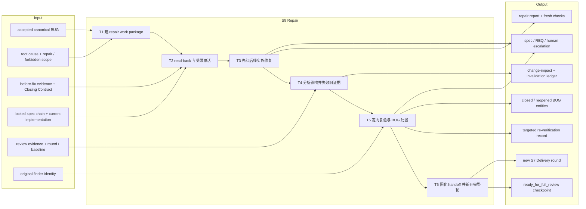
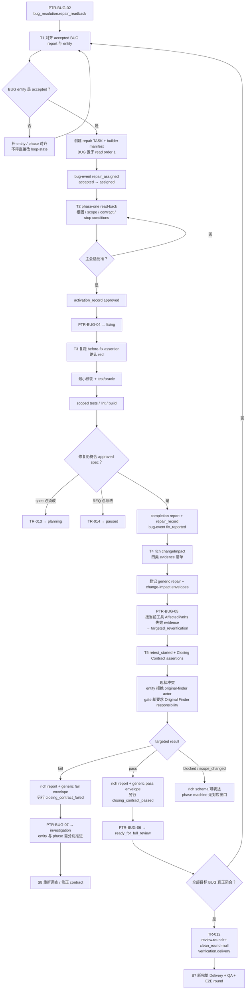

# L3-S9 — 修复（Repair）

> 层：第三层 ｜ 上游：L2 §S9 ｜ 前置：S8 已通过 PTR-BUG-02 进入 `bug_resolution.repair_readback` ｜ 下游：TR-012 回到 S7 新完整轮，或 TR-013 回 planning、TR-014/GTR-004 进入 paused
>
> 阅读顺序：§1～§3 先回答“为什么修好代码仍不等于恢复可信度、S9 怎样从 accepted BUG 收敛到完整轮入口”；§4 再映射修复任务、两阶段激活、证据失效、定向复验、BUG entity 与 phase；§5～§8 审计职责、当前真实强制力、出口和易错点。S6～S11 尚未完成机制优化，本文会如实区分目标设计、文本方法与现有代码能力。

## 1. 第一层：S9 的立意与目标

### 1.1 为什么需要 S9

S8 解决的是“什么问题值得修、根因和边界是什么”，S9 解决的是“如何在不扩大授权面的前提下消除这个根因，并重建被改动污染的可信度”。因此 S9 不是普通的补丁阶段，也不是“测试绿了就回交”的同义词。

一次修复必须同时完成四件事：

1. 把 accepted canonical BUG 转成边界明确的 repair assignment，Builder 只读写该 BUG 所需范围；
2. 用 Closing Contract 先证明旧反例存在，再实施最小修复并留下可复算的完成报告；
3. 识别本次改动使哪些历史 PASS 失效，不能让旧证据继续替新实现背书；
4. 对该 BUG 做定向复验并形成可恢复检查点，然后回到 S7 从 Delivery 开始完整重跑。

所以 S9 的完成定义不是“diff 已落地”，也不是“targeted re-verification PASS”，而是：**修复、影响账、定向复验和 BUG 状态彼此一致，并且只通过 TR-012 进入一个新的完整 review round。**

### 1.2 阶段目标与完成定义

| 项目 | 定义 |
|:--|:--|
| 输入 | S8 accepted canonical BUG；root cause、repair/forbidden scope、before-fix evidence、Closing Contract、original finder；当前 TASK/contract/REQ/design/rules 指纹链；现有实现与 review evidence |
| 要搞清楚 | 谁被授权修哪个 BUG；最小改动是什么；实际改了哪些 artifact；哪些历史 evidence 被污染；谁、按哪些断言做定向复验；何时必须回 S8/planning/paused |
| 核心工作 | 建 repair work package → phase-one read-back 与批准 → BUG-scoped activation → 先红后绿修复 → change impact 与证据失效 → 定向复验 → 新完整轮 handoff |
| 输出 | repair TASK/manifest/activation；fix/completion report；changeImpact；invalidated evidence ledger；targetedReverification；BUG entity events；`ready_for_full_review` checkpoint |
| 目标完成 | 每个 accepted BUG 都已被修复或显式升级；实际 changed paths 与 impact 一致；受影响旧 PASS 已失效；Closing Contract 逐项复验；BUG/phase/evidence 三账对齐 |
| 下一阶段 | targeted PASS 批次 → PTR-BUG-06 → `ready_for_full_review` → TR-012 → S7 `verification.delivery`；spec change → TR-013；REQ change → TR-014；超限目标为 GTR-004 paused |

### 1.3 Overview：输入、主步骤与输出



### 1.4 S9 的边界与当前保证

- **S9 的 phase 边界**：`repair_readback`、`fixing`、`targeted_reverification`、`ready_for_full_review`；S8 的 `investigation/bug_report_review` 不属于 S9；
- **不负责**：重新发明需求、在 finding 未被 accepted 前修代码、用定向复验代替 S7 全轮、直接修改 locked REQ；
- **三套状态并存**：top-level phase、每个 BUG entity state、repair/impact/reverification evidence 由不同入口更新，当前没有事务把它们自动同步；
- **两阶段激活只有部分机器承载**：phase gate 能要求一条 activation envelope，但不会枚举所有 repair Builders，也不会解析 read-back、BUG scope 或 Closing Contract；普通写操作在 phase one 仍主要靠主会话纪律与事后 scope 检查；
- **影响失效已存在 action，但输入错位**：PTR-BUG-05 确实先调用 `invalidate_affected_evidence`，但它读取的是触发该迁移的当前工具调用 `AffectedPaths`，并不消费 rich `changeImpact` 中的 changed artifacts；
- **定向复验有结构化 schema，但 phase gate 不读其断言**：gate 只认一条通用 envelope 的 kind/responsibility/conclusion/round；
- **当前存在身份语义冲突**：phase gate 要求 producer responsibility=`Original Finder`，BUG lifecycle 的 `original_finder_assigned` 和关闭检查却拒绝 `actor_agent_id` 出现在 `original_finder_agent_ids`；
- **TR-012 确实会 `review.round++`、清空 `clean_round` 并回到 Delivery**，但不会清除旧 evidence；S7 当前的同轮扫描会把旧轮 evidence 也当作错误，因此新轮仍可能被历史记录卡住。

## 2. 第二层：S9 的任务分解

| 任务 | 要解决的问题 | 主要动作 | 阶段产出 |
|:--|:--|:--|:--|
| T1 建 repair work package | accepted BUG 如何变成可执行且最小授权的工作单元 | 核对 BUG entity/report；创建 repair TASK、manifest、assignment；把 BUG 放在读序首位；记录 `repair_assigned` | BUG→TASK→Builder mapping、repair scope、manifest |
| T2 read-back 与受限激活 | Builder 是否理解根因、Closing Contract、禁区和停止条件 | 按 BUG→TASK→contracts→REQ→design/rules 读回；主会话批准；登记 activation；PTR-BUG-04 进 fixing | approved read-back、activation envelope、phase checkpoint |
| T3 先红后绿实施修复 | 如何证明修的是根因而不是掩盖症状 | 复跑 before-fix assertion；最小改动；补缺失 oracle；执行 scoped tests/checks；生成 completion/repair report；`fix_reported` | changed paths、fresh checks、fix ref、repair report |
| T4 影响分析与证据失效 | 哪些旧 PASS 已不能代表当前实现 | 对 changed artifacts 做 change matrix；形成 invalidated/superseded/retained/reverify 清单；登记通用 envelope；PTR-BUG-05 执行失效 action | rich changeImpact、generic gate evidence、runtime invalidation records |
| T5 定向复验与 BUG 处置 | Closing Contract 是否逐项成立；复验是否独立且未越界 | 逐 assertion 复验；记录 scope compliance；pass/fail/blocked/scope_changed；推进 BUG entity 和 phase | targetedReverification、retest evidence、closed/reopened BUG |
| T6 handoff 与新完整轮 | 怎样证明定向 PASS 没有被误当 clean round | 汇总全部 BUG；PTR-BUG-06 固化 `ready_for_full_review`；TR-012 开新 round 并回 Delivery | durable handoff、新 review round、S7 输入 |

T1～T5 应按 canonical BUG 逐项闭合；phase transition 却是批次共享的。因此在触发 PTR-BUG-04/05/06 或 TR-012 前，主会话必须先做 batch ledger，不能把“一条满足 gate 的 envelope”误当成“所有 BUG 已完成”。

## 3. 从 accepted BUG 到新完整轮的工作流



这张图同时展示了目标工作流和当前断点。`bug-event` 与 PTR/TR 必须各自发生；一边成功不会自动补另一边。rich report 与 quality-gate envelope 也必须分别处理，因为当前没有 adapter 把前者转换成后者。

## 4. 第三层：每项任务如何被引导和承载

### 4.1 T1 — repair work package、BUG 映射与实体派修

repair assignment 应从 canonical BUG 开始，而不是从最近改动文件开始。`docs/tasks/TASK-template.md` 明确要求修复任务把 BUG 前插为 Document Manifest order 1，之后才读 TASK、contracts、REQ、design/rules。最小工作包应写清：

- canonical BUG ID/path 与 current fingerprint；
- source findings、root cause 和 violated clauses；
- repair scope、prospective write paths、forbidden paths、allowed command classes；
- before-fix evidence、Closing Contract assertions 与 expected outputs；
- original finder/assignment、required Skills、stop/escalation conditions；
- completion report、impact record、targeted re-verification 的预期路径。

目标上，一个 repair TASK 对应一个可单上下文完成的根因单元；多个 BUG 只有在 repair boundary、改动机制与 Closing Contract 真正兼容时才共享 assignment。

当前 runtime 有三类互不充分的锚：TASK/manifest/agent entities、BUG entity 上的 `repair_task_id`/`repair_builder_agent_id`、Markdown/rich BUG 内容。`runtime bug-event --event repair_assigned` 只检查两个 param 是非空字符串，不验证 TASK 或 Agent 存在、状态正确、属于该 workgroup，也不读取 repair scope。`runtime register-workgroup` 复用 S6 的 Builder 机制，但仍继承 S6 已记录的缺口：manifest 的责任完整性、真实 write scope 与 agent/task 生命周期没有端到端绑定。

因此 T1 必须显式产出 BUG→repair TASK→assignment→Builder ledger。只看到 BUG entity 处于 `assigned`，不能推出工作包真实存在或边界正确。

### 4.2 T2 — phase-one read-back 与 BUG-scoped activation

`two-phase-activation` 给出的修复读序是：

```text
BUG → TASK → contracts → REQ → design/UI → rules
```

read-back 至少要回答：对根因的理解、每条 Closing Contract 如何先红后绿、预计 changed paths、禁止触碰什么、需要哪些命令/工具、何种现象必须停止并升级。主会话应把回复与当前文档 fingerprint 对齐，再批准 phase two。

当前 PTR-BUG-04 的机器门只有：

- 一条 `activation_record`；
- producer responsibility=`Orchestrator`；
- conclusion=`approved`；
- transition guards `repair_understanding_approved`、`repair_activation_recorded`。

后两个 guards 是 evidence-backed attestation，不解析 read-back，也不枚举本批所有 repair Builders。`record_repair_activation` action 只确认 transition evidence map 非空。activation envelope 也没有与某个 BUG/TASK/Agent 的结构化全链校验。

更重要的是，Skill 对“phase one 不写”的约束主要依赖主会话不批准与工作纪律：Hook 在 evidence 不足时给 `not_ready` 指引，但普通工具调用并不会因此全部硬拒绝。所谓动态 scope 是 Agent Definition、manifest、TASK、activation、runtime phase 与 policy 的概念性交集；当前并没有一个统一判定器证明每次文件写入都属于该 BUG。

### 4.3 T3 — 先红后绿、最小修复与修复报告

修复执行应保留一条可审计因果链：

1. 对 Closing Contract 的旧矛盾运行最小断言，保存 red/before-fix evidence；
2. 只修改 root cause 所需路径；若发现 scope 不足，停止并回主会话，不自行扩权；
3. 补上原有测试没有拦住该问题的 oracle 或 fidelity 缺口；
4. 运行与 changed path、受影响 contract/module、数据迁移和风险类型匹配的 checks；
5. completion report 明列 changed paths、commands/results、evidence IDs、scope deviations、残余风险；
6. 用 BUG event `fix_reported` 记录 fix ref，并形成 repair evidence。

当前 BUG lifecycle 对 `fix_reported` 只要求 `fix_ref` 非空，然后把字符串写入 entity；不验证路径存在、内容指纹、tests、Closing Contract 或 changed paths。PTR-BUG-05 的 `GATE-REPAIR-BATCH-REPORTED` 只要求最少一条：

- `repair_record`，Builder 或 `BUILD-WORK-PACKAGE`，conclusion=`reported`；
- `change_impact_record`，Builder 或 `BUILD-WORK-PACKAGE`，conclusion=`recorded`。

`repair_reports_complete` 是 attestation stub；phase gate 不按 accepted BUG 数量、repair assignment 或 check result 枚举。因此一条 repair envelope 就可能把共享 phase 推到 targeted re-verification，其他 BUG 仍可停在 accepted/assigned/fixing。

另外，`runtime evidence add` 登记的是 gate 可消费的通用 envelope 与其文件指纹，不会替 rich repair/completion report 做领域 schema 校验。报告内容和 gate 声明必须由主会话另行对齐。

### 4.4 T4 — change impact 与真正发生的证据失效

目标语义是先根据实际改动形成一张影响账：

| 分类 | 含义 |
|:--|:--|
| invalidated | 旧证据引用了已改变的行为/文件，不能继续作为 PASS |
| superseded | 有 fresh replacement，旧证据保留历史但不再代表当前事实 |
| retained | 已检查与改动无关，可说明为什么保留 |
| required re-verification | 必须在 targeted 或下一完整轮重跑的断言/维度 |

`review-evidence.schema.json#changeImpact` 能表达 source BUGs、十类 change type、changed artifacts、decisions、四档 escalation 和上述四类 evidence IDs。这是有用的引导性产物，但当前失效 action **不读取它**。

PTR-BUG-05 的实际路径是：

1. Controller 从触发迁移的**当前 PreToolUse 请求**取得 `AffectedPaths`；Edit/Write 可从 path 推导，Bash 若解析不到路径则为空；
2. transition 把这组路径传给 `invalidate_affected_evidence`；
3. `ComputeImpact` 遍历 runtime evidence：REQ 路径使同 generation 全部命中；其他路径只按 evidence `scope_refs` 与 changed path 的祖先/子孙重叠判断；
4. action 排除本次 transition 自己绑定的 evidence IDs，把其他命中项标记 `invalid`，写 `invalidated_by`、rule、reason；
5. 空 paths 或无重叠时以 `committed` 返回，不阻止 phase 前进。

这里有五个关键现状：

- `AffectedPaths` 不是“整个 repair 的累计 changed paths”，而是恰好触发 PTR-BUG-05 的那次工具调用路径；它可能与修复 diff 无关；
- rich changeImpact 即使列全 changed artifacts，也不会修正这组输入；
- evidence 若没有正确 `scope_refs`，非 REQ 改动通常无法命中；
- 实现注释声称 BUG path 只影响 targeted evidence、source path 只影响若干 review kind，但 `matchChange` 实际没有按 evidence kind 过滤，只做 path overlap；
- action 只做 invalidation，不验证 rich record 所列 invalidated/retained/reverify IDs 与运行结果一致。

因此“PTR-BUG-05 已执行”目前只能证明失效函数被调用，不能证明修复污染的全部旧 PASS 已被正确失效。T4 必须由主会话对比 `git diff/changed paths`、rich impact、runtime invalidation 结果和 replacement plan，发现空/错漏就停止进入 targeted phase，而不是相信 gate 已闭合。

### 4.5 T5 — targeted re-verification、身份连续性与双状态链

目标上的 targeted re-verification 应由最了解原反例、且没有实施修复的人，对每个 BUG 的 Closing Contract 逐项复验。它至少验证：

- 原始 reproduction 已从 red 变 green；
- 每条 assertion 有 fresh evidence，而不是复用 Builder 自报；
- coverage gap 对应的新 oracle 会在回退补丁后再次变红；
- repair changed paths 没有越出批准 scope；
- impact 中标记 required re-verification 的项目均有结果；
- 只得出“该 BUG 的定向断言通过”，不宣称整轮 clean。

rich `targetedReverification` schema 需要 BUG ID、original/performing assignment、continuity reason、impact ID、逐 assertion results、scope compliance 和 result；result 可为 `pass/fail/blocked/scope_changed`，且 `pass` 会强制 scope 与所有 assertion 都是 pass。

但 phase gate 消费的是另一种通用 envelope：

| 路径 | 当前检查 | 没有检查 |
|:--|:--|:--|
| PTR-BUG-06 | 当前 round 一条 `targeted_reverification_record`；responsibility=`Original Finder`；conclusion=`pass` | BUG ID、真实 finder agent、逐 assertion、scope compliance、impact ID、所有 BUG 数量 |
| PTR-BUG-07 | 同 kind/responsibility/current round；conclusion=`fail` | failure assertions、对应 BUG entity、attempt/contract counters |
| BUG `retest_started` | `actor_agent_id` 非空，且当前代码要求 actor **不在** `original_finder_agent_ids` | phase、assignment、evidence、责任字段 |
| BUG `closing_contract_passed` | `reverification_evidence` 和 `actor_agent_id` 非空；actor 仍必须不在 finder IDs | 引用存在/内容/pass、gate envelope、rich report |
| BUG `closing_contract_failed` | `failure_evidence` 非空 | phase PTR-BUG-07、内容、same-contract 自增 |

这不是“双保险”，而是语义冲突：通用 envelope 可以把 responsibility 写成 `Original Finder`，但 gate 不把 producer agent 映射到 BUG finder IDs；真正的 finder agent 若作为 entity actor，反而会被拒绝。当前可出现“非 finder 以 `Original Finder` 责任标签产出 PASS 并关闭 BUG”的形式满足，也可出现“真实 finder 完成复验却无法推进 entity”。在修复该实现前，文档必须明确记录此冲突，不能声称 original-finder continuity 已被机器证明。

phase 与 BUG entity 也不联动：PTR-BUG-06 可把 phase 推到 ready，而 BUG 仍在 retesting；先 close entity 也不保证 phase 有 PASS envelope。失败时 PTR-BUG-07 与 `closing_contract_failed` 同样要分别执行。`blocked/scope_changed` 虽可写入 rich report，却没有对应 quality gate 或 phase transition，当前会停在 targeted_reverification，需主会话显式选择调查、spec 或 REQ 路由并保留原因。

### 4.6 T6 — `ready_for_full_review`、TR-012 与新轮完整性

`ready_for_full_review` 的正确含义是“repair phase 已结束，只能交给新完整轮”，不是 clean round，也不是 release-ready。TR-012 有真实 `from_phase` 检查；成功后：

- top-level state 从 `bug_resolution` 进入 `verification`；
- `review.round` 加一；
- `review.clean_round` 置 `null`；
- verification phase 设为 `delivery`。

这条结构确实阻止了从 targeted PASS 直接进入 S10。但其出口完整性仍低于目标：

- `GATE-TARGETED-REVERIFICATION-COMPLETE` 只需当前轮一条 targeted PASS 和任意一条 change-impact recorded；后者不要求当前 round；
- `bug_phase_ready_for_full_review` 是 attestation stub；
- 真 guard `all_targeted_reverification_passed` 只扫描 severity=`P0`，并仅阻止 `investigating/pending_approval/accepted/assigned/fixing/retesting`；P1～P3 全部忽略，P0 `draft` 也不会阻止；
- guard 不读取 targeted evidence，不验证 close transition、original finder、Closing Contract 或 batch mapping；
- `start_review_round` 只加 round、清 clean_round，不 invalid/supersede/归档旧 evidence。

最后一点会与 S7 当前 clean-round 实现发生冲突：S7 的 same-round 规则会因看到旧轮 evidence 而报错，即使它已 invalid。故 TR-012 的“新轮”状态推进是真的，但“新轮可以干净重算”在现实现状下仍可能失败。

### 4.7 规格、REQ 与 repair-limit 分流

修复中发现“按当前 specification 无法安全修”时，不能扩大 BUG scope 掩盖层级问题：

| 情况 | 目标路由 | 当前真实机制 |
|:--|:--|:--|
| design/contract/TASK 错，locked REQ 不变 | TR-013 `repair_spec_change_required` → planning | 需 change-impact + repair envelopes；`req_baseline_unchanged` 是 stub；失效仍依赖当前工具 AffectedPaths |
| locked REQ 必须改变 | TR-014 `repair_req_change_required` → paused | 需 repair requested event + pause envelope，transition 生成 checkpoint；不自动修改 REQ |
| targeted fail、同一根因仍成立 | PTR-BUG-07 + BUG failed event → S8 investigation | 两条状态链需分别推进；进入 investigating 时 `attempt_count` 增加 |
| attempt 达阈值 | 目标为 typed `RepairLimitError` → adapter → GTR-004 paused | 生产 BUG lifecycle 使用另一套普通 error 检查，没有调用 typed helper/adapter；无法自动 pause |
| same Closing Contract 连续失败 | 目标为达到 `max_same_contract_failures` 后暂停重审 contract | `same_contract_failure_count` 没有任何自增写路径，当前阈值基本不会生效 |

此外两套 attempt 边界语义不同：BUG lifecycle 在“下一次 attempt 将大于 max”时才拒绝；独立 `CheckRepairLimit` 在当前 attempt `>= max` 时返回 typed error。即使未来接线，也必须先统一阈值含义。

## 5. 职责分布与覆盖审计

### 5.1 职能落点

| 职能 | 主责 | 承载位置 | 当前消费者 |
|:--|:--|:--|:--|
| accepted BUG 边界 | S8 Investigator + Orchestrator approval | BUG Markdown/rich record/runtime entity | repair Builder、主会话 |
| repair work package | Orchestrator/Planner | repair TASK + team manifest + assignment | Builder、activation review |
| read-back 与 activation | Builder 提交，Orchestrator 批准 | agent messages + activation envelope | PTR-BUG-04 |
| 最小修复与 scoped checks | repair Builder | code/tests/completion report/fix ref | PTR-BUG-05、targeted verifier |
| change-impact 判断 | Builder 提供事实，Orchestrator 复核 | rich changeImpact + generic envelope | 人工 ledger；PTR-BUG-05 只消费 envelope，action 不消费 rich 内容 |
| evidence invalidation | transition action | runtime evidence status/invalidated_by | S7 clean-round 与审计 |
| targeted re-verification | 原 finding responsibility 或独立 verifier | rich report + generic envelope | PTR-BUG-06/07、BUG close event |
| BUG entity lifecycle | Orchestrator 通过 `runtime bug-event` | entities.bugs[] | TR-012 semantic guard、repair counters |
| phase 与新轮 | Controller/transition engine | lifecycle + review.round/clean_round | S7 |
| spec/REQ/超限裁决 | Orchestrator/Human | TR-013/014/GTR-004、pause checkpoint | planning 或 S11 human gateway |

### 5.2 应有的分工与重叠控制

- S8 冻结问题模型，S9 Builder 不重新解释 accepted behavior；若根因/contract 错，回调查或 planning；
- Builder 提供 changed paths 和测试事实，但“哪些旧 PASS 仍可信”需要独立 impact review，不能由自报结论独占；
- targeted verifier 不修改修复代码；一旦需要改代码，应结束复验并回修复链；
- original finder continuity 的目标是复用发现上下文，不是让身份标签替代 assertion evidence；
- BUG entity 记录逐缺陷事实，phase 记录批次进度，generic envelope 服务质量门；三者可以分工，但必须有明确 reconciliation，不应让任一单独冒充另外两套事实；
- targeted PASS 只关闭局部 contract；Delivery/QA/E2E 新轮负责重新判断系统整体，因此两者有意重叠在风险区域，但结论层级不同。

### 5.3 如实现状与未闭合缺口

1. **repair assignment 只做字符串关联**：`repair_task_id`、`repair_builder_agent_id` 不验实体、状态或相互归属；
2. **BUG scope 没有统一硬校验**：模板/activation 可声明边界，但每次写入不与 canonical BUG scope 做端到端比对；
3. **phase-one no-write 不是普遍硬阻断**：主要靠主会话不批准和过程纪律；
4. **PTR-BUG-04 只认一条 activation**：不枚举所有 repair Builders/BUGs，read-back guards 不解析内容；
5. **BUG `fix_reported` 只验非空 ref**：不验路径、指纹、checks 或 contract；
6. **PTR-BUG-05 不检查 repair batch 完整**：一条 repair + 一条 impact envelope 即可推进共享 phase；
7. **rich reports 与 gate envelopes 分裂**：completion/changeImpact/targeted schema 不会自动转换或被 gate 内容校验；
8. **失效读取错误时间窗**：使用触发迁移的当前工具 `AffectedPaths`，不是整个 repair diff；
9. **rich changeImpact 不驱动 action**：changed artifacts 和四类 evidence 清单可与 runtime 实际失效完全不一致；
10. **空/错 AffectedPaths 静默成功**：无 impact 时 action 返回 committed，phase 仍可前进；
11. **scope_refs 缺失导致漏失效**：除 REQ 同代际规则外，影响匹配依赖 evidence 自报 scope；
12. **实现与 impact 注释不一致**：BUG/source change 没有按声称的 evidence kind 收窄，可能过度失效；
13. **targeted gate 不读逐 assertion**：一条通用 PASS envelope 可绕过 rich report 的 scope/assertion 约束；
14. **Original Finder 语义相反**：phase gate 要该责任，entity actor 检查却拒绝 finder ID；两者也没有 agent-to-responsibility 映射；
15. **BUG entity 与 phase 不同步**：close/reopen 与 PTR-BUG-06/07 可各自成功，留下互相矛盾状态；
16. **`blocked/scope_changed` 无 phase route**：schema 可写、状态机不可走；
17. **PTR-BUG-06 与 TR-012 都是单证据门**：不按 BUG、assignment 或 Closing Contract 枚举；
18. **TR-012 semantic guard 只管部分 P0 states**：忽略 P1～P3 和 P0 draft，也不验证 evidence；
19. **新轮不清旧 evidence**：会触发 S7 已记录的 same-round 历史 evidence 污染；
20. **repair-limit 自动桥未接通**：普通错误、typed helper 与 adapter 是三段未串联路径；
21. **same-contract counter 是死字段**：failed retest 不自增；
22. **两套 attempt 阈值不一致**：一套在 `> max` 拒绝，另一套在 `>= max` 报 typed error；
23. **TR-013 的 REQ 不变 guard 是 stub**：spec/REQ 分层仍依赖人工判断；
24. **批次共享 phase 无 partition**：多个 BUG 不同进度或不同 route 时，一条 phase cursor 难以忠实表达。

### 5.4 关键取舍

| 问题 | 设计选择 | 原因与当前代价 |
|:--|:--|:--|
| finding 是否可直接修 | 只修 accepted canonical BUG | 保持授权边界；依赖 S8 输出质量 |
| repair 是否复用 S6 Builder 机制 | 复用两阶段 activation，但按 BUG 收窄 scope | 避免双套组织模型；当前收窄未完全硬化 |
| 何时失效 evidence | 修复报告完成、进入 targeted 前，由 PTR-BUG-05 action 执行 | 顺序正确；输入却是当前工具 paths，不是 repair diff |
| targeted 谁执行 | 目标为原 finding responsibility 的独立执行者 | 保留发现上下文；当前 finder identity 实现与 gate 互相冲突 |
| targeted PASS 后去哪里 | 只能经 ready checkpoint 回 S7 新完整轮 | 防局部 PASS 冒充系统结论；旧 evidence 清理仍有实现缺口 |
| 规格漂移怎么处理 | spec 回 planning，REQ 交 human | 不让 Builder扩权；当前 route guards 与 impact 较弱 |
| 重试耗尽 | pause 而非无限振荡 | 方向正确；生产桥和 counter 尚未闭合 |

## 6. L1 准则如何嵌入 S9

| L1 准则 | S9 中的实际落点 |
|:--|:--|
| D1 权威外置 | repair TASK、BUG entity、reports、impact、evidence validity、phase/journal 落盘；多载体未同步削弱单一权威 |
| D2 自然路径观测 | PreToolUse 自动评估 PTR/TR，实际写路径可进入 Controller；但只捕获当前调用，未形成完整 repair change set |
| D3 门是顾问 | 缺 activation/repair/impact/retest envelope 会给 missing；无法指出具体哪个 BUG/assertion/changed path 缺失 |
| D4 引导性产物 | BUG 首读、Closing Contract、changeImpact 四清单、targeted assertion results 迫使显式思考边界与可信度 |
| D5 三级强制 | Skill/模板引导；rich schema 约束形状；phase/entity/gate 控路由——内容消费和三账一致性仍弱 |
| D6 三方收敛 | Builder 实施，原 finding responsibility/独立 verifier 复验，Orchestrator 裁决；REQ 改动交 Human |
| D7 收敛可观测 | BUG attempts、phase revisions、invalidated evidence、review round 可显示回路；死 counter 和未接 pause bridge 会制造假收敛 |
| 公理一 原型 | 对应现实中的 defect repair、change-impact analysis、evidence invalidation、targeted retest 与 full regression |
| 公理二 分工 | 根因批准、修复、自证 checks、独立复验、新轮审查分开；当前身份检查方向错误 |
| 公理三 消费 | Closing Contract 供 Builder/retester，impact 应供 invalidator，新轮消费 fresh evidence；当前 rich impact/targeted 内容未被 gate 消费 |
| 公理四 成本 | 先做 BUG 定向修复和复验，再用完整轮覆盖系统风险；不要求每次小改立刻重跑所有内容 |
| 公理五 传达 | `reported/recorded/pass/fail/blocked/scope_changed/ready` 各有不同语义；不能用一个 PASS 省略 impact、entity close 或 full review |

## 7. 产出、出口门槛与失败路由

### 7.1 正式产出

- 每个 accepted BUG 的 repair TASK、manifest、assignment、Builder mapping 与批准 activation；
- approved read-back、当前文档 fingerprints、repair/forbidden scope 和 stop conditions；
- before-fix red evidence、最小修复 diff、fresh tests/checks、completion/repair report 与 BUG fix ref；
- rich changeImpact、实际 changed paths、invalidated/superseded/retained/reverify ledger、runtime evidence status changes；
- 每个 BUG 的 rich targetedReverification、generic gate envelope、entity retest/close/fail events；
- unresolved blocked/scope-changed/spec/REQ/limit escalation records；
- `ready_for_full_review` checkpoint 与 TR-012 后的新 review round。

### 7.2 目标出口判定与当前机器地板

| 维度 | 目标判定 | 当前机器实际检查 |
|:--|:--|:--|
| Repair assignment | 每个 accepted BUG 有存在且状态正确的 TASK/Builder/manifest，scope 来自 approved BUG | bug-event 只验两个字符串非空；phase 不枚举 |
| Activation | 每个 repair Builder 已读当前指纹链、理解 contract、获得不扩大的 phase-two scope | 一条 Orchestrator/approved activation envelope；guards 不解析 read-back |
| Repair complete | 每个 BUG 先红后绿，changed paths 在 scope 内，必需 checks PASS | 一条 repair/reported envelope；fix ref 只验非空 |
| Impact complete | rich changed artifacts 等于真实 diff；所有受污染 PASS 被失效；保留项有理由 | 一条 impact/recorded envelope；action 只用当前 tool AffectedPaths 与 evidence scope_refs |
| Targeted PASS | 每个 BUG 的每条 Closing Contract assertion PASS，scope compliant，执行者身份/责任正确 | 当前 round 一条 Original Finder/pass envelope；不读 rich report或 BUG ID |
| BUG closure | 所有目标 BUG entity 与 targeted outcome 对齐；非阻断也有 disposition | TR-012 guard 只阻止部分 P0 states；entity close 另走命令且身份规则冲突 |
| Full-review handoff | 只从 ready checkpoint 开新 round，旧证据不污染新轮 | from_phase、round++、clean_round=null、delivery 真强制；旧 evidence 不清理 |
| Retry safety | 达 attempt/same-contract limit 自动 paused | 普通检查、typed helper、adapter 未接；same-contract 不计数 |

### 7.3 失败路由

| 情况 | 去向 |
|:--|:--|
| repair work package/read-back/activation 不完整 | 留 `repair_readback`，补真实映射与批准；不要用单条 activation 替整批 |
| before-fix assertion 不会红 | 回 S8 检查根因、reproduction 或 Closing Contract；不得继续盲修 |
| 修复需要超出 approved scope，但规格仍正确 | 停止并让主会话重做 repair assignment/activation；不要自行扩权 |
| design/contract/TASK 必须改，REQ 不变 | TR-013 → planning；重新走 S2～S5 并重算影响 |
| locked REQ 必须改 | TR-014 → paused → human amendment |
| impact 与真实 diff/失效结果不一致 | 留 fixing/阻止 handoff；当前 machine 不会替你发现，需显式 reconciliation |
| targeted fail | BUG `closing_contract_failed` + PTR-BUG-07 → S8 investigation；两条链都要对齐 |
| targeted blocked/scope_changed | 当前无直接 phase route；保留 rich evidence，由主会话选择调查、spec、REQ 或 human route |
| attempt/contract limit 达到 | 目标 GTR-004 paused；当前自动桥未接通，必须保留现场并人工升级，不能无限重试 |
| targeted PASS 但仍有未闭合 BUG | 留 S9，补逐 BUG ledger；不得让单条 gate evidence 触发 TR-012 |
| TR-012 后新轮被旧 evidence 卡住 | 按 S7 的历史 evidence 污染缺口处理；不能复用旧 PASS 或伪造 clean-round |

## 8. 易错点与渐进披露

### 8.1 易错点

1. 把 accepted BUG 直接发给 Builder，不建 repair TASK/manifest/activation；
2. 沿普通 TASK→contract→REQ 读序，漏读首位 canonical BUG 与 Closing Contract；
3. 看到 `repair_assigned` 就相信 TASK/Agent 存在；当前只校验非空字符串；
4. 把 phase-one `not_ready` 当作所有写操作已被硬拒绝；当前不是普遍写权限墙；
5. 只留 green test，不保存 before-fix red evidence；这样无法证明修复与反例有因果关系；
6. `fix_ref` 非空就认为 machine 已验证补丁和 tests；BUG lifecycle 不读内容；
7. 把 rich changeImpact 的 changed artifacts 当作失效 action 输入；当前 action 完全不消费它；
8. 在登记 evidence 后随便执行一个工具调用，误以为 PTR-BUG-05 会拿到整个 repair diff；它只拿该触发调用的 paths；
9. AffectedPaths 为空仍继续；当前 action 会静默 committed 且 phase 可前进；
10. evidence 不填 `scope_refs`，却期待非 REQ 改动能被 impact matcher 命中；
11. 把通用 targeted PASS envelope 当成 rich assertion report；gate 不核 BUG ID、scope compliance 或逐项结果；
12. 声称“原 finder 已被机器强制复验”；当前 phase 责任标签与 entity 身份规则互相冲突；
13. 只推进 PTR-BUG-06、不关闭 entity，或只 close entity、不推进 phase；两套链不会互补；
14. 用 rich `blocked/scope_changed` 期待自动回 S8；Loop Definition 没有对应 phase transition；
15. 一个 P0 targeted PASS 就触发 TR-012，忽略其他 P0 draft 或全部 P1～P3；当前 guard 可能放行；
16. 把 `ready_for_full_review` 当 clean round；它只是 S9→S7 的 durable checkpoint；
17. 认为 `review.round++` 会自动清理旧 evidence；action 只清 `clean_round`；
18. 相信 repair limit 已自动 pause；生产调用链和 same-contract counter 尚未闭合；
19. 修复中发现 spec/REQ 问题仍继续扩改代码；正确动作是 TR-013/014 分层升级；
20. 为绕过当前机制缺口直接编辑 `.claude/loop-state.json`；所有状态变化仍应走受控 runtime/transition 入口并记录缺口。

### 8.2 阅读预算

- **只想理解 S9 主线**：读 §1.1～§1.3、§2、§3、§7.3；
- **正在实施 repair**：重点读 §4.1～§4.4，再加载 `two-phase-activation`、`impact-analysis`、BUG/TASK 载体与对应风险 Skill；
- **正在做 targeted re-verification**：读 §4.5、§7.2，消费 BUG Closing Contract、before-fix evidence、impact 与 fresh build，不重读 Builder 的实现叙事；
- **正在做主会话 handoff**：读 §4.6～§4.7 和 batch ledger，逐项核对 BUG/phase/evidence 三账；
- **正在维护 harness**：必须读 §5.3，并对照 `assignment/bug_lifecycle.go`、`transition/actions.go`、`impact/analysis.go`、quality-gate registry、Controller `AffectedPaths` 与 repair-limit adapter；
- **S7 下游 reviewer**：只消费新 round、current fingerprints、closed BUG + targeted refs、invalidated/replacement ledger 和残余风险；不得把 S9 targeted PASS 当成本轮 Delivery/QA/E2E evidence。
