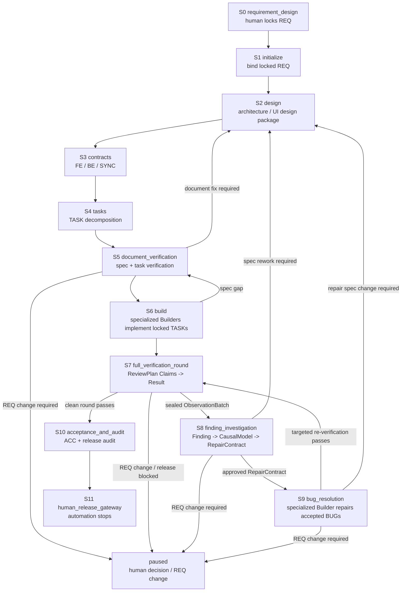

# Agent Protocol — Main Spine

> Authoritative Main Spine. The Main-session Driver (Layer 1) reads the
> current stage's section here on every turn. Each stage has a stable anchor
> (`#s0` through `#s11`) so `AGENTS.md` and Harness `next` output can link to
> it. Runtime authority for current facts lives in `.claude/loop-state.json`;
> legal transitions live in `docs/loop-definition.json`.

## How to read this file

1. A `SessionStart` or lifecycle Hook `systemMessage` is the first recovery
   packet. It contains the current Stage, the single Next action, the ordered
   read list, and stable links to this file and the Harness Manual. Treat it as
   a scheduling instruction, not as an audit notice.
2. Follow the packet's `Read in order` list: the project entry document
   (`AGENTS.md`), Runtime/Milestone, this current stage anchor, the bound REQ,
   and the one primary Skill. After compaction, do not reconstruct the stage
   from conversation memory.
3. If the packet says `blocked` or the Runtime is unclear, read
   `.claude/bin/loop-harness.md`. A Quality Gate that is merely `not_ready`
   returns safety `allow`; use its Recovery Packet to produce the listed
   missing work. Use the CLI only for initialization/binding, Runtime reconcile
   after an integrity failure, rollback/rollover, a human Gateway, or
   diagnostics (`loop-harness ready` for the live gate checklist); normal
   continuation uses the Hook packet and Milestone. Never use `ready` (or
   any CLI) to hand-push a Transition.
4. Each section has the same shape:
   - `purpose`: why this stage exists
   - `inputs`: what to read before acting
   - `inputs_from`: which upstream stages produce the inputs (explicit data-flow chain)
   - `actions`: ordered work to perform
   - `done_when`: predicates that prove the stage is complete
   - `next`: the default next stage on success
   - `failure_route`: where to go when something is wrong
   - `human_gateway`: conditions that may surface a Gateway
   - `primary_skill`: the main Methodology Skill for this stage

5. Stage advance is allowed only when every `done_when` predicate is true.
   When a predicate is false, produce the most-forward missing deliverable or
   evidence; the next `PreToolUse` invokes the Controller to re-evaluate and,
   if satisfied, auto-advance at most one allowlisted Transition. Do not wait
   for or manually invoke a transition.

> **Design-status note:** this file is the short Main-Spine index. L4 and the
> current L3 blueprints define the target dispatch/verification behavior;
> `docs/loop-definition.json`, existing CLI events, and legacy stage details
> remain compatibility implementation until the next migration pass. Do not
> infer that a target schema or Hook behavior already exists merely because it
> is described here or in a blueprint.

## Event-driven recovery contract

The lifecycle is one continuous journey for one bound REQ. Hook events are
re-entry points into that journey:

| Event | Controller responsibility | Agent responsibility |
|:---|:---|:---|
| `SessionStart` | Reconcile Runtime, refresh `milestone`, emit the full current guidance and ordered read list | Read in the listed order and drive the single `Next` action; no normal CLI call |
| `PreCompact` | Persist the latest resumable checkpoint and emit the compact handoff | Leave the next session a recoverable Runtime; the next `SessionStart` re-seats it |
| `SubagentStart` | Resolve Assignment、真实 topology、dispatch mode 和最小上下文；高风险才进入原生 Plan approval | 读取权威输入，按 Assignment 执行；`plan_checkpoint` 不等待第二轮授意 |
| `PostToolUse` `SendMessage` | 捕获 PLAN_REPORT/BLOCKER/COMPLETION，更新 Assignment checkpoint | PLAN_REPORT 通过 SendMessage 发送，不是 final response；发送后继续执行 |
| `SubagentStop` | Result 缺失时，在官方 stop decision 已通过 doctor 时阻止停止；否则保留 checkpoint 并交 scheduler 恢复/重派 | 只有 canonical Result、有效 BLOCKER 或已消费结果才能收口 |
| `TeammateIdle` | 只处理当前 Assignment；官方 continue/block 已通过 doctor 时反馈到同一 teammate，否则保留 checkpoint，不模拟唤醒 | 计划缺失、计划后未完成或 Result 缺失时继续当前责任；不 self-claim 下一项 |
| `PreToolUse` `Task|Agent` | 检查 Assignment、scope、dispatch mode、冲突和平台容量；槽满只排队不裁 coverage | 使用真实 topology；缺少 Assignment 或 scope 时修正派发，不复制长协议 |
| `PreToolUse` safety decision | Emit Quality Gate status, any committed Transition, the final safety decision, and a Recovery Packet | Produce listed missing work when `not_ready`; only a locked-artifact write or squash-merge attempt is hard-blocked |

A Hook is a natural-event trigger and does not itself mutate lifecycle state. It
invokes the Controller, which reads the authoritative Runtime, evaluates the
current Quality Gate, and, when that gate is satisfied, commits at most one
allowlisted Transition through `transition.Apply` using compare-and-swap. The
Controller then refreshes the Milestone and emits the final safety decision plus
a Recovery Packet. The Milestone is a projection of Runtime—not a second state
machine—and `docs/loop-definition.json` plus the Transition Engine remain the
legal lifecycle authority.

On the happy path, the Agent produces the missing deliverable or evidence and
lets the next `PreToolUse` control cycle discover it and auto-advance; the Agent
must not manually call `loop-harness` to advance stages. CLI use is reserved for
initialization/binding, reconcile, rollback/rollover, human Gateway actions, and
optional diagnostics (`ready`). A Quality Gate result of `not_ready` returns safety `allow`, so the original tool
proceeds, and its Recovery Packet lists the missing items. Only locked-artifact
writes and squash-merge attempts receive a hard safety `block`.

There is no separate PostCompact event in the shipped Hook registration.
Therefore `PreCompact` saves the checkpoint and the next `SessionStart`
performs recovery. This pair is the compact recovery protocol.

## Stage list

| ID | Stage | Primary skill | Anchor |
|:---|:---|:---|:---|
| S0 | requirement_design | `requirement-funnel` | `#s0` |
| S1 | initialize | `loop-orchestration` | `#s1` |
| S2 | design | `specification-planning` | `#s2` |
| S3 | contracts | `specification-planning` | `#s3` |
| S4 | tasks | `specification-planning` | `#s4` |
| S5 | document_verification | `document-verification` | `#s5` |
| S6 | build | (TASK plus selected Best Practices) | `#s6` |
| S7 | full_verification_round | L4 dispatch + focus-specific DV/QA/E2E Skills | `#s7` |
| S8 | finding_investigation | `bug-resolution` + L4 plan_checkpoint | `#s8` |
| S9 | bug_resolution | `bug-resolution` | `#s9` |
| S10 | acceptance_and_audit | `acceptance-and-handoff` | `#s10` |
| S11 | human_release_gateway | `acceptance-and-handoff` | `#s11` |

## Stage Flow

The Main Spine is a one-way delivery trunk with explicit correction loops.
S6 and S9 both use specialized Builder capability (`frontend-builder`,
`backend-builder`, or `test-builder`), but they are different stages with
different inputs: S6 builds locked TASKs; S9 repairs accepted BUGs.



## Non-negotiable invariants

These hold across every stage:

1. Chat is not a baseline; decisions land in versioned documents.
2. Engineering Loop binding is independent of Claude `/loop`. Binding requires
   one human-locked REQ; `/loop` only delivers the Wake-up Prompt.
3. UI-impacting work requires module-organized prototypes (HTML + `stories.md`
   + `flows.md` under `docs/design/prototypes/<module>/`) before S3 contract
   lock (see S2). The current implementation IS the baseline; no separate
   capture is required.
4. 每个委派责任都有唯一 Assignment；普通 `plan_checkpoint` 任务在 PLAN_REPORT 后连续执行，高风险任务才需要 `plan_approval_required`。
5. Main Agent 不自执行已委派责任，不因正常计划回复“批准开工”；只有计划偏移、阻塞、权限变化或 Result 消费需要介入。平台会话状态不能用 Runtime 的 `active` 文案伪造唤醒。
6. Blocking findings enter S8 finding investigation before S9 repair.
   Targeted re-verification never produces a clean round; only a same-round
   complete Delivery + QA + E2E Browser pass does.
7. On the normal path, the Agent produces the missing deliverable or evidence;
   the next `PreToolUse` invokes the Controller, which may commit at most one
   allowlisted Transition through the Harness transition engine. The Agent
   never edits `.claude/loop-state.json` or manually invokes transition CLI for
   ordinary stage advancement.
8. Squash merge, publication, deployment, and formal release always require
   human approval.

---

## S0 — requirement_design {#s0}

- **purpose**: produce one human-locked REQ baseline.
- **inputs**: user intent, project facts (`docs/project-map.md`), applicable rules.
- **inputs_from**: [] (human input + existing project baselines; this is the entry stage)
- **actions**:
  1. distill the user's expected outcome into §A — an agent-filtered restatement (ambiguous colloquial wording removed, implicit premises made explicit), confirmed by the human; never record raw quotes
  2. funnel through §A (why) → §B (direction & constraints) → §C (what), one layer at a time; each hand-up is a complete proposal (recommendation + rationale + rejected alternatives) with at most 3 genuine value-decision points for the human
  3. record unknowns, dependencies, and out-of-scope items (§D)
  4. determine UI impact (`none` / `changed` / `unknown`)
  5. obtain human lock and a lock record (date, identity, version)
- **done_when**:
  - REQ file exists at `docs/requirements/REQ-<id>.md` with `status: locked`
  - lock record is present
  - SHA-256 of the locked file is computable
- **next**: S1
- **failure_route**: stay in S0 until locked; if locked but flawed, human amendment only.
- **human_gateway**: any REQ change after lock requires `req_amendment`.
- **primary_skill**: requirement-funnel (the human states the expected outcome and approves layer by layer; the main session owns the design and is accountable for it)

## S1 — initialize {#s1}

- **purpose**: bind one human-locked REQ to a fresh Runtime Bookmark.
- **inputs**: locked REQ, healthy Loop Definition / Hook Policy / Runtime schema, inactive Runtime with no other bound REQ.
- **inputs_from**: [S0 (human-locked REQ + lock record + SHA-256)]
- **actions**:
  1. run `loop-harness req bind --approved-by <human identity>` — it auto-initializes a missing runtime, self-preflights, and discovers the sole bindable REQ when `--req` is omitted (`req list` shows the candidate pool; multiple candidates require an explicit `--req`). The human may equivalently tell the main session to bind, which then executes the command on their behalf — the consent gesture is the human's explicit instruction, the execution confirmation is the tool-permission prompt, the durable record is the journal.
  2. read the confirmation output (bound id/version/sha256, cursor, baseline generation, journal event) — the output is the verification; no manual state inspection is needed. `doctor` remains available for deep health checks but is not a binding prerequisite.
- **done_when**:
  - Runtime `bound_req.path` matches the locked REQ file
  - SHA-256 in Runtime matches the file on disk
  - the bind confirmation output was printed (bound id/version/sha256, cursor, generation)
  - the binding is journalled (TR-001 commit) and the state records event `req_bound` — the cursor advances directly to `planning.design`; a literal "S1" state is never observed (S1 is the bind action, not a residence)
- **next**: S2. After binding records the required Runtime facts, the next `PreToolUse` reflects the Controller-established `planning.design` cursor; no manual transition CLI is needed.
- **failure_route**: if doctor/validate fail, fix Loop Definition / Hook Policy / schema first; if a REQ is already bound, surface `req_amendment` or abort.
- **human_gateway**: binding cannot proceed without a human-locked REQ and a human identity approver.
- **primary_skill**: `loop-orchestration`

## S2 — design {#s2}

- **purpose**: produce the architecture decisions and, when UI impact is `changed`, the module's nine-file scenario design package (the dual-track convergence of `skills: specification-planning`).
- **inputs**: locked REQ, existing architecture, existing module packages (if any), applicable design rules (`docs/rules/scenario-model.md`).
- **inputs_from**: [S0 (locked REQ), S1 (Runtime Bookmark + baseline generation 1)]
- **actions**:
  1. draft or update `docs/design/architecture/ARCHITECTURE-<id>.md` (system track)
  2. if UI impact = `changed`: run the dual-track convergence per `skills: specification-planning` — user track first lands `stories.md`; convergence-1 fills the hand-written `cross-matrix.json` carrier (fact×FR×story cells: covering branch or no-branch reason) and produces `scenario-model.json` + `fixture-contract.json`; convergence-2 lands `flows.md`, page HTML, and `index.html`. The current implementation IS the baseline; no separate capture is required.
  3. at close: run `go run ./cmd/loop-harness scenario generate --module <module> --root .` then `scenario validate --module <module> --root .` — validate runs the full AC↔CASE bridge
  4. flip the architecture document's top `状态` field to `locked`（PTR-PLAN-01 只登记 locked 的 ARCHITECTURE-*.md——留在 draft 会被 gate 拒，missing `document:design:locked`），并按 specification-planning SKILL「Planning Evidence Envelopes」节登记 JSON 信封证据（kind=planning_design、responsibility=Architect——主会话本身；缺它 gate 报 `evidence:planning_design_record`，信封不合格报 `evidence:<id>:schema`）
  5. record decisions that the contracts will need (state, data, integration, migration)
- **done_when**:
  - architecture document covers every decision the contract stage needs
  - if UI impact = `changed`: the **nine-file package** exists at `docs/design/prototypes/<module>/` (5 hand-maintained + page HTML + 2 generated; `scenario generate` writes the two generated files — never hand-edit them) — `index.html` + page HTML files (4-field header per `docs/rules/ui-prototype.md` §5/§6/§7), `stories.md` (≥1 `S-NNN` citing its REQ-id), `flows.md` (≥1 `F-NNN` + `PATH-*`), `scenario-model.json`, `cross-matrix.json`, `fixture-contract.json`, plus the generated `cases.json` and `scenario-coverage.json`
  - `scenario generate` + `scenario validate` exit green, and the AC↔CASE bridge reports every acceptance criterion of the bound REQ reached (or carrying an endorsed N/A: an NFR id or a §A4 negative-space pointer — free text is rejected)
  - the architecture document's top `状态` is `locked` and a `planning_design` evidence (responsibility=Architect, conclusion=pass) is registered
- **next**: S3. Produce any missing architecture/prototype deliverable and qualified design evidence; the next `PreToolUse` lets the Controller evaluate the gate and auto-commit `PTR-PLAN-01` when satisfied.
- **failure_route**: if a design decision changes REQ semantics, surface `req_amendment`; otherwise iterate the design document. Bridge failures are S2 gaps even when they surface at S3's gate — return here.
- **human_gateway**: `req_amendment`, `unrecoverable_business_decision`, and the ADR direction sign-off (the single S2 human gate of `skills: specification-planning`). The sign-off package = the REQ's `docs/design/decisions/ADR-<id>.md`, whose `## Depth Self-Review` and `## Endorsed N/A` sections (see `docs/design/decisions/ADR-template.md`) carry the three-role self-review conclusion and the endorsed N/A list.
- **primary_skill**: `specification-planning`

## S3 — contracts {#s3}

- **purpose**: write the FE / BE / SYNC development contracts that bound Builder work.
- **inputs**: locked REQ, architecture, module prototypes (if applicable), naming and API rules.
- **inputs_from**: [S0 (locked REQ), S2 (architecture + module prototype set)]
- **actions**:
  1. draft `docs/contracts/CONTRACTS-<id>.md` (index)
  2. draft the contracts in order `FE-<id>.md` → `BE-<id>.md` → `SYNC-<id>.md` (FE first: its API expectations feed BE and SYNC)
  3. ensure contracts jointly cover every REQ acceptance criterion
  4. add bottom-up references and a coverage matrix
  5. on finalization follow `skills: specification-planning` step 10 exactly: flip each contract's top status line（模板中的「状态」行）to `locked`, then run `go run ./cmd/loop-harness contracts check --root .` (the single detailed home for the machine-checked close; PTR-PLAN-02 registers only locked contracts), and register the JSON planning envelope (kind=planning_contract, responsibility=Contract Planner — see the SKILL's Planning Evidence Envelopes section; the gate also requires this evidence, missing `evidence:planning_contract_record`)
- **done_when**:
  - the contract set covers the entire REQ
  - every contract has stability metadata (status, version, owner)
  - UI-impacting contracts reference the module prototype set by directory path + fingerprint of the current contents
- **next**: S4. Produce any missing contract deliverable or qualified contract evidence; the next `PreToolUse` lets the Controller evaluate the gate and auto-commit `PTR-PLAN-02` when satisfied.
- **failure_route**: if a contract reveals a REQ gap, return to S2 (architecture) or surface `req_amendment`; if a UI contract is drafted before the module prototype set exists, produce the prototype set first — Quality Gate stays `not_ready` until prototype evidence exists (prototype is not a Hook deny/warn).
- **human_gateway**: only `req_amendment`.
- **primary_skill**: `specification-planning`

## S4 — tasks {#s4}

- **purpose**: split the contract set into single-responsibility TASKs with bidirectional links.
- **inputs**: contracts, REQ, applicable rules.
- **inputs_from**: [S3 (FE/BE/SYNC contracts), S0 (REQ acceptance criteria)]
- **actions**:
  1. derive one TASK per single-responsibility work package
  2. give each TASK: read order, prospective write paths, closing contract, dependencies
  3. verify the dependency DAG is acyclic and that every contract clause traces to at least one TASK
- **done_when**:
  - every contract clause has TASK coverage
  - every TASK has a verifiable Closing Contract
  - write-path overlaps have explicit sequential ownership
- **next**: S5. Produce any missing TASK/DAG deliverable or qualified task evidence — including the S4 planning envelope (kind=planning_task, responsibility=Task Planner; the SKILL's Planning Evidence Envelopes section; missing token `evidence:planning_task_record`); the next `PreToolUse` lets the Controller evaluate the gate and auto-commit `TR-002` when satisfied.
- **failure_route**: if a TASK reveals a contract gap, return to S3.
- **human_gateway**: none for ordinary work.
- **primary_skill**: `specification-planning`

## S5 — document_verification {#s5}

- **purpose**: independent Document Verifier pass over the entire spec chain before any Builder activation.
- **inputs**: locked REQ, architecture, contracts, candidate TASK batch.
- **inputs_from**: [S2 (architecture + optional final UI design package), S3 (FE/BE/SYNC contracts), S4 (candidate TASK batch + DAG), S0 (locked REQ baseline)]
- **actions** — S5 is three moves (派活 → 审查 → 收口三岔路):

  1. **派活**：主会话按 `team-planning` 建两职责任命——两个 document-verifier subagent 分别绑 `DV-SPEC-CONSISTENCY` 与 `DV-TASK-EXECUTABILITY`，manifest 声明 separation_edges（independence），validator 拒共享 agent。各审查者默认走 agent-dispatch 的 plan_checkpoint（PLAN_REPORT → 立即继续）；高风险任命才用 plan_approval_required（readback → 激活信封）。
  2. **审查**（两职责并行，任一出 finding 即可进第 3 步）：
     - `DV-SPEC-CONSISTENCY`：激活后**第一件事**是把 `docs/reports/review/REV-template.md` §0 的证据信封骨架复制到 `docs/reports/review/REV-{runid}-{resp}.json`（11 字段每字段带填写指引——写骨架即读懂要交什么）；然后自底向上读 TASK→契约→REQ→设计，核对验收↔条款映射、跨文档引用指纹、契约间边界一致、场景映射，并深挖三项——AC→assert 端到端抽样、NFR 落地追踪、负向错误路径三方对账（详见 document-verification SKILL）。
     - `DV-TASK-EXECUTABILITY`：同样先落信封骨架；跑 `loop-harness tasks check` 消费机检结论（覆盖/DAG 机器已判，不重算），再审五问——单一职责/单窗口（compact 是灾难性表现）/语义连贯/自包含锚点/可测性前向，外加批次节奏半问（关键路径与假依赖）。**触发式专项**（数据模型变更→迁移处置与兼容债务审查；外部依赖→集成韧性；critical profile→风险验证就位）由激活信封按条件指名，见 SKILL Triggered Deep-Dives。
     - 有 finding 才写 REV 报告（带定位）；双 pass 不产报告。
  3. **收口三岔路**（信封回填 conclusion，由 PreToolUse 自动路由——agent 不调用任何 transition 命令）：
     - 双 `pass`：各自信封 conclusion=pass、subject_refs 手动从 `.claude/loop-state.json` 的 documents[] 逐条复制（故意无自动命令），并按 REV-template §0 注 2 用 `runtime evidence add` 登记进 runtime（未登记 gate 看不见）→ gate（两证据 + 独立性）→ **TR-003 自动提交，批次锁定**，进 S6。
     - 任一 `fix_required`：信封 conclusion=fix_required + requested_event=document_fix_required → TR-004 自动回 planning → 主会话修复被标记文档 → 受影响职责重新审查；**另一职责至少以新指纹重签信封**（任一文档变指纹，两份旧 pass 信封同时失配——subject 全量匹配不区分谁受影响；重签用 `-r2` 起的递增后缀新 ID，见 REV-template §0 注 2）→ 回第 2 步。触发的 fix 记录由 TR-004 的失效动作消费。
     - `req_change_required`（REQ 级歧义，规格链写不出一致解读）：TR-005 → runtime paused（human_boundary）——交人裁决 amendment 或放弃。

  两条不变量：修复不重开已定的设计决策（只改被标记的条款，同 S9 纪律）；S5 的**基线代际锁**（TR-003 指纹登记）≠ 文件 `Status` 字段——契约/TASK 文件在 S3/S4 定稿时就声明 locked/complete（PTR-PLAN-02/TR-002 消费磁盘声明），TR-003 只是把精确指纹冻结为 S6 起的基线边界。

- **done_when**:
  - both mandatory responsibilities PASS
  - no open finding
  - machine checks pass (`loop-harness validate --all`, `loop-harness doctor`)
  - execution batch is atomically locked (TR-003 committed)
- **next**: S6. Produce any missing independent review or machine-check evidence; the next `PreToolUse` lets the Controller evaluate the document gate and auto-commit `TR-003` when satisfied, including its atomic-lock actions.
- **failure_route**: if a finding reveals a REQ-level ambiguity, surface `req_amendment`; otherwise rework S2/S3/S4 and rerun the affected responsibility（修复回路见 actions 第 3 步的 fix_required 分支）.
- **human_gateway**: only `req_amendment`.
- **primary_skill**: `document-verification`

## S6 — build {#s6}

- **purpose**: implement, unit-test, integrate, and report.
- **inputs**: locked spec chain, agent definitions, applicable Best Practices.
- **inputs_from**: [S5 (atomically locked spec chain: REQ + architecture + contracts + TASKs at exact fingerprints), S0 (locked REQ unchanged)]
- **done_when** (what GATE-BUILDER-BATCH-READY actually computes, per TASK in the TR-003 registered batch):
  - one Builder Result registered via `runtime task-complete` (the single completion path — it atomically validates the completion message, derives the evidence envelope, advances Agent and TASK, and registers evidence in one revision);
  - the envelope's recorded checks are all `pass` and it declares no scope deviations;
  - a durable worktree integration checkpoint has reached `verified` (SubagentStop-driven inspect → non-squash merge → checks run);
  - **no team manifest is required at this gate** — S7 planning starts from the real integrated diff at its own entry.
- **next**: S7. Close every missing-token gap above (completion, checks, deviations, integration checkpoints); the next `PreToolUse` lets the Controller evaluate the build gate and auto-commit `TR-006` when satisfied.

### S6 operating sequence (Main session)

1. `loop-harness tasks check --root .` — batch completeness, DAG, closing contracts.
2. Author the workgroup manifest (`.claude/workgroups/<REQ>/<TASK>/manifest.json`), following `team-manifest.example.json`. Per assignment declare:
   - `write_paths` — the write-scope audit compares the real git diff against these at integration;
   - `required_checks` — commands the Integrator actually executes before `verified` (entries prefixed `locked:` declare locked-artifact paths instead);
   - `worktree_path` / `branch` / `target_branch` — see worktree discipline below;
   - `depends_on` — other assignments in the same manifest this one must wait for (workgroup-internal scheduling only; cross-workgroup waits are encoded via separation edges or left to runtime ordering);
   - `reuse_decision` — `create` for a fresh assignment, `reuse` when a prior assignment's work is being continued, `replace` when a stale assignment is being superseded;
   - `grouping_rationale` — one sentence explaining why this responsibility got its own assignment (for review and audit, not for scheduling).
3. `loop-harness runtime register-workgroup --manifest <path> --task-id <TASK> --task <task-doc>`.
4. `loop-harness team launch --manifest <path> --request-template <template>` — emits one readback request per assignment.
5. Create the worktree (worktree discipline below).
6. Dispatch the Builder (subagent or teammate).
7. Advance the 12-event lifecycle (table below).
8. On completion: `runtime task-complete` (canonical path; the legacy `agent-event completion_reported` + `runtime evidence add` dual write still works but produces a thinner envelope the gate cannot consume).
9. The Builder stop triggers `SubagentStop`: Inspect (scope audit, locked diff, merge-tree, required checks) → non-squash merge → `verified` checkpoint — or run `runtime task-integrate --assignment-id <id>` explicitly (see the integration contract). When every batch TASK is verified, the next `PreToolUse` auto-commits TR-006.

### Worktree discipline

Nobody creates the worktree for you. Before the Builder starts writing:

```bash
git worktree add .worktrees/<assignment-id> -b wt/<assignment-id> develop
```

Record the coordinates in the workgroup manifest row (`worktree_path`, `branch`, `target_branch`) or the sidecar `.claude/assignments/<assignment-id>.json`. Unregistered coordinates mean SubagentStop fails with `worktree_metadata` missing and no integration happens.

### Integration contract

`SubagentStop` fires automatically when the platform stops the subagent (`.claude/settings.json` wires it to the harness). The hook locates the assignment from the payload's `agent_id` (or `target_id`) — that is the identification contract, and a natural payload that carries neither simply falls through to generic guidance without integrating.

Whenever the automatic path does not fire or cannot identify the assignment (and for the acknowledge/cleanup follow-up after `verified`), run the integration explicitly:

```bash
.claude/bin/loop-harness runtime task-integrate --assignment-id <id>
```

It drives the identical chain (Inspect → non-squash merge → required checks → verified checkpoint; preserve on failure) and is an allowed manual invocation. Preconditions: the assignment's worktree coordinates are registered and the Builder Result is registered via `runtime task-complete`. An unknown assignment id fails with the list of currently known ids.

### Agent lifecycle event table

| Event (exact name) | Prerequisite agent state | Command |
|:--|:--|:--|
| `readback_started` | spawned | `runtime agent-event --event readback_started --message <readback_response>` |
| `readback_submitted` | reading | same command shape; message_type `readback_response` |
| `understanding_approved` (or `understanding_rejected`) | understanding_submitted | message_type `readback_response` |
| `document_conflict_reported` | understanding_submitted | route TR-007 inputs |
| `activation_sent` | understanding_approved | message_type `activation`; the runtime verifies `approved_readback_sha256` equals the byte hash of the registered readback file — compute it with `shasum -a 256 <readback-file>` (macOS) or `sha256sum <file>` (Linux) |
| `work_started` | activated | message_type `work_start`; required before completion |
| `completion_reported` | working | **use `runtime task-complete` instead** |
| `completion_acknowledged` | reported | drives the ack/cleanup follow-up (also advanced by `runtime task-integrate` re-runs) |
| `work_blocked` / `blocker_resolved` / `shutdown_approved` | working / blocked / blocked | blocker lifecycle |

### Gate missing-token legend (TR-006)

| Token | Meaning | Next action |
|:--|:--|:--|
| `evidence:completion_report` | no qualified completion envelope at all | run `runtime task-complete` for each unfinished TASK |
| `evidence:completion_report:<TASK>` | that TASK has no Builder Result | run `runtime task-complete` for it |
| `checks:<TASK>:…` | the envelope records a non-pass check | fix and re-run `runtime task-complete`; the newer envelope supersedes |
| `scope_deviations:<TASK>:…` | unapproved write-scope deviation | revise the assignment scope or fix the implementation |
| `integration_checkpoint:<TASK>` | no verified checkpoint for that TASK | run `runtime task-integrate --assignment-id <id>` for that assignment |
| `batch:execution_batch_empty` | the registered execution batch is empty | check whether TR-003 committed; `runtime reconcile` |

The Milestone recovery packet uses two projection-level tokens with the same semantics: `builder_completion_reports` ≙ the completion-token family above, `verified_integration_checkpoints` ≙ the integration-token family.

### Builder Result fields — what the Builder must fill

`runtime task-complete` expects a `completion_report` message with these required fields (JSON schema `completionReport`); `agent_id` must match the agent doing the work, `task_id` the assignment, and `requested_event` is always `completion_reported`:

| Field | Rule |
|:--|:--|
| `status` | `completed` only — `blocked`/`failed` belong on `work_blocked`, not here |
| `summary` | one sentence of what actually changed |
| `changed_paths` | real paths the diff touched (matched against `write_paths` at integration) |
| `reviewed_paths` | same, for read-only roles |
| `checks` | every owned check with `name`/`command`/`result` — a non-`pass` result blocks TR-006 |
| `scope_deviations` | paths changed outside `write_paths` (must be empty for `completed`) |
| `bug_id` / `team_id` | may be `null` — the schema accepts null; they are for repair cycles, not fresh S6 builds |
| `agent_definition_ref` | path to `.claude/agents/<role>.md` — the identity anchor, not optional content |
| `message_id` / `correlation_id` / `activation_id` | hash-chain identifiers; `activation_id` is the `act-` id issued at `activation_sent` |

The runtime reads the file at the registered `readback_ref` path, computes its byte hash with `shasum -a 256 <readback-file>` (macOS) or `sha256sum <file>` (Linux), and verifies `approved_readback_sha256` equals that value at `activation_sent`. Compute the hash after the readback file is written and registered; do not copy a hash from an earlier draft.

`agent_id` in the SubagentStop payload is the identification contract: the hook locates the assignment by `agent_id` (or `target_id`). A Builder should stop with the same `agent_id` it was dispatched under — otherwise the integration never fires and the `task-integrate` fallback is the recovery.

- **failure_route**: if a Builder reveals a spec gap, return to S5 (and from there to S2/S3/S4) via TR-007; if a Builder cannot complete its locked TASK because of an implementation blocker, record the blocker inside S6 until the TASK can be completed or a spec gap is proven. A needed scope expansion requires a revised assignment (new manifest row); do not widen `write_paths` silently. Defects discovered after Builder report enter S8 finding investigation before any S9 repair.
- **human_gateway**: only `missing_external_permission` after all other work is done.
- **primary_skill**: `team-planning` (Team setup). Once assignments are activated, each specialized Builder follows the TASK body plus risk-triggered Best Practices.

## S7 — full_verification_round {#s7}

- **purpose**: run a full same-round discovery pass over correctness, engineering quality, and real browser behavior, on one frozen baseline, under a machine-computed exit.
- **inputs**: S6 integrated baseline, REQ/contracts/TASKs, Builder Result, project rules, risk tags, CASE/PATH, runnable app/test environment.
- **inputs_from**: [S6 (integrated implementation + Result/check evidence), S5 (locked spec chain), S0 (REQ acceptance criteria)]
- **actions**:
  1. plan the round: `loop-harness s7 draft` scaffolds a ReviewPlan from the current facts (one DV traceability claim per TASK, QA static focus claims, E2E coverage state from the REQ's ui_impact); the Planner fills the TODO oracles/methods, then registers with `loop-harness runtime review-plan --file <plan.json>`. The validator rejects: required Claims without an owning Assignment, one Claim in two Assignments, mixed-lens Assignments, dispatched not_applicable Claims, dependency cycles, zero DV or QA Claims without a coverage justification, any current-generation TASK missing from all source_refs, and any capacity policy other than `coverage_complete`. A concrete `source_ref + affected_surface` from a consumed Result or Finding permits exactly one controlled revision: `runtime review-plan revise --file <v2.json> --source-ref <id> --affected-surface <path>`
  2. dispatch reviewers: `runtime register-workgroup` per Assignment. The manifest row must carry `claim_ids` exactly matching the plan Assignment; registration flips the covered Claims to `running`. Behavior-wave (E2E/specialty) workgroups register only after every required static Claim has a disposition
  3. each Reviewer writes their result per `review-result.example.json` (claim_results must equal the Assignment's Claim set exactly; every fail Claim references one immutable Finding with a real `encounter` — journey_summary, wall_action, first_bad_checkpoint, plus the per-observation-mode minimum fields) and submits it with `loop-harness runtime review-result submit --assignment-id <id> --result <result.json>`. One CAS: result evidence + Findings + claim dispositions + reviewer agent state; `subject_digest` mismatch means the baseline drifted — the round is stale, not submittable
  4. a finding verdict flips the round to `cannot_clean` but ordinary safe discovery continues (`drain_policy=complete_required_claims`); only a P0 finding seals the batch immediately with explicit capture gaps. The pause verdicts (`req_change_required` / `release_blocked`) create the single authoritative pause checkpoint inside the submit transaction; TR-010/TR-011 then only move the cursor
  5. the round consumer runs inside the same submit: when the final required Claim lands with findings, the ObservationBatch seals (exact Finding set, coverage summary, finder routes); with no findings, the machine CleanRound snapshot is registered. Never hand-write an aggregate PASS or a clean_round record
  6. exits are hook-driven: TR-008 consumes the sealed batch (one BUG draft per Finding, deduplicated by finding content hash — S8 never re-reproduces symptoms by default); TR-009 recomputes the CleanRound over the exact Claim set before acceptance. `loop-harness s7 status` is the read-only board for the whole round
- **reviewer write rule**: during the verification stage the PreToolUse hook hard-denies Write/Edit/MultiEdit/NotebookEdit outside `.claude/`, `docs/reports/`, and the ReviewPlan's `verification_artifact_workspace` (created at registration for `e2e_coverage_state=cold_start`; E2E results must bind the workspace digest, and the close recomputes it) — the frozen baseline tolerates no product writes. Reviewers never repair; a product problem is a Finding. Execution wrappers append sanitized timeline steps via `loop-harness capture step --assignment <id> --action ... --observed ...`; `review-result submit --captures <dir>` merges them into findings whose encounter timeline is empty. Secrets are rejected at capture time
- **done_when**:
  - every applicable Claim has a current disposition and every required Claim has a consumed Result
  - no overloaded generic Assignment or unresolved duplicate oracle remains in the coverage views
  - E2E evidence is bound to the declared flow/entry/oracle and includes material state, console/network and trace evidence where applicable
  - every runtime Finding has the actual encounter: short journey, last-good, wall action, first-bad, terminal state, state/side-effect delta and evidence refs
  - if clean, one machine-generated CleanRound exists; otherwise a sealed ObservationBatch carries the Finding exact set and claim coverage summary
- **next**: S10 if CleanRound passes; S8 if ObservationBatch is sealed. Produce the most-forward missing Claim Result, encounter field or handoff fact; do not manually invoke a transition.
- **failure_route**: any blocking finding → S8 finding investigation; incomplete/stale evidence restarts S7 with a new round.
- **human_gateway**: none for ordinary work; verdict pauses (TR-010/TR-011) surface the human gateway.
- **primary_skill**: L4 dispatch governance, then focus-specific QA/DV/E2E Skills; the round exit (CleanRound / ObservationBatch) is machine-owned.

## S8 — finding_investigation {#s8}

- **purpose**: consume S7's immutable observations and derive evidence-backed root cause and a complete RepairContract for S9.
- **inputs**: sealed ObservationBatch, Finding encounter/raw evidence, locked spec chain, implementation, tests, historical impact.
- **inputs_from**: [S7 (sealed Finding exact set and claim coverage summary), S5 (locked spec chain), S6 (current implementation)]
- **actions**:
  1. validate ObservationBatch exact Finding set, baseline, encounter readiness and claim coverage; do not default to re-running the symptom
  2. create/revise InvestigationCases; preserve every Finding and keep grouping reversible
  3. create a minimal competing hypothesis set and dispatch investigation Assignments by hypothesis/discriminator, not by file or symptom count
  4. prove trigger → violated invariant → faulty mechanism → propagation → symptoms, and search blast radius and detection gap
  5. classify each Case as implementation/test/tooling/environment/spec/REQ/duplicate/no-change and define the correct authority route
  6. approve a RepairContract only when every source Finding is explained and symptom/root/detection assertions are Builder-ready
- **disposition routing**:

  | S8 result | Required disposition | Next route |
  |:---|:---|:---|
  | Case lacks causal evidence or has unexplained Findings | `investigate_more` | stay in S8; add evidence or discriminator-bound follow-up |
  | confirmed implementation/test/tooling/environment repair | approved RepairContract | S9 repair |
  | duplicate of an already covered Case | reversible duplicate link | follow canonical Case |
  | specification correction | `spec_rework_required` | S2 planning |
  | locked REQ must change | `req_change_required` | paused / human Gateway |
  | evidence-backed no artifact change | `no_change` | new complete S7 round when the batch has no remaining repair |
- **done_when**:
  - every Finding maps to a Case disposition without deleting or overwriting the source observation
  - every Case routed to S9 has a supported CausalModel, blast radius, detection gap and approved RepairContract
  - no accepted repair is defined as a symptom-only patch; S9 consumes the RepairContract instead of re-deriving root cause
- **next**: S9 for approved RepairContract; S2 for specification rework; paused for REQ change; S7 only for evidence-backed no-change or after repair. Produce the missing Case/Hypothesis/Contract fact; do not ask S8 to reproduce a confirmed symptom by default.
- **failure_route**: unsupported root cause stays in S8 investigation; REQ-level ambiguity surfaces `req_amendment`.
- **human_gateway**: only `req_amendment`.
- **primary_skill**: `bug-resolution` plus L4 plan_checkpoint; S8 Investigator is read-only against product/spec.

## S9 — bug_resolution {#s9}

- **purpose**: execute approved RepairContracts (with canonical BUG as a compatibility projection), target-re-verify root-cause elimination, then return for a fresh complete round.
- **inputs**: approved RepairContract/CausalModel (canonical BUG is a projection if needed), original spec chain, implementation.
- **inputs_from**: [S8 (approved RepairContract), S5 (locked spec chain), S6 (current implementation)]
- **control shape**:

  ```mermaid
  flowchart TD
      FINDING["S7 blocking finding<br/>observed by Delivery / QA / E2E"]
      INVESTIGATE["S8 investigation<br/>failure boundary + root cause"]
      BUG["accepted canonical BUG<br/>repair scope + Closing Contract"]
      READBACK["S9.1 Builder read-back<br/>BUG + original spec chain"]
      FIX["S9.2 Builder fixes<br/>RepairContract-scoped plan"]
      INVALIDATE["S9.3 invalidate affected PASS evidence"]
      TARGET["S9.4 original responsibility<br/>targeted re-verification"]
      HANDOFF["S9.5 ready_for_full_review<br/>persisted handoff checkpoint"]
      REVIEW["S7 new full review round<br/>Delivery + QA + E2E"]

      FINDING --> INVESTIGATE --> BUG --> READBACK --> FIX --> INVALIDATE --> TARGET --> HANDOFF --> REVIEW
  ```

- **actions** (sub-phases, see table below for full mapping):
  1. **S8.1 investigation** — assign single-responsibility root-cause investigation
  2. **S8.2 bug_report_review** — write the canonical BUG report; main session approves it
  3. **S9.1 repair_readback** — create or reuse a Builder; phase-one read-back of BUG + spec chain
  4. **S9.2 fixing** — phase-two activate; Builder implements fix; run scoped tests
  5. **S9.3 invalidate_evidence** — mark affected historical PASS evidence invalid
  6. **S9.4 targeted_reverification** — original finding responsibility re-verifies only that BUG
  7. **S9.5 ready_for_full_review** — persist the completed S9 handoff; no Agent performs new work here
- **sub-phases** (machine `bug_resolution.*` phases):

  | Sub-phase | Role | Entry PTR | Exit PTR | Done when |
  |:---|:---|:---|:---|:---|
  | S8.1 investigation | Investigator (single-responsibility subagent or main session) | enter bug_resolution | PTR-BUG-01 | root cause + scope + reproduction identified |
  | S8.2 bug_report_review | main session | PTR-BUG-01 | PTR-BUG-02 (approve) / PTR-BUG-03 (reject) | BUG report sufficient to direct repair |
  | S9.1 repair_readback | Builder phase one (read-only) | PTR-BUG-02 | PTR-BUG-04 | read-back approved; scope and plan confirmed |
  | S9.2 fixing | Builder phase two (bounded write) | PTR-BUG-04 | PTR-BUG-05 | fix landed; scoped unit/integration tests pass; completion_report written |
  | S9.3 invalidate_evidence | main session | PTR-BUG-05 | before targeted re-verification starts | affected historical PASS evidence marked invalid; replacement evidence has fresh IDs |
  | S9.4 targeted_reverification | original finding responsibility | PTR-BUG-05 | PTR-BUG-06 (pass) / PTR-BUG-07 (fail) | only that BUG's dimensions PASS |
  | S9.5 ready_for_full_review | Runtime handoff checkpoint | PTR-BUG-06 | TR-012 | targeted PASS is durably recorded; only a new complete S7 may follow |

  Sub-phase invariants:

  - Findings are not repair work. S8 must produce an accepted BUG with root cause and Closing Contract before any Builder repair starts.
  - The Builder activated in S9.1/S9.2 has a **BUG-scoped activation envelope**, not the original S6 Builder scope. Write paths, tools, and command classes are bounded by what the BUG fix requires.
  - S9.4 **never produces a clean round**. Targeted re-verification only proves this BUG is fixed. The S9 → S7 advance requires a fresh complete Delivery + QA + E2E round.
  - S9.3 must complete before targeted re-verification and before the S9 → S7 transition commits; otherwise the new S7 round would reference PASS evidence that the fix invalidated.
  - `ready_for_full_review` is terminal only for the nested `bug_resolution` phase machine. It is not a terminal Loop state and performs no repair work; it is the persisted, recoverable handoff that makes TR-012 the only legal S9 exit.

- **done_when**:
  - accepted BUG report exists with root cause, scope, and reproduction from S8
  - affected evidence is marked invalid; replacement evidence has fresh IDs (S9.3)
  - repair is implemented and the targeted re-verification passes (S9.1, S9.2, S9.4)
  - Runtime reaches `bug_resolution.ready_for_full_review` before TR-012 starts the new S7 round
- **next**: S7 (a brand-new complete Delivery + QA + E2E round). Produce the missing activation, repair, invalidation, or targeted re-verification evidence; each next `PreToolUse` lets the Controller auto-commit at most one declared BUG phase Transition, culminating in `TR-012` after the durable `ready_for_full_review` checkpoint.
- **failure_route**: if targeted re-verification fails, return to S8 investigation for the same BUG (PTR-BUG-07 `targeted_reverification_fail → investigation`) or a new BUG if root cause differs; if repair cannot be safely completed, pause only after every autonomous recovery path is exhausted.
- **human_gateway**: only `req_amendment`.
- **primary_skill**: `bug-resolution`

## S10 — acceptance_and_audit {#s10}

- **purpose**: assemble acceptance materials and run release architecture audit.
- **inputs**: clean round, locked REQ, all valid evidence.
- **inputs_from**: [S7 (clean round record by ID + hash), S0 (locked REQ), S5 (locked spec chain), S6+S7+S8+S9 (all valid evidence)]
- **actions**:
  1. write the ACC document (REQ coverage, evidence map, migration, rollback)
  2. run the release architecture audit (changes, risks, protected-command impact)
  3. assemble the release-ready package
- **done_when**:
  - ACC document exists and is consistent with the Runtime
  - release audit complete with no open action
  - package is release-ready
- **next**: S11. Produce the missing current ACC or release-audit evidence; the next `PreToolUse` lets the Controller auto-commit at most one allowlisted Transition (`TR-015`, then on a later event `TR-017`) when its gate is satisfied.
- **failure_route**: if a defect is found, return to S8 finding investigation; only accepted canonical BUGs proceed to S9 repair. If the issue is an incomplete build report rather than a defect, return to S6. If it is a REQ gap, surface `req_amendment`.
- **human_gateway**: only `req_amendment`.
- **primary_skill**: `acceptance-and-handoff`

## S11 — human_release_gateway {#s11}

- **purpose**: hand off the release-ready package to the human; automation stops at a non-terminal decision gateway.
- **inputs**: release-ready package, ACC, release audit.
- **inputs_from**: [S10 (release-ready package + ACC + release audit evidence)]
- **actions**:
  1. submit the Gateway package (type, completed work, single unresolved fact, impact, recommendation, resume stage)
  2. stop all autonomous advancement
- **done_when**:
  - Gateway package exists
  - Runtime is at `awaiting_human_release`
- **next**: no automatic transition. The human must submit exactly one explicit `runtime human-decision` disposition, mapped to a fixed transition: `approve` → TR-025 `release_authorized`; `defer` → TR-026 `paused` and a generated S11 pause checkpoint; `reject_defect` → TR-027 S8 investigation with `finding_record`; `reject_acceptance` → TR-028 `acceptance`; `reject_release_audit` → TR-029 `release_audit`; `abort` → TR-030 `aborted`.
- **decision_command**: `loop-harness runtime human-decision --disposition <approve|defer|reject_defect|reject_acceptance|reject_release_audit|abort> --expected-revision <N> --actor <user|orchestrator> --decision-evidence <human-decision-reference>`; `reject_defect` additionally requires `--finding-evidence <finding-reference>`.
- **failure_route**: missing disposition, actor, current revision, decision evidence, finding evidence where required, or any arbitrary target state is rejected without state/journal mutation. A human decision never grants merge, publication, deployment, or formal release authority to the Harness.
- **human_gateway**: this stage **is** a `release_ready` Gateway; `awaiting_human_release` is not terminal and has no automatic candidate.
- **primary_skill**: `acceptance-and-handoff`

`release_authorized` is the S11 human-authorized terminal. `aborted` remains a terminal/blocked projection. Runtime rollover is permitted only from `release_authorized` or `aborted`, never from `awaiting_human_release`.

---

## Cursor mapping (Main Spine ↔ machine lifecycle/phase)

Main Spine stage is the human/agent-readable projection of the authoritative
machine lifecycle/phase cursor. The mapping is fixed by
`docs/loop-definition.json`; the Milestone, Hook Guidance, and CLI projections
must agree with the same committed Runtime revision and cannot advance
independently. Artifact inspection is only a legacy reconcile aid, not the
normal S2/S3/S4 cursor authority.

| Main Spine | Machine `lifecycle` / `phase` |
|:---|:---|
| S0 requirement_design | `inactive` (Runtime not yet bound) |
| S1 initialize | `inactive` binding operation; successful `TR-001` enters `planning.design` / S2 |
| S2 design | `planning.design` |
| S3 contracts | `planning.contracts` |
| S4 tasks | `planning.tasks` |
| S5 document_verification | `document_verification` |
| S6 build | `building` |
| S7 full_verification_round | Target: `verification.plan` / `verification.assignment.result` / `verification.observation_batch.sealed` / `verification.clean_round`; current phase names remain compatibility projections |
| S8 finding_investigation | Target: `bug_resolution.intake` / `bug_resolution.case.investigation` / `bug_resolution.repair_contract.approved`; current BUG review names remain compatibility projections |
| S9 bug_resolution | Target: RepairContract-scoped plan / fixing / targeted_reverification / ready_for_full_review; current BUG event names remain compatibility projections |
| S10 acceptance_and_audit | `acceptance` / `release_audit` |
| S11 human_release_gateway | `awaiting_human_release` (non-terminal decision gateway) |
| S11 human_authorized_terminal | `release_authorized` (terminal; human authorization recorded only) |
| S11 aborted_terminal | `aborted` (terminal/blocked) |

Illegal combinations return `INVALID_CURSOR_MAPPING`. Independent mutation
of any one cursor field is rejected without snapshot or journal side effect.

## Runtime projection (status / next)

The main session does not infer state from memory or normally query it with the
CLI. It receives the same Runtime projection in the Hook Recovery Packet and
Milestone. The following CLI examples show the equivalent diagnostic projection
for reconcile or human/operator use.

### `loop-harness status --root .`

```json
{
  "runtime_id": "...",
  "revision": 1,
  "bound_req": {"id": "REQ-001", "path": "...", "version": "v1.0.0", "sha256": "..."},
  "stage": "S2",
  "lifecycle": "planning",
  "phase": "design",
  "objective": "complete architecture and optional UI design package",
  "completed": [],
  "open_items": [],
  "active_work": [],
  "human_gateway": null
}
```

### `loop-harness next --root .`

```json
{
  "stage": "S2",
  "protocol_ref": "docs/agent-protocol.md#s2",
  "objective": "complete architecture decisions",
  "action": "draft and review the architecture document",
  "read": ["REQ-001", "applicable architecture sources"],
  "primary_skill": "specification-planning",
  "missing": ["architecture_record"],
  "done_when": ["architecture_record is valid"],
  "then": "recompute",
  "human_required": false
}
```

The `missing[]` field is the contract between the Harness and the Driver:
when `missing` is non-empty, the next action is "produce the first item in
`missing`", not "wait for a transition". The `primary_skill` field is the
only method-naming field; legacy `method` is rejected, and unknown Skill IDs
are rejected.

## How stage advance actually happens

- A natural Hook event, normally `PreToolUse`, invokes the Controller; the Hook
  itself does not mutate Runtime.
- The Controller reads the Runtime revision, evaluates the current gate, and,
  when satisfied, calls `transition.Apply` with compare-and-swap to commit at
  most one allowlisted Transition.
- After evaluation or commit, the Controller refreshes the Milestone projection
  and emits the final safety decision plus Recovery Packet.
- The Agent never declares a state change or edits `.claude/loop-state.json`.
  It produces the listed missing deliverable/evidence, and the next `PreToolUse`
  discovers it; ordinary stage advancement requires no manual transition CLI.
- `not_ready` leaves lifecycle unchanged and returns safety `allow` with missing
  items. Only a locked-artifact write or squash-merge attempt is hard-blocked.
- CAS rejection or an unknown gate never guesses success; the Controller emits
  recovery/reconcile guidance and waits for a later natural event.
