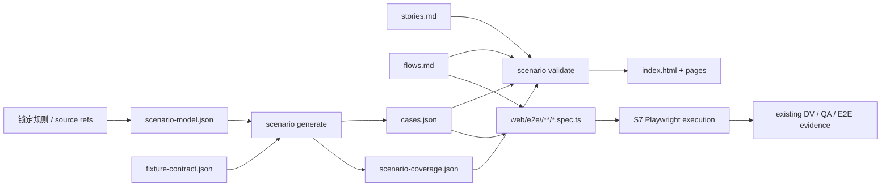

# 架构：事实驱动的模块场景与生产级 E2E 验证

> 状态：active / current truth
> 更新：2026-08-13
> 适用范围：业务规则、模块场景、用户故事、用户动线、UI 原型、fixture、DV、QA、Playwright E2E
> 权威约束：不新增顶层 S 阶段，不修改 Loop Definition、Runtime、Transition 或 EvidenceCatalog

## 1. 目标链路

项目采用以下闭环：

```text
锁定业务规则
  → 模块事实与规则分支
  → 正向/反向 CASE
  → 模块完整 Story / Flow / Prototype
  → 模块级 Playwright spec
  → DV + QA + S7 真实执行证据
  → 实际业务可完成、错误分支可拦截
```

这条链路解决的不是“有没有测试文件”，而是以下可验证问题：

- 每个允许和拒绝结果来自哪条锁定规则；
- 输入事实如何命中该规则分支；
- 正反用例是否覆盖所有 required branch；
- 用户是否能从真实入口逐步完成业务；
- 非法输入是否被正确阻断且没有禁止的副作用；
- CASE、Story、PATH、spec 与执行证据是否保持同一当前事实。

## 2. 模块级当前真相

场景资产归模块所有，不归 REQ、迭代轮次或测试运行所有。任何 REQ 触及模块行为时，
都必须读取并维护该模块的一套完整当前集合，然后执行模块全量回归。

```text
docs/design/prototypes/<module>/
├── index.html
├── stories.md
├── flows.md
├── scenario-model.json
├── fixture-contract.json
├── cases.json
├── scenario-coverage.json
└── *.html

web/e2e/<module>/**/*.spec.ts
```

必须遵守：

- REQ 只能作为 `source_refs` 和受影响模块绑定来源；
- Git 保存历史，当前目录只保存一套正确事实；
- 禁止 per-REQ、per-round、版本号、generation、addendum 或旧版副本；
- Story、Flow、CASE、fixture、prototype 与 spec 都使用模块内稳定 ID；
- 测试运行报告可以记录执行轮次，但不得成为设计定义的第二份权威。

## 3. 组件与数据流



`scenario-model.json` 与 `fixture-contract.json` 是人工维护输入；`cases.json` 与
`scenario-coverage.json` 是确定性生成输出，不接受人工补丁。

## 4. 严格文件契约

四个 JSON 文件使用 UTF-8、两空格缩进、末尾换行和稳定排序。所有对象拒绝未知字段。

### 4.1 scenario-model.json

顶层只允许：

| 字段 | 约束 |
|:---|:---|
| `module` | 等于父目录名，lowercase-kebab |
| `coverage_profile` | `ordinary` / `rule-dense` / `critical` |
| `facts` | 非空；fact 包含稳定 `id` 和非空 `partitions` |
| `rules` | 非空；rule 包含 `id`、`source_refs`、`risk`、`branches` |

每个 partition 包含稳定 `id` 与合成 `value`。不得写生产 PII、生产数据库快照或未声明
的随机数据。

每个 branch 必须包含：

```text
id, case_id, title, polarity, required, witness, oracle,
fixture_id, story_refs, flow_refs, browser_required
```

`risk` 属于父级 rule，不属于 branch。`witness` 的 key/value 必须分别解析到当前 fact
和该 fact 的 partition。`story_refs` 使用独立 `S-NNN`；`flow_refs` 中的 `F-NNN` 与
`PATH-*` 是两个独立元素，不使用组合字符串。

### 4.2 Oracle

所有正向和反向 Oracle 都必须声明共同字段：

```text
visible, terminal_state, persisted_effects, forbidden_side_effects
```

反向 Oracle 还必须声明：

```text
rejection, expected_state, recovery
```

当 `recovery` 为忽略大小写和首尾空白后的 `"N/A"` 时，还必须提供非空
`recovery_source_refs` 与 `recovery_reason`。这些来源必须属于父 rule 的
`source_refs`。不得用无来源的 N/A 规避恢复路径设计。

### 4.3 fixture-contract.json

顶层只允许 `module` 与非空 `fixtures`。每个 fixture 只包含：

```text
id, persona, synthetic: true, setup, cleanup
```

`setup` 与 `cleanup` 必须非空。fixture 可以建立角色、权限、草稿、字典、固定时钟、
隔离 namespace 和受控外部响应等前置事实，但不得替代登录后的导航、填写、保存、提交、
审批、取消、重试等被测用户动作。

### 4.4 生成输出

`cases.json` 顶层只允许 `module` 与 `cases`。每个 CASE 保留 rule/branch 映射、
witness、完整 Oracle、fixture、Story/Flow refs 和 `browser_required`。

`scenario-coverage.json` 只保存汇总：

```text
module, coverage_profile, counts, required_branch_coverage, ratio
```

CASE、branch 和 Flow/PATH 明细从 `cases.json` 枚举；不得从 coverage 汇总文件反推。

## 5. 覆盖门禁

覆盖采用硬门与容量门：

| 门禁 | 要求 |
|:---|:---|
| required allow branch | 100% 有 CASE |
| required reject branch | 100% 有 CASE |
| `ordinary` | negative:positive 至少 1:1 |
| `rule-dense` | negative:positive 至少 2:1 |
| `critical` | negative:positive 至少 3:1 |

容量比例不能替代分支覆盖。即使比例达标，任一 required allow/reject branch 缺失仍然
fail-closed。没有反向语义的规则必须提供有来源、可审查的 N/A，而不是省略 reject
branch。

## 6. 生成与校验

公开命令为：

```bash
go run ./cmd/loop-harness scenario generate --module <module> --root .
go run ./cmd/loop-harness scenario validate --module <module> --root .
go run ./cmd/loop-harness scenario validate --all --root .
go run ./cmd/loop-harness scenario validate --module <module> --root . --require-specs
```

生成器执行：

1. 严格解析 schema，拒绝未知字段；
2. 校验 module、ID 唯一性、fact/partition witness、fixture、Story、Flow/PATH 引用；
3. 校验共同与正反 Oracle、N/A 来源、正反容量比和 required branch 100% 覆盖；
4. 按 CASE ID 稳定排序，确定性生成两个当前输出；
5. 写入输入和输出 fingerprint；
6. 使用可恢复 transaction journal 替换双输出；
7. 在后续 generate/validate 时恢复中断事务，并拒绝 stale/tampered 输出。

模块目录、输入、输出、journal 与 spec 路径都拒绝 symlink；真实路径必须保持在仓库对应
根目录内。双输出采用 crash-recoverable replacement，不宣称跨两个 rename 的文件系统
级瞬时原子性。

`scenario.ValidateAll` 已接入 repository semantic validation，因此现有
`validate --all` 与 `doctor` 会检查所有实际模块；根级 README 和模板不是模块。

## 7. UI 需求绑定

UI-impact 为 changed 的 REQ 必须在当前 REQ 文档中显式引用：

```text
docs/design/prototypes/<module>/
```

门禁按该绑定检查每个受影响模块，而不是接受“任意一个完整模块”。每个模块必须同时具备：

- `index.html`、至少一个页面 HTML、`stories.md`、`flows.md`；
- 四个场景 JSON 文件；
- index 与每个页面的原型元信息头；
- 可解析的 Story/Flow ID 与完整场景语义。

缺少模块绑定、包不完整、语义失败、目录/必需文件/页面 symlink 或真实路径逃逸都
fail-closed。

## 8. Playwright 静态绑定

永久 spec 只位于 `web/e2e/<module>/**/*.spec.ts`。`--require-specs` 只接受从
`@playwright/test` 命名导入的 `test` 或安全别名，并只识别以下静态调用：

```typescript
test('<literal title>', callback)
test('<literal title>', { /* literal details */ }, callback)
```

callback 必须位于合法的最后参数位置；动态 title/details、错误参数位、局部遮蔽、
伪 test、注释、`.spec.tsx` 和 ID 前后缀都不计入覆盖。每个 browser-required CASE
及其全部 PATH 必须以精确 ID 出现在同一个真实 callback body 中。标题或注释中的 ID
只用于阅读，不构成绑定。

Canonical 示例：

```typescript
import { expect, test } from '@playwright/test'

test('CASE-INV-0042 / PATH-VALIDATION-LEGAL-REP', async ({ page }) => {
  await test.step('CASE-INV-0042 / PATH-VALIDATION-LEGAL-REP', async () => {
    await loginThroughDeclaredEntry(page, 'filing-operator')
    await page.getByTestId('nav-investor-workbench').click()
    await page.getByTestId('investor-draft-row').click()
    await page.getByTestId('investor-type').selectOption('organization')
    await page.getByTestId('submission-submit').click()
    await expect(page.getByTestId('legal-representative-error')).toBeVisible()
    await expect(page.getByTestId('submission-status')).toHaveText('草稿')
  })
})
```

静态绑定只证明 CASE/PATH 与 test callback 的映射。S7 仍必须启动真实应用和浏览器，
逐步执行 PATH 的人类动作，并断言可见结果、终态、持久化结果和禁止副作用。fixture
不能跳过这些动作。

## 9. 生命周期职责

| 阶段/角色 | 当前职责 |
|:---|:---|
| S0 / PM | 锁定业务规则、来源、未知项和受影响模块 |
| S2 / Planning | 维护完整模块事实、规则、CASE、Story、Flow、Prototype 与 fixture 契约 |
| Document Verifier | 独立检查规则来源、模块当前真相、schema/模板一致性与任务可执行性 |
| S5 / QA | 校验正反 Oracle、边界、引用、比例、生成确定性、路径安全和门禁串联 |
| S6 / Test Builder | 从 `cases.json` 枚举 browser CASE/PATH，维护模块 spec、seed 与 cleanup |
| S7 / E2E Tester | 从真实入口执行当前模块全部 required CASE/PATH，保存既有 E2E 证据 |

任何 REQ 改变模块规则、事实、字段、状态、权限、错误、恢复动作或用户路径时，都必须
刷新完整模块包并运行完整模块回归，不能只测试该 REQ 的增量子集。

## 10. 验证矩阵

| 维度 | 必须证明 |
|:---|:---|
| DV-SPEC-CONSISTENCY | 模块所有权、当前真相、规则/模板/Skill/schema/CLI 无矛盾 |
| DV-TASK-EXECUTABILITY | 产物、命令、写边界、来源与 fail-closed 行为可执行 |
| QA-MODULE-CODE | 严格解析、确定性、引用、路径安全、事务恢复和错误处理合格 |
| QA-UNIT-TEST | 正反、比例、重复 ID、未知引用、Oracle、N/A、绕过与 symlink 有测试 |
| QA-INTEGRATION-TEST | CLI、semantic validation、doctor、UI package gate 串联成功与失败路径 |
| E2E | generate → validate → 缺 spec 失败 → 真 spec 通过 → 篡改/绕过失败 |
| Full regression | 全仓 test、目标 race、vet、validate、doctor、skill/schema 校验全部通过 |

## 11. 非目标与冻结边界

- 不修改 Runtime 状态机、Transition catalog、EvidenceCatalog 或 `.claude` 状态；
- 不新增顶层 S 阶段，不替换现有 `e2e-coverage`；
- 不实现任意表达式 DSL、SAT/SMT 或无限输入域自动发现；
- 不从生产实现反推 Oracle，不读取生产 PII 或生产数据库快照；
- 不让 fixture 替代用户操作；
- 不建立 REQ/round/version 级永久场景定义；
- 不把 CLI 静态绑定误称为真实浏览器执行证据。

## 12. 当前实现位置

| 能力 | 位置 |
|:---|:---|
| 业务规则 | `docs/rules/scenario-model.md` |
| 模块模板 | `docs/design/prototypes/` |
| 场景设计 Skill | `skills/scenario-model-design/` |
| JSON Schema | `internal/schema/assets/scenario-*.schema.json` |
| 生成/校验/事务恢复 | `internal/scenario/` |
| CLI 与 UI 门禁 | `internal/cli/` |
| Repository semantic gate | `internal/semantic/` |
| 静态 Skill catalog | `internal/catalog/` |

本文件只维护当前已生效架构；历史决策和差异由 Git 保存。
